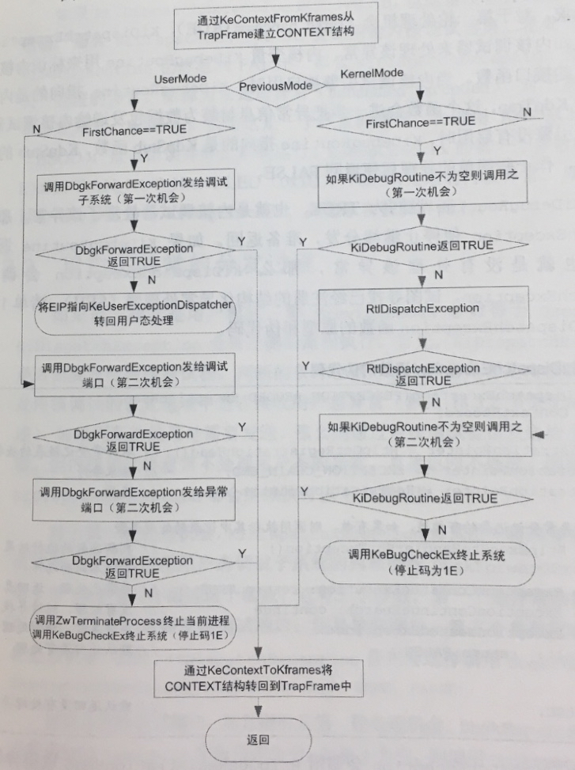
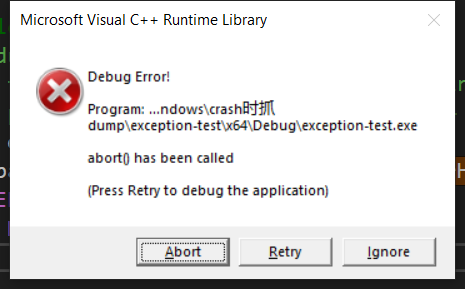
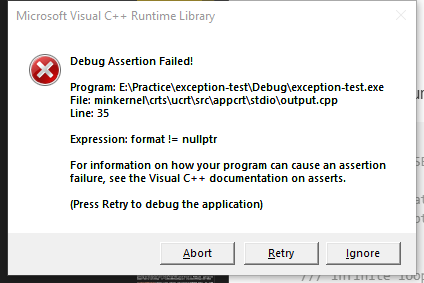
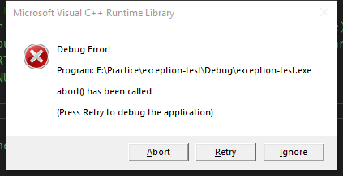

[toc]

# 正文

声明一点，这篇**主要**是探讨Windows下的异常捕获。

首先要说明一点，操作系统中，不论是用户态还是内核态的程序，出现了异常情况或者严重错误，操作系统也是按照一定规则处理的，并不是随便地终止了程序。不然的话，操作系统就会发生资源泄露，或者其他错误。

Windows系统检测到我们写的程序发生了未处理异常或者其他严重错误（具体什么错误呢？）时，一般会将其终止掉，在此之前，默认会弹出一个应用程序错误对话框（Application Fault Dialog），或者叫GPF（General Protection Fault 通用保护错误）对话框。如果系统中配置了JIT（Just-In-time）调试器，那么在崩溃的时候会启动设置的调试器。Windows系统中默认的JIT是一个叫做Dr. Watson的JIT调试器(参考[Wiki](https://en.wikipedia.org/wiki/Dr._Watson_(debugger))，其可执行文件名字在不同代Windows OS中有所不同)。

配置JIT调试器可以在注册表 Computer\HKEY_LOCAL_MACHINE\SOFTWARE\Microsoft\Windows NT\CurrentVersion\AeDebug 位置设置。我的机器上由于装有VS，默认这个选项被替换为了VS调试器 "C:\WINDOWS\system32\vsjitdebugger.exe"。msdn上有一篇文档介绍JIT设置：[How to disable or enable Dr. Watson for Windows](https://support.microsoft.com/en-us/help/188296/how-to-disable-or-enable-dr-watson-for-windows)

## RaiseException函数

看msdn上，介绍到[RaiseException()](https://docs.microsoft.com/en-us/windows/win32/api/errhandlingapi/nf-errhandlingapi-raiseexception)的Remark部分有提到：

*The RaiseException function enables a process to use structured exception handling to handle private, software-generated, application-defined exceptions.*

也就是说这个函数会直接触发一个SEH异常。

另外，这个函数中的Remark部分还提到具体搜索异常的过程：
1. 系统首先通知进程的调试器，如果存在的话
2. 如果未调试进程，或者关联的调试器不处理这个异常，系统会尝试搜索发生异常的线程的栈帧来定位基于栈帧的异常处理函数。系统首先是收缩当前的栈帧，然后向后遍历之前的栈帧。（也就是向调用函数的方向回溯）
3. 如果找不到基于栈帧的处理函数，或者没有基于栈帧的处理函数处理异常，系统将再次尝试通知进程的调试器。
4. 如果未调试进程，或者关联的调试器未处理异常，则系统将根据异常类型做出默认处理。对于大多数异常，默认操作是调用ExitProcess函数。

所谓 **基于栈帧的处理函数** 就是SEH的__try{}__catch{}代码块，参考 [Frame-based Exception Handling](https://docs.microsoft.com/en-us/windows/win32/debug/frame-based-exception-handling)

## 捕获大部分崩溃 - SetUnhandledExceptionFilter

*这部分内容主要参考开源软件crashrpt的文档 [About Exceptions and Exception Handling](http://crashrpt.sourceforge.net/docs/html/exception_handling.html)*

我们写程序一般是通过 [SetUnhandledExceptionFilter](https://docs.microsoft.com/en-us/windows/win32/api/errhandlingapi/nf-errhandlingapi-setunhandledexceptionfilter) 配合 [MiniDumpWriteDump](https://docs.microsoft.com/en-us/windows/win32/api/minidumpapiset/nf-minidumpapiset-minidumpwritedump) 来完成崩溃的捕获和dump抓取的。 SetUnhandledExceptionFilter的自定义处理函数的返回值中：

- EXCEPTION_EXECUTE_HANDLER  一般是终止进程，我写代码测试了一下，这样处理的话，系统的Event Viewer中不会记录异常。
- EXCEPTION_CONTINUE_EXECUTION 在异常发生的代码处，继续执行代码，不过有一个修改异常信息的机会。我写的测试代码中，这种处理返回值，最后会在系统的Event Viewer中找到崩溃记录。
- EXCEPTION_CONTINUE_SEARCH 执行一般的异常处理流程，依赖于[SetErrorMode](https://docs.microsoft.com/en-us/windows/win32/api/errhandlingapi/nf-errhandlingapi-seterrormode)设置的标记 

Windows 10上，我测试下来，自定义未处理异常函数的返回值与SetErrorMode的配合，对系统事件(Event Viewer)中应用程序错误产生记录的对应关系是：

1. 自定义未处理异常返回 EXCEPTION_EXECUTE_HANDLER，设置错误模式为 SetErrorMode(SEM_NOGPFAULTERRORBOX)，生成dump，不产生事件记录。因为这类异常背后的逻辑是程序预知到了这种错误，处理好了，就不需要系统记录了。
2. 自定义未处理异常返回 EXCEPTION_CONTINUE_EXECUTION，设置错误模式为 SetErrorMode(SEM_NOGPFAULTERRORBOX)，程序卡死无法产生dump和事件记录。卡死的原因是让程序继续执行，但是之前碰到的异常并没有解决，导致无法继续执行。
3. 自定义未处理异常返回 EXCEPTION_CONTINUE_SEARCH，设置错误模式为 SetErrorMode(SEM_NOGPFAULTERRORBOX)，生成dump，但是不产生事件记录；如果不设置ErrorMode，也就是说ErrorMode为0的话，生成dump，同时也产生事件记录。

Windows上这个处理过程可以抓取到大多数崩溃。参考资料中的[CrashRpt](http://crashrpt.sourceforge.net/)也使用了这个方法。

### SEH的小插曲

之前Windows上出现过一个bug，在Win32程序的WndProc中如果发生崩溃的话，会被SEH忽略：参考 [OpenGL suppresses exceptions in MFC dialog-based application](https://stackoverflow.com/questions/2162897/opengl-suppresses-exceptions-in-mfc-dialog-based-application)，以及 [Exceptions silently caught by Windows, how to handle manually?](https://stackoverflow.com/questions/2622200/exceptions-silently-caught-by-windows-how-to-handle-manually) （这里提到微软为此还出过一个更新包 KB976038（Exceptions that are thrown from an application that runs in a 64-bit version of Windows are ignored），不过MSDN大改版之后，现在这些资料找不到了）。一个解决方案是使用SEH包裹WndProc或者HookProc，但是这个肯定不是好办法。

不过另一个方法是强制Windows不再忽略该异常，使用到的代码(据说是KB976038文档中带的官方代码)：

```cpp
// 因为这个功能在微软打的补丁包里面，所以需要通过动态加载的方式设置。
// 另外，这个补丁包已经包含在了Win7 SP1中。
#define PROCESS_CALLBACK_FILTER_ENABLED     0x1
typedef BOOL (WINAPI *GETPROCESSUSERMODEEXCEPTIONPOLICY)(__out LPDWORD lpFlags);
typedef BOOL (WINAPI *SETPROCESSUSERMODEEXCEPTIONPOLICY)(__in DWORD dwFlags );
HINSTANCE h = ::LoadLibrary(L"kernel32.dll");
if ( h ) {
   GETPROCESSUSERMODEEXCEPTIONPOLICY GetProcessUserModeExceptionPolicy = 
        reinterpret_cast< GETPROCESSUSERMODEEXCEPTIONPOLICY >( ::GetProcAddress(h, "GetProcessUserModeExceptionPolicy") );
   SETPROCESSUSERMODEEXCEPTIONPOLICY SetProcessUserModeExceptionPolicy = 
        reinterpret_cast< SETPROCESSUSERMODEEXCEPTIONPOLICY >( ::GetProcAddress(h, "SetProcessUserModeExceptionPolicy") );
   if ( GetProcessUserModeExceptionPolicy == 0 || SetProcessUserModeExceptionPolicy == 0 ) {
      return;
   }
   DWORD dwFlags;
   if (GetProcessUserModeExceptionPolicy(&dwFlags)) {
      SetProcessUserModeExceptionPolicy(dwFlags & ~PROCESS_CALLBACK_FILTER_ENABLED); 
   }
}
```


## 那还有小部分呢？

SetUnhandledExceptionFilter并不能处理Windows上C\++代码的所有未处理，简单地说是因为CRT有自己的处理逻辑。

我们C\++代码中常见的异常类型有

1. 访问无效内存，比如空指针，内存访问越界，

```c
int* pI = nullptr;
*p = 1;
```

2. 栈耗尽，比如无限递归。导致Stack overflow错误

```c
void InfiniteFunc(int a) {
    int b = 2;
    b++;
    InfiniteFunc(a + b);
}
```

3. 缓存溢出，大数据块写入小数据块，导致内存非法访问。现在VC\++编译器一般会启用Buffer Security Check : [/GS (Buffer Security Check)](https://docs.microsoft.com/en-us/cpp/build/reference/gs-buffer-security-check?view=vs-2019) 编译选项。

4. 调用C++的纯虚指针，参考 [_get_purecall_handler, _set_purecall_handler](https://docs.microsoft.com/en-us/cpp/c-runtime-library/reference/get-purecall-handler-set-purecall-handler?view=vs-2019) 的示例代码。

5. 内存耗尽，申请内存失败 *目前的操作系统中由于使用了虚拟内存的技术，一般不会碰到*

6. 非法参数传入C++系统函数
参考 [_set_invalid_parameter_handler, _set_thread_local_invalid_parameter_handler](https://docs.microsoft.com/en-us/cpp/c-runtime-library/reference/set-invalid-parameter-handler-set-thread-local-invalid-parameter-handler?view=vs-2019) 里面的示例代码。

```c
// crt_set_invalid_parameter_handler.c
// compile with: /Zi /MTd
#include <stdio.h>
#include <stdlib.h>
#include <crtdbg.h>  // For _CrtSetReportMode

void myInvalidParameterHandler(const wchar_t* expression,
   const wchar_t* function,
   const wchar_t* file,
   unsigned int line,
   uintptr_t pReserved)
{
   wprintf(L"Invalid parameter detected in function %s."
            L" File: %s Line: %d\n", function, file, line);
   wprintf(L"Expression: %s\n", expression);
   abort();
}

int main( )
{
   char* formatString;

   _invalid_parameter_handler oldHandler, newHandler;
   newHandler = myInvalidParameterHandler;
   oldHandler = _set_invalid_parameter_handler(newHandler);

   // When the debug CRT library is used, invalid parameter errors also raise an assertion
   // Disable the message box for assertions.
   _CrtSetReportMode(_CRT_ASSERT, 0);

   // Call printf_s with invalid parameters.
   formatString = NULL;
   printf(formatString);
}
```

里面提到一个设置函数 [_CrtSetReportMode](https://docs.microsoft.com/en-us/cpp/c-runtime-library/reference/crtsetreportmode?view=vs-2019)

7. CRT检测到异常并请求强制退出进程

Windows中的有两种可以捕获的异常：
1. 一种是C++的异常，一般用try{ /*throw xxx;*/ }catch{}的结构
2. 另外一种是使用SEH，这个是VC\++编译器独有的，不可用于移植的代码。__try{}__catch{}结构的，而且SEH只能用于C类型的函数，不能用于C\++类内部。

不过，SEH的异常可以通过_set_se_translator()转为C++的异常，参考：[_set_se_translator](https://msdn.microsoft.com/en-us/library/5z4bw5h5.aspx)里面的示例代码，将一个除零的异常，转为了自定义的C\++类型异常 SE_Exception 。

对于使用SEH不能保护的代码，就属于unhandled Exception范畴了，可以使用SetUnhandledExceptionFilter设置函数来处理，这个函数是SEH的top-level处理过程。不过使用这个函数要注意，如果异常处理函数是在DLL中，并且这个DLL还没有加载，那么行为是未定义的。

**所以，SEH和SetUnhandledExceptionFilter的关系就是，SEH没有包住的异常栈帧，就会被当作未处理异常，交给SetUnhandledExceptionFilter设置的函数处理**

XP中引入的VEH（[Vectored Exception Handling](https://docs.microsoft.com/en-us/windows/win32/debug/vectored-exception-handling)）是对SEH的扩展。如果你想监控所有类型的异常，就像是调试器那样，那么VEH是非常适合的，不过问题是你要决定哪些异常要处理，哪些不要处理。

要提一下：异常处理流程中，VEH是先于SEH的，不过VEH只能在用户态代码中，SEH可以在用户态和内核态代码中。VEH的注册函数返回值如果是“继续搜索”，那么异常会被SEH接过来处理，如果是“继续执行”，那么SEH会认为VEH已经处理过了，就不处理了。

CRT错误处理过程
除了C\++类型异常和SEH异常之外，还有CRT异常，crt遇到C++类型的异常之后会调用terminate()函数，所以你最好用set_terminate()设置一个错误处理过程。
CRT错误处理过程可以设置：
- [set_terminate](https://docs.microsoft.com/en-us/cpp/c-runtime-library/reference/set-terminate-crt?view=vs-2019)
- [set_unexpected](https://docs.microsoft.com/en-us/cpp/c-runtime-library/reference/set-unexpected-crt?view=vs-2019)
- [_set_purecall_handler](https://docs.microsoft.com/en-us/cpp/c-runtime-library/reference/get-purecall-handler-set-purecall-handler?view=vs-2019)
- [_set_new_handler](https://docs.microsoft.com/en-us/cpp/c-runtime-library/reference/set-new-handler?view=vs-2019)
- _set_security_error_handler  已经被移除，参考 _set_security_error_handler no longer declared
- [_set_invalid_parameter_handler](https://docs.microsoft.com/en-us/cpp/c-runtime-library/reference/set-invalid-parameter-handler-set-thread-local-invalid-parameter-handler?view=vs-2019) 比如printf设置了空缓存区，参考示例代码
- [signal](https://docs.microsoft.com/en-us/cpp/c-runtime-library/reference/signal?view=vs-2019)  信号处理内有乾坤

以上主要在 MSDN [Process and Environment Control](https://docs.microsoft.com/en-us/cpp/c-runtime-library/process-and-environment-control?view=vs-2019)查找资料。

C\++信号处理 Signal Handling，也就是C\++中的程序中断机制。通过signal()函数处理。

ANSI标准中一共有六种：

1. SIGABRT Abnormal termination
2. SIGFPE Floating-point error，当浮点运算出错时由CRT调用，一般情况下不会生成。Windows系统 **默认关闭** 了这个信号，取而代之的是生成一个NaN或者无限大的数字，可以通过_controlfp_s函数打开这个异常。参考 [Floating-Point Exceptions](https://docs.microsoft.com/en-us/windows/win32/debug/floating-point-exceptions)
3. （*）SIGILL Illegal instruction Windows下 **不产生** 这个信号 
4. SIGINT CTRL+C signal，  win32程序 **不支持** 这个信号，当CTRL+C中断发生时，Win32系统会生成一个新的线程处理该中断，这样的话，比如一些在unix上的单线程可能会变成多线程，并出现不可知的错误。这里强调了UNIX中的单线程程序，我试了一下及时创建一个最简单的console程序也会有3个线程（一个Main Thread，2个Work Thread），原因参考 Raymond [Why does my single-threaded program have multiple threads?](https://devblogs.microsoft.com/oldnewthing/20191115-00/?p=103102)中提到console application会有线程专门用来“handle and deliver console control notifications”
5. SIGSEGV Illegal storage access 
6. （*）SIGTERM Termination request Windows下 **不产生** 这个信号 

*这部分可以参考 msdn [signal](https://docs.microsoft.com/en-us/cpp/c-runtime-library/reference/signal?view=vs-2019)函数介绍*

标*的MSDN中提示说Windows NT不会生成，留着只是为了兼容ANSI。~~但是如果在主线程中设置了SIGSEGV信号函数，那么就会由CRT而不是SEH设置的SetUnhandledExceptionFilter()过滤函数来调用，并且有一个全局的变量_pxcptinfoptrs包含异常信息。如果是在其他线程的话，异常处理过程是由SEH的SetUnhandledExceptionFilter()过滤函数调用的。~~（这部分删除掉是因为我现在(2020.10)没在msdn上找到这个说法，可能是后来有变动，毕竟这篇文档成文早于2010年，之后Windows上的CRT有较大的变化）

除了函数之外，还有编译链接选项上的一些事情。CRT可以以MD（动态链接）和MT（静态链接）的方式编译进模块（exe/DLL）里面。参考：/MT、/MD编译选项，以及可能引起在不同堆中申请、释放内存的问题，/MD, /MT, /LD (Use Run-Time Library)。
MD的方式时推荐的，多个模块公用一个CRT的DLL库的方式；以MT的方式使用CRT的话，需要把函数写成static，并且使用/NODEFAULTLIB链接标记，链接到所有模块中，还需要每个模块中都注册CRT错误处理过程。

上面提到这几种异常也不全，可以参考操作系统的IDT表项看看系统支持哪些中断/异常处理。比如说还有:

- 除零异常
- 页错误
- 栈段错误
- 浮点错误
- 内存对齐错误
- SIMD浮点错误
- 无效TSS
- 段不存在
- ...

全部IDT的内容，参考 [Interrupt Dispatching Internals](https://codemachine.com/article_interruptdispatching.html)

## 为什么调试器可以抓到所有崩溃?

*这部分参考《软件调试》中介绍的内容。这里再次向张老师致敬。*

简单地说，因为Windows提供的中断和异常管理机制中，如果碰到有未处理的异常，或者是CRT中发生错误的时候，会先判断进程是否在调试器下运行，是的话就把控制权交给了调试器。 也就是说程序的执行流程中会主动请求调试器协助。

详细一点说的话，需要从Windows的中断和异常说起。

Windows保护模式下如果发生中断或者异常，会通过查找IDT（中断描述符）表来寻找处理函数，而Windows启动早期会初始化这个表。

IDT中有三种表项，也就是所谓的门描述符（Gate Descriptor）结构。

- 任务门 切换任务用；由于x64架构不支持硬件方式的任务切换，所以没有任务门了。
- 中断门 处理中断例程
- 陷阱门 描述异常处理例程入口

本篇提到的中断和异常处理，主要靠后二者。

Windows中的异常，除了CPU产生的硬件异常外，还有软件模拟出的异常，比如调用RaiseException或者语言层面throw抛出的异常。Windows会以统一的方式处理这两类软硬件异常。用于描述异常的数据结构是struct _EXCEPTION_RECORD。

- CPU异常（硬件异常）会调用 CommonDispatchException
- 软件异常 是通过内核服务 NtRaiseException 产生的，用户态代码可以通过RaiseException来间接调用这个函数。

上述二者产生异常之后最终都会调用到KiDispatchException。



从上图中可以看出本节简述部分的内容。因为这个函数会尝试请求调试器介入，所以调试器可以捕获所以的异常。

那么如果进程执行中发生一个异常，如何捕获并处理异常，Windows提供了哪些机制？

Windows中创建一个进程的过程中会调用一个函数BaseProcessStart，这个函数的实现比较简单，但是整个函数体被一个SEH的__try包裹着，这里是Windows进程为异常发生托底的最后一重关卡。由于很多程序有全局变量，还有使用了CRT的程序，还需要处理CRT的初始化，处理命令行参数等，而crt的实现中还会做基于信号的异常处理，所以CRT也有一层SEH的__try块，这个由编译器负责插入这段代码，我电脑上是在路径 C:\Program Files (x86)\Microsoft Visual Studio\2017\Professional\VC\Tools\MSVC\14.16.27023\crt\src\vcruntime\exe_common.inl 下（书中提到代码是位于crt0.cpp中，但是考虑到该书写于2008年前可能会有变化）。

```cpp
/// C:\Program Files (x86)\Microsoft Visual Studio\2017\Professional\VC\Tools\MSVC\14.16.27023\crt\src\vcruntime\exe_common.inl
static __declspec(noinline) int __cdecl __scrt_common_main_seh() throw()
{
    if (!__scrt_initialize_crt(__scrt_module_type::exe))
        __scrt_fastfail(FAST_FAIL_FATAL_APP_EXIT);

    bool has_cctor = false;
    __try
    {
        bool const is_nested = __scrt_acquire_startup_lock();

        if (__scrt_current_native_startup_state == __scrt_native_startup_state::initializing)
        {
            __scrt_fastfail(FAST_FAIL_FATAL_APP_EXIT);
        }
        else if (__scrt_current_native_startup_state == __scrt_native_startup_state::uninitialized)
        {
            __scrt_current_native_startup_state = __scrt_native_startup_state::initializing;

            if (_initterm_e(__xi_a, __xi_z) != 0)
                return 255;

            _initterm(__xc_a, __xc_z);

            __scrt_current_native_startup_state = __scrt_native_startup_state::initialized;
        }
        else
        {
            has_cctor = true;
        }

        __scrt_release_startup_lock(is_nested);

        // If this module has any dynamically initialized __declspec(thread)
        // variables, then we invoke their initialization for the primary thread
        // used to start the process:
        _tls_callback_type const* const tls_init_callback = __scrt_get_dyn_tls_init_callback();
        if (*tls_init_callback != nullptr && __scrt_is_nonwritable_in_current_image(tls_init_callback))
        {
            (*tls_init_callback)(nullptr, DLL_THREAD_ATTACH, nullptr);
        }

        // If this module has any thread-local destructors, register the
        // callback function with the Unified CRT to run on exit.
        _tls_callback_type const * const tls_dtor_callback = __scrt_get_dyn_tls_dtor_callback();
        if (*tls_dtor_callback != nullptr && __scrt_is_nonwritable_in_current_image(tls_dtor_callback))
        {
            _register_thread_local_exe_atexit_callback(*tls_dtor_callback);
        }

        //
        // Initialization is complete; invoke main...
        //

        int const main_result = invoke_main();

        //
        // main has returned; exit somehow...
        //

        if (!__scrt_is_managed_app())
            exit(main_result);

        if (!has_cctor)
            _cexit();

        // Finally, we terminate the CRT:
        __scrt_uninitialize_crt(true, false);
        return main_result;
    }
    __except (_seh_filter_exe(GetExceptionCode(), GetExceptionInformation()))
    {
        // Note:  We should never reach this except clause.
        int const main_result = GetExceptionCode();

        if (!__scrt_is_managed_app())
            _exit(main_result);

        if (!has_cctor)
            _c_exit();

        return main_result;
    }
}
```

这个版本的CRT代码中，异常处理过滤器_seh_filter_exe的实现：

```cpp
/// 代码位于 C:\Program Files (x86)\Windows Kits\10\Source\10.0.19041.0\ucrt\misc\exception_filter.cpp

// Identifies an exception and the action to be taken with it
//
// This function is called by the exception filter expression of the __try-
// __except statement in the startup code, which guards the call to the user-
// provided main (or DllMain) function.  This function consults the per-thread
// exception-action table to identify the exception and determine its
// disposition.  The disposition of an exception corresponding to a C signal may
// be modified by a call to signal().  There are three broad cases:
//
// (1) Unrecognized exceptions and exceptions for which the action is SIG_DFL
//
//     In both of these cases, EXCEPTION_CONTINUE_SEARCH is returned to cause
//     the OS exception dispatcher to pass the exception on to the next exception
//     handler in the chain--usually a system default handler.
//
// (2) Exceptions corresponding to C signals with an action other than SIG_DFL
//
//     These are the C signals whose disposition has been affected by a call to
//     signal() or whose default semantics differ slightly from the corresponding
//     OS exception.  In all cases, the appropriate disposition of the C signal is
//     made by the function (e.g., calling a user-specified signal handler).
//     Then, EXCEPTION_CONTINUE_EXECUTION is returned to cause the OS exception
//     dispatcher to dismiss the exception and resume execution at the point
//     where the exception occurred.
//
// (3) Exception for which the action is SIG_DIE
//
//     These are the exceptions corresponding to fatal C Runtime errors. For
//     these, EXCEPTION_EXECUTE_HANDLER is returned to cause control to pass
//     into the __except block of the __try-__except statement.  There, the
//     runtime error is identified, an appropriate error message is printed out,
//     and the program is terminated.
extern "C" int __cdecl _seh_filter_exe(
    unsigned long       const xcptnum,
    PEXCEPTION_POINTERS const pxcptinfoptrs
    )
{
    // Get the PTD and find the action for this exception.  If either of these
    // fails, return to let the handler search continue.
    __acrt_ptd* const ptd = __acrt_getptd_noexit();
    if (ptd == nullptr)
        return EXCEPTION_CONTINUE_SEARCH;

    __crt_signal_action_t* const pxcptact = xcptlookup(xcptnum, ptd->_pxcptacttab);
    if (pxcptact == nullptr)
        return EXCEPTION_CONTINUE_SEARCH;

    __crt_signal_handler_t const phandler = pxcptact->_action;

    // The default behavior (SIG_DFL) is not to handle the exception:
    if (phandler == SIG_DFL)
        return EXCEPTION_CONTINUE_SEARCH;

    // If the behavior is to die, execute the handler:
    if (phandler == SIG_DIE)
    {
        // Reset the _action (in case of recursion) and enter the __except:
        pxcptact->_action = SIG_DFL;
        return EXCEPTION_EXECUTE_HANDLER;
    }

    // If an exception is ignored, just ignore it:
    if (phandler == SIG_IGN)
        return EXCEPTION_CONTINUE_EXECUTION;

    // The remaining exceptions all correspond to C signals which have signal
    // handlers associated with them.  For some, special setup is required
    // before the signal handler is called.  In all cases, if the signal handler
    // returns, -1 is returned by this function to resume execution at the point
    // where the exception occurred.

    // Save the old exception pointers in case this is a nested exception/signal.
    PEXCEPTION_POINTERS const old_pxcptinfoptrs = ptd->_tpxcptinfoptrs;
    ptd->_tpxcptinfoptrs = pxcptinfoptrs;

    // Call the user-supplied signal handler.  Floating point exceptions must be
    // handled specially since, from the C point of view, there is only one
    // signal.  The exact identity of the exception is passed in the per-thread
    // variable _tfpecode.
    if (pxcptact->_signal_number == SIGFPE)
    {
        // Reset the _action field to the default for all SIGFPE entries:
        __crt_signal_action_t* const first = ptd->_pxcptacttab + __acrt_signal_action_first_fpe_index;
        __crt_signal_action_t* const last  = first + __acrt_signal_action_fpe_count;

        for (__crt_signal_action_t* it = first; it != last; ++it)
            it->_action = SIG_DFL;

        // Save the current _tfpecode in case this is a nested floating point
        // exception.  It's not clear that we need to support this, but it's
        // easy to support.
        int const old_fpecode = ptd->_tfpecode;

        // Note:  There are no exceptions corresponding to _FPE_UNEMULATED and
        // _FPE_SQRTNEG.  Furthermore, STATUS_FLOATING_STACK_CHECK is raised for
        // both stack overflow and underflow, thus the exception does not
        // distinguish between _FPE_STACKOVERFLOW and _FPE_STACKUNDERFLOW.
        // Arbitrarily, _tfpecode is set to the formr value.
        switch (pxcptact->_exception_number)
        {
        case STATUS_FLOAT_DIVIDE_BY_ZERO:    ptd->_tfpecode = _FPE_ZERODIVIDE;      break;
        case STATUS_FLOAT_INVALID_OPERATION: ptd->_tfpecode = _FPE_INVALID;         break;
        case STATUS_FLOAT_OVERFLOW:          ptd->_tfpecode = _FPE_OVERFLOW;        break;
        case STATUS_FLOAT_UNDERFLOW:         ptd->_tfpecode = _FPE_UNDERFLOW;       break;
        case STATUS_FLOAT_DENORMAL_OPERAND:  ptd->_tfpecode = _FPE_DENORMAL;        break;
        case STATUS_FLOAT_INEXACT_RESULT:    ptd->_tfpecode = _FPE_INEXACT;         break;
        case STATUS_FLOAT_STACK_CHECK:       ptd->_tfpecode = _FPE_STACKOVERFLOW;   break;
        case STATUS_FLOAT_MULTIPLE_TRAPS:    ptd->_tfpecode = _FPE_MULTIPLE_TRAPS;  break;
        case STATUS_FLOAT_MULTIPLE_FAULTS:   ptd->_tfpecode = _FPE_MULTIPLE_FAULTS; break;
        }

        // Call the SIGFPE handler.  Note that we cast to the given function
        // type to support old MS C programs whose SIGFPE handlers expect two
        // arguments.
        //
        // CRT_REFACTOR TODO Can we remove this support?  It's not clear that
        // this is correct for all architectures (e.g. x64 and ARM).
        reinterpret_cast<void (__cdecl *)(int, int)>(phandler)(SIGFPE, ptd->_tfpecode);

        // Restore the stored value of _tfpecode:
        ptd->_tfpecode = old_fpecode;
    }
    else
    {
        // Reset the _action field to the default, then call the user-
        // supplied handler:
        pxcptact->_action = SIG_DFL;
        phandler(pxcptact->_signal_number);
    }

    // Restore the stored value of _pxcptinfoptrs:
    ptd->_tpxcptinfoptrs = old_pxcptinfoptrs;

    return EXCEPTION_CONTINUE_EXECUTION; 
}

```

而Windows的CRT版本中包含信号处理函数，是为了支持Unix或者类Unix操作系统上的程序移植过来，从_seh_filter_exe代码中也可以看出这个异常处理几乎没什么用了，返回值一般是要么忽略信号继续执行，要么请求SEH继续搜索处理函数，对于SIGFPE的处理倒是有的，但也标注了不想支持的意思。

## CRT, C++ STL, 系统API之间的关系

VC\++提供的C\++标准库实现了标准C99的CRT，并且还做了微软自己的托管代码的实现；所有VC++的CRT实现都支持多线程开发。VC2015重构了CRT实现，提供了一个叫做Universal CRT的库，并且随Win10一起发布。Win10 SDK中带了静态库、动态库和UCRT的头文件。安装VC++的时候只带有一个Win10 SDK UCRT的子集，同时VC++2015之后的版本在工程中支持切换任意版本的UCRT。

猜测UCRT应该是为了支持Win10的全平台而重构的。看代码中会发现有x86,x64,ARM等CPU的宏判断，再加上之前版本中有的native code和managed code，VC++的CRT做的比其他版本的要复杂很多了。更多信息参考：[C Run-Time Libraries (CRT)](https://docs.microsoft.com/en-us/cpp/c-runtime-library/crt-library-features?view=vs-2019)

[What is the C runtime library?](https://stackoverflow.com/questions/2766233/what-is-the-c-runtime-library)。

[ANSI C、ISO C、Standard C联系与区别](https://zhuanlan.zhihu.com/p/24764902)

所谓Runtime Library就是系统对编译器做的一层封装。C Runtime Library中调用系统资源的部分底层就是调用了系统的API了，比如_beginthread最终调了Win32 API的CreateThread。

那么C++ STL与CRT之间的关系呢？可以从STL中的std::terminate函数的实现中看出来：

```cpp
/// 来自微软开源的STL：目录stl\inc\exception
...
_STD_BEGIN
// DUMMY FUNCTION DECLARATIONS
using terminate_handler = void(__cdecl*)();

inline terminate_handler __CRTDECL set_terminate(terminate_handler) noexcept { // register a terminate handler
    return nullptr;
}

[[noreturn]] inline void __CRTDECL terminate() noexcept { // handle exception termination
    _CSTD abort();
}

_NODISCARD inline terminate_handler __CRTDECL get_terminate() noexcept { // get current terminate handler
    return nullptr;
}

...

_STD_END

/// 宏的定义：stl\inc\yvals_core.h

#define _STD_BEGIN namespace std {
#define _STD_END   }
#define _STD       ::std::
#define _RANGES    ::std::ranges::

#ifdef __cplusplus
#define _CSTD ::

#define _EXTERN_C     extern "C" {
#define _END_EXTERN_C }
#else // ^^^ __cplusplus / !__cplusplus vvv
#define _CSTD

#define _EXTERN_C
#define _END_EXTERN_C
#endif // __cplusplus
```

可以看出STL中与CRT同名的函数调用的是CRT。

## CRT中几个重要的函数

### 退出进程的函数： abort() vs exit() vs terminate()

先说一下我电脑Win10上CRT的源码位置：C:\Program Files (x86)\Windows Kits\10\Source\10.0.19041.0\ucrt，注意不在VC++或者VS的路径下了。使用VSCode打开可以搜索想要查找的函数。

#### terminate

[terminate (CRT)](https://docs.microsoft.com/en-us/cpp/c-runtime-library/reference/terminate-crt?view=vs-2019)的Remark中提到，terminate用于同C\++异常配合，在下面三种情况下会被调到：

1. 抛出一个C++异常，但是没有匹配的catch。（从后面介绍的set_unexpected可以知道，在gcc中这个会被当做unexpected情况处理，而不是terminate，虽然unexpected默认会调用terminate）
2. 析构函数退栈的时候抛出的异常
3. 抛出异常之后，栈毁坏了

```cpp
/// 源码
extern "C" terminate_handler __cdecl set_terminate(
    terminate_handler const new_handler
    )
{
    __acrt_ptd* const ptd = __acrt_getptd();

    terminate_handler const old_handler = get_terminate_or_default(ptd);

    ptd->_terminate = new_handler;

    return old_handler;
}

extern "C" void __cdecl terminate()
{
    terminate_handler const handler = __acrt_getptd()->_terminate;
    if (handler)
    {
        // Note:  We cannot allow any exceptions to propagate from a user-
        // registered terminate handler, so if any structured exception escapes
        // the user handler we abort.
        __try
        {
            handler();
        }
        __except(EXCEPTION_EXECUTE_HANDLER)
        {
            ; // Deliberately do nothing
        }
    }

    // If the terminate handler returned, faulted, or otherwise failed to end
    // execution, we will do it:
    abort();
}

```

terminate()默认会调用abort()，在此之前允许用户设置自定义终止函数(set_terminate),MSDN上一个例子：

```c
// exceptions_Unhandled_Exceptions.cpp
// compile with: /EHsc
#include <iostream>
using namespace std;
void term_func() {
   cout << "term_func was called by terminate." << endl;
   exit( -1 );
}
int main() {
   try
   {
      set_terminate( term_func );
      throw "Out of memory!"; // No catch handler for this exception
   }
   catch( int )
   {
      cout << "Integer exception raised." << endl;
   }
   return 0;
}

/// output:  term_func was called by terminate.
```

#### abort

[abort](https://docs.microsoft.com/en-us/cpp/c-runtime-library/reference/abort?view=vs-2019)

abort不会把执行控制权交给调用者，而是检查abort信号处理函数，如果设置了SIGABRT信号就发起SIGABRT信号。
微软的实现中，debug版本的库会在发起SIGABRT信号前弹出一个错误消息；如果不想要提示，可以设置 [_set_abort_behavior](https://docs.microsoft.com/en-us/cpp/c-runtime-library/reference/set-abort-behavior?view=vs-2019)，

```c
// crt_set_abort_behavior.c
// compile with: /TC
#include <stdlib.h>

int main()
{
   printf("Suppressing the abort message. If successful, this message"
          " will be the only output.\n");
   // Suppress the abort message
   _set_abort_behavior( 0, _WRITE_ABORT_MSG);
   abort();
}
```

弹出的提示框如图（消息内容根据VC的crt的版本有所不同）：



如果点击Abort，程序会立即退出并返回错误码3；如果点击Retry，程序会请求一个JIT调试器（如果设置了的话）；如果点击Ignore，程序会继续执行abort逻辑退出程序。

在retail和debug版本下，abort会检查用户有没有设置SIGABRT信号处理函数，有的话就调用。我们可以通过[signal](https://docs.microsoft.com/en-us/cpp/c-runtime-library/reference/signal?view=vs-2019)来设置自定义的SIGABRT函数，这样有一个机会一些优雅的资源回收，错误报告，日志记录，或者生成一个dump（通过RaiseException触发）。如果没有设置的话，就会调用raise(SIGABRT)。

非debug版本的窗口程序和控制台程序中，abort会调用Windows错误报告服务，一般来说就是Dr.Waston窗口。用户可以设置[_set_abort_behavior](https://docs.microsoft.com/en-us/cpp/c-runtime-library/reference/set-abort-behavior?view=vs-2019)来控制这个行为。如果没有调用Windows错误报告服务，那么就直接调用_exit （参考 [exit, _Exit, _exit](https://docs.microsoft.com/en-us/cpp/c-runtime-library/reference/exit-exit-exit?view=vs-2019)） 结束进程并返回3，并把程序执行的控制权返回父进程或者操作系统。

```c
_set_abort_behavior(0, _CALL_REPORTFAULT);
```

关于这个crt函数在遇到dll的时候还有一个讨论（bug or 兼容性）：[The documentation of abort/_set_abort_behavior should mention legacy behavior](https://github.com/MicrosoftDocs/cpp-docs/issues/219)

```cpp
/// _set_abort_behavior 源码
extern "C" unsigned int __cdecl _set_abort_behavior(unsigned int flags, unsigned int mask)
{
    unsigned int oldflags = __abort_behavior;
    __abort_behavior = oldflags & (~mask) | flags & mask;
    return oldflags;
}

/// abort的源码，上面说了那么多，权当这个函数的解释了。
extern "C" void __cdecl abort()
{
    #ifdef _DEBUG
    if (__abort_behavior & _WRITE_ABORT_MSG)
    {
        __acrt_report_runtime_error(L"abort() has been called");
    }
    #endif


    /* Check if the user installed a handler for SIGABRT.
     * We need to read the user handler atomically in the case
     * another thread is aborting while we change the signal
     * handler.
     */
    __crt_signal_handler_t const sigabrt_action = __acrt_get_sigabrt_handler();
    if (sigabrt_action != SIG_DFL)
    {
        raise(SIGABRT);
    }

    /* If there is no user handler for SIGABRT or if the user
     * handler returns, then exit from the program anyway
     */

    if (__abort_behavior & _CALL_REPORTFAULT)
    {
        #if defined _M_ARM || defined _M_ARM64 || defined _UCRT_ENCLAVE_BUILD
        __fastfail(FAST_FAIL_FATAL_APP_EXIT);
        #else
        if (IsProcessorFeaturePresent(PF_FASTFAIL_AVAILABLE))
            __fastfail(FAST_FAIL_FATAL_APP_EXIT);

        __acrt_call_reportfault(_CRT_DEBUGGER_ABORT, STATUS_FATAL_APP_EXIT, EXCEPTION_NONCONTINUABLE);
        #endif
    }

    /* If we don't want to call ReportFault, then we call _exit(3), which is the
     * same as invoking the default handler for SIGABRT
     */

    _exit(3);
}

```

由于terminate一定会调用abort，所以只需要设置abort的自定义处理函数就可以截获二者的异常情况了。

#### exit

[exit, _Exit, _exit](https://docs.microsoft.com/en-us/cpp/c-runtime-library/reference/exit-exit-exit?view=vs-2019)

找到源码看一下：

```cpp
extern "C" void __cdecl exit(int const return_code)
{
    common_exit(return_code, _crt_exit_full_cleanup, _crt_exit_terminate_process);
}

extern "C" void __cdecl _exit(int const return_code)
{
    common_exit(return_code, _crt_exit_no_cleanup, _crt_exit_terminate_process);
}

extern "C" void __cdecl _Exit(int const return_code)
{
    common_exit(return_code, _crt_exit_no_cleanup, _crt_exit_terminate_process);
}

extern "C" void __cdecl quick_exit(int const return_code)
{
    common_exit(return_code, _crt_exit_quick_cleanup, _crt_exit_terminate_process);
}

extern "C" void __cdecl _cexit()
{
    common_exit(0, _crt_exit_full_cleanup, _crt_exit_return_to_caller);
}

extern "C" void __cdecl _c_exit()
{
    common_exit(0, _crt_exit_no_cleanup, _crt_exit_return_to_caller);
}
```

调用的都是common_exit。

exit 总体上会：

1. 调用thread-local的析构函数 
2. 然后按照后入先出的方式调用注册的atexit和_onexit函数  （_execute_onexit_table）
3. 刷新所有文件缓存
4. 退出程序

_Exit和_exit只是退出进程，不做1，2，3的清理工作，只做4.

如果在函数中调用exit, _Exit, _exit，那么要注意手动释放自动生成的对象（非静态对象）和临时对象（编译器生成的对象，比如函数返回值）。

```cpp
void last_fn() {}
    struct SomeClass {} myInstance{};
    // ...
    myInstance.~SomeClass(); // explicit destructor call
    exit(0);
}
```

关于 [atexit](https://docs.microsoft.com/en-us/cpp/c-runtime-library/reference/atexit?view=vs-2019)，[_onexit](https://docs.microsoft.com/en-us/cpp/c-runtime-library/reference/onexit-onexit-m?view=vs-2019)，二者用法基本上是一样的，_onexit是微软的一个扩展，为了ANSI 的可移植性要使用atexit。

```cpp
// crt_atexit.c
#include <stdlib.h>
#include <stdio.h>

void fn1( void ), fn2( void ), fn3( void ), fn4( void );

int main( void )
{
   atexit( fn1 );
   atexit( fn2 );
   atexit( fn3 );
   atexit( fn4 );
   printf( "This is executed first.\n" );
}

void fn1()
{
   printf( "next.\n" );
}

void fn2()
{
   printf( "executed " );
}

void fn3()
{
   printf( "is " );
}

void fn4()
{
   printf( "This " );
}
```

正好StackOVerflow上也有一个类似的问题：[abort, terminate or exit?](https://stackoverflow.com/questions/2820285/abort-terminate-or-exit)

说，abort就像是异常终止程序，也就是说程序无法“挽救”了，并发起一个SIGABRT信号，不论你设置了什么处理函数，都会终止程序；exit是一个正常的退出，比如说遇到错误的输入，但这不是程序的错误。而terminate是报告一个无法处理的异常可以采取的最后一招。

### 没什么用的 set_unexpected 

[unexpected (CRT)](https://docs.microsoft.com/en-us/cpp/c-runtime-library/reference/unexpected-crt?view=vs-2019) 默认调用terminate，可以通过[set_unexpected (CRT)](https://docs.microsoft.com/en-us/cpp/c-runtime-library/reference/set-unexpected-crt?view=vs-2019)来做自定义行为。

msdn上说这个函数的流程不与C++异常处理一起使用。

而且没有在上面的CRT目录下找到这个函数的实现，只有一个头文件 C:\Program Files (x86)\Microsoft Visual Studio\2017\Professional\VC\Tools\MSVC\14.16.27023\include\eh.h

[Why the function unexpected is not called?](https://stackoverflow.com/questions/25403585/why-the-function-unexpected-is-not-called)


```cpp
void my_terminate() {
    std::cerr << "my terminate handler";
    std::exit(0);
}

void my_unexpected() {
    std::cerr << "my unexpected handler";
    std::exit(EXIT_FAILURE);
}

void function() throw() // no exception in this example, but it could be another spec
{
    throw std::exception();
}

int main(int argc, char* argv[])
{
    std::set_terminate(my_terminate);
    std::set_unexpected(my_unexpected);
    try {
        function();
    } catch (const std::logic_error&) {
    }
    return 0;
}
```

我在MSVC上试了这个例子 无法调用到my_unexpected!!!  有人说这是微软的一个“bug”： [Exception Handling - set_unexpected() not able to call](https://stackoverflow.com/questions/10056909/exception-handling-set-unexpected-not-able-to-call)，gcc是可以的。

### _set_purecall_handler

调用时机在调用纯虚函数的时候。

```cpp
/// 目录地址：C:\Program Files (x86)\Microsoft Visual Studio 14.0\VC\crt\src\vcruntime\purevirt.cpp
extern "C" extern _purecall_handler __pPurecall;

extern "C" int __cdecl _purecall()
{
    _purecall_handler const purecall_handler = _get_purecall_handler();
    if (purecall_handler != nullptr)
    {
        purecall_handler();

        // The user-registered purecall handler should not return, but if it does,
        // continue with the default termination behavior.
    }

    abort();
}

extern "C" _purecall_handler __cdecl _set_purecall_handler(
    _purecall_handler const new_handler
    )
{
    return __crt_fast_decode_pointer(
        __crt_interlocked_exchange_pointer(
            &__pPurecall,
            __crt_fast_encode_pointer(new_handler)));
}

extern "C" _purecall_handler __cdecl _get_purecall_handler()
{
    return __crt_fast_decode_pointer(__crt_interlocked_read_pointer(&__pPurecall));
}
```

### _set_error_mode

[_set_error_mode](https://docs.microsoft.com/en-us/cpp/c-runtime-library/reference/set-error-mode?view=vs-2019), 控制错误信息的输出模式，使用标准输出，还是弹框。

## 进程内捕获异常 VS 进程外捕获异常

参考资料中提到的[google-breakpad](https://chromium.googlesource.com/breakpad/breakpad)介绍到，进程外异常才是安全的。

# 理一下思路

Windows系统层面，捕获异常是通过系统中断/异常作为基础的。

Windows中的进程，一般都会有一层SEH来包裹住，这是提供给开发者捕获异常的基础。如果是使用了CRT的C\++进程，还有一层CRT的main函数实现，这个函数主体也是用SEH包裹的，主要是为了兼容一些UNIX移植过来的程序的信号处理，实际上Windows没有对这些信号做什么特别的支持，即使捕获到异常大部分也是继续转发不做处理，或者忽略异常继续执行。不过，由于CRT中有自己的一套处理异常和错误的逻辑，一般情况下遇到这类问题都是以调用abort，terminate，或者exit结束进程，如果直接结束进程的话，进程就无法获取到处理这类异常的机会；CRT考虑到了这一点，为用户提供了一些接口，用来设置自定义异常处理，这类接口主要有：

- _set_purecall_handler
- _set_invalid_parameter_handler
- 信号SIGABRT：signal(SIGABRT, mySignalHandler); 配合_set_abort_behavior（set_terminate会调用abort，所以只需要设置abort的处理函数）设置Debug模式下的是否弹出对话框

基本上，除了上面提到的情况，使用SetUnhandledException可以抓到所有崩溃的场景了。

**(本篇没敢研究CRT，SetUnhandledException，SEH，DLL之间组合的情形)**

# 测试代码

Windows上抓取minidump的代码可以参考 [这里](http://www.debuginfo.com/examples/effmdmpexamples.html)。

测试代码工程放在了 [github](https://github.com/u-stone/articles/tree/master/System/Windows/crash%E6%97%B6%E6%8A%93dump)上。

invalid parameter 崩溃：

<!-- ![invalid-parame-crash-dialog][invalid-parame-crash-dialog] -->


纯虚函数调用：



# 参考资料

一个被广泛使用的开源项目 [CrashRpt](http://crashrpt.sourceforge.net/)，文档中有异常和异常处理的一篇好文章：[About Exceptions and Exception Handling](http://crashrpt.sourceforge.net/docs/html/exception_handling.html), 国内2011年就有人[翻译](https://www.cnblogs.com/hdtianfu/archive/2011/12/27/2303113.html)了的。

谷歌开源项目[google-breakpad](https://chromium.googlesource.com/breakpad/breakpad)，docs中先看[getting_started_with_breakpad.md](https://chromium.googlesource.com/breakpad/breakpad/+/master/docs/getting_started_with_breakpad.md)这个概述文件。

张银奎老师[软件调试](https://book.douban.com/subject/3088353/)中第11章中断和异常管理，第12章 未处理异常和JIT调试。

[深入解析Windows操作系统：第6版（上册）](https://book.douban.com/subject/25844377/) 第三章系统机制中 3.1 陷阱分发。

[Matt Pietrek](https://en.wikipedia.org/wiki/Matt_Pietrek) 在 Microsoft Systems Journal中的一篇文章 [A Crash Course on the Depths of Win32™ Structured Exception Handling](https://web.archive.org/web/20040603050159/http://www.microsoft.com/msj/0197/exception/exception.aspx)，或者查看这个网站[个人博客](http://bytepointer.com/resources/pietrek_crash_course_depths_of_win32_seh.htm)，其中有一个不错的资源汇集页面 [	Resources](http://bytepointer.com/resources/index.htm)

[Under The Hood - Matt Pietrek](https://docs.microsoft.com/en-us/archive/blogs/matt_pietrek/)

看雪上的一篇文章，介绍了异常捕获的3个工具 [白话windows之四 异常处理机制(VEH、SEH、TopLevelEH...)](https://bbs.pediy.com/thread-173853.htm)

MSDN上的资料：

- [Structured Exception Handling](https://docs.microsoft.com/en-us/windows/win32/debug/structured-exception-handling),
- [Exception Handling Routines](https://docs.microsoft.com/en-us/cpp/c-runtime-library/exception-handling-routines?view=vs-2019)
- [Unhandled C++ exceptions](https://docs.microsoft.com/en-us/cpp/cpp/unhandled-cpp-exceptions?view=vs-2019)
- [Handle structured exceptions in C++](https://docs.microsoft.com/en-us/cpp/cpp/exception-handling-differences?view=vs-2019)
- [C runtime Library Reference](https://docs.microsoft.com/en-us/cpp/c-runtime-library/c-run-time-library-reference?view=vs-2019)
- [Compatibility](https://docs.microsoft.com/en-us/cpp/c-runtime-library/compatibility?view=vs-2019)
- [/GS (Buffer Security Check)](https://docs.microsoft.com/en-us/cpp/build/reference/gs-buffer-security-check?view=vs-2019) 搞清楚所谓的缓存安全检查是什么
- [/EH (Exception handling model)](https://docs.microsoft.com/en-us/cpp/build/reference/eh-exception-handling-model?view=msvc-160) 异常处理模型，这个编译选项会影响C++异常和SEH异常的行为。
- [/SAFESEH (Image has Safe Exception Handlers)](https://docs.microsoft.com/en-us/cpp/build/reference/safeseh-image-has-safe-exception-handlers?view=msvc-160)

[SetUnhandledExceptionFilter拦不住的崩溃](https://blog.csdn.net/limiteee/article/details/8472179) 介绍了一种不被CRT替换掉自定义异常过滤函数的方法。

[Windows 程序捕获崩溃异常 生成dump](https://www.cnblogs.com/jojodru/p/9618416.html) 介绍了比较全面的SEH的内容。值得关注的是`SetProcessUserModeExceptionPolicy`的处理，相应的一个问题：[Exceptions silently caught by Windows, how to handle manually?](https://stackoverflow.com/questions/2622200/exceptions-silently-caught-by-windows-how-to-handle-manually)

[Why SetUnhandledExceptionFilter cannot capture some exception but AddVectoredExceptionHandler can do](https://stackoverflow.com/questions/19656946/why-setunhandledexceptionfilter-cannot-capture-some-exception-but-addvectoredexc) 介绍了VEH比SEH高级的地方。

[Getting an exception call stack from the catch block (C++) ](https://docs.microsoft.com/en-us/archive/blogs/slavao/getting-an-exception-call-stack-from-the-catch-block-c) MSDN上的一篇blog，介绍了C++的try-catch抓到一个异常之后如何获取到call stack。有点高深，没看懂。

[windows下捕获dump](https://www.cnblogs.com/cswuyg/p/3207576.html)  有一个写好的例子。不过，只支持32位。

[SetUnhandledExceptionFilter and the C/C++ Runtime Library](https://www.codeproject.com/Articles/154686/SetUnhandledExceptionFilter-and-the-C-C-Runtime-Li)  介绍如何通过API Hook的方法，让别的调用无法替换自己设置的Top-Level未处理异常函数。

[网游客户端弹出个“Runtime Error”不产生dump文件的解决办法](http://www.cppblog.com/lai3d/archive/2011/08/25/154358.html)

[C++异常处理类与自定义异常处理类](https://blog.csdn.net/makenothing/article/details/43273137)

[Integrating Crash Reporting into Your Application - A Beginners Tutorial](https://www.codeproject.com/Articles/308634/Integrating-Crash-Reporting-into-Your-Application)，
[Add Crash Reporting to Your Applications with theCrashRpt Library](https://www.codeproject.com/Articles/3497/Add-Crash-Reporting-to-Your-Applications-with-the)

[What Every Computer Programmer Should Know About Windows API, CRT, and the Standard C++ Library](https://www.codeproject.com/Articles/22642/What-Every-Computer-Programmer-Should-Know-About-W)

[Crt, API, STL, MFC, ATL之间的关系](https://blog.csdn.net/acelit/article/details/58584706)

Raymond的一篇文章 [Disabling the program crash dialog](https://devblogs.microsoft.com/oldnewthing/20040727-00/?p=38323)

[How to Capture a Minidump: Let Me Count the Ways](https://www.wintellect.com/how-to-capture-a-minidump-let-me-count-the-ways/)

[Hooking IDT](https://resources.infosecinstitute.com/hooking-idt/)

[Windows Kernel Internals](https://codemachine.com/kerint.html)

不劳用户动手，程序主动抓dump [Is it possible to create mini dump file programmatically without a crash?](https://stackoverflow.com/questions/43193901/is-it-possible-to-create-mini-dump-file-programmatically-without-a-crash)


