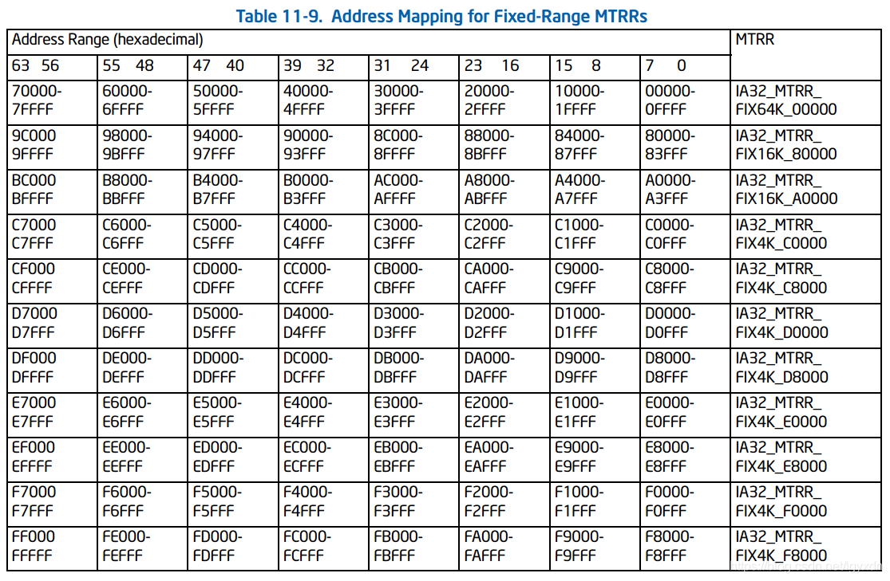

@[toc]

本章介绍英特尔64与IA-32处理器中的内存缓存与缓存控制机制、TLB与存储缓冲区。它还描述了P6系列处理器中引入的内存类型范围寄存器（mtrr），以及它们如何用于控制物理内存位置的缓存。

# 11.1 内部缓存、TLB和缓冲区

Intel 64和IA-32体系结构支持高速缓存、转换查找缓冲区（TLB），和用于指令和数据的临时片上（和外部）存储的存储缓冲区。（图11-1显示了奔腾4和英特尔至强处理器的缓存、TLB和存储缓冲区的排列。）表11-1显示了奔腾4、英特尔至强、P6系列和奔腾处理器的这些缓存和缓冲区的特性。**这些单元的大小和特性由特定机器决定，并且可能在处理器的未来版本中更改**。CPUID指令返回执行该指令的处理器的缓存和缓冲区的大小和特性。请参阅“英特尔64与IA-32体系结构软件开发人员手册”第2A卷第3章“指令集参考，A-L”中的“CPUID-CPU标识”。


|Cache or Buffer|Characteristics  |
|:--|:--|
| Trace Cache 跟踪缓存 | •奔腾4和英特尔至强处理器（基于英特尔NetBurst微架构）：12 Kμops，8路关联设置。<br>•Intel Core i7、Intel Core 2 Duo、Intel®Atom™、Intel Core Duo、Intel Core Solo、Pentium M处理器：未实现。<br>•P6系列和奔腾处理器：未实现。 |
|L1指令缓存 | •奔腾4和英特尔至强处理器（基于英特尔NetBurst微架构）：未实现。<br>•Intel Core i7处理器：32 KByte，4路关联设置。<br>•Intel Core 2 Duo、Intel Atom、Intel Core Duo、Intel Core Solo、Pentium M处理器：32 KByte、8路关联设置。<br>•P6系列和奔腾处理器：8或16 KByte，4路集合关联，32字节缓存线大小；2路集合关联，适用于较早的奔腾处理器。|
|L1数据缓存|•奔腾4和英特尔至强处理器（基于英特尔NetBurst微架构）：8千字节，4路关联设置，64字节缓存线大小。<br>•奔腾4和英特尔至强处理器（基于英特尔NetBurst微架构）：16 KB，8路关联设置，64字节缓存线大小。<br>•Intel Atom处理器：24 KByte，6路关联设置，64字节缓存线大小。<br>•Intel Core i7、Intel Core 2 Duo、Intel Core Duo、Intel Core Solo、Pentium M和Intel Xeon处理器：32 KB、8路关联设置、64字节缓存线大小。<br>•P6系列处理器：16 KByte，4路集合关联，32字节缓存线大小；8 KByte，2路集合关联，用于早期P6系列处理器。<br>•奔腾处理器：16 KByte，4路集合关联，32字节缓存线大小；8 KByte，2路集合关联，适用于较早的奔腾处理器。|
|L2统一缓存|•Intel Core 2 Duo和Intel Xeon处理器：高达4兆字节（或4兆字节处理器中为4兆字节2），16路关联设置，64字节缓存线大小。<br>•Intel Core 2 Duo和Intel Xeon处理器：高达6兆字节（或在四核处理器中为6兆字节2），24路关联设置，64字节缓存线大小。<br>•英特尔酷睿i7、i5、i3处理器：256KBbyte，8路关联设置，64字节缓存线大小。<br>•Intel Atom处理器：512 KB，8路关联设置，64字节缓存线大小。<br>•Intel Core Duo，Intel Core Solo处理器：2兆字节，8路关联设置，64字节缓存线大小<br>•奔腾4和英特尔至强处理器：256、512、1024或2048千字节，8路关联设置，64字节缓存线大小，128字节扇区大小。<br>•奔腾M处理器：1或2兆字节，8路关联设置，64字节缓存线大小。<br>•P6系列处理器：128 KByte、256 KByte、512 KByte、1-MByte或2-MByte，4路关联设置，32字节缓存线大小。<br>•奔腾处理器（外部可选）：系统特定，通常为256或512 KByte，4路关联设置，32字节缓存线大小。|
|L3统一缓存|•Intel Xeon处理器：512KByte、1-MByte、2-MByte或4-MByte，8路关联设置，64字节缓存线大小，128字节扇区大小。<br>•Intel Core i7处理器，Intel Xeon 5500处理器：高达8字节，16路关联设置，64字节缓存线大小。<br>•Intel Xeon处理器5600：高达12字节、64字节缓存线大小。<br>•Intel Xeon处理器7500：高达24MB，64字节缓存线大小。|
|指令TLB（4KB页）|•奔腾4和英特尔至强处理器（基于英特尔NetBurst微架构）：128个条目，4路关联设置。<br>•Intel Atom处理器：32个条目，完全关联。<br>•Intel Core i7、i5、i3处理器：每个线程64个条目（每个核心128个条目），4路关联设置。<br>•Intel Core 2 Duo、Intel Core Duo、Intel Core Solo处理器、Pentium M处理器：128个条目，4路集合关联。<br>•P6系列处理器：32个条目，4路集合关联。•奔腾处理器：32个条目，4路集合关联；对于采用MMX技术的奔腾处理器，完全集合关联。|
|数据TLB（4KB页）|•Intel Core i7、i5、i3处理器，DTLB0:64条，4路关联设置。<br>•英特尔酷睿2双核处理器：DTLB0，16条，DTLB1，256条，4路。<br>•Intel Atom处理器：每线程16条micro TLB，完全关联；64条DTLB，4路设置关联；16条PDE缓存，完全关联。<br>•奔腾4和英特尔至强处理器（基于英特尔NetBurst微架构）：64项，完全关联，与大页DTLB共享。<br>•Intel Core Duo、Intel Core Solo处理器、奔腾M处理器：128个条目，4路关联设置。<br>•奔腾和P6系列处理器：64个条目，4路集合关联；全集合，关联，适用于采用MMX技术的奔腾处理器。|
|指令TLB（大页）|•Intel Core i7、i5、i3处理器：每个线程7个条目，完全关联。<br>•Intel Core 2双核处理器：4个入口，4路。<br>•奔腾4和英特尔至强处理器：大页面被分割。<br>•Intel Core Duo、Intel Core Solo、Pentium M处理器：2个条目，完全关联。<br>•P6系列处理器：2个条目，完全关联。<br>•奔腾处理器：使用与4千字节页面相同的TLB|
|数据TLB（大页）|•Intel Core i7、i5、i3处理器，DTLB0:32个条目，4路集合关联。<br>•英特尔酷睿2双核处理器：DTLB0，16条，DTLB1，32条，4路。<br>•Intel Atom处理器：8个条目，4路集合关联。<br>•奔腾4和英特尔至强处理器：64个条目，完全关联；与小页数据TLB共享。<br>•Intel Core Duo、Intel Core Solo、Pentium M处理器：8个条目，完全关联。<br>•P6系列处理器：8个条目，4路集合关联。<br>•奔腾处理器：8个条目，4路集合关联；使用与奔腾4千字节页面相同的TLB采用MMX技术的处理器。|
|二级统一TLB（4KB页）|•Intel Core i7、i5、i3处理器，STLB:512个条目，4路集合关联|
|Store Buffer|•Intel Core i7、i5、i3处理器：32个条目。<br>•Intel Core 2双核处理器：20个条目。<br>•Intel Atom处理器：8个条目，用于WC和存储缓冲区。<br>•奔腾4和英特尔至强处理器：24项。<br>•奔腾M处理器：16个条目。<br>•P6系列处理器：12个。<br>•奔腾处理器：2个缓冲区，每个缓冲区有1个入口（采用MMX技术的奔腾处理器有4个缓冲区，可容纳4个入口）。|
|写入合并（WC）缓冲区|•Intel Core 2双核处理器：8个条目。<br>•Intel Atom处理器：8个条目，用于WC和存储缓冲区。<br>•奔腾4和英特尔至强处理器：6或8个条目。<br>•Intel Core Duo、Intel Core Solo、Pentium M处理器：6个条目。<br>•P6系列处理器：4个入口。|

*注：在奔腾4和英特尔至强处理器中引入IA-32体系结构*

英特尔64与IA-32处理器可实现四种类型的高速缓存：跟踪高速缓存、1级（L1）高速缓存、2级（L2）高速缓存和3级（L3）高速缓存。见图11-1。缓存可用性描述如下：

- **英特尔酷睿i7、i5、i3处理器系列以及基于英特尔微架构代码名为Nehalem和英特尔微架构代码名为Westmere的英特尔至强处理器系列** — 一级缓存分为两部分：一部分专用于缓存指令（预解码指令），另一部分用于缓存数据。二级缓存是一个统一的数据和指令缓存。每个处理器核心都有自己的L1和L2。三级缓存是一个包括统一的数据和指令缓存在内，由物理包(physical package)中的所有处理器核心共享。未实现跟踪缓存。
- **基于英特尔酷睿微架构的英特尔酷睿2处理器系列与英特尔至强处理器系列** —  一级缓存分为两部分：一部分专用于缓存指令（预编码指令），另一部分用于缓存数据。二级缓存是位于处理器芯片上的统一数据和指令缓存；在双核处理器实现中，它在两个处理器内核之间共享。四核处理器有两个L2，每个L2由两个处理器核共享。未实现跟踪缓存。
- **Intel® Atom™ 处理器** — 一级缓存分为两部分：一部分专用于缓存指令（预解码指令），另一部分用于缓存数据。二级缓存是一个统一的数据和指令缓存位于处理器芯片上。未实现跟踪缓存。
- **Intel®Core™Solo和Intel®Core™Duo处理器** — 一级缓存分为两部分：一部分用于缓存指令（预解码指令），另一部分用于缓存数据。二级缓存是位于处理器芯片上的统一数据和指令缓存。在双核处理器实现中，它在两个处理器核心之间共享。未实现跟踪缓存。
- **基于英特尔NetBurst微架构的奔腾4与英特尔至强处理器** — 跟踪缓存从指令解码器缓存解码指令（μops），一级缓存包含数据。二级和三级缓存是位于处理器芯片上的统一数据和指令缓存。双核处理器有两个L2，每个处理器核一个。请注意，L3缓存仅在某些Intel Xeon处理器上实现。
- **P6系列处理器** — 一级缓存分为两部分：一部分用于缓存指令（预编码指令），另一部分用于缓存数据。二级缓存是位于处理器芯片上的统一数据和指令缓存。P6系列处理器不实现跟踪缓存。
- **Pentium®处理器** — 一级缓存的结构与P6系列处理器相同。没有跟踪缓存。二级缓存是早期奔腾处理器芯片外部的统一数据和指令缓存并在以后的奔腾处理器中的处理器芯片上实现。对于二级缓存位于处理器外部的奔腾处理器，通过系统总线访问缓存。

对于英特尔酷睿i7处理器以及基于英特尔酷睿、英特尔Atom和英特尔NetBurst微架构、英特尔酷睿双核、英特尔酷睿单核和奔腾M处理器的处理器，一级和二级缓存（以及三级缓存（如果支持））的缓存线宽64字节。处理器总是从系统内存中从64字节边界开始读取缓存线。（64字节对齐的高速缓存线从一个地址开始，其6个最低有效位被清除。）高速缓存线可以用8路传输突发事务（8-transfer burst transaction）从内存中填充。缓存不支持部分填充的缓存线，因此即使缓存一个双字也需要缓存整行。

P6系列和奔腾处理器中的L1和L2高速缓存线宽32字节，从系统内存中读取的高速缓存线从32字节边界开始（内存地址的5个最低有效位清除）。高速缓存线可以用4路传输突发事务从内存中填充。不支持部分填充的缓存线。

基于英特尔NetBurst微架构的处理器中的跟踪缓存可用于所有执行模式：保护模式、系统管理模式（SMM）和实地址模式。L1、L2和L3缓存在所有执行模式下都是可用的；但是，在SMM中必须小心使用它们（请参阅第34.4.2节“SMRAM缓存”）。

TLBs存储最近使用的页目录和页表条目。当启用分页时，它们通过减少读取存储在系统内存中的页表所需的内存访问次数来加快内存访问。TLB分为四组：4KB页的指令TLB、4KB页的数据TLB、大页（2MB、4MB或1GB页）的指令TLB和大页的数据TLB。TLB通常仅在启用分页的保护模式下处于活动状态。当分页被禁用或处理器处于实地址模式时，TLB将保持其内容，直到显式或隐式刷新（请参阅第11.9节“使转换查找缓冲区（TLB）无效”）。

基于Intel Core微架构的处理器实现一级指令TLB和两级数据TLB。英特尔酷睿i7处理器提供二级统一TLB。

存储缓冲区与处理器指令执行单元相关联。它允许保存对系统内存和/或内部缓存的写操作，并且在某些情况下可以组合起来优化处理器的总线访问。在所有执行模式中，存储缓冲区始终处于启用状态。

处理器的缓存在很大程度上对软件是透明的。启用时，指令和数据在这些缓存中流动，而不需要显式的软件控制。但是，了解这些缓存的行为可能有助于优化软件性能。例如，有关缓存维度和替换算法的知识可以指示在不引起缓存抖动的情况下可以同时操作多大的数据结构。

在多处理器系统中，维护缓存一致性在极少数情况下可能需要系统软件的干预。对于这些罕见的情况，处理器提供特权缓存控制指令，用于刷新缓存和强制内存排序。

软件可以使用一些指令来提高L1、L2和L3缓存的性能，包括预取、CLFLUSH和CLFLUSHOPT指令以及非临时移动指令（MOVNTI、MOVNTQ、MOVNTDQ、MOVNTPS和MOVNTPD）。这些指令的使用在第11.5.5节“缓存管理指令”中进行了讨论


# 11.2 相关术语

IA-32处理器（从奔腾处理器开始）和Intel 64处理器使用MESI缓存协议来维护缓存一致性。

当处理器发现有一个读取操作是可以缓存的，那么就会一次性地读取一个缓存行的数据到相应的缓存中（L1/L2/L3/全部），这个叫做**填充缓存行(cache line fill)**.

如果处理器下一次要访问的操作数正好在缓存中，那么处理器就不需要去访问内存，而是直接快速地从缓存中访问，这叫做**缓存命中(cache hit)**.

当处理器打算把操作数写到一个可缓存的内存区域，这时它会首先检查缓存行里是否有这个内存地址。如果有的话，就不需要去访问内存了，而是写到缓存中，这叫做**写命中(write hit)**.

但是如果没有一个有效的缓存行对应要写入的内存区域，那么写缓存就不会命中。这时候处理器会执行填充缓存行，申请写操作缓存，然后写入到该缓存，然后再根据当前的写策略写到内存。如果操作数要写到内存，那么首先会写到store buffer，然后等到系统总线可用的时候，写到内存。

# 11.3 可用的缓存方法

处理器允许任何区域的内存存放于缓存L1/L2/L3之中，在系统内存独立的页或区中，处理器允许指定下面的内存类型，在Intel 64和IA-32架构下有：

- 强制不缓存(Strong Uncacheable ：UC) - 不允许缓存的系统内存。所有出现在系统总线上的读和写都以program order进行，不允许乱序。不能进行推测性内存访问、不能做页表遍历、不能预取推测的分支目标。这类缓存控制对于内存映射的I/O设备是十分有用的，当使用一般的RAM的时候，这类操作可以极大地损耗处理器性能。
- 不缓存 (Uncacheable: UC-) - 除了可以被WC内存类型的MTRRs(Memory type range registers 参考维基百科[词条](https://en.wikipedia.org/wiki/Memory_type_range_register) )编程覆盖，这种类型的特点同UC。这种类型的处理器从Pentium III处理器家族开始就有，并且只能通过PAT(Performance acceleration technology Intel的一个改进芯片组性能的技术)的方式启用。
- 写合并(Write Combining: WC) - 系统内存中不能缓存的地址，并且一致性也不受处理器总线一致性协议强制约束。可以进行推测性读取；写操作可能会延迟并放在写合并缓存(wirte combining buffer)中来减少内存访问。如果写合并缓存不满，那么写操作可能会被延迟到下一个序列化事件出现的时候，比如一个SFENCE/MFENCE指令，CPUID指令，一次非缓存的读/写操作，一次中断，或者一个LOCK指令执行。这类缓存控制适用于视频帧缓存，此时只要写操作在更新内存以便在图形显示器中看到，那么写操作的顺序不重要的。这种内存类型在Pentium Pro 和 Pentium II处理器的MTRRs编程中开始支持，或者在Pentium III处理器配合打开PAT技术、以MTRRs编程就开始支持。
- 直接写 (Write-through: WT) - 读/写到系统内存的数据或者读/写自系统内存数据都可以缓存。读操作缓存命中时从缓存行中读，没有命中就触发缓存填充。允许推测读取。所有写操作都会经过缓存行写入系统内存。当写到系统内存的时候，所有无效的缓存行不能被填充，所有有效的缓存行要么被填充，要么不可用。允许写合并，这种类型的缓存控制适合帧缓冲存储区，或者是那些系统总线上访问系统内存的设备，但是不能执行内存访问监视，要求必须满足处理器缓存和系统内存的一致性。
- 写回 (Write-back: WB) - 读/写到系统内存的数据或者读/写自系统内存数据都可以缓存。缓存命中时从缓存行中读，缓存未命中就触发缓存填充。允许推测读。写缺失会触发缓存行填充(从P6家族处理器开始)；在允许的情况下，写操作完全在缓存中进行。允许写合并。写回内存类型通过减少不必要的系统内存写操作减轻了系统总线压力。写入缓存行的操作不会立即写入内存，而是累积在缓存中。当执行一个写回操作的时候，缓存行中的改动才会写入系统内存。而当缓存行需要释放的时候才会触发一个写回操作，比如当缓存行已满，但是有新的缓存行申请的时候；也可以是由于缓存一致性机制触发。这类缓存控制提供了最好的性能，但是它要求系统总线上的所有访问系统内存的设备都有监视内存访问的能力，以保证内存和缓存的一致性。
- 写保护 (Write protected: WP) - 尽可能地读取缓存行，读取操作未命中的话触发缓存填充。写操作会广播到系统总线，并且导致系统总线上所有处理器中相应的缓存行失效。允许推测读取。这种内存类型从P6家族的处理器配合MTRRs编程开始支持。


## 11.3.1 写合并内存地址的缓存

写入到WC内存类型的数据并不是缓存到典型意义上的“缓存”中的，它们是保留在独立与L1/2/3和store buffer的写合并缓存中的。WC缓存不受其他设备监视，所以也就不提供数据一致性保证。对WC内存的写操作进行缓冲是为了允许软件在一个很小的时间窗口内向WC缓冲区提供更多修改过的数据，同时尽可能保持对软件的非侵入性。对WC内存的写操作进行缓冲也会导致数据覆盖；也就是说，对同一内存位置的多次写操作将保留最后一次写入该位置的数据，而其他写操作将会丢失。

WC缓冲区的大小和结构没有在体系结构上定义。对于Intel Core 2 Duo, Intel Atom, Intel Core Duo, Pentium M, Pentium 4 和 Intel Xeon处理器，WC缓冲区由多个64字节WC缓冲区组成。对于P6系列处理器，WC缓冲区由几个32字节的WC缓冲区组成。

当软件开始写入WC存储器时，处理器开始一次一个地填充WC缓冲区。当一个或者多个WC缓冲区填满，处理器可以选择将缓冲区移出到系统内存。这个用于移出WC缓冲区的协议依赖于实现，软件不应依赖于系统内存一致性。当使用WC内存类型时，软件一定要注意到以下事实：向系统内存写入数据将被延迟，在系统内存要求一致性时必须故意清空WC缓冲区。

一旦处理器开始将数据从WC缓冲区移出到系统内存中，它将根据缓冲区中包含有效数据的数量做出总线事务类型的决定。如果缓冲区已满（例如，所有字节都有效）处理器将在总线上执行突发写入事务。这将导致在单个突发事务中在数据总线上传输所有32字节（P6系列处理器）或64字节（奔腾4及更新处理器）。如果一个或多个WC缓冲区字节无效（例如，未由软件写入），处理器将使用“部分写入”事务（一次一个数据块，其中一个“数据块”是8字节）将数据传输到内存。

将一个WC缓存数据发送到存储器，将导致一个最多4个部分写事务（对于P6族处理器）或8个部分写事务（对于奔腾4和更近的处理器）。

按照定义，WC内存类型是弱排序的。一旦开始移出WC缓冲区，数据将服从其定义的弱排序语义。在WC缓冲区的连续分配/释放之间不保持排序（例如，写入WC缓冲区1后写入WC缓冲区2可能显示为缓冲区2后接系统总线上的缓冲区1）。当WC缓冲区作为部分写入移出到内存时，连续部分写入之间没有保证的顺序（例如，块2的部分写入可能出现在总线上块1的部分写入之前，反之亦然）。

WC广播到系统总线是由事务的原子性提供唯一保证的。例如，使用P6系列处理器完全满的WC缓冲区将始终使用任何块顺序作为单个32位突发事务进行广播。在WC缓冲区移出（其中数据将作为部分移出）过程中，包含在同一个块（0 mod 8对齐）中的所有数据将同时广播。同样，对于最近的基于英特尔NetBurst微架构的处理器开始，完整的WC缓冲区将始终作为单个突发事务传播，并且在事务中可以使用任何块顺序。对于部分缓冲区传播，包含在同一块中的所有数据将同时广播。

## 11.3.2 如何选择内存类型

最简单的系统内存模型不使用具有读或写副作用的内存映射I/O，不包括帧缓冲区，对所有内存使用写回内存类型。I/O代理可以执行直接内存访问（DMA）来写回内存，缓存协议保持缓存一致性。

系统可以将UC内存用于其他内存映射的I/O，并且应该始终将UC内存用于有读取副作用的内存映射I/O。

双端口内存可以被认为是一种有写副作用、需要较快写操作的内存，因为这些写操作在到达内存代理之前无法在另一个端口上观察到。系统可以为帧缓冲区或包含屏幕上显示像素值的双端口存储器使用UC, UC-，WT，WC内存类型。帧缓冲区存储器通常较大（几兆字节），通常比处理器读取的要多。对帧缓冲区使用UC类型内存会产生非常大的总线通信量，因为对整个缓冲区的操作是使用部分写入而不是行写入来实现的。对帧缓冲区使用WT类型内存可以替换处理器的L2，L3以及L1中几乎所有其他有用的缓存行。因此，系统应尽可能对帧缓冲区使用WC类型内存。

当软件无法以有利于回写缓存的方式访问数据结构时，软件可以使用页级缓存控制来分配适当的有效内存类型。例如，软件可以读取一次大的数据结构，并且在结构被另一个代理重写之前不再访问该结构。如此大的数据结构应标记为不可缓存，否则读取它将收回处理器将再次引用的缓存行。

一个类似的例子是一个只写的数据结构，它被写入（将数据导出到另一个代理），但从不被软件读取。这样的结构可以被标记为不可缓存，因为软件从不读取它所写入的值（尽管它是不可缓存的内存，但它将使用部分写入，而作为写回内存中，它将使用行写入来写入，这可能要等到另一个代理读取结构并触发隐式写回时才会发生）。

在奔腾III、奔腾4和更新的处理器上，提供了新的指令，使软件能够更好地控制数据的缓存、预取和写回特性。这些指令允许软件使用弱顺序或处理器顺序的内存类型来提高处理器性能，但在必要时强制对内存读取和/或写入进行强排序。它们还允许软件更好地控制数据的缓存。有关这些指令和预期用途的说明，请参阅第11.5.5节“缓存管理指令”

## 11.3.3 在不可缓存内存中获取代码

程序可以从不可缓存（UC）内存执行代码，但其含义不同于访问UC内存中的数据。在执行代码获取时，处理器从不推测性地从可缓存代码转换为UC代码。也从不推测性地获取导致UC代码的分支目标。

处理器可以累积多次获取相同的UC缓存线，以便解码一次指令。它可以在缓存线中解码连续的UC指令，而不必在每个指令之间穿插提取操作。它还可以从相同或连续的4-KByte页中获取额外的缓存行，以便解码一条非推测性UC指令（这即使指令完全包含在一行中，也可以为true）。

由于上述原因，并且由于缓存行大小可能在未来的处理器中发生变化，软件应避免将具有读取副作用的内存映射I/O放在同一页或用于执行UC代码的后续页中。

# 11.4 缓存控制协议

下一节介绍当前为Intel 64和IA-32体系结构定义的缓存控制协议。

在L1数据缓存和L2/L3统一缓存中，MESI（modified，exclusive，shared，invalid）缓存协议与其他处理器的缓存保持一致性。L1数据缓存和L2/L3统一缓存每行有两个MESI状态标志。每行可标记为处于表11-4中定义的状态之一。通常，MESI协议的操作对程序是透明的。


P6系列处理器中的L1指令缓存只实现MESI协议的“SI”部分，因为指令缓存是不可写的。指令缓存监视数据缓存中的更改，以在修改指令时保持缓存之间的一致性。有关缓存指令含义的更多信息，请参阅第11.6节“自修改代码”。

# 11.5 缓存控制

Intel 64和IA-32体系结构提供多种机制，用于控制数据和指令的缓存，以及控制处理器、缓存和内存之间的读写顺序。这些机制可分为两组：
- **缓存控制寄存器和位** — Intel 64和IA-32体系结构在控制寄存器与页表与目录表项中定义多个专用寄存器与各种位，用于控制一级、二级和三级缓存中的缓存系统内存位置。这些机制控制虚拟内存页和物理内存区域的缓存。
- **缓存控制和内存排序指令** — “英特尔64”与“IA-32”体系结构提供了多条指令，用于控制数据缓存、内存读写顺序以及数据预取。这些指令允许软件控制特定数据结构的缓存，控制内存中特定位置的内存一致性，并强制程序中特定位置的强内存顺序。

以下部分描述这两组缓存控制机制。

## 11.5.1 缓存控制寄存器和位

图11-3描述了IA-32处理器中的缓存控制机制。除了内存地址空间的问题，它们在英特尔64处理器中的工作原理是一样的。

Intel 64和IA-32体系结构提供以下缓存控制寄存器和位，用于启用或限制对内存中不同页或区域的缓存：

- **CD标志，控制寄存器CR0的第30位** — 控制系统内存位置的缓存（见第2.5节，“控制寄存器”）。如果清除了CD标志，则会为整个系统内存启用缓存，但可能会被其他缓存控制机制限制为单个页面或内存区域。当设置了CD标志时，P6和更新的处理器系列的缓存（缓存层次结构）在处理器的缓存中受到限制，而奔腾处理器则受到阻止（参见下面的注释）。但是，设置了CD标志后，缓存仍将响应snoop通信量。应显式刷新缓存以确保内存一致性。为了获得最高的处理器性能，应该清除控制寄存器CR0中的CD和NW标志。表11-5显示了CD和NW标志的交互作用。  
对于从P6系列开始的处理器系列，设置CD标志的效果与奔腾处理器有所不同（见表11-5）。为了确保CD标志设置后的内存一致性，应该显式地刷新缓存（请参阅第11.5.3节“防止缓存”）。为P6和更新的处理器系列设置CD标志将修改缓存线填充和更新行为。此外，在这些处理器上设置CD标志不会强制对内存访问进行严格的排序，除非MTRR被禁用和/或所有内存都被引用为未缓存（请参阅第8.2.5节“加强或削弱内存排序模型”）。
- **NW标志，控制寄存器CR0的第29位** — 控制系统内存位置的写入策略（参见第2.5节“控制寄存器”）。如果NW和CD标志清除，则对整个系统内存启用写回，但其他缓存控制机制可能会限制对单个页面或内存区域的写回。表11-5显示了CD和NW标志的其他组合如何影响缓存。

```
注意：
奔腾4和英特尔至强处理器会忽略NW标志；也就是说，当设置了CD标志时，处理器使用无填充缓存模式，而不管NW标志的设置如何。
英特尔Atom处理器会忽略NW标志；也就是说，当设置了CD标志时，处理器将禁用缓存，而不管NW标志的设置如何。
对于奔腾处理器，当一级缓存被禁用（控制寄存器CR0中的CD和NW标志被设置）时，DP（双处理器）系统接受外部snoop，单处理器系统禁止外部snoop。
当禁止snoop时，不检查地址奇偶性，也不为损坏的地址断言APCHK；但是，当接受snoop时，检查地址奇偶性，并为损坏的地址断言APCHK。
```
- **分页结构项中的PCD和PWT标志** — 控制用于访问分页结构和页面的内存类型（请参阅第4.9节“分页和内存类型”）。
- **控制寄存器CR3中的PCD和PWT标志** — 控制用于访问当前分页结构层次结构的第一个分页结构的内存类型（请参阅第4.9节“分页和内存类型”）。
- **页目录中和页表条目（引入P6系列处理器中的IA-32体系结构）的G（全局）标志** — 控制单个页面的TLB条目刷新。有关此标志的详细信息，请参阅第4.10节“缓存转换信息”。
- **控制寄存器CR4中的PGE（页面全局启用）标志**-使用G标志启用全局页面的建立。有关此标志的详细信息，请参阅第4.10节“缓存转换信息”。
- **内存类型范围寄存器（MTRR）（在P6系列处理器中引入）** —控制物理内存特定区域中使用的缓存类型。可以选择第11.3节“可用缓存方法”中描述的任何缓存类型。有关MTRR的详细说明，请参阅第11.11节“内存类型范围寄存器（MTRR）”。
- **页面属性表（PAT）MSR（在奔腾III处理器中引入）** — 扩展处理器的内存类型功能，允许逐页分配内存类型（请参阅第11.12节“页面属性表（PAT）”。
- **IA32_MISC_ENABLE MSR（仅在基于英特尔NetBurst微架构的处理器中可用）的第6位的第三级缓存禁用标志** — 允许禁用和启用L3缓存，与L1和L2缓存无关。
- **KEN#和WB/WT#管脚（奔腾处理器）** — 允许外部硬件控制用于特定内存区域的缓存方法。它们执行与P6中的MTRR相似（但不完全相同）的功能 家庭处理器。
- **PCD和PWT管脚（奔腾处理器）**  — 这些管脚（与控制寄存器CR3以及页面目录和页面表项中的PCD和PWT标志相关）允许外部二级缓存中的缓存逐页控制，与在这些处理器的一级缓存上执行的控制一致。P6和更新的处理器系列不提供这些管脚，因为芯片包内部的二级缓存。


表11-5. 缓存操作模式
|CD | NW | 缓存和读写策略 | L1 | L2/L3 1⃣️️|
|:---|:------|:------|:------|:----------|
|0|0|•正常缓存模式。最高性能的缓存操作。<br>•读取命中访问缓存；读取未命中可能导致替换。•写入命中更新缓存。<br>•仅写入共享行和写入未命中更新系统内存。<br><br>•写入未命中导致缓存线填充。<br>•写命中可以在MTRRs的控制下和相关的读失效周期将共享行更改为已修改。<br>•（仅限奔腾处理器。）写入未命中不会导致缓存线填充。<br><br>•（仅限奔腾处理器。）写入命中可以在WB/WT的控制下将共享线更改为独占。<br>•允许失效。<br>•支持外部窥探流量。|YES<br>YES<br>YES<br><br>YES<br>YES<br>YES<br><br>YES<br>YES<br>YES<br>|YES<br>YES<br>YES<br><br>YES<br> <br> <br><br> <br>YES<br>YES<br>|
|0|1|无效设置。生成一般保护异常（#GP），错误代码为0|NA|NA|
|1|0|无填充缓存模式。保持记忆连贯性。 <br>•（奔腾4及更高版本的处理器系列）通电或重置后的处理器状态。<br>•读取命中访问缓存；读取未命中不会导致替换（请参阅下面的奔腾4和英特尔至强处理器参考资料）<br> •写入命中更新缓存。<br>•仅写入共享行和写入未命中更新系统内存。<br><br>•写入未命中访问内存。<br>•写命中可以在MTRRs的控制下和相关的读失效周期将共享行更改为独占。<br>•（仅限奔腾处理器。）写入命中可以在WB/WT的控制下将共享线更改为独占。<br>•（仅限P6及更高版本的处理器系列）除非禁用MTRR和/或所有内存都被引用为未缓存，<br>否则不强制执行严格的内存排序（请参阅第7.2.4节，“加强或削弱内存排序模型”）。<br> •允许失效。<br> •支持外部窥探流量。|<br>YES<br>YES<br>YES<br>YES<br><br>YES<br>YES<br>YES<br>YES<br><br>YES<br>YES|<br>YES<br>YES<br>YES<br>YES<br><br>YES<br>YES<br> <br>YES<br><br>YES<br>YES|
|1|1|没有保持内存一致性。2⃣️3⃣️<br>•（P6系列和奔腾处理器。）通电或重置后处理器的状态。<br>•读取命中访问缓存；读取未命中不会导致替换。<br>•写入命中更新缓存并将独占行更改为已修改。<br><br>•写入命中后，共享行仍保持共享。<br>•写入未命中访问内存。<br>•当监听时，失效被禁止；但允许使用INVD和WBINVD指令。<br>•支持外部窥探流量。|<br><br>YES<br>YES<br>YES<br><br>YES<br>YES<br>No|<br><br>YES<br>YES<br>YES<br><br>YES<br>YES<br>YES|
*注：  
1⃣️ 此表中的L2/L3列是奔腾4、英特尔至强和P6系列处理器的最终版本。它旨在表示在基于奔腾处理器的系统中可以实现的功能，该处理器具有特定于平台的外部回写二级缓存。  
2⃣️ 奔腾4和更新的处理器系列不支持这种模式；将CD和NW位设置为1将选择no fill
高速缓存模式。  
3⃣️ 英特尔Atom处理器不支持。如果在英特尔Atom处理器中CD=1，则禁用缓存*

## 11.5.2 缓存控件的优先级

缓存控制标志和MTRR按层次结构操作，以限制缓存。也就是说，如果设置了CD标志，则全局禁止缓存（见表11-5）。如果清除了CD标志，则可以使用页级缓存控制标志和/或MTRRs来限制缓存。如果页级和MTRR缓存控件重叠，则阻止缓存的机制具有优先权。例如，如果MTRR使系统内存区域不可缓存，则该区域中的页就无法使用页级缓存控制来启用缓存。反之亦然；也就是说，如果页级缓存控件将页指定为不可缓存，则不能使用MTRR使页可缓存。

如果将回写和直写缓存策略分配给页面和内存区域时出现重叠，则优先使用直写策略。写合并策略（只能通过MTRR或PAT分配）优先于直写或回写。

页面级别的内存类型的选择取决于是否使用PAT为页面选择内存类型，如下节所述。

在基于英特尔NetBurst微架构的处理器上，IA32_MISC_ENABLE MSR的第6位可以禁用第三级缓存。对于这些处理器中的三级缓存，使用IA32_MISC_ENABLE[位6]优先于CD标志、MTRRs和PAT。也就是说，当设置三级缓存禁用标志（缓存禁用）时，其他缓存控件对三级缓存没有影响；当标志清除（启用）时，缓存控件对三级缓存的影响与对一级和二级缓存的影响相同。
英特尔酷睿i7处理器、基于英特尔酷睿的处理器以及英特尔Atom微架构均不支持IA32_MISC_ENABLE[位6]。

### 11.5.2.1 为奔腾Pro和奔腾II处理器选择内存类型

奔腾Pro和奔腾II处理器不支持PAT。这里，页面的有效内存类型是通过页面表或页面目录项中的MTRRs、PCD和PWT位来选择的。表11-6描述了当正常缓存生效（控制寄存器CR0中的CD和NW标志清除）时，MTRR内存类型和页级缓存属性到有效内存类型的映射。以灰色显示的组合是为奔腾Pro和奔腾II处理器定义的实现。鼓励系统设计者避免这些实现定义的组合。


*注：1. 当页表和页目录项中未使用PAT位（设置为0）时，这些有效内存类型也适用于奔腾4、英特尔至强和奔腾III处理器。*

当正常缓存生效时，表11-6中显示的有效内存类型使用以下规则确定：

奔腾Pro和奔腾II处理器不支持PAT。这里，页面的有效内存类型是通过页面表或页面目录项中的MTRRs、PCD和PWT位来选择的。表11-6描述了当正常缓存生效（控制寄存器CR0中的CD和NW标志清除）时，MTRR内存类型和页级缓存属性到有效内存类型的映射。以灰色显示的组合是为奔腾Pro和奔腾II处理器定义的实现。鼓励系统设计者避免这些实现定义的组合。

1. 如果页的PCD和PWT属性都为0，则有效内存类型与MTRR定义的内存类型相同。
2. 如果设置了PCD标志，则有效内存类型为UC。
3. 如果清除了PCD标志并设置了PWT标志，则WB内存类型的有效内存类型为WT，而所有其他内存类型的有效内存类型为MTRR定义的内存类型。
4. 将PCD和PWT标志设置为相反的值被视为WP和WC内存类型的特定模型，并在体系结构上为WB、WT和UC内存类型定义。

### 11.5.2.2 为奔腾III和更新的处理器系列选择内存类型

Intel Core 2 Duo、Intel Atom、Intel Core Duo、Intel Core Solo、Pentium M、Pentium 4、Intel Xeon和Pentium III处理器使用PAT选择有效的页级内存类型。这里，页面的内存类型由MTRRs和PAT条目中的值选择，PAT条目中的值是用页面表或页面目录条目中的PAT、PCD和PWT位选择的（参见第11.12.3节，“从PAT中选择内存类型”）。表11-7描述了正常缓存生效时（控制寄存器CR0中的CD和NW标志清除）MTRR内存类型和PAT条目类型到有效内存类型的映射。


注：
1. UC属性来自MTRRs，处理器不需要监听它们的缓存，因为数据永远不会被缓存。出于性能原因，首选此属性。
2. UC属性来自页表或页目录条目，处理器需要检查其缓存，因为数据可能由于页别名而被缓存，这是不推荐的。
3. 这些组合在以前版本的“英特尔64与IA-32体系结构软件开发人员手册”中被指定为“未定义”。然而，所有同时支持PAT和mtrr的处理器都决定了这些组合的有效页级内存类型。

### 11.5.2.3 在具有不同内存类型的页之间写入值

如果内存中的两个相邻页具有不同的内存类型，并且一个字或更长的操作数被写入跨越这两个页之间页边界的内存位置，则操作数可能被写入内存两次。此操作不会对写入实际内存造成问题；但是，如果设备映射了分配给页面的内存空间，则设备可能会出现故障。

## 11.5.3 阻止缓存

要在启用一级、二级和三级缓存并接收到缓存填充后禁用它们，请执行以下步骤：

1. 进入无填充缓存模式。（将控制寄存器CR0中的CD标志设置为1，将NW标志设置为0。
2.使用WBINVD指令刷新所有缓存。
3. 禁用MTRRs并将默认内存类型设置为uncached或为uncached内存类型设置所有MTRR（请参阅第11.11.2.1节“IA32_MTRR_DEF_type MSR”中对type字段和E标志的讨论）。

必须在设置CD标志后刷新缓存（步骤2），以确保系统内存一致性。如果缓存未刷新，则读取时仍会发生缓存命中，并将从有效缓存线读取数据。

上面列出的三个单独步骤的意图解决了三个不同的要求：（i）中断新数据替换缓存中的现有数据（ii）确保已经在缓存中的数据被释放到存储器中，（iii）确保后续存储器引用观察UC内存类型语义。缓存控制硬件的不同处理器实现可能允许这三个需求的软件实现的某些变化。见下面的注释。

*注：
如表11-5所示，在控制寄存器CR0中设置CD标志可修改处理器的缓存行为，但在所有处理器系列中单独设置CD标志可能不足以强制所有物理内存的有效内存类型为UC，也不强制严格的内存顺序，由于不同处理器系列的硬件实现差异。要强制对所有物理内存使用UC内存类型和严格的内存顺序，只需将所有物理内存的MTRRs编程为UC内存类型或禁用所有mtrr即可。
对于奔腾4和英特尔至强处理器，在执行上述步骤序列之后，包含WBINVD指令结束到实际禁用MTRR之间代码的缓存线可以保留在缓存层次结构中。在这里，要完全从缓存中删除代码，必须在禁用MTRRs之后执行第二条WBINVD指令。
对于英特尔Atom处理器，设置CD标志会强制所有物理内存遵守UC语义（不需要显式设置物理内存的内存类型）。因此，软件不需要发布第二个WBINVD，这一点不同与其他代处理器。*

## 11.5.4 禁用和启用三级缓存

在基于英特尔NetBurst微架构的处理器上，IA32_MISC_ENABLE MSR的第6位可以禁用第三级缓存。三级缓存禁用标志（IA32_MISC_ENABLE MSR的位6）允许禁用和启用三级缓存，而不依赖于一级和二级缓存。在使用此控件禁用或启用三级缓存之前，软件应禁用并刷新所有处理器缓存，如前面第11.5.3节“阻止缓存”中所述，以防止丢失存储在三级缓存中的信息。禁用或启用三级缓存后，可以还原整个处理器的缓存。

具有L3的较新Intel 64处理器不支持IA32_MISC_ENABLE[位6]，第11.5.3节“防止缓存”中描述的过程适用于整个缓存层次结构。

## 11.5.5 缓存管理指令

Intel 64和IA-32体系结构提供了一些用于管理L1、L2和L3缓存的指令。INVD和WBINVD指令是特权指令，作为一个整体在L1、L2和L3缓存上操作。PREFETCHh, CLFLUSH 和 CLFLUSHOPT指令以及非临时移动指令（MOVNTI、MOVNTQ、MOVNTDQ、MOVNTPS和MOVNTPD）提供了对缓存更细粒度的控制，并可用于所有特权级别。

INVD和WBINVD指令用于使L1、L2和L3缓存的内容无效。INVD指令使所有内部缓存项失效，然后生成一个特殊功能总线周期，指示外部缓存也应失效。使用INVD指令时应小心。它不会强制回写已修改的缓存线；因此，存储在缓存中但未回写到系统内存的数据将丢失。除非有一个特定需要或益处使得缓存失效而不需要回写修改过的行（例如，在测试或故障恢复期间，不考虑缓存与主内存的一致性），否则软件应使用WBINVD指令。

WBINVD指令首先将所有内部缓存中任何修改过的行写回，然后使L1、L2和L3缓存的内容无效。它会忽略有效的写策略（即直写或回写），保持L1、L2、L3与主内存的缓存一致性。执行此操作后，WBINVD指令生成一个（P6系列处理器）或两个（奔腾和Intel486处理器）特殊功能总线周期，以向外部高速缓存控制器指示在发生外部高速缓存失效后应将修改后的数据写回。WBINVD完成的时间或周期将因不同缓存层次结构的大小和其他因素而不同。因此，WBINVD指令的使用会对中断/事件响应时间产生影响。

PREFETCHh指令允许程序向处理器建议，将来自系统内存中指定位置的缓存线预取到缓存层次结构中（请参阅第11.8节“显式缓存”）。

CLFLUSH和CLFLUSHOPT指令允许刷新来自内存的、选定的缓存线。这些指令使程序具备一项能力：当知道系统内存的缓存部分在不久的将来将不会被访问时，可以显式地释放缓存空间。

非临时移动指令（movinti、MOVNTQ、MOVNTDQ、MOVNTPS和MOVNTPD）允许数据从处理器寄存器直接移动到系统内存，而不必同时写入L1、L2和/或L3缓存。这些指令可用于防止在将要修改一次的数据存储回系统内存之前对其进行操作时造成缓存污染。这些指令对通用、MMX和XMM寄存器中的数据进行操作。

## 11.5.6 L1上下文模式

一级数据缓存上下文模式是基于英特尔NetBurst微架构（支持英特尔超线程技术）的处理器的一项功能。当CPUID.1:ECX[位10]=1时，处理器支持使用一级数据缓存上下文模式标志（IA32_MISC_ENABLE[位24]）设置一级数据缓存上下文模式。可选模式有自适应模式（默认）和共享模式。

BIOS负责配置L1数据缓存上下文模式。

### 11.5.6.1 自适应模式

自适应模式有助于逻辑处理器之间的一级数据缓存共享。在自适应模式下运行时，一级数据缓存在同一个核心的逻辑处理器之间共享，如果：

- 共享缓存的逻辑处理器的CR3控制寄存器相同。
- 共享缓存的逻辑处理器使用相同的分页模式。

在这种情况下，整个一级数据缓存可供每个逻辑处理器使用（而不是竞争性地共享）。

如果共享一个L1缓存的逻辑处理器的CR3值不同，或者逻辑处理器使用不同的分页模式，则处理器将争夺缓存资源。这会减少每个逻辑处理器的缓存的有效大小。不允许缓存的别名（这可以防止数据抖动）。

### 11.5.6.2 共享模式

在共享模式下，逻辑处理器之间竞争性地共享L1数据缓存。即使逻辑处理器使用相同的CR3寄存器和分页模式，这也是正确的。

在共享模式下，一级数据缓存中的线性地址可以被别名化，这意味着缓存中的一个线性地址可以指向不同的物理位置。解析别名的机制可能导致抖动。因此，IA32_MISC_ENABLE[位24]=0是基于支持英特尔超线程技术的英特尔NetBurst微架构的处理器的首选配置

# 11.6 自修改代码

对当前缓存在处理器中的代码段中的内存位置的写入会导致关联的缓存线（或多个缓存线）失效。此检查基于指令的物理地址。此外，P6系列和奔腾处理器还检查对代码段的写入是否可以修改已预取以供执行的指令。如果写操作影响预取指令，则预取队列无效。后一种检查基于指令的线性地址。对于奔腾4和英特尔至强处理器，如果目标指令已解码并驻留在跟踪缓存中，则代码段中指令的写入或窥探会使整个跟踪缓存失效。后一种行为意味着，在奔腾4和英特尔至强处理器上运行时，自修改代码的程序可能导致性能严重下降。
实际上，对线性地址的检查不应在IA-32处理器之间造成兼容性问题。包含自修改代码的应用程序使用相同的线性地址来修改和获取指令。

系统软件（如调试器）可能使用与获取指令不同的线性地址修改指令，在执行修改后的指令之前，将执行序列化操作（如CPUID指令），该操作将自动重新同步指令缓存和预取队列。（有关使用自修改代码的详细信息，请参阅第8.1.3节“处理自修改和交叉修改代码”。）

对于Intel486处理器，对高速缓存中的指令进行写操作将修改高速缓存和内存中的指令，但如果在写操作之前预取了该指令，则执行的可能是该指令的旧版本。要防止执行旧指令，请在修改指令的任何写入之后立即编写跳转指令，以刷新指令预取单元。

# 11.7 隐式缓存（奔腾4、英特尔至强和P6系列处理器）

在使内存元素具有潜在可缓存性时会隐式缓存，尽管该元素可能从未在正常的冯诺依曼序列中被访问过。由于激进的预取、分支预测和TLB未命中处理，P6和更新的处理器系列上也会发生隐式缓存。隐式缓存是现有Intel386、Intel486和奔腾处理器系统行为的扩展，因为在这些处理器家族上运行的软件还不能确定性地预测指令预取的行为。

为了避免与隐式缓存相关的问题，当对缓存一致性机制不能自动处理的可缓存数据进行更改时，操作系统必须显式地使缓存失效。这包括写入双端口或物理上别名化的内存条（处理器的监听机制无法检测到这些内存条），以及更改内存中的页表项。

示例11-1中的代码显示了隐式缓存对页表条目的影响。线性地址F000H指向物理位置B000H（F000H的页表条目包含值B000H），线性地址F000的页表条目是PTE_F000。

示例 11-1. 隐式缓存对页表条目的影响
```
mov EAX, CR3; Invalidate the TLB
mov CR3, EAX; by copying CR3 to itself
mov PTE_F000, A000H; Change F000H to point to A000H
mov EBX, [F000H];
```

由于P6和更新处理器系列中的推测性执行，执行的最后一条MOV指令会将物理位置B000H的值放入EBX，而不是新物理地址A000H的值。这种情况可以通过在加载和存储之间放置TLB无效来补救。

# 11.8 显式缓存

奔腾III处理器引入了四条新指令，即预取指令，为软件提供了对数据缓存的显式控制。这些指令向处理器提供“提示”，提示预取指令请求的数据应立即或尽快读取到缓存层次结构中，以备使用。这些指令提供不同的提示，以选择将读入数据的缓存级别。

预取指令有助于减少通常与从内存中读取数据相关联的长延迟，从而有助于防止处理器“暂停”。然而，这些指令应谨慎使用。过度使用会导致资源冲突，从而降低应用程序的性能。此外，这些指令应仅用于从内存中预取数据；不应用于预取指令。有关正确使用预取指令的详细信息，请参阅《英特尔64与IA-32体系结构优化参考手册》中的第7章“优化缓存使用”。

# 11.9 使转换查找缓冲区（TLB）无效

处理器对软件透明地更新其地址转换缓存（TLB）但是，有几种机制允许软件和硬件显式地或作为另一个操作的副作用使TLB失效。第4.10.4节“TLB和分页结构缓存的失效”给出了大多数细节。此外，无论G标志的设置如何，以下操作都会使所有TLB条目失效：

- 确认或取消确认FLUSH# 管脚(pin)。
-（仅限奔腾4、英特尔至强及更高版本的处理器）写入MTRR（带有WRMSR指令）。
- 写入控制寄存器CR0以修改PG或PE标志。
- （仅限奔腾4、英特尔至强及更高版本的处理器）写入控制寄存器CR4以修改PSE、PGE或PAE标志。
- 写入控制寄存器CR4，将PCIDE标志从1更改为0。

有关TLB的其他信息，请参阅第4.10节“缓存转换信息”。

# 11.10 Store Buffer

英特尔64与IA-32处理器将每次写入（存储）内存的操作临时存储在存储缓冲区中。存储缓冲区允许处理器继续执行指令，而不必等到对内存和/或缓存的写入完成，从而提高了处理器性能。它还允许延迟写入以更有效地使用内存访问总线周期。
一般来说，存储缓冲区的存在对软件是透明的，即使在使用多个处理器的系统中也是如此。处理器确保写入操作始终按程序顺序执行。它还可以确保在以下情况下，存储缓冲区的内容始终被释放到内存中：
- 当产生异常或中断时。
- （仅限P6和更新的处理器系列）执行序列化指令时。
- 执行I/O指令时。
- 执行锁定操作时。
- （仅限P6和更新的处理器系列）执行BINIT操作时。
- （仅限奔腾III和更新的处理器系列）使用SFENCE指令订购存储时。
- （仅限奔腾4及更新的处理器系列）使用MFENCE指令订购存储时。

第8.2节“内存排序”中有关写入排序的讨论详细描述了存储缓冲区的操作。

# 11.11 存储器类型范围寄存器（Memory Type Range Registers : MTRR）

以下部分仅适用于P6和更新的处理器系列。

内存类型范围寄存器（MTRR）提供了一种将内存类型（见第11.3节“可用缓存方法”）与系统内存中的物理地址范围相关联的机制。它们允许处理器为不同类型的内存（如RAM、ROM、帧缓冲存储器和内存映射I/O设备）优化操作。它们还通过消除早期IA-32处理器上用于此功能的内存控制管脚和驱动它们所需的外部逻辑，简化了系统硬件设计。

MTRR机制允许在物理内存中定义多达96个内存范围，并且它定义了一组特定于模型的寄存器（model-specific registers：MSRs），用于指定每个范围中包含的内存类型。表11-8显示了可以指定的内存类型及其属性；图11-4显示了物理内存与mtrr的映射。有关每种内存类型的详细说明，请参阅第11.3节“可用缓存方法”。

在硬件重置之后，P6和更新的处理器系列将禁用所有固定和可变mtrr，这实际上使所有物理内存都无法缓存。然后，初始化软件应将MTRRs设置为特定的、系统定义的内存映射。通常，BIOS（基本输入/输出系统）软件配置MTRRs。然后，操作系统或执行程序可以使用普通的页面级可缓存属性自由修改内存映射。

在使用P6系列或更新系列处理器的多处理器系统中，每个处理器**必须**使用相同的MTRR内存映射，以便软件具有一致的内存视图。

*注：
在多处理器系统中，操作系统必须保持系统中所有处理器之间的MTRR一致性（即，所有处理器必须使用相同的MTRR值）。P6和更新的处理器不提供硬件支持来保持这种一致性。*

表11-8. 可以用MTRRs编码的内存类型


记忆类型和助记符 | MTRR中的编码
---|---
Uncacheable (UC) | 00H
Write Combining (WC) | 01H
保留* | 02H
保留* | 03H
Write-through (WT) | 04H
Write-protected (WP) | 05H
Writeback (WB) | 06H
保留* | 07H到FFH

注：* 使用这些编码会导致一般保护异常（#GP）


## 11.11.1 MTRR特征识别

MTRR特性的可用性是特定于模型的。软件可以通过执行CPUID指令并读取特征信息寄存器（EDX）中MTRR标志（位12）的状态来确定处理器是否支持MTRR。

如果设置了MTRR标志（指示处理器实现MTRR），则可以从64位IA32_MTRRCAP MSR（P6系列处理器的名称为MTRRcap MSR）获取有关MTRR的附加信息。IA32_MTRRCAP MSR是一个只读MSR，可以用RDMSR指令读取。图11-5显示了IA32_MTRRCAP MSR的内容。此寄存器中标志和字段的功能如下：

- **VCNT（可变范围寄存器计数）字段，位0到7** — 表示处理器上实现的可变范围数。
- **FIX（支持固定范围寄存器）标志，位8** — 设置时支持固定范围MTRR（IA32_MTRR_FIX64K_00000到IA32_MTRR_FIX4K_0F8000）；清除时不支持固定范围寄存器。
- **WC（写入组合）标志，位10** — 设置时支持写入组合（WC）内存类型；清除时不支持WC类型。
- **SMRR（系统管理范围寄存器）标志，第11位** — 设置第11位时支持系统管理范围寄存器（SMRR）接口；清除时不支持SMRR接口。

IA32_MTRRCAP MSR中的位9和位12到63被保留。如果软件试图写入IA32 MTRRCAP MSR，则会生成一般保护异常（#GP）。

软件必须读取IA32_MTRRCAP VCNT字段以确定可变MTRR的数量，并查询IA32_MTRRCAP中的其他功能位以确定处理器支持的其他功能。例如，某些处理器可能会在VCNT字段中报告值“8”，而其他处理器可能会报告具有不同值的VCNT。


## 11.11.2 用MTRRs设置内存范围

每个范围中指定的内存范围和内存类型由三组寄存器设置：IA32_MTRR_DEF_TYPE MSR、固定范围MTRR和可变范围MTRR。这些寄存器可以分别使用RDMSR和WRMSR指令读写。IA32_MTRRCAP MSR表示处理器上这些寄存器的可用性（见第11.11.1节“MTRR特性标识”）。

### 11.11.2.1 IA32_MTRR_DEF_TYPE MSR

IA32_MTRR_DEF_TYPE MSR（为P6系列处理器命名为MTRRdefType MSR）设置不包含在MTRR中的物理内存区域的默认属性。此寄存器中标志和字段的功能如下：

- **类型字段，位0到7** — 表示那些物理内存地址范围使用的默认内存类型，这些物理内存地址范围没有由MTRR指定的内存类型（该字段的编码见表11-8）。此字段的合法值为0、1、4、5和6。所有其他值都会导致生成一般保护异常（#GP）。  
英特尔建议在不存在内存的所有物理内存地址中使用UC（未缓存）内存类型。若要将UC类型分配给不存在的内存位置，可以将其指定为类型字段中的默认类型，或者使用固定和可变范围MTRRs显式赋值。
- **FE（已启用固定范围MTRR）标志，第10位** — 设置时启用固定范围MTRR；清除时禁用固定范围MTRR。启用固定范围MTRR时，当发生范围重叠时，它们优先于可变范围MTRR。如果禁用了固定范围MTRR，则仍可以使用可变范围MTRR，并可以映射固定范围MTRR通常覆盖的范围。
- **E（MTRRs enabled）标志，位11** — 设置时启用MTRRs；清除时禁用所有MTRRs，UC内存类型应用于所有物理内存。设置此标志时，FE标志可以禁用固定范围MTRRs；清除标志时，FE标志不起作用。设置E标志时，尚未由固定或变量MTRR映射的内存将使用区域默认内存类型字段中的指定类型。

IA32 MTRR_DEF_TYPE MSR中的位8和9以及位12到63被保留；如果软件试图向它们写入非零值，处理器将生成一般保护异常（#GP）。


### 11.11.2.2 固定范围 MTRRs

一共有11个固定范围寄存器来映射固定存储器范围，每个寄存器有64位。每个寄存器被分成8位字段，用于为寄存器控制的每个子范围指定内存类型：

- **寄存器IA32_MTRR_FIX64K_00000** — 映射从0H到7FFFFH的512 KByte地址范围。此范围分为8个64 KByte子范围。
- **寄存器IA32_MTRR_FIX16K_80000和IA32_MTRR_FIX16K_A0000** — 将两个128 KByte地址范围从80000H映射到bfffh。此范围分为16个16 KByte子范围，每个寄存器8个范围。
- **寄存器IA32_MTRR_FIX4K_c000到IA32_MTRR_FIX4K_F8000** — 映射从c000h到fffff h的8个32 KByte地址范围。此范围分为64个4千字节的子范围，每个寄存器8个范围。

表11-9显示了固定物理地址范围和固定范围MTRRs的相应字段之间的关系；表11-8显示了MTRRs的内存类型编码。
对于P6系列处理器，固定范围mtrr的前缀是MTRRfix。



### 11.11.2.3 可变范围 MTRRs

奔腾4、英特尔至强和P6系列处理器允许软件为m个可变大小地址范围指定内存类型，每个范围使用一对MTRR。支持的范围数m以IA32_MTRRCAP MSR的位7:0表示（参见第11.11.1节中的图11-5）。

每对中的第一个条目（IA32_MTRR_PHYSBASEn）定义范围的基址和内存类型；第二个条目（IA32_MTRR_PHYSMASKn）包含用于确定地址范围的掩码。“n”后缀在0到m–1的范围内，用于标识特定的寄存器对。

对于P6系列处理器，这些可变范围MTRR的前缀是MTRRphysBase和MTRRphysMask。


图11-7显示这些寄存器中的标志和字段。这些标志和字段的功能是：

- **类型字段，0到7位** — 指定范围的内存类型（该字段的编码见表11-8）。
- **PhysBase字段，位12到（MAXPHYADDR-1）** — 指定地址范围的基址。
在MAXPHYADDR是36位的情况下，这个24位的值在低端扩展12位以形成基址（这将自动在4-KByte边界上对齐地址）。
- **PhysMask字段，位12到（Max Pro ADDR-1）** — 指定掩码（如果最大物理地址大小为36位时，为24位，如果最大物理地址大小为40位，则为28位）。根据以下关系，掩码确定要映射的区域的范围：
  - Address_Within_Range AND PhysMask=PhysBase和PhysMask
  - 该值在低端扩展12位以形成掩码值。有关详细信息，请参阅第11.11.3节“基本和掩码计算示例”
  - PhysMask字段的宽度取决于处理器支持的最大物理地址大小。
  CPUID.800 000 8H报告处理器支持的最大物理地址大小。如果CPUID.8000008h不可用，软件可以假设处理器支持36位物理地址大小（那么PhysMask是24位宽的，而IA32_MTRR_PhysMask的高28位是保留的）。请参阅下面的注释。
- V（有效）标志，第11位-设置时启用寄存器对；清除时禁用寄存器对。
IA32_MTRR_PHYSBASEn和IA32_MTRR_PHYSMASKn寄存器中的所有其他位都是保留的；如果软件试图写入它们，处理器会生成一般保护异常（#GP）。
某些掩码值可能导致范围不连续。在这样的范围内，没有被掩码值映射的区域会被设置为默认内存类型，除非其他一些MTRR为该范围指定了一个类型。英特尔不鼓励使用“不连续的”范围。

*注：
软件可以使用ACPI/INT15 e820接口机制解析BIOS提供的内存描述。然后，该信息可用于确定MTRRs是如何初始化的（例如：允许BIOS定义有效的内存范围和由平台支持的最大内存范围，包括处理器）。*

有关重叠可变MTRR范围的信息，请参见第11.11.4.1节“MTRR先例”

### 11.11.2.4 系统管理范围寄存器接口(System-Management Range Register Interface)

如果设置了IA32_MTRRCAP[位11]，处理器支持SMRR接口，以限制对系统管理模式（SMM）软件使用的指定内存地址范围的访问（请参阅第34.4.2.1节）。如果支持SMRR接口，强烈建议SMM软件使用它来保护SMI代码和SMI处理程序在SMRAM区域中存储的数据。
系统管理范围寄存器由一对MSR组成（见图11-8）。IA32_SMRR_PHYSBASE MSR定义SMRAM内存范围的基址和用于在SMM中访问它的内存类型。IA32_SMRR_PHYSMASK MSR包含一个有效位和一个掩码，用于确定受SMRR接口保护的SMRAM地址范围。这些msr只能在SMM中写入；试图在SMM之外写入它们会导致一般的保护异常。(对于某些处理器型号，只有当使用IA32_FEATURE_CONTROL MSR中的模型指定位启用了SMRR接口时，RDMSR和WRMSR才能访问这些MSR。)
图11-8显示了这些寄存器中的标志和字段。这些标志和字段的功能如下：
- **类型字段，0到7位** — 指定范围的内存类型（该字段的编码见表11-8）。
- **PhysBase字段，位12到31** — 指定地址范围的基址。地址必须小于4 GB，并在4 KB边界上自动对齐。
- **PhysMask字段，位12到31** — 指定根据以下关系确定要映射的区域范围的掩码：
  - Address_Within_Range AND PhysMask=PhysBase和PhysMask
  - 该值在低端扩展12位以形成掩码值。有关详细信息，请参阅第11.11.3节“基本和掩码计算示例”
- **V（有效）标志，第11位** — 设置时启用寄存器对；清除时禁用寄存器对。

在试图访问这些SMRR寄存器之前，软件必须测试IA32_MTRRCAP寄存器中的位11。如果不支持SMRR，则从寄存器读取或写入寄存器会导致一般保护异常。

当IA32_SMRR_PHYSMASK MSR中的有效标志为1时，对指定地址范围的访问按如下方式处理：
- 如果逻辑处理器在SMM中，则使用IA32_SMRR_PHYSBASE MSR中的内存类型访问。
- 如果逻辑处理器不在SMM中，写入访问将被忽略，读取访问将为每个字节返回一个固定值。在这种情况下使用不可缓存内存类型（UC）。
即使指定的地址范围与MTRRs指定的范围重叠，上述项目也适用。


### 11.11.3 基值和掩码(Base and Mask)计算示例

本节中的示例适用于支持最大物理地址大小为36位的处理器。在可变范围MTRR对中输入的基值和掩码值是处理器扩展到36位的24位值。

例如，要在IA32 MTRR_PHYSBASE3寄存器中输入2MBytes（200000H）的基址，将截断12个最低有效位，并在PhysBase字段中输入值000200H。必须对掩码值执行相同的操作。例如，要将地址范围从200000H映射到3FFFFFH（2MB到4MB），需要FFFE00000H的掩码值。同样，此掩码值的12个最低有效位被截断，因此在IA32_MTRR_PHYSMASK3的PhysMask字段中输入的值为FFFE00H。使用此掩码时，200000到3FFFFFH范围内的任何地址与掩码值执行与操作得到的值，与这个基址和这个掩码值（200000H）进行与操作得到的值相同。

要映射400000H到7FFFFFH（4MB到8MB）的地址范围，在PhysBase字段中输入000400H的基值，在PhysMask字段中输入FFFC00H的掩码值。

Example 11-2. 为系统设置内存

下面是为系统设置MTRRs的示例。假设系统具有以下特征：
- 96 MB的系统内存被映射为回写内存（WB），以获得最高的系统性能。
- 自定义4MBI/O卡映射到64兆字节基址处的未缓存内存（UC）。这一限制迫使96MB的系统内存地址从0到64MB，从68MB到100MB，为I/O卡留下一个4MB的空间。
- 一个8兆字节的显卡被映射到从地址a000000h开始的写入组合存储器（WC）。
- 从15 MB到16 MB的BIOS区域映射到UC内存。
MTRRs的以下设置将生成此系统配置的物理地址空间的正确映射。

```asm
IA32_MTRR_PHYSBASE0 = 0000 0000 0000 0006H
IA32_MTRR_PHYSMASK0 = 0000 000F FC00 0800H
Caches 0-64 MByte as WB cache type.
IA32_MTRR_PHYSBASE1 = 0000 0000 0400 0006H
IA32_MTRR_PHYSMASK1 = 0000 000F FE00 0800H
Caches 64-96 MByte as WB cache type.
IA32_MTRR_PHYSBASE2 = 0000 0000 0600 0006H
IA32_MTRR_PHYSMASK2 = 0000 000F FFC0 0800H
Caches 96-100 MByte as WB cache type.
IA32_MTRR_PHYSBASE3 = 0000 0000 0400 0000H
IA32_MTRR_PHYSMASK3 = 0000 000F FFC0 0800H
Caches 64-68 MByte as UC cache type.
IA32_MTRR_PHYSBASE4 = 0000 0000 00F0 0000H
IA32_MTRR_PHYSMASK4 = 0000 000F FFF0 0800H
Caches 15-16 MByte as UC cache type.
IA32_MTRR_PHYSBASE5 = 0000 0000 A000 0001H
IA32_MTRR_PHYSMASK5 = 0000 000F FF80 0800H
Caches A0000000-A0800000 as WC type.
```

此MTRR设置使用重叠任何两个内存范围的能力（只要这些范围映射到WB和UC内存类型），以最小化配置内存环境所需的MTRR寄存器的数量。此设置还满足了保留两个寄存器对以供操作系统使用的要求。

#### 11.11.3.1 支持大于36位物理地址的基值和掩码计算

对于支持大于36位物理地址大小的英特尔64和IA32处理器，软件应查询CPUID.800 000 8h以确定最大物理地址。看这个例子.

Example 11-3. 为40位地址大小的系统设置内存

如果处理器支持40位物理地址大小，那么PhysMask字段（在IA32_MTRR_PhysMask寄存器中）是28位，而不是24位。对于这种情况，示例11-2应修改如下：

```asm
IA32_MTRR_PHYSBASE0 = 0000 0000 0000 0006H
IA32_MTRR_PHYSMASK0 = 0000 00FF FC00 0800H
Caches 0-64 MByte as WB cache type.
IA32_MTRR_PHYSBASE1 = 0000 0000 0400 0006H
IA32_MTRR_PHYSMASK1 = 0000 00FF FE00 0800H
Caches 64-96 MByte as WB cache type.
IA32_MTRR_PHYSBASE2 = 0000 0000 0600 0006H
IA32_MTRR_PHYSMASK2 = 0000 00FF FFC0 0800H
Caches 96-100 MByte as WB cache type.
IA32_MTRR_PHYSBASE3 = 0000 0000 0400 0000H
IA32_MTRR_PHYSMASK3 = 0000 00FF FFC0 0800H
Caches 64-68 MByte as UC cache type.
IA32_MTRR_PHYSBASE4 = 0000 0000 00F0 0000H
IA32_MTRR_PHYSMASK4 = 0000 00FF FFF0 0800H
Caches 15-16 MByte as UC cache type.
IA32_MTRR_PHYSBASE5 = 0000 0000 A000 0001H
IA32_MTRR_PHYSMASK5 = 0000 00FF FF80 0800H
Caches A0000000-A0800000 as WC type.
```

### 11.11.4 范围大小和对齐要求

要映射到可变范围MTRR的范围必须满足以下“2的n次方”大小和对齐规则：

1. 最小范围大小为4kbytes，范围的基址必须至少位于4kbyte边界上。
2. 对于大于4kbytes的范围，每个范围的长度必须为2的n次方，其基地址必须在2的n次方边界上对齐，其中n是等于或大于12的值。基地址对齐值不能小于其长度。例如，8-KByte范围不能在4-KByte边界上对齐。它必须在至少8千字节的边界上对齐。

#### 11.11.4.1 MTRR优先权

如果未启用MTRRs（通过在IA32_MTRR_DEF_TYPE MSR中设置E标志），则所有内存访问都是UC内存类型。如果启用了MTRRs，则用于内存访问的内存类型确定如下:

1. 如果物理地址在物理内存的前1兆字节内，并且启用了固定MTRR，则处理器使用为适当的固定范围MTRR存储的内存类型。
2. 否则，处理器将尝试将物理地址与由可变范围MTRRs设置的内存类型相匹配：
  - 如果一个可变内存范围匹配，处理器将使用存储在该范围的IA32_MTRR_PHYSBASEn寄存器中的内存类型。
  - 如果两个或多个可变内存范围匹配且内存类型相同，则使用该内存类型。
  - 如果两个或多个可变存储器范围匹配，并且其中一个存储器类型为UC，则使用UC存储器类型。
  - 如果两个或多个变量内存范围匹配且内存类型为WT和WB，则使用WT内存类型。
  - 对于以上规则未定义的重叠，处理器行为未定义。
3. 如果没有固定或可变内存范围匹配，处理器将使用默认内存类型。

### 11.11.5 MTRR初始化

在硬件重置时，P6和更新的处理器清除可变范围MTRR中的有效标志，并清除IA32_MTRR_DEF_TYPE MSR中的E标志以禁用所有MTRR。MTRRs中的所有其他位都未定义。

在初始化MTRR之前，软件（通常是系统BIOS）必须将所有固定范围和可变范围MTRR寄存器字段初始化为0。然后，软件可以根据已知的内存类型初始化mtrr，包括它自动配置的设备上的内存。在启动操作系统之前，需要进行初始化。

有关在MP（多处理器）系统中初始化MTRR的信息，请参阅第11.11.8节“MP系统中的MTRR注意事项”。

### 11.11.6 重新映射内存类型

系统设计者可能会重新映射内存类型以优化性能，或者因为未来的处理器可能不会实现奔腾4、英特尔至强和P6系列处理器支持的所有内存类型。以下规则支持一致内存类型重新映射：
1. 不应将内存类型映射到内存排序模型较弱的另一个内存类型。
例如，不可缓存类型不能映射到任何其他类型，而写回(WB)、直写(WT)和写保护(WP)类型不能映射到弱顺序写组合(WC)类型。
2. 不延迟写入的内存类型不应映射到延迟写入的内存类型，因为此类内存类型的应用程序可能依赖于其直写行为。因此，写回(WB)类型不能映射到直写(WT)类型。
3. 将写数据视为不一定由后续读取（如写保护类型）存储和读取的内存类型，只能映射到具有相同行为的另一种类型（奔腾4、英特尔至强和P6系列处理器没有其他类型）或不可缓存类型。

在许多特定情况下，系统设计者可以获得有关如何使用内存类型的附加信息，从而允许附加映射。例如，无相关写副作用的直写(WT)内存可以是映射到写回(WB)内存。

### 11.11.7 MTRR维护编程接口

操作系统在启动后维护MTRRs，并为内存映射设备设置或更改内存类型。操作系统应该提供一个驱动程序和应用程序编程接口（API）来访问和设置MTRRs。函数调用MemTypeGet()和MemTypeSet()定义此接口。

#### 11.11.7.1 MemTypeGet() 函数

函数返回由参数base和size指定的物理内存范围的内存类型。基址是起始物理地址，大小是内存范围的字节数。该函数自动将基地址和大小与4-KByte边界对齐。MemTypeGet()函数的伪代码在示例11-4中给出。

Example 11-4. MemTypeGet()伪代码

```
#define MIXED_TYPES -1 /* 0 < MIXED_TYPES || MIXED_TYPES > 256 */

IF CPU_FEATURES.MTRR /* processor supports MTRRs */
    THEN
        Align BASE and SIZE to 4-KByte boundary;
        IF (BASE + SIZE) wrap 4-GByte address space
            THEN return INVALID;
        FI;
        IF MTRRdefType.E = 0
            THEN return UC;
        FI;
        FirstType ¨ Get4KMemType (BASE);
        /* Obtains memory type for first 4-KByte range. */
        /* See Get4KMemType (4KByteRange) in Example 11-5. */
        FOR each additional 4-KByte range specified in SIZE
            NextType ¨ Get4KMemType (4KByteRange);
            IF NextType ¼ FirstType
                THEN return MixedTypes;
            FI;
        ROF;
        return FirstType;
    ELSE return UNSUPPORTED;
FI;
```

如果处理器不支持MTRRs，则函数返回UNSUPPORTED。如果未启用MTRRs，则返回UC存储器类型。如果指定范围对应多个内存类型，则返回混合类型的状态。否则，返回为范围定义的内存类型（UC、WC、WT、WB或WP）。

示例11-5中Get4KMemType()函数的伪代码获取给定物理地址上单个4-KByte范围的内存类型。示例代码通过将该地址与已知的固定范围（0到7FFFFH（64KB区域）、80000H到BFFFH（16KB区域）和C000H到FFFFFH（4KB区域）进行比较来确定PHY_ADDRESS是否在固定范围内。如果一个地址在其中一个范围内，则其MTRR中的适当位确定存储器类型。

Example 11-5. Get4KMemType()伪代码

```
IF IA32_MTRRCAP.FIX AND MTRRdefType.FE /* fixed registers enabled */
    THEN IF PHY_ADDRESS is within a fixed range
        return IA32_MTRR_FIX.Type;
FI;
FOR each variable-range MTRR in IA32_MTRRCAP.VCNT
    IF IA32_MTRR_PHYSMASK.V = 0
        THEN continue;
    FI;
    IF (PHY_ADDRESS AND IA32_MTRR_PHYSMASK.Mask) = (IA32_MTRR_PHYSBASE.Base
        AND IA32_MTRR_PHYSMASK.Mask)
        THEN return IA32_MTRR_PHYSBASE.Type;
    FI;
ROF;
return MTRRdefType.Type;
```

#### 11.11.7.2 MemTypeSet()函数

示例11-6中的MemTypeSet()函数将参数base和size指定的物理内存范围的MTRR设置为type指定的类型。基址和大小是4kbytes的倍数，大小不是0。

Example 11-6. MemTypeSet伪代码

```
IF CPU_FEATURES.MTRR (* processor supports MTRRs *)
    THEN
        IF BASE and SIZE are not 4-KByte aligned or size is 0
            THEN return INVALID;
        FI;
        IF (BASE + SIZE) wrap 4-GByte address space
            THEN return INVALID;
        FI;
        IF TYPE is invalid for Pentium 4, Intel Xeon, and P6 family processors
            THEN return UNSUPPORTED;
        FI;
        IF TYPE is WC and not supported
            THEN return UNSUPPORTED;
        FI;
        IF IA32_MTRRCAP.FIX is set AND range can be mapped using a fixed-range MTRR
            THEN
                pre_mtrr_change();
                update affected MTRR;
                post_mtrr_change();
        FI;
        
    ELSE (* try to map using a variable MTRR pair *)
        IF IA32_MTRRCAP.VCNT = 0
            THEN return UNSUPPORTED;
        FI;
        IF conflicts with current variable ranges
            THEN return RANGE_OVERLAP;
        FI;
        IF no MTRRs available
            THEN return VAR_NOT_AVAILABLE;
        FI;
        IF BASE and SIZE do not meet the power of 2 requirements for variable MTRRs
            THEN return INVALID_VAR_REQUEST;
        FI;
        pre_mtrr_change();
        Update affected MTRRs;
        post_mtrr_change();
FI;

pre_mtrr_change()
    BEGIN
        disable interrupts;
        Save current value of CR4;
        disable and flush caches;
        flush TLBs;
        disable MTRRs;
        IF multiprocessing
            THEN maintain consistency through IPIs;
        FI;
    END
    
post_mtrr_change()
    BEGIN
        flush caches and TLBs;
        enable MTRRs;
        enable caches;
        restore value of CR4;
        enable interrupts;
    END
```

MemTypeSet函数中的物理地址到变量范围映射算法通过循环遍历当前变量范围寄存器并确定所讨论的物理地址是否匹配任何当前范围来检测与当前变量范围寄存器的冲突。在扫描过程中，该算法可以检测出当前变量范围是否重叠，并且可以连接成单个范围。

pre_mtrr_change()函数在更改mtrr之前禁用中断，以避免使用部分有效的mtrr设置执行代码。该算法通过设置CD标志并清除控制寄存器CR0中的NW标志来禁用缓存。使用WBINVD指令使缓存无效。该算法通过清除控制寄存器CR4（如果已设置PGE）中的页全局启用（PGE）标志或更新控制寄存器CR3（如果已清除PGE）来刷新所有TLB项。最后，它通过清除IA32_MTRR_DEF_TYPE MSR中的E标志来禁用MTRRs。

更新内存类型后，post_mtrr_change()函数将重新启用MTRRs，并再次使缓存和tlb失效。由于处理器对指令和数据都进行了积极的预取，因此需要第二次失效。该算法通过设置CD标志恢复中断并重新启用缓存。

一个操作系统可以批处理多个MTRR更新，以便只发生一对缓存失效。

### 11.11.8 MP系统中的MTRR考虑

在多处理器（MP）系统中，操作系统必须保持系统中所有处理器之间的MTRR一致性。奔腾4、英特尔至强和P6系列处理器不提供硬件支持来保持这种一致性。一般来说，所有处理器必须具有相同的MTRR值。
此要求意味着当操作系统初始化MP系统时，必须在寄存器MTRRdefType中的E标志为0时加载引导处理器的MTRRs。然后，操作系统指示其他处理器使用相同的内存映射加载它们的mtrr。在所有处理器都加载了MTRR之后，操作系统向它们发送信号以启用MTRR。屏障同步用于防止进一步的内存访问，直到所有处理器指示MTRRs已启用。这种同步可能是一种击落式算法，具有共享变量和处理器间中断。
MP系统中MTRRs值的任何更改都要求操作系统使用以下过程重复加载和启用过程以保持一致性：
1. 向所有处理器广播以执行以下代码序列。
2. 禁用中断。
3. 等待所有处理器到达此点。
4. 进入无填充缓存模式。（将控制寄存器CR0中的CD标志设置为1，将NW标志设置为0。）
5. 使用WBINVD指令刷新所有缓存。注意：在支持自我窥探的处理器上，CPUID特性标志位27，此步骤是不必要的。
6. 如果在控制寄存器CR4中设置了PGE标志，则通过清除该标志来刷新所有TLB。
7. 如果控制寄存器CR4中的PGE标志清除，则通过执行从控制寄存器CR3到另一个寄存器的MOV，然后从该寄存器到CR3的MOV，刷新所有TLB。
8. 禁用所有范围寄存器（通过清除寄存器MTRRdefType中的E标志）。如果只修改变量范围，则软件可能会清除受影响寄存器对的有效位。
9. 更新MTRRs。
10. 启用所有范围寄存器（通过在寄存器MTRRdefType中设置E标志）。如果只修改了变量范围寄存器，并且清除了它们各自的有效位，则改为设置受影响范围的有效位。
11. 再次刷新所有缓存和所有TLB。（奔腾4、英特尔至强和P6系列处理器需要TLB刷新。使用奔腾4、英特尔至强和P6系列时，不需要执行WBINVD指令
处理器，但在未来的系统中可能需要它。）
12. 进入正常缓存模式以重新启用缓存。（将控制寄存器CR0中的CD和NW标志设置为0。）
13. 如果在上述步骤6中被清除，则在控制寄存器CR4中设置PGE标志。
14. 等待所有处理器到达此点。
15. 启用中断。

### 11.11.9 大页面尺寸的考量 （Large Page Size Considerations）

MTRRs为具有4kbyte粒度（与4KB页面的粒度相同）的有限数量的区域提供内存类型。给定页的内存类型缓存在处理器的TLB中。使用大页面（2 MB、4 MB或1 GB）时，一个页面表条目包含多个4 KB颗粒，每个颗粒具有一个内存类型。由于大页的内存类型缓存在TLB中，因此如果大页映射到MTRRs已用多个内存类型映射的内存区域，则处理器可以以未定义的方式运行。

通过确保一个大页面中的所有MTRR内存类型范围都是同一类型，可以避免未定义的行为。如果大页映射到包含不同MTRR定义的内存类型的内存区域，则页表项中的PCD和PWT标志应设置为该区域中最保守的内存类型。例如，用于内存映射I/O和常规内存的大页被映射为UC内存。或者，操作系统可以使用多个4KB页面映射区域，每个页面都有自己的内存类型。

要求一个大页面中的所有4KB范围都是相同的内存类型，这意味着具有不同内存类型的大页面可能会受到性能损失，因为它们必须用最低的共同内存类型(the lowest common denominator memory type)进行标记。同样的考虑也适用于1GB的页面，每个页面可能包含多个2 MB的范围。

奔腾4、英特尔至强和P6系列处理器为0至4KB的物理内存范围提供了特殊支持，这些物理内存可能由固定和可变MTRR映射。当奔腾4、英特尔至强或P6系列处理器检测到这样一个大页，它的前1MB范围的内存类型与固定MTRR的相冲突，那么就会调用这个支持。在这里，处理器将内存范围映射为TLB中的多个4KB页。这种操作以牺牲性能为代价来确保正确的行为。为了避免这种性能损失，操作系统软件应该为地址大于或等于4 MB的内存区域保留大页选项。

# 11.12 页面属性表（PAT）

页属性表（PAT）扩展了IA-32体系结构的页表格式，允许基于线性地址映射将内存类型分配给物理内存区域。PAT是MTRRs的一个配套特性；也就是说，MTRRs允许将内存类型映射到物理地址空间的区域，其中PAT允许将内存类型映射到线性地址空间内的页。MTRR对于静态描述物理范围的内存类型非常有用，通常由系统BIOS设置。PAT扩展了页表中PCD和PWT位的功能，使得可以分配给MTRR的所有五种存储器类型（加上一种附加存储器类型）也可以动态地分配给线性地址空间的页。

PAT是在奔腾III处理器上引入IA-32体系结构的。它也可以在奔腾4和英特尔至强处理器中使用。

## 11.12.1 检测对PAT特性的支持

操作系统或执行程序可以通过执行EAX寄存器中值为1的CPUID指令来检测PAT的可用性。对PAT的支持由PAT标志表示（返回到EDX寄存器的值的第16位）。如果支持PAT，则操作系统或执行程序可以使用IA32_PAT MSR对PAT进行编程。当存储器类型被分配给PAT中的条目时，软件可以使用页表和页目录条目中的PAT索引位（PAT）以及PCD和PWT位来将PAT中的存储器类型分配给各个页。

注意，在任何启用PAT的控制寄存器中都没有单独的标志或控制位。PAT总是在所有支持它的处理器上启用，而在所有分页模式下，只要启用了分页，表查找就总是发生。

## 11.12.2 IA32_PAT MSR

IA32_PAT MSR位于MSR地址277H（请参阅《英特尔64与IA-32体系结构软件开发人员手册》第4卷第2章“特定型号寄存器（MSR）”。图11-9。显示64位的格式
IA32_PAT MSR。
IA32_PAT MSR包含八个页面属性字段：PA0到PA7。每个字段的三个低阶位用于指定内存类型。每个字段的五个高阶位是保留的，必须设置为所有0。八个页属性字段中的每个都可以包含表11-10中指定的任何内存类型编码。


注意，对于P6系列处理器，IA32_PAT MSR被命名为PAT MSR。


注：* 使用这些编码将导致一般保护异常（#GP）

## 11.12.3 从PAT中选择内存类型
要从PAT中选择页的内存类型，由PAT、PCD和PWT位组成的3位索引必须编码在页的页表或页目录项中。表11-11示出了PAT、PCD和PWT比特的可能编码，以及用每个编码选择的PAT条目。PAT位是指向4KB页的页表条目中的第7位，或者是指向较大页的分页结构条目中的第12位。在指向任何大小的页的分页结构条目中，PCD和PWT位分别是位4和3。

为页选择的PAT条目与映射页面的物理内存区域的MTRR设置一起使用，以确定页的有效内存类型，如表11-7所示。


## 11.12.4 PAT编程
表11-12显示了处理器通电或复位后每个PAT条目的默认设置。软重置（INIT reset）后，设置保持不变。


通过使用WRMSR指令写入IA32_PAT MSR，可以更改PAT所有项中的值。IA32_PAT MSR可以读写（分别使用RDMSR和WRMSR指令）以CPL为0运行的软件。表11-10显示了PAT中允许的条目编码。试图将未定义的内存类型编码写入PAT会导致生成一般保护（#GP）异常。

操作系统负责确保对PAT条目的更改是在以保持处理器缓存和转换查找缓冲区（TLB）一致性的前提下发生。这是通过遵循第11.11.8节“MP系统中的MTRR注意事项”中规定的程序来完成的，该程序用于更改多处理器系统中MTRR的值。它需要一个特定的操作序列，包括刷新处理器缓存和TLBs。

PAT允许在页表中指定任何内存类型，因此可以将单个物理页映射到两个或多个不同的线性地址，每个地址具有不同的内存类型。英特尔不支持这种做法，因为它可能导致未定义的操作，从而导致系统故障。特别是，WC页决不能别名为可缓存页，因为WC写操作可能不会检查处理器缓存。

将之前映射为可缓存内存类型的页重新映射到WC页时，操作系统可以通过执行以下操作来避免此类别名：

1. 删除以前对页表中可缓存内存类型的映射；也就是说，让它们消失。
2. 刷新可能已使用映射的处理器的tlb，即使是推测性的。
3. 使用新的内存类型（例如WC）创建到同一物理地址的新映射。
4. 刷新以前可能使用过映射的所有处理器上的缓存。注意：在支持自我窥探(self-snooping)的处理器上，CPUID特性标志位27，此步骤是不必要的。

使用页目录作为页表（以映射大页）并启用页大小扩展的操作系统必须仔细检查4-KByte页表项的PAT索引位的使用。页表项的PAT索引位（位7）对应于页目录项中的页大小位。因此，当设置同时用作页目录的页表的缓存类型时，操作系统只能使用PAT条目的PA0到PA3。如果操作系统在将这块内存用作页表时尝试使用PAT条目PA4到PA7，则它会有效地将访问此内存的PS位设置为页目录。

为了与不支持PAT的早期IA-32处理器兼容，应注意为PAT中的条目选择编码（请参阅第11.12.5节“与早期IA-32处理器的PAT兼容”）。

## 11.12.5 与早期IA-32处理器的PAT兼容
对于支持PAT的IA-32处理器，IA32_PAT MSR始终处于激活状态。也就是说，页表条目和页目录条目（指向页）中的PCD和PWT位总是通过在PAT中选择一个条目来间接地为页选择内存类型。它们从不直接为页面选择内存类型，就像以前不实现PAT的IA-32处理器那样（见表11-6）。为了允许编写的代码在不支持PAT的早期IA-32处理器上运行，PAT机制被设计为允许向后兼容早期处理器。这种兼容性是通过对3位PAT项索引中的PAT、PCD和PWT位进行排序来提供的。对于不实现PAT的处理器，PAT索引位（页表条目中的位7和页目录条目中的位12）被保留并设置为0。在保留PAT位的情况下，只能使用PCD和PWT位选择PAT的前四个条目。在通电或复位（见表11-12）时，对前四个条目进行编码，以选择与PCD和PWT位通常在未实现PAT的IA-32处理器中直接选择的相同的存储器类型。因此，如果在通电或重置后保持PAT中前四个条目的编码不变，则在早期未实现PAT的IA-32处理器上运行的代码将在实现了PAT的IA-32处理器上正确运行。

# 参考
1. [Intel® 64 and IA-32 Architectures Software Developer’s Manual Volume 3 (3A, 3B, 3C & 3D): System Programming Guide](https://software.intel.com/en-us/articles/intel-sdm) 的 Chapter 11 Memory Cache Control