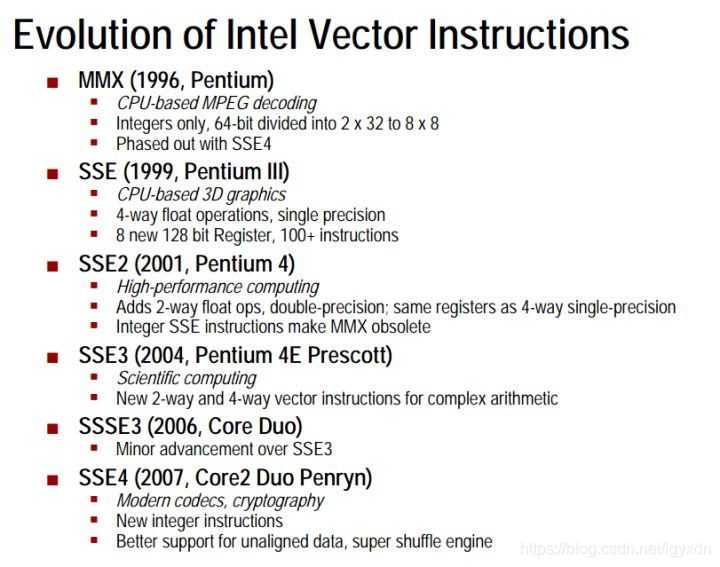
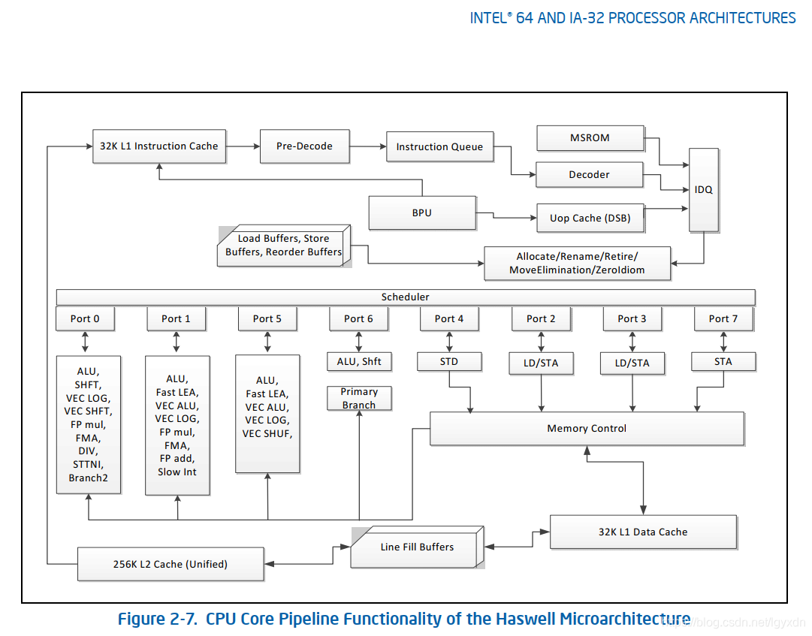
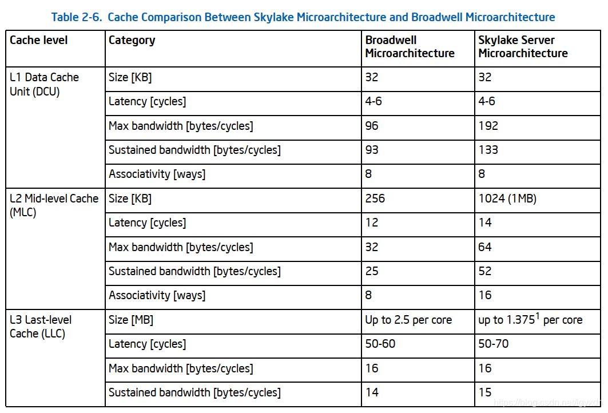

@[toc]
# 前言

为了了解CPU架构对并行的影响才有了这篇文章，而现在PC机上使用最多的是Intel的CPU，因此本篇的讨论范围聚焦在Intel CPU上，同时Intel也足够有代表性。

内存屏障 memory barrier，有时候也可以叫内存栅栏 memory fence。

# 现代Intel® CPU架构

还是先看看历史吧，从历史的发展中我们能够看到碰到的问题，以及解决问题的思路和具体实现，这样也就更深刻地理解为什么会是现在这个样子。不过CPU的发展历史，一以贯之的就是：**速度、速度、速度**；到了2008年左右，CPU性能提升遇到发展瓶颈，同时候个人笔记本的普以及移动办公的出现，CPU厂商还考虑了节电等其他方面技术。下面看看本篇要讨论的影响并行编程中CPU的重要变化节点。

1989年Intel486™处理器中加入了8KB的on-chip**一级缓存L1**，同时也加入了完整的浮点运算单元FPU。

*目前应该很难找到Intel486™这样的芯片了，所以不知道其运算速度与当时的CPU相比，如果计算同样大小、但类型分别位浮点型和整型的两组数据哪个更快。不过现在我的2013年买的Think Pad笔记本上是浮点运算快哦，就是不知道有没有代表性，所以今后同学们不要一提到浮点运算就觉得慢了。*

1993年Intel在Pentium®处理器中加入了第二个执行管线(pipeline)达到了超标量性能，一个时钟周期内可以同时执行两条指令，一级缓存L1大小变为16KB，其中8KB是数据缓存，另外8KB是指令缓存。在数据缓存中中引入了**MESI协议**加速数据写回。

1995-1999年间P6家族的Intel Pentium Pro处理器在超标量(superscalar)实现中引入了动态执行(dynamic execution)，其中包含了乱序指令执行(out-of-order execution)等多个为提升性能而加入的非线性指令执行功能。

2006-2007年Intel® Core™ Duo(当年大名鼎鼎的**酷睿**处理器)系列处理器中引入了双核CPU，从此进入多核时代。

上面大概是Intel CPU主要变化的节点。

其中，P6家族（1995-1999年）的CPU中最重要的是加入的动态执行模块，或者叫乱序执行模块，这个是CPU并行的关键，包含了3部分：

1. 深度分支预测 Deep branch prediction，用来保证指令管线满载运行。
2. 动态数据流分析 Dynamic data flow analysis，用来实时分析数据依赖性和乱序指令执行的机会。
3. 推测执行 Speculative execution，可以基于条件分支执行指令，并最终按照原指令流的顺序提交执行结果。为此P6处理器将指令的分发、执行与结果的提交进行了解耦。乱序执行内核(out-of-order execution core)通过数据流分析来执行指令池中所有可能的指令并将结果放在临时寄存器中，然后完成单元(retirement unit)线性地搜索指令池，寻找那些已完成的、并且与其他指令或者未执行的分支没有数据关联的指令，一旦找到就将指令结果按照原来在线程池中的顺序提交到内存或者IA-32寄存器（8个通用寄存器和8个x87 FPU数据寄存器）。

作为一个软件开发人员，平时能够接触到的“最底层”的代码也就是汇编代码了，机器码( 或者说机器指令)基本看了一头雾水，一堆数字而已。我们当初学习计算机组成原理的时候可能接触到一些教条式的说法，比如，

机器指令和微指令的关系如下：

1. 一条机器指令对应一个微程序，这个微程序是由若干条微指令构成的。因此，一条机器指令的功能是若干条微指令组成的序列来实现的。简而言之，一条机器指令所完成的操作划分成若干条微指令来完成，由微指令进行解释和执行。
2. 从指令与微指令，程序与微程序，地址与微地址的一一对应关系上看，前者与内存储器有关，而后者与控制存储器（它是微程序控制器的一部分。微程序控制器主要由控制存储器、微指令寄存器和地址转移逻辑三部分组成。其中，微指令寄存器又分为微地址寄存器和微命令寄存器两部分）有关，与此相关也有相对应的硬设备。
3. 从一般指令的微程序执行流程图可以看出。每个CPU周期就对于一条微指令。这就告诉我们怎么设计微程序，也将使得我们进一步体验到机器指令很微指令的关系。

对于软件开发来说机器指令已经是最接近CPU的指令了，而汇编指令和机器指令的关系：

1. 汇编指令是对机器指令的又一层抽象，但它和机器指令一样是归属于某一类CPU指令集的
2. 汇编指令有时候可以对应多个机器指令，比如Intel的MOV指令有多个变种，可以读取(寄存器，内存)，(寄存器，寄存器)等等，具体可以参考Intel软件开发者手册的卷2；而且寄存器和内存还有8/16/32/64位的差别。同时也就出现了另一个问题，如何位指令进行编码（变长编码和定长编码）

但是光从这些文字上我们得不到任何感性的认知，我们还需要了解一些细节和现实的东西才能有真正的认知。知乎上有一个问题[CPU的微指令是如何编写的？](https://www.zhihu.com/question/37382184)，点赞最多的那位同学图文并茂的解释可以给我们一个感性的认知。但是更细节的东西需要参考更专业的书籍，比如[《计算机组成与设计》](https://book.douban.com/subject/26604008/)。当看完CPU中真正有哪些硬件供指令驱动的时候才能了解上面的总结性语句。

这个时候我就有另一个自然的问题，我们一般说现在的CPU速度很快，每秒可以执行多少多少条指令，而且现在有多核CPU了，而且每个CPU中还有多个stage进行超线性执行；那么这里说的这个**指令**到底是什么指令？汇编指令？还是微指令？这个问题参考知乎上的另一个问题[计算机执行一条指令要多长时间？](https://www.zhihu.com/question/51614321)，可以知道，这事儿没那么简单。那么非要通俗简单地说呢！由于CPU对每条汇编指令对应的微程序进行了拆分执行，在不同阶段(stage)中，执行的速度不一样，而且还可能出现cache miss，分支预测判断错误，要操作的数据在L1/L2/L3或者内存，所以只能说统计意义上的平均数了，或者换种说法，每条机器指令的执行平均需要使用多少CPU时钟周期(clock)。在[Intel 64 and IA-32 Architectures Optimization Reference Manual](https://software.intel.com/en-us/download/intel-64-and-ia-32-architectures-optimization-reference-manual)的附录(APPENDIX C INSTRUCTION LATENCY AND THROUGHPUT)中有给了严格定义的一个列表，取几项说明一下(操作数都是从寄存器到寄存器的)：

Instruction | Latency | Throughput
---|---|---
ADD/SUB |  1  | 0.25
CMP/TEST | 1 | 0.25
CMOVE/CMOVcc | 1 | 0.5
Lock CMPXCHG8B m64 | 22 | 22
Lock CMPXCHG16B m128 | 32 | 32
POPCNT r32, r32 | 3 | 1
POPCNT r64, r64 | 3 | 1

*Latency 是指执行核心完成一个指令的全部操作所需的时钟周期；  
Throughout 是执行端口(the issue ports)再次指执行相同指令前等待的时钟周期。*

可以看出执行一条标准的CISC指令一般是大于一个时钟周期。当然后面可以看出，执行一条RISC指令可就比较快了。

## 指令集 CISC, RICS ...

目前全世界的计算机指令集架构中最**常见**的有2种：CISC(Complex Instruction Set Computers 复杂指令集)和RISC(Reduced Instruction Set Computers 精简指令集)。市场上，Intel、AMD公司几乎代表了CISC；ARM、MIPS(Microprocessor without interlocked pipelined stages 无内部互锁流水级的微处理器)公司代表了RISC。我们国家完全自主研发的、主要应用于非民用领域的龙芯，就是在发展后期买了MIPS公司的IP授权兼容MIPS指令的CPU，(注意“龙芯”可不是“汉芯”这个冒牌货)。不过ARM公司乘着移动设备的东风起飞了，MIPS由于种种原因没有蓬勃地发展起来，也没有进入大众的眼中。在对应的操作系统领域，微软的Windows，苹果的OS X系统一般运行在CISC架构的CPU上。iOS，Android等移动OS大多运行在RISC架构的CPU上。

还有另外4种不常见的指令集：

- VLIW (Very long instruction word 超长指令字)
- EPIC (Explicitly Parallel Instruction Computing 显式并行指令计算)
- MISC (Minimal instruction set computer 最小指令集)
- OISC (One instruction set computer  单一指令集)。

目前Intel全新的IA-64架构的64位Itanium处理器就是EPIC的。超长指令字(VLIW)是指令级并行，超线程(Hyper-Threading)是线程级并行，而多内核则是芯片级并行。这三种方式都是提高并行计算性能的有效途径。其中，VLIW（超长指令字）体系结构是美国Multiflow和Cydrome公司于20世纪80年代设计的体系结构，EPIC体系结构就是从VLIW中衍生出来的。

指令集也不是一层不变的东西，随着时间的推移，市场上应用场景的变化，指令集本身也在发展变化。比如Intel的指令集在每一次新的处理器发布的时候，都会有一些增加，当然都是完全兼容老的指令集的；而且Intel和AMD的x86指令集架构也是几乎相同的，咦、两个公司居然用几乎相同的指令集! x86指令集架构(Instruction Set Architecture)最初是由Intel基于Intel 8086微处理器和它的8088变种研发的，在后来的发展中，得到了AMD，Cyrix，VIA等公司的共同努力，形成了一个庞大的指令集架构家族，但是只有Intel、AMD、VIA、DM&P拥有x86架构的license。

不过，还需要细说的一点是，实际上Intel只是在用户层面上使用了CISC，而在底层电路上使用的仍然是RISC，因为这样的话可以比较容易地实现兼容老的指令集，还有就是RISC指令执行更加有效率。Intel的CPU微架构中有一个Front-end的东西就是做这个从CISC到RISC的工作的。同时ARM也没有闲着，也做了一些CISC的工作。所以看来这二者也是各有所长，需要混合运用最妙。所以现在网上对于这两种指令集的争论都表示不屑，应该说，对等地就像是在软件开发中讨论汇编和C哪个更好吧。

从这里也可以看出，我们一般在Windows/Linux/Mac平台上写的C/C\++这种代码，由clang/clang\++/gcc/g\++/msvc编译器编译成CISC的指令，交给Intel的CPU之后，在CPU内部还有一道Front-end将这个机器指令decode为RISC指令。那么一般情况下一条CISC指令会被翻译为多条RISC指令。

# Intel各个时期的CPU微架构（microarchitecture）特点

下面按照时间顺序介绍Intel历史上比较重要的几个CPU的微架构。

## P6 Family Microarchitecture（1995-1999）

有几点需要指出：

1. 左下角的方框里面Front End，就是用来将CISC指令转为RISC指令的。这个模块解耦了用户层面（写编译器的那些人）的指令集和电路板实现的指令集（也就是微指令micro-operation）。
2. Execution Out-of-Order Core、Retirement、BTSs/Branch Prediction几个模块提供了并行运算（这就是性能啊）的支撑，也是本篇讨论的问题的来源。
3. 这个时期的CPU已经有两级高速缓存了：1st Level Cache（8KB的指令缓存和8KB的数据缓存）和2nd Level Cache。

## Intel NetBurst® Microarchitecture（2000）
这个微架构下诞生了很多代Intel的CPU：Intel® Pentium® 4 Processor Family（2000-2006），Xeon® Processor（2001-2007），Pentium® Processor Extreme Edition（2005）等，每一款也都有改进。

这一版相对于P6来讲，其实增加了很多内容，只是在示意图中体现出来的是添加了L3缓存，优化了Front End。Out-of-Order Execution Core模块可以在每个时钟周期分发多达6个micro-op（微指令），大部分pipline（管线）可以在每个时钟周期执行一个新的微指令，所以每个管线可以保证同时间有多个微指令在执行。每个时钟周期可以执行两条计算逻辑单元（ALU）的指令，多数浮点指令可在两个时钟周期执行一次。

## Intel® Core™ Microarchitecture （2006-2007）
这个微架构开始诞生了多核CPU，同时也考虑了节能因素。

为提高性能，大体上引入了4项技术：提高每个处理核心获取、分发、执行的带宽，可满足每个时钟周期有多达四条指令执行待完；增大缓存大小，并优化缓存到执行核心的算法；降低了L1，L2缓存miss的概率，以保证乱序执行；提升SIMD指令单时钟周期的吞吐量和浮点指令。

后面几代CPU微架构（Intel® Atom™ Microarchitecture（2008），Nehalem（2008），Westmere（2010），Sandy Bridge（2011），Ivy Bridge（2012），Haswell（2013））基本就在这个基础上大概做下面优化了：

1. 增加管线，增加指令执行分段数，增加带宽和缓存
2. 提升数字媒体指令SIMD的性能
3. 更好的乱序执行引擎
4. 更加节能高效

下面这个图说明了Intel向量指令的发展情况：

## Sandy Bridge微架构（2011）
下图是2011年Intel发布的Sandy Bridge微架构流水线示意图

与后继者Haswell相比，示意图大致相似。明显的区别是scheduler中port的数量，Sandy Bridge是6个，Haswell中是8个。

## Haswell微架构 （2013）
下图是Intel 2013年的一个微架构Haswell的流水线。

Haswell微架构的乱序引擎主要在下面三个方面作出了更新：
1. 在取micro-op指令并放入micro-op队列并绑定到调度器的port上
2. 调度器控制将micro-op发放到port上，这里一共有8个port，4个计算操作执行资源port，4个内存操作port支持每个时钟周期加载和存储高达256bit。
3. 执行核心，调度器每个时钟周期可以分发高达8个micro-op，每个port一个。

## Broadwell微架构（2014）
Broadwell是2014年Intel的CPU微架构，Skylake是2015年的微架构。从下图中可以看到CPU中各级缓存的速度：

*图片来自《Intel® 64 and IA-32 Architectures Optimization Reference Manual》Order Number: 248966-042b September 2019 第二章*

# 现代CPU架构下，并行程序面临的问题

目前CPU中指令的执行，理论上还是取指令IF，指令解码ID，执行指令EX，访存取数MEM，结果写回WB这五个步骤。但实际上，由于CPU追求更高的性能（或者说是能效），加入了破坏这个流程的辅助模块，主要是下面几方面：

1. 多级缓存 CPU内部有高速缓存（L1/L2/L3），Intel CPU内部还有一个Store Buffer；CPU外部有内存，虚拟缓存，硬盘等
2. 动态指令执行模块，包括乱序执行核心，以及相关的算法等
3. 多核心  2008年左右之后的CPU加入了多处理核心的设计理念

到目前为止，指令执行的加速依赖的基本上也就是更快的时钟频率，更大的多级缓存，更好的指令动态执行相关的算法（CPU内部的，跟程序员没有直接关系）。

还有另外一个加速任务处理的视角就是添加针对性的指令集，比如SIMD指令集就是为了数字多媒体添加的；还有就是可以将一类任务交给其他计算机组件处理，比如GPU。

## 数据和指令在缓存中出现的问题

由于DRAM的访问速度发展比CPU芯片的处理速度发展慢很多，几十年(具体什么时候我也不知道，只是Intel  P6就有了L1)以前，CPU的高速和内存的低速慢慢地成为计算机处理速度的瓶颈，为此在CPU内部加入了高速缓存，期望根据指令和数据的时域局部性和空域局部性原理，来缓解CPU处理数据&指令等待访问内存的问题，到现在发展到了多级缓存。在多核时代，还有一个问题是，多个CPU中都有自己的缓存。缓存之间的指令和数据也可能出现关联性，存放在缓存中的数据会涉及到更新和写回内存的问题。

## 流水线中碰到的问题

流水线是为一种实现多条指令重叠执行的技术。在前面提到的指令指令模型中，流水线大致分为5步，现在的指令集基本都是就是为流水线设计的，可以很好地将指令的执行分割为多个步骤；不过，还是会出现一些问题：
1. 比如相邻的若干个指令之间相互关联，后一个指令执行的中间某一步，需要使用前一步，或者前几步中执行输出的数据，但是这个数据目前还没有被计算出来，那么后一个指令就需要等待，这会浪费了宝贵的CPU时钟周期，这类可以归为**数据冲突**；针对这种情况，有的CPU设计中，开发了一条旁路（bypassing），或者叫做前推（forwarding）的硬件，可以让后面急等着使用数据的指令，通过这个途径快捷地得到数据，而不必等到数据被写回到内存/缓存系统。
2. 还有一种，比如多个数据相关的指令在执行中，由于输出的数据过多，或者是还没有接下来使用这个数据的指令被执行到，导致存储区域不够使用了，这时由于硬件的结构设计导致指令执行中有一些等待，或者是丢弃；这种是属于**结构冲突**。
3. 针对分支判断的指令，对应地是编程语言中的if-else，switch等判断。这类指令一般决定了下一条指令应该执行哪一个，但是在指令流水线中，取到该分支指令的下一个时钟周期就要取出下一条执行的指令了，那么应该如何取舍呢？要么，等待分支指令得到执行结果，然后再决定接下来该执行哪一条指令，这是阻塞流水线的方法；要么，先蒙一个，这个方法就叫做分支预测（branch prediction），蒙对了那么流水线执行的非常顺畅，如果蒙错了，那么就需要撤销分支预测之后的指令流及其占用的存储空间，代价略大。不过，实际操作中，分支预测的正确率很高，比如记录下近期分支指令执行的结果，然后根据这些记录来预测下一次，正确率可达90%。这种属于**控制冲突**。

# 如何解决
从系统架构上来看，目前常见的服务器架构有三种：SMP(Symmetric Multi-Processor 多处理器结构)，NUMM(Non-Uniform Memory Access 非一致存储器存取)，MPP(Massive Parallel Processing 大规模并行处理)。我们一般的个人电脑上，使用的是SMP架构的CPU。

1. SMP 是指服务器中多个 CPU 对称工作，无主次或从属关系。各 CPU 共享相同的物理内存，每个 CPU 访问内存中的任何地址所需时间是相同的，因此 SMP 也被称为一致存储器访问结构 (UMA ： Uniform Memory Access) 。
2. NUMM 基本特征是具有多个 CPU 模块，每个 CPU 模块由多个 CPU( 如 4 个 ) 组成，并且具有独立的本地内存、 I/O 槽口等。
3. MPP 由多个 SMP 服务器通过一定的节点互联网络进行连接，协同工作，完成相同的任务，从用户的角度来看是一个服务器系统。

本篇着重点在SMP。四种SMP架构的CPU内存一致性模型：

1. 顺序一致性模型（SC，Sequential Consistency，所有读取和所有写入都是有序的）；
2. 宽松一致性模型（RC，Relaxed Consistency，允许某些可以重排序），[ARM和POWER属于这类](http://www.cl.cam.ac.uk/~pes20/ppc-supplemental/test7.pdf)；
3. 弱一致性模型（WC，Weak Consistency，读取和写入任意重新排序，仅受显式内存屏障限制）；
4. 完全存储排序（TSO，Total Store Ordering），SPARC和x86属于这种类型，只有“store load”一种情况会发生重排序，其它情况和SC模型一样。

使用C++这类语言写的代码，编译为汇编指令，并交给CPU执行，这个过程中，有两个阶段发生了乱序，一是编译器自行将指令进行优化排序，二是CPU内部的乱序执行；前者属于软件层面的乱序，后者属于硬件层面的乱序。

## 软件层面可以解决的问题

编译器为了给出更高效率的代码，打开优化开关之后会自行处理一些生成指令的排序。从代码层面“抽象”地看编译器做的优化，如下面的例子：
| Code | Compiler | 
|--|--|
| a=1; |  v2=d;| 
| v1=b; | v1=b; | 
| c=2; | a=1; | 
| v2=d; | c=2; |

from: [Memory barriers in C](https://mariadb.org/wp-content/uploads/2017/11/2017-11-Memory-barriers.pdf)

## 硬件层面提供了哪些工具

再进一步，代码/指令进入CPU之后再次乱序之后：

| Code | Compiler | CPU |
|--|--|--|
| a=1; |  v2=d;| v2=d; |
| v1=b; | v1=b; | c=2; |
| c=2; | a=1; | a=1; |
| v2=d; | c=2; | v1=b; |

# 参考
1. Intel的一组牛逼的工具，不过基本都是付费的，最多可以试用30天，部分免费：[Intel® Software Development Tools - Complete List](https://software.intel.com/en-us/try-buy-tools)
2. 关于Store Buffers [Size of store buffers on Intel hardware? What exactly is a store buffer?](https://stackoverflow.com/questions/54876208/size-of-store-buffers-on-intel-hardware-what-exactly-is-a-store-buffer)   简单地说Store Buffers是论条数的，不同CPU中数目不一样，具体每一条的大小是Intel的设计机密没有公开。
3. CPU架构师 David Kanter的一篇文章，来自他的个人网站 [Intel's Haswell CPU Microarchitecture](https://www.realworldtech.com/haswell-cpu/5/) 
4. 维基百科上关于Intel CPU架构的汇总 [List of Intel CPU microarchitectures](https://en.wikipedia.org/wiki/List_of_Intel_CPU_microarchitectures)
5. **Memory Ordering** in Modern Microprocessors, [Part I](https://www.linuxjournal.com/article/8211) [Part II](https://www.linuxjournal.com/article/8212) 文章的作者是[Is Parallel Programming Hard, And, If So, What Can You Do About It?](https://mirrors.edge.kernel.org/pub/linux/kernel/people/paulmck/perfbook/perfbook.html)的作者[Paul E. McKenney](https://engineering.oregonstate.edu/paul-mckenney-2015-academy-distinguished-engineers)的[个人信息主页](http://www2.rdrop.com/~paulmck/)(里面有个人参与的项目，[博客](https://paulmck.livejournal.com/) *需要翻墙*，论文集合，给Linux打的补丁等)，
6. [Intel® 64 and IA-32 Architectures Software Developer’s Manual Volume 3 (3A, 3B, 3C & 3D): System Programming Guide](https://software.intel.com/en-us/articles/intel-sdm)，Vol 1 Chapter 2 Intel® 64 and IA-32 Architectures 介绍了Intel CPU演化历史，可以清晰地看到CPU中各个重要模块添加的时间以及功能概要；Vol 3A Chapter 8 Multiple-Processor Management 和 Chapter 11 Memory Cache Control提到了缓存相关的技术，比如缓存控制协议(CACHE CONTROL PROTOCOL)中的MESI状态，Store Buffer等。[《Intel® 64 and IA-32 Architectures Optimization Reference Manual》](https://software.intel.com/en-us/articles/intel-sdm)中2.5.5 Cache Hierarchy中也提到一些缓存读取/写入的内容。
7. [《计算机体系结构：量化研究方法》](https://book.douban.com/subject/20452387/) 的“第5章 线程级并行”中也提到了缓存一致性问题。第5版英文版[附录下载地址](http://booksite.mkp.com/9780123838728/references.php)，本书的由浅入深的阅读顺序：缓存方面是先读附录B，然后是第二章；流水线方面是先读附录C，然后是第三章。[《计算机组成与设计：硬件/软件接口》](https://book.douban.com/subject/30443432/)，该书有配套的网址 [Patterson, Hennessy: Computer Organization and Design](https://booksite.elsevier.com/9780128017333/)，其中有很多资源，比如扩展阅读，参考文献，推荐读物，ARM DS-5专业软件套件。下载到了百度网盘链接: https://pan.baidu.com/s/1RrYsxtuKWhHdth-gzcvjyA 提取码: q8ta
8. [AMD64 Architecture Programmer's Manual Volume 1-6](https://www.amd.com/en/support/tech-docs?keyword=Programmer%E2%80%99s+Manual)，或者在[这个](https://www.amd.com/en/support/tech-docs)网页里面搜**Programmer’s Manual**。《AMD64 Architecture Programmer’s Manual Volume 2 - System Programming》中 7 Memory System有关于内存/缓存一致性的内容。
9. [解读两大精简指令集：RISC-V和MIPS](https://blog.csdn.net/qq_41394155/article/details/88595775)；[终于有人把各个指令集之间的关系和发展讲清楚了](https://www.4hou.com/web/17446.html)；[Hyper Thread超线程的种种](https://zhuanlan.zhihu.com/p/58448264)；[risc vs cisc](https://cs.stanford.edu/people/eroberts/courses/soco/projects/risc/risccisc/)；[Why does Intel hide internal RISC core in their processors?](https://stackoverflow.com/questions/5806589/why-does-intel-hide-internal-risc-core-in-their-processors)
10. CPU几个有趣的历史知识， [现在有哪些国产 CPU 和操作系统？现状如何？](https://www.zhihu.com/question/58816532/answer/160144528) ；[在CPU IP授权上，ARM 是怎样战胜MIPS的？](https://www.zhihu.com/question/19902714/answer/20211737)
11. 维基百科上词条 [x86](https://en.wikipedia.org/wiki/X86)
12. 发现一个跟我有类似初衷的文章 [CPU体系结构](https://my.oschina.net/fileoptions/blog/1633021)，作者[黑客画家](https://my.oschina.net/fileoptions)
13. 2018年大量爆出的（发现于2017年6月）CPU漏洞：[Meltdown and Spectre](https://spectreattack.com)，这个页面中有各个平台下软件层面的解决办法。相关解释的文章：[一步一步理解CPU芯片漏洞：Meltdown与Spectre](https://www.freebuf.com/articles/system/159811.html)。发现这两个bug的都有 [Project Zero](https://googleprojectzero.blogspot.com) 的成员，Project Zero是Google的一个安全团队。
14. 讲述CPU变化的文章 [What's new in CPUs since the 80s?](https://danluu.com/new-cpu-features/)  [Assembly v. intrinsics](https://danluu.com/assembly-intrinsics/)
15. [每个程序员都应该了解的内存知识【第一部分】](https://www.oschina.net/translate/what-every-programmer-should-know-about-memory-part1)和 [每个程序员都应该了解的 CPU 高速缓存](https://www.oschina.net/translate/what-every-programmer-should-know-about-cpu-cache-part2)
16. [C和C++中的volatile、内存屏障和CPU缓存一致性协议MESI](https://blog.csdn.net/Aquester/article/details/86671146)
17. Wikipedia [MESI protocol](https://en.wikipedia.org/wiki/MESI_protocol)
18. [Memory barriers in C](https://mariadb.org/wp-content/uploads/2017/11/2017-11-Memory-barriers.pdf)
19. kernel.org上一篇解释为什么不能用volatile在多线程中的文章 [Why the "volatile" type class should not be used](https://www.kernel.org/doc/html/latest/process/volatile-considered-harmful.html)，提到的一个观点是Linux kernel中使用volatile来充当atomic类型，几乎从来都不对，也几乎都是bug。
20. 宾夕法尼亚工程学院 2016年的GPGPU编程课 [CIS 601: Special Topics in Computer Architecture: GPGPU Programming Spring 2016](https://www.cis.upenn.edu/~devietti/classes/cis601-spring2016/)。
21. 剑桥大学教授[Peter Sewell](https://www.cl.cam.ac.uk/~pes20/)及一些其他人整理的一个内容聚合网页 [Relaxed-Memory Concurrency](https://www.cl.cam.ac.uk/~pes20/weakmemory/)，这里面资料很多。有几篇重要的论文，[x86-TSO: A Rigorous and Usable Programmer's Model for x86 Multiprocessors.](https://www.cl.cam.ac.uk/~pes20/weakmemory/cacm.pdf) 
22. [服务器三种体系架构：NUMA、SMP和MMP](https://my.oschina.net/guol/blog/116581) 
23. [SMP、NUMA、MPP体系结构介绍](https://www.cnblogs.com/yubo/archive/2010/04/23/1718810.html)
24. Agner Fog. [Optimizing software in C++ An optimization guide for Windows, Linux and Mac](http://www.agner.org/optimize/optimizing_cpp.pdf)
25. Ulrich Drepper. [What Every Programmer Should Know About Memory](http://www.akkadia.org/drepper/cpumemory.pdf)
26. [内存一致性模型(Memory Consistency Models)](http://blog.chinaunix.net/uid-25909722-id-3016122.html)