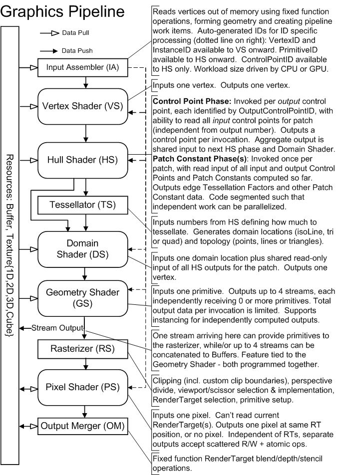
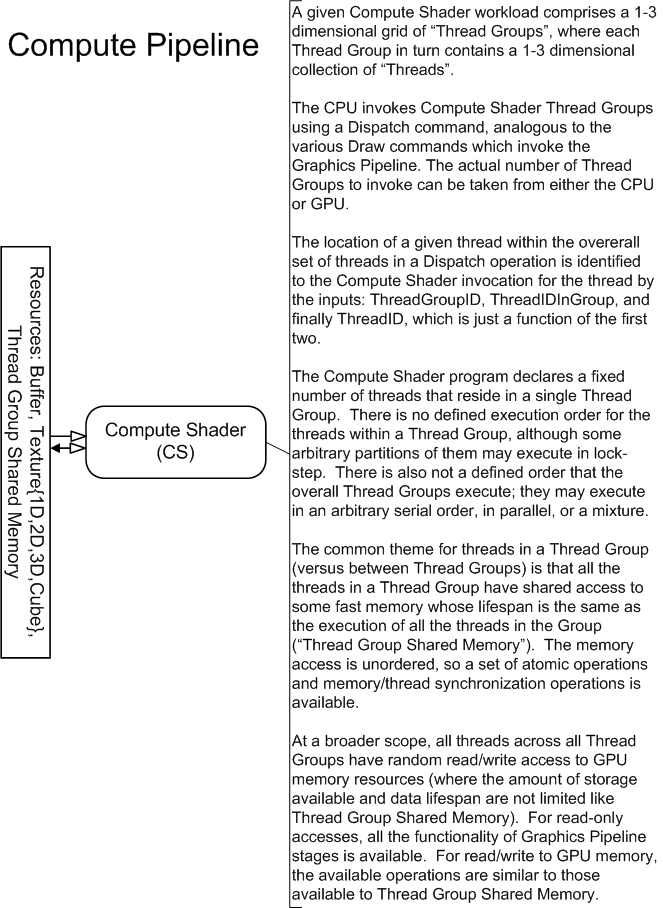
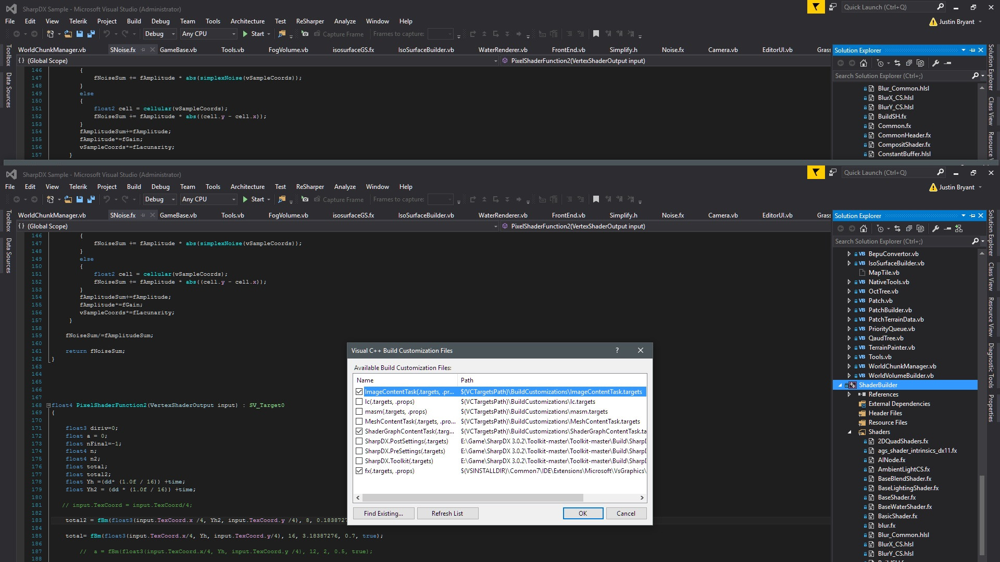
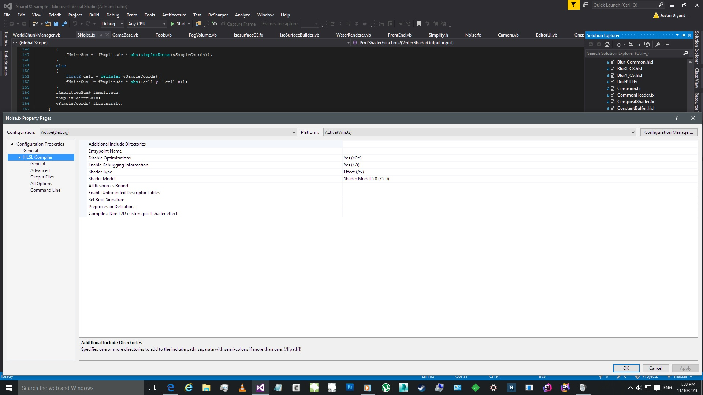

[TOC]

# pipeline

## 总览

下图显示了通过每个可编程阶段从输入到输出的数据流。


注意这个 `pipeline` 中的一些缩写，在 `ID3D11DeviceContext` 的一些接口中有出现：

- IA：Input-assembler Stage 输入装配阶段，【加载集合数据（顶点和索引），涉及到数据的组织方式，将数据组装为几何图元】
- VS：Vertex Shader Stage 顶点着色阶段，【可以把这个阶段看做一个输入和输出都是单个顶点的函数，每一个被绘制的顶点必须经过这个阶段才能往后送，涉及到坐标空间计算，投影】
- HS：Hull Shader Stage 外壳着色阶段，【】
- Tesselator Stage 曲面细分阶段，【对网格中的三角形进行细分，使得网格更加细腻】
- DS：Domain Shader Stage 域着色阶段，【】
- GS：Geometry Shader Stage 几何着色阶段，【可选，输入是完整图元，可以控制创建新的几何体，也可以控制不输出任何图元，相比顶点着色阶段就不能创建新顶点，比如可以将一个顶点扩展为线或者四边形】
- SO：Stream Output Stage 流输出阶段，【】
- RS：Rasterizer Stage 光栅化阶段，【为投影至屏幕的3D三角形计算出像素颜色】
- PS：Pixel-Shader Stage 像素着色阶段，【由GPU执行的程序，针对每一个像素片段结合顶点的插值属性计算像素颜色，可以实现逐像素光照，反射，阴影等复杂效果】
- OM：Ouput-Merger Stage 输出合并阶段，【上一个阶段的像素送到这里进行输出合并，一些未通过测试的像素片段被丢弃，一些留下写入后台缓冲区，混合blend也在这里实现】
- CS：Computer Shader Stage 计算着色阶段（这个没有出现在上图中，这个也叫做 `DirectCompute technology`）

更为详细的图（来自：[Direct3D 11.3 Functional Specification](https://microsoft.github.io/DirectX-Specs/d3d/archive/D3D11_3_FunctionalSpec.htm) (**重要资料**，涵盖了 D3D 版本从 10 到 11.3 的所有功能) ）：





# 调试
## 打印 HRESULT 错误信息

可以使用Windows平台提供的 [`_com_error`](https://learn.microsoft.com/en-us/cpp/cpp/com-error-com-error) 封装类：

```C++
#include <comdef.h>

_com_error err(hr);
LPCTSTR errMsg = err.ErrorMessage();
```

## DirectX 11 打开调试层

参考 [Using the debug layer to debug apps](https://learn.microsoft.com/en-us/windows/win32/direct3d11/using-the-debug-layer-to-test-apps)

要创建支持调试层的设备，必须安装 DirectX SDK（以获取 D3D11SDKLayers.dll），然后在调用 `D3D11CreateDevice` 函数或 `D3D11CreateDeviceAndSwapChain` 函数时指定 `D3D11_CREATE_DEVICE_DEBUG` 标志。

```C++
UINT creationFlags = D3D11_CREATE_DEVICE_BGRA_SUPPORT;
#if defined(_DEBUG)
        // 重点在这里：创建设备的时候，指定 D3D11_CREATE_DEVICE_DEBUG 标记
        // If the project is in a debug build, enable the debug layer.
        creationFlags |= D3D11_CREATE_DEVICE_DEBUG;
#endif
        // Define the ordering of feature levels that Direct3D attempts to create.
        D3D_FEATURE_LEVEL featureLevels[] =
        {
            D3D_FEATURE_LEVEL_11_1,
            D3D_FEATURE_LEVEL_11_0,
            D3D_FEATURE_LEVEL_10_1,
            D3D_FEATURE_LEVEL_10_0,
            D3D_FEATURE_LEVEL_9_3,
            D3D_FEATURE_LEVEL_9_1
        };

        ComPtr<ID3D11Device> d3dDevice;
        ComPtr<ID3D11DeviceContext> d3dDeviceContext;
        DX::ThrowIfFailed(
            D3D11CreateDevice(
                nullptr,                    // specify nullptr to use the default adapter
                D3D_DRIVER_TYPE_HARDWARE,
                nullptr,                    // specify nullptr because D3D_DRIVER_TYPE_HARDWARE 
                                            // indicates that this function uses hardware
                creationFlags,              // optionally set debug and Direct2D compatibility flags
                featureLevels,
                ARRAYSIZE(featureLevels),
                D3D11_SDK_VERSION,          // always set this to D3D11_SDK_VERSION
                &d3dDevice,
                nullptr,
                &d3dDeviceContext
                )
            );
```

如果出错就会在调试信息中打印类似下面这样的信息：


> DXGI WARNING: IDXGIFactory::CreateSwapChain: Blt-model swap effects (DXGI_SWAP_EFFECT_DISCARD and DXGI_SWAP_EFFECT_SEQUENTIAL) are legacy swap effects that are predominantly superceded by their flip-model counterparts (DXGI_SWAP_EFFECT_FLIP_SEQUENTIAL and DXGI_SWAP_EFFECT_FLIP_DISCARD). Please consider updating your application to leverage flip-model swap effects to benefit from modern presentation enhancements. More information is available at http://aka.ms/dxgiflipmodel. [ MISCELLANEOUS WARNING #294: ]
> DXGI ERROR: IDXGIFactory::CreateSwapChain: DXGI_SWAP_CHAIN_FLAG_NONPREROTATED can only be specified in DXGI_SWAP_CHAIN_DESC::Flags, when DXGI_SWAP_CHAIN_DESC::Windowed is FALSE, since the flag only affects fullscreen swap chains. [ MISCELLANEOUS ERROR #34: ]
> Exception thrown at 0x00007FFAB28ACF19 in Dx11.exe: Microsoft C++ exception: _com_error at memory location 0x0000005895EFEAE0.

对比上面两种打印错误的方式，后一种方式对于 DirectX 来说打印的错误信息更加全面。前一种不止可以打印 DirectX 的错误信息。

## DXGetErrorString 找不到的问题

有一些错误码使用上面的方法无法处理（会报告 `Unknown error`），这时可以使用 `DXGetErrorString` 打印错误码对应的字符串，但是这个函数后来（Win8 开始）被标记为弃用了。同样的还有：`DXGetErrorDescription`, `DXTrace`。

参考这篇 [Where's DXERR.LIB?](https://walbourn.github.io/wheres-dxerr-lib/)，可以在 [这里](https://github.com/walbourn/walbourn.github.io/tree/main/download) 下载 `dxerr` 字符开头的源文件，下载之后包含到项目中使用即可。

## ID3D11Debug 的使用

调试接口控制调试设置，验证管道状态，并且仅在调试层打开时才能使用。

```
#include <d3d11.h>

ID3D11Debug* debugInterface;
HRESULT hr = device->QueryInterface(__uuidof(ID3D11Debug), (void**)&debugInterface);
if (SUCCEEDED(hr))
{
    debugInterface->ReportLiveDeviceObjects(D3D11_RLDO_DETAIL);
    debugInterface->Release();
}
```

## 调试 - 参考信息
<!-- 理解的不太对，先隐藏了。
- [HLSL Shader Debugger](https://learn.microsoft.com/en-us/previous-versions/visualstudio/visual-studio-2015/debugger/hlsl-shader-debugger?view=vs-2015) 直接调试 HLSL 源代码。不过对于 `VS 2017` 需要使用一个插件 [HLSL Tools for Visual Studio](https://marketplace.visualstudio.com/items?itemName=TimGJones.HLSLToolsforVisualStudio)，参考这个问答：[Debugging .FX files in Visual Studio not working](https://gamedev.stackexchange.com/questions/131240/debugging-fx-files-in-visual-studio-not-working)

  选中要设置的工程，右键 `Build Dependencies` -> `Build Customizations...` 
  

  选中 `hlsl` 文件，打开属性对话框，选择左侧 `HLSL Compiler` -> `General` -> `Shader Type` 设置为 `Effect (/fx)`。

  
-->
- [DirectX 11 How to debug a vertex shader in visual studio](https://www.youtube.com/watch?v=3tb-w_X6-4Y) YouTube 上这个介绍如何使用 VS 的图形调试工具来调试 HLSL 文件。
- [Visual Studio Graphics Diagnostics](https://learn.microsoft.com/en-us/previous-versions/visualstudio/visual-studio-2017/debugger/graphics/visual-studio-graphics-diagnostics?view=vs-2017) `Visual Studio Graphics Diagnostics` 是一组用于记录并分析 Direct3D 应用程序中的渲染和性能问题的工具。图形诊断可用于在 Windows PC、Windows 设备模拟器或远程 PC 或设备上本地运行的应用程序。 *VS2017 中这个程序的稳定性不好，老是会崩溃*。
- VS 中 `Analyze` 菜单下的性能分析工具。不过这个程序也老是出问题，进而导致VS崩溃。参考：[Performance Explorer](https://learn.microsoft.com/en-us/previous-versions/visualstudio/visual-studio-2017/profiling/performance-explorer?view=vs-2017)
- [PIX on Windows](https://devblogs.microsoft.com/pix/introduction/)，PIX 是一款为使用 **`DirectX 12`** 的 Windows 和 Xbox 游戏开发人员提供的性能调优和调试工具。下载[地址](https://devblogs.microsoft.com/pix/download/)，下载的文件是一个安装文件，并且需要重启电脑（可能启用了某些系统级的功能） 这个功能在我的 Windows 10 on Mac(Intel) 环境下启动失败，修改设置还会卡死整个系统。看来是有兼容性问题的。同时这个工具对环境的要求：[Requirements](https://devblogs.microsoft.com/pix/requirements/)
- [GPUView](https://learn.microsoft.com/en-us/windows-hardware/drivers/display/installing-gpuview) GPUView是一个用于分析GPU和CPU性能的工具，这个工具包含在 WPT 工具包中，WPT 工具包在 [Windows SDK](https://developer.microsoft.com/en-us/windows/downloads/windows-sdk/) 中。
- [baldurk/renderdoc](https://github.com/baldurk/renderdoc) RenderDoc 是一款基于帧捕获的图形调试器，目前可用于 Windows、Linux、Android 和 Nintendo Switch™ 上的 Vulkan、D3D11、D3D12、OpenGL 和 OpenGL ES 开发。官网[地址](https://renderdoc.org/)。

*Windows 11 里面按下 Print Screen键会调用起系统的截图工具，对于一般的Windows用户这个可能比较实用，但是对于 DX 的开发者来说，这个功能会影响采集视频帧。关闭方法参考：[如何关闭win11系统自带截图](https://answers.microsoft.com/zh-hans/windows/forum/all/%E5%A6%82%E4%BD%95%E5%85%B3%E9%97%ADwin11%E7%B3%BB/d569f681-d0e6-4b97-8c19-14850dbe45a5)*

## directx 哪个版本的 shader 文件使用后缀名 fx ?

DirectX 9使用的是后缀名为.fx的shader文件。在DirectX 9中，使用的是HLSL 2.0版本的shader语言，并且将shader代码保存在.fx文件中。这些.fx文件包含了顶点着色器、像素着色器以及其他类型的着色器代码。然而，从DirectX 10开始，Microsoft不再推荐使用.fx文件，而是建议使用更灵活和可扩展的.hlsl文件来存储和管理着色器代码。因此，从DirectX 10及之后的版本开始，一般不再使用.fx文件作为shader文件的后缀名。

## 还要学习 Effect 框架吗？

知乎上有一个问题：[DirectX 11 抛弃了Effect框架后，那么大家都是自己封装一个框架么？](https://www.zhihu.com/question/29173031)，根据大牛`叛逆者`的回答说，微软开源这个框架主要是因为各个公司都有一套自己的 `Effect` 框架，都不用微软的，所以微软干脆开源了，并且不再维护了。而这个 Effect 框架，通过自己调试代码大概浏览了一下发现，也就是对 DirectX API 的一个封装。

# 基础

## 使用 DirectX SDK 的环境配置

记得设置下面的配置项：

- 头文件包含：`$(DXSDK_DIR)Include`
- 静态库包含：`$(DXSDK_DIR)Lib\x64` 或者 `$(DXSDK_DIR)Lib\x86`

官方文档：[Direct3D 11 Graphics](https://learn.microsoft.com/en-us/windows/win32/direct3d11/atoc-dx-graphics-direct3d-11)

## 格式

### DXGI_FORMAT_

`DXGI_FORMAT_` 有很多定义项。

参考 [DXGI_FORMAT enumeration](https://learn.microsoft.com/en-us/windows/win32/api/dxgiformat/ne-dxgiformat-dxgi_format) 中的 [Format Modifiers](https://learn.microsoft.com/en-us/windows/win32/api/dxgiformat/ne-dxgiformat-dxgi_format#format-modifiers) 部分，这里简述一下：

- _FLOAT：浮点型
- _SINT：二进制补码有符号整数
- _SNORM：有符号标准化整数。它在资源中解释为有符号整数，并在着色器中解释为 [-1, 1] 范围内的有符号标准化浮点值。
- _SRGB：标准 RGB 数据，以亮度级别的线性斜坡粗略地显示颜色，以便普通观察者在普通观看条件下可以在普通显示器上查看它们。所有 0 映射到 0.0f，所有 1 映射到 1.0f。全 0 和全 1 之间的无符号整数编码序列表示 0.0f 到 1.0f 之间数字的浮点解释中的非线性级数。
- _TYPELESS：无类型数据，无类型格式旨在创建无类型资源；也就是说，资源的大小已知，但其数据类型尚未完全定义。
- _UINT：无符号整数
- _UNORM：无符号标准化整数；它在资源中解释为无符号整数，并在着色器中解释为 [0, 1] 范围内的无符号标准化浮点值。
- _SHAREDEXP：共享指数。该格式中的所有浮点表示形式共享一个指数。

## 常见函数解释

### DirectX API

#### IDXGISwapChain::Present 的参数 `SyncInterval` 提到的 `"vertical blank"` 是什么意思？

chatgpt 的回答：
```
"vertical blank"（垂直空白）是指显示器刷新的过程中的一个阶段。在显示器上绘制新的帧之前，需要等待垂直空白期结束。垂直空白期是指显示器的电子束完成一次从屏幕的底部移动到顶部的扫描周期。

在调用IDXGISwapChain的Present方法时，SyncInterval参数用于指定如何与垂直空白期进行同步，从而控制帧率和显示效果：

当SyncInterval为0时，表示不等待垂直空白期，立即将帧显示在屏幕上。这可以实现更高的帧率，但可能会导致屏幕撕裂（screen tearing）效果。
当SyncInterval为1时，表示在等待下一个垂直空白期之前，将帧显示在屏幕上。这样可以避免屏幕撕裂，但可能会导致帧率受限于显示器的刷新率。
当SyncInterval大于1时，表示等待多个垂直空白期后再显示帧，从而进一步限制帧率。
总结来说，SyncInterval参数用于控制帧的显示时机，以平衡帧率和显示效果之间的权衡。根据您的需求和硬件性能，可以选择适当的SyncInterval值来获得满意的显示效果。
```

#### ID3D11DeviceContext::VSSetConstantBuffers 中的 StartSlot 如何理解？

文心一言回答：

`startSlot` 参数是此函数的一个关键部分，它指定了开始设置常量缓冲区的槽位（slot）。在 Direct3D 中，常量缓冲区被用作从 CPU 传递数据到 GPU 的一种方式。这些数据可能包括矩阵、光照参数、材质属性等，这些都是顶点着色器或像素着色器在渲染过程中可能需要的。

常量缓冲区是通过槽位来组织的，每个槽位可以容纳一个常量缓冲区。`startSlot` 参数指定了开始设置的槽位索引。例如，如果 `startSlot` 为 0，那么该函数将从第一个槽位开始设置常量缓冲区。

此外，`VSSetConstantBuffers` 函数通常还接受一个 `NumBuffers` 参数，该参数指定了要设置的常量缓冲区的数量。因此，结合 `startSlot` 和 `NumBuffers`，您可以精确地指定要设置哪些槽位上的常量缓冲区。

例如，如果您想设置第一个和第三个槽位上的常量缓冲区，您可能会这样调用 `VSSetConstantBuffers`：

```cpp
deviceContext->VSSetConstantBuffers(0, 1, &constantBuffer1); // 设置第一个槽位
deviceContext->VSSetConstantBuffers(2, 1, &constantBuffer3); // 设置第三个槽位
```
这里，`constantBuffer1` 和 `constantBuffer3` 是指向常量缓冲区资源的指针。

补充，除了起始地址，数量之外，常量类型本身包含了数据的大小，三者一起用来标识GPU中的数据更新区域。

### 第三方库

#### CreateDDSTextureFromFile 加载 .dds 失败

`DirectXTK` 库中的 `CreateDDSTextureFromFile` API 作为取代老的[`D3DX11CreateShaderResourceViewFromFile`](https://learn.microsoft.com/en-us/windows/win32/direct3d11/d3dx11createshaderresourceviewfromfile) 的函数，加载老的 *.dds 文件可能存在错误，原因可以参考 [Can't get CreateDDSTextureFromFile to work](https://stackoverflow.com/questions/27951873/cant-get-createddstexturefromfile-to-work)。

# 性能

- [For best performance, use DXGI flip model](https://devblogs.microsoft.com/directx/dxgi-flip-model/) 创建DX设备时，如何选择 flip mode。
- [DXGI flip model](https://learn.microsoft.com/en-us/windows/win32/direct3ddxgi/dxgi-flip-model)

# 工具

- Fxc.exe Windows操作系统中的一个命令行编译器，用于编译HLSL（High-Level Shading Language）着色器代码。官方资料参考 [Compiling shaders](https://learn.microsoft.com/en-us/windows/win32/direct3dhlsl/dx-graphics-hlsl-part1)
- [GameTechDev/PresentMon](https://github.com/GameTechDev/PresentMon) PresentMon 是一组用于捕获和分析 Windows 上图形应用程序的高级性能特征的工具。PresentMon 跟踪关键性能指标，例如 CPU、GPU 和显示帧持续时间和延迟；并可跨不同的图形 API（例如 DirectX、OpenGL 和 Vulkan）、不同的硬件配置以及桌面和 UWP 应用程序工作。

# 第三方库

- 微软的开源工具库，博客[Living without D3DX](https://walbourn.github.io/living-without-d3dx/)描述道： *“所有版本的 D3DX 均已弃用，并且不随 Windows 8.x SDK 一起提供。这包括 D3DX9、D3DX10 和 D3DX11。有很多选项可以将现有代码转移到更新的、更受支持的解决方案，其中大多数现在都是共享源代码。”*，同时给出了 **D3DX 移植表：**
    - [DirectXMath](https://learn.microsoft.com/en-us/windows/win32/dxmath/directxmath-portal) `XNAMATH` 的最新版本，DirectXMath API 为 DirectX 应用程序常见的常见线性代数和图形数学运算提供 SIMD 友好的 C++ 类型和函数。这个库微软开源并托管在了 GitHub 上：[microsoft/DirectXMath](https://github.com/Microsoft/DirectXMath)。支持 nuget 下载安装，可以在 [nuget 官网](https://www.nuget.org/packages) 上找到。如果在Windows 10 系统上使用 `#include <xnamath.h>` 结果编译器找不到对应头文件的话，就可以升级到 `DirectXMath` 库了。
    - [microsoft/FX11](https://github.com/Microsoft/FX11) Effects for Direct3D 11 (FX11) 是一个管理运行时，用于一起创作 HLSL 着色器、渲染状态和运行时变量。此代码设计为使用 Visual Studio 2019（16.11 或更高版本）或 Visual Studio 2022 进行构建。需要使用 Windows 10 May 2020 Update SDK（19041）或更高版本。
    - [microsoft/DXUT](https://github.com/microsoft/DXUT/wiki)  多年来，DXUT 一直享有某种“半官方”地位，因为它在大多数 DirectX SDK 示例内容中使用。一些视频卡制造商的样品也采用了它。参考这里对它的描述 [DXUT for Win32 Desktop Update](https://walbourn.github.io/dxut-for-win32-desktop-update/)，DXUT 严重依赖 D3DX 库中的功能，该库现已弃用，仅在 DirectX SDK 中可用。Direct3D 11 有许多 D3DX 替代品，但 Direct3D 9 没有。因此，如果您仍然需要 Windows XP 或 Direct3D 9 支持，则需要坚持使用已停产的 DirectX SDK（2010 年 6 月）发布，并继续依赖旧版DirectSetup部署模型。
    - [microsoft/DirectXTK](https://github.com/Microsoft/DirectXTK) DirectX Tool Kit for DirectX 11
    - [microsoft/DirectXTK12](https://github.com/Microsoft/DirectXTK12) 用于为 Windows 11 和 Windows 10 的通用 Windows 平台 (UWP) 应用程序、Xbox Series X|S 和 Xbox One 的游戏以及 Win32 编写 **Direct3D 12** C++ 代码。适用于 Windows 11 和 Windows 10 的桌面应用程序。
    - [microsoft/DirectXTex](https://github.com/Microsoft/DirectXTex) DirectXTex texture processing library, 用于读取和写入.DDS文件以及执行各种**纹理**内容处理操作，包括调整大小、格式转换、mip 贴图生成、Direct3D 运行时纹理资源的块压缩以及高度图到法线贴图的转换。该库使用 Windows Image Component (WIC) API。它还包括.TGA读取.HDR器和写入器，因为这些图像文件格式通常用于纹理内容处理管道，但目前不受内置 WIC 编解码器的支持。
    - [microsoft/DirectXMesh](https://github.com/Microsoft/DirectXMesh) 用于执行各种**几何**内容处理操作，包括生成法线和切线框架、三角形邻接计算、顶点缓存优化和网格生成。
    - [microsoft/UVAtlas](https://github.com/Microsoft/UVAtlas) UVAtlas - isochart texture atlasing， 一个用于创建和打包等图纹理图集的共享源库。"texture atlas" 是计算机图形学中的一个概念，指的是将多个纹理图像组合到一个大的图像中，以优化纹理映射和内存使用的技术。"isochart texture atlas" 指的是一个集合了多个等图纹理的图像集

- 示例代码
    - [walbourn/directx-sdk-samples](https://github.com/walbourn/directx-sdk-samples) *此存储库包含 Direct3D 11、XInput 和 XAudio2 示例，这些示例来自旧版 DirectX SDK，已更新为使用 Windows 10 SDK 进行构建*。这个人维护了很多 DirectX 官方的代码，猜测应该是 Directx 团队的员工。
        - [Direct3D11TutorialsFX11](https://github.com/walbourn/directx-sdk-samples/tree/main/Direct3D11TutorialsFX11) 其中学习 **FX11** 的教程代码，参考其中的 ReadMe 可以知道：*最初的Direct3D 10教程系列涵盖了Tutorial01至Tutorial07的Win32基础知识，Tutorial08至Tutorial10的DXUT，以及Tutorial11至Tutorial14的Effects 10。这是Tutorial11至Tutorial14的更新版本，用于Direct3D 11框架的DXUT和Win32桌面应用程序的Effects 11库。* 打开 `DirectX SDK (June 2010) ` 自带的 Sample Browser，随便打开一个示例代码，然后切换到 Documentation 可以看到全部 DirectX 9 - 11 的 Sample And Tutorials。其中可以找到对于 Tutorial 的说明。
    - [walbourn/directx-sdk-legacy-samples](https://github.com/walbourn/directx-sdk-legacy-samples) *此存储库包含旧 DirectX SDK 中的 Direct3D 9、Direct3D 10、一些 Direct3D 11 和 DirectSound C++ 示例，这些示例已更新为使用 Windows 10 SDK 和 Microsoft.DXSDK.D3DX NuGet 包进行构建*
    - [microsoft/DirectX-Graphics-Samples](https://github.com/microsoft/DirectX-Graphics-Samples) DirectX 12 的代码仓库。

- 其他的
    - [assimp/assimp](https://github.com/assimp/assimp) Open Asset Import Library 是一个将各种 3D 文件格式加载为共享内存格式的库。它支持 40 多种导入文件格式和越来越多的导出文件格式。
    - DirectX 3D UI库 `Dear ImGui`：[ocornut/imgui](https://github.com/ocornut/imgui) Dear ImGui 是一个用于 C++ 的无膨胀图形用户界面库
