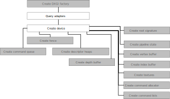

[TOC]

## 关于学习资料

不同的学习阶段要看不同的资料，比如刚刚开始接触DX，那么看一些类似《DIRECTX.9.0.3D游戏开发编程基础》的书是可以的，但是一旦熟悉之后，就必须学会开始阅读官方文档，很多细节是在一些书中不会提及的。

## SDK包安装

DirectX SDK 9 安装之后会在系统环境变量中添加一个 `DXSDK_DIR`。 可以用在VC工程，以及其他需要使用该环境的地方。

ref: [Missing files, DirectX SDK (d3dx9.lib, d3dx9.h)](https://stackoverflow.com/questions/17015088/missing-files-directx-sdk-d3dx9-lib-d3dx9-h)

## D3DPRESENT\_PARAMETERS

D3DPRESENT\_PARAMETERS 是创建d3d object的参数，里面有很多成员需要重点关注。

## 设备类型

参考 [D3DDEVTYPE enumeration](https://docs.microsoft.com/en-us/windows/win32/direct3d9/d3ddevtype)

*   HAL - 硬件
*   ref类型
*   软件类型 参考[这里](https://www.gamedev.net/forums/topic/70256-d3ddevtype_ref-or-d3ddevtype_hal/1341367)这个是为那些不使用3d硬件加速，而是要自己实现软件渲染引擎的场景用的。
*   。。。

> 创建，释放，重置设备必须在焦点窗口的窗口过程所在线程。

## D3DCREATE

## 相关dll

*   C:\Windows\System32\d3d9.dll
*   C:\Windows\System32\d3dref9.dll
*   C:\Windows\System32\D3DX9d\_43.dll

## surface 格式

[D3DFORMAT](https://docs.microsoft.com/en-us/windows/win32/direct3d9/d3dformat)

多种格式，微软不知道为什么会把多种格式定义到一个枚举类型中。

## surface vs texture

dx中的surface(表面)对应类 [IDirect3DSurface9](https://docs.microsoft.com/en-us/windows/win32/api/d3d9helper/nn-d3d9helper-idirect3dsurface9)，而texture(纹理) [IDirect3DBaseTexture9](https://docs.microsoft.com/en-us/windows/win32/api/d3d9helper/nn-d3d9helper-idirect3dbasetexture9)。二者都是继承自`IDirect3DResource9`。

纹理是用于渲染的材料 (render from)，表面是用来渲染的工具 (render to)。[Simple texture vs. surface question](https://www.gamedev.net/forums/topic/410447-simple-texture-vs-surface-question/3732800/)，一般来说二者等价，除非是要把内容渲染到纹理上。

## Adapters and devices

参考：[Adapters and devices](https://www.milty.nl/grad_guide/basic_implementation/d3d12/device.html)

[How is a DirectX Adapter Different from a Device?](https://gamedev.stackexchange.com/questions/125407/how-is-a-directx-adapter-different-from-a-device)

> adapter是物理硬件或者模拟器设备，device是一个面向开发者的抽象层；一般情况下，device是与开发者交互的，adapter是与device交互的。看起来就是上层是开发者API，下面是device，再下面是adapter，看这幅图(上面那个链接里)可以证明

> 还有这句：
>
> 为了创建设备(device)，我们首先需要选择一个适配器(adapter)来运行。适配器可以被认为是一个 GPU 或其他渲染子系统：当系统中存在多个 GPU 时，您可以明确选择您希望在哪个 GPU 上运行，甚至可以在多个适配器上创建多个设备并允许它们协同工作使用 Direct3D 12 的显式多 GPU 支持进行操作。

## 关于设备丢失

[Lost Devices (Direct3D 9)](https://docs.microsoft.com/en-us/windows/win32/direct3d9/lost-devices) 官方文档中有详细的解释，以及应对方法。

设备丢失意味着显存中的映射区域失效，那么就会出现无法渲染的问题。

### 设备丢失后如何处理？

释放该释放的资源（D3DPOOL\_DEFAULT 创建出来的资源），调用reset接口，然后重新创建资源。reset接口是设备丢失期间唯一生效的方法，也是唯一的可以将设备从丢失状态重置为可操作状态的方法。

## 检查硬件支持能力

[Determining Hardware Support (Direct3D 9)](https://docs.microsoft.com/en-us/windows/win32/direct3d9/determining-hardware-support) 就是3个函数的使用。

## 顶点数据处理

一般情况下应该使用HAL设备。那到底什么时候该使用软件顶点处理呢？

[这里](https://gamedev.net/forums/topic/614116-difference-between-hardware-vertex-processing-and-software-vertex-processing/4879255/)有一个人回答说：

> The software processing will allow you to run directx 11 on a directx 9 compatible card. because all the actually work is offloaded to the CPU.
> Hardware processing is where all the work is done on the GPU.
>
> software processing is VERY VERY SLOW and is never really used, except if you want to test a feature that is not supported by your current video card.

简言之，软件定点处理(实际上由CPU代劳)多是用于测试一些目前显卡还不支持的特性。

## 关于状态

DX9是一个状态机，参考 [States (Direct3D 9)](https://docs.microsoft.com/en-us/windows/win32/direct3d9/states)

## 资源

[Managing Resources (Direct3D 9)](https://docs.microsoft.com/en-us/windows/win32/direct3d9/managing-resources)

资源的类型，比如索引缓冲区，顶点缓冲区，纹理，

纹理、顶点资源的创建多是 CreateXXX 方法，要使用资源都必须锁定资源，使用也是LockXXX的方法。

资源之间的关系:

如果是高频修改的资源，可以组合使用 `D3DUSAGE_DYNAMIC` 和 `D3DPOOL_DEFAULT`。

## 提高dx性能

[D3DUSAGE](https://docs.microsoft.com/en-us/windows/win32/direct3d9/d3dusage) 中有建议，详细解释

## 采集

采集可以使用 [DirectShow](https://docs.microsoft.com/en-us/windows/win32/directshow/video-capture)；

环境配置：在Win10上需要下载安装Windows7 SDK，x64版本Windows使用 [Microsoft Windows SDK for Windows 7 and .NET Framework 4 (ISO)](https://www.microsoft.com/en-us/download/details.aspx?id=8442)中的 GRMSDKX\_EN\_DVD.iso 版本。安装好之后在 `C:\Program Files\Microsoft SDKs\Windows\v7.1`。

另外，DirectShow的源码在泄露的NT源码中可以找到（nt5src\Source\XPSP1\NT\multimedia\dshow）。

## 调试

*   [Enabling Direct3D Debug Information (Direct3D 9)](https://learn.microsoft.com/en-us/windows/win32/direct3d9/enabling-direct3d-debug-information)
*   [How to debug Direct3D resource leak?](https://gamedev.stackexchange.com/questions/49614/how-to-debug-direct3d-resource-leak)

