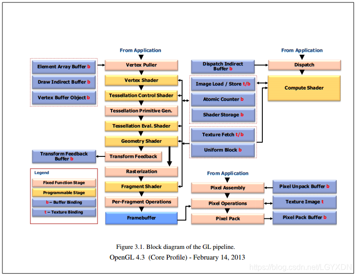
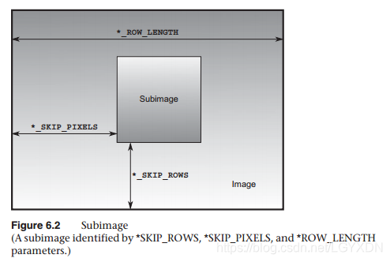
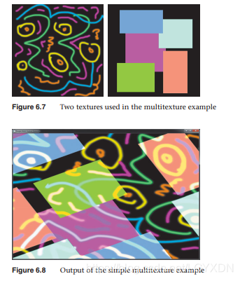
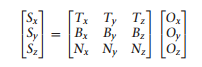

[toc]
本文不分章节。

# 前言

## 标准
既然OpenGL是一个API标准，那么其标准的文档可以在官网查找： [Documentation](https://www.opengl.org/documentation)，或者在[Khronos OpenGL® Registry](https://www.khronos.org/registry/OpenGL/index_gl.php)查找。不过官网速度太慢了，最好下载官方的[pdf文档](https://www.khronos.org/registry/OpenGL/specs/gl/)。


[docs.GL](http://docs.gl/)是一个可以检索OpenGL API的网站（基于一个[开源项目](https://github.com/BSVino/docs.gl)开发的），更可喜的是有的API说明中还会有示例代码。

虽然KhronosGroup也有官方的文档，但就是难看：[OpenGL-Refpages](https://github.com/KhronosGroup/OpenGL-Refpages)

## 代码练习环境

如果不看本书的话，可以选择的配置是glfw和glew。Windows上是在这两个官网下载，并在VC++环境下配置；Mac上可以使用homebrew来安装。

但是如果要看本书的话，还是最好选择freeglut和glew。Windows可以下载编译好的文件，或者自行编译；Mac上可以使用homebrew安装。红宝书就是这么拽~

红宝书的代码应该不是在Mac上写的，因为自己带的LoadShaders.cpp在Mac上编译不过。包含OpenGL库的时候，使用的是<GL/gl.h>，而这个在Mac上应该是<OpenGL/gl.h>，位于/System/Library/Frameworks/OpenGL.framework/Headers。

该书第九版的代码在GitHub上[OpenGL Red Book](https://github.com/openglredbook/examples)，第八版可以在[Kylewlk/OpenGL-Programming-Guide-8th-Edition-Code](https://github.com/Kylewlk/OpenGL-Programming-Guide-8th-Edition-Code)找到。

**提醒一下：最好不要在Mac上练习该书代码，Windows+freeglut+glew+VS是最佳练习环境。**

# 正文
## 相关概念

**OpenGL需要将所有的数据都保存到缓存对象中，它相当于是OpenGL服务端维护的一块内存区域。**

### OpenGL渲染管线


### 生成 glGen*

负责分配不同类型的OpenGL对象的名称。可认为类似C语言中的指针变量。比如顶点数组对象(glGenVertexArray)，顶点缓存对象(glGenBuffer)……

### 绑定  glBind*

顶点绑定是将一组顶点设置为当前对象，后续操作都是针对这个当前对象的。一般发生在两种情况下：创建对象并初始化，以及要使用的对象并非当前对象。这也是体现了OpenGL的设计上是基于状态机模型的。

### 释放 glDelete*

不再使用的话，需要释放缓存。

### 有效性判断 glIs*

判断某个对象是不是创建了还没有释放。

### 载入数据 

glBufferData。*额，感叹一下，初看OpenGL的一些函数好多定义的不清晰，功能重复，而且参数不同功能差异就很大，命名还很烂。*

### 着色器

OpenGL 3.1之后，每个程序必须有两个着色器：顶点着色器和片元着色器。

### 禁用和启用
glEnable & glDisable。*这么喜欢使用参数控制状态的标准居然不使用参数来控制禁用和启用，而是使用了两个函数，也是随意啊。*

### 状态测试
glIsEnabled 状态测试。

## 着色器基础知识点

OpenGL从3.1开始从核心中去掉了固定管线。3.0的时候尚可使用兼容模式写固定管线。所以现代OpenGL渲染严重依赖着色器。OpenGL着色语言是在OpenGL 2.0版本左右开始发布的，目前基本会同OpenGL一起发布更新。写法上类似C/C\++。

着色器是一个独立的处理单元，每个着色器都有一个叫做main的入口函数。它使用着色器中特殊的全局变量来将外部的数据传递进来，以及传递出去。

### 注释风格

类似C/C\++

### 基本数据类型

GLSL是一种强类型语言，必须事先声明类型。基本类型有：
float(32bit float number), double(64bit float number), int(32 bit), uint(32 bit), bool.

### 命名

类似C，但是不能使用连续的下划线。

### 变量的作用域

类C

### 类型转换

隐式类型转换比C少，比C/C\++更加注重类型安全。语句“int f = false;” 会报错。

支持的隐式转换规则：
- int --> uint
- int, uint --> float
- int, uint, float --> double

可以显示转换

```
float f = 3.14;
int ten = int(f);
```

### 聚合类型

向量：2D, 3D, 4D, 对应地有float, int, uint, double, bool。GLSL中默认的类型是float，这一点可以从vec2d是使用了float类型看出，使用int的写作ivec2，还有uvec2, dvec2, bvec2。初始化：vec2d velcity=vec2(0.5, 1.0); 

对应地还有矩阵类型：mat，类型命名规则类似向量。mat2x2, mat2x3……mat4x4

```
// 向量
vec3 velocity = vec3(1.0, 2.0, 3.0);
ivec3 steps = vec3(velcity); // 类型转换，并赋值

vec4 color;
vec3 RGB = vec3(color); // 只有前三个分量，相当于截断

vec3 white = vec3(1.0, 1.0, 1.0);
vec4 translucent = vec4(white, 0.5);

// 3维矩阵的初始化（效果相同）
mat3 M = mat3(1.0, 2.0, 3.0, 
              4.0, 5.0, 6.0, 
              7.0, 8.0, 9.0);
vec3 col1 = vec3(1.0, 2.0, 3.0);
vec3 col2 = vec3(4.0, 5.0, 6.0);
vec3 col3 = vec3(7.0, 8.0, 9.0);
mat3 M = (col1, col2, col3);

vec2 col1 = vec2(1.0, 2.0);
vec2 col2 = vec2(4.0, 5.0);
vec2 col3 = vec2(7.0, 8.0);
mat3 M = mat3(col1, 3.0
              col2, 6.0
              col3, 9.0);
```

#### 向量/矩阵中元素的访问

三种类型的分量：
- 与位置相关的分量：(x, y, z, w);
- 与颜色相关的分量：(r, g, b, a);
- 与纹理相关的分量：(s, t, p, q);

```
// 访问分量
float red = color.r;
// 通过下标访问
float red = color[0];

// 注意，这里相当于3维
vec3 luminance = color.rrr;
// 反转
color = color.abgr;

// 但是三种分量不能混用
vec4 color = otherColor.rgz; // z来自不同访问符集合

mat4 m = mat4(2.0); // 这是一个单位矩阵乘以2. 只有正对角线的元素为2.0，其余皆为0.0.
vec4 zVec = m[2]; // 第二列
float yScale = m[1][1]; // 即：2.0
```

#### 结构体
```
struct Particle {
   float life;
   vec3  position;
   vec3  velocity;
};

vec3 pos = vec3(1.0, 1.0, 2.0);
vec3 vel = vec3(0.0, 0.5, 0.8);
Particle p = Particle(10.0, pos, vel);
```

#### 数组

```
// 3维数组
float coeff[3] = float[3](1.0, 1.0, 1.0);
float[3] coeff;

// 未定义多少维，可重新定义。
int indicess[]; 

// 向量/矩阵的长度，对于向量来说就是元素维度，对于矩阵来说是列数。
mat3x4;
int c = m.length(); // 3
int r = m[0].length(); // 4

```

还有多维数组

```
float coeff[3][5]; // 三个数组，每个元素包含一个5维数组 
coeff[2][1] *= 2.0; 
coeff.length(); // 常量3
coeff[2]; // 一个5维数组
coeff[2].length(); // 常量5
```

#### 存储限制符

- const 只读的变量，仅在初始化时指定  const floata PI = 3.14;
- in 设置变量为着色器的输入变量
- out 设置变量为着色器的输出变量
- uniform 这类变量直接从OpenGL程序中接收数据，它不随着顶点/片元的变化而变化。必须是全局变量。在所有的可用的着色阶段都是共享的
- buffer 设置应用程序共享的一大块可读写的内存
- shared 本地工作组中共享使用，只能用于计算着色器中

其中uniform类型变量(也可以是数组和结构体)比较特别，由专门的函数用来取出/设置。GLSL编译器会在链接的时候创建一个uniform变量列表。需要通过glGetUniformLocation()获取索引。同时存在于用户应用程序和着色器中，故而需要在修改着色器的内容同时也调用OpenGL函数修改uniform缓存对象。

```
// 获取uniform变量索引并设置具体的值
GLint timeLoc;
GLfloat timeValue = ...;
timeLoc = glGetUniformLocation(program, "time");
glUniform1l(timeLoc, timeValue); // set value
```

glUniform*f可以设置布尔数据。再次证明OpenGL中float才是“第一”基本类型。相对而言int是C/C\++的“第一”基本类型。

#### 语句

##### 操作符
操作符基本同C。此外GLSL还重载了大部分操作符，用来支持向量和矩阵的运算。比如矩阵和向量的点乘。

##### 控制

if-else
```
if (真) {
    
} else {
    
}
```

switch-case
```
switch (int_value) {
    case n:
    ...
    break;
    case m:
    ...
    break;
    default:
    ...
    break;
}
```

for-loop, while-loop, do-while-loop

```
for (int i = 0; i < 10; ++i) {
    ...
}
while (n < 10) {
    ...
}
do {
    ...
} while (n < 10);
```

以及：break, continue, return [结果]，discard（只能用于片元着色器中，表示终止着色器的执行）。

#### 函数

GLSL有一些内置函数，也支持用户自定义函数，遵循先声明后使用的规则。声明方式同C（如下），只是参数要加上访问修饰符，还有函数名不能以gl_开头，不能连续使用下划线：

```
returntype functionName([accessModifier] type1 variable1,
                        [accessModifier] type2 variable2,
                        ...) 
{
    return returnValue;
}
```

上面的参数限定符accessModifier有：in（默认），const in，out，inout。见名知义。

GLSL除了（内容十分丰富的）内置函数之外，还有内置常量，内置变量。

### 计算的不变性

GLSL着色器无法保证在不同的着色器中，两个完全相同的算式得到的结果完全一致。[惊讶]。原因是由不同的优化导致。当在图形设备上完成计算的时候，GLSL有两个方法invariant/precise来确保；但是对于宿主计算机和图形硬件各自计算的，无能为力，如下例，即使使用了invariant/precise也不行：

```
uniform float ten;     // 假定应用程序设置这个值为10.0
const float f = sin(10.0); // 宿主机的编译器负责计算
float g = sin(ten);  // 图形硬件负责计算

void main() {
    if (f == g) { // 不一定相等
        ...
    }
}
```

invariant限制符可以设置任何着色器的（包括内置变量）输出变量。为了保证不变性，GLSL编译器的一些优化可能被迫终止。调试的时候，可以设置全部变量为invariant，方法是：

```
#pragma STDGL invariant(all)
```

precise可以设置任何计算中的变量或者函数返回值，可用于避免计算几何体的时候出现裂缝。为了保证表达式结果的一致性，应该使用precise。这里，precise的含义其实是计算的可重复性，而不是增加精度。实际上，使用precise是阻止编译器使用不同的指令来做同一类运算，比如普通的乘法和fma（融混乘法）。

### 预处理器

同C一样，GLSL也有预处理阶段。不过差异之处是没有包含命令（#include）。

### 编译器选项

须在函数代码块之外写。

```
#pragma optimize(on)  // 优化开
#pragma optimize(off) // 优化关

#pragma debug(on)   // 调试开
#pragma debug(off)  // 调试关
```

```
// 设置某个扩展编译功能
#extension extension_name : <directive>
```

extensio\_name可由glGetString(GL_EXTENSION);得到。

```
// 设置全部扩展功能
#extension all : <directive>
```

directive可选的值有：

- require  不支持就提示错误，不能设置为all
- enable   不支持就警告，设置为all就提示错误
- warn     不支持，或者编译中使用了任何扩展，就警告
- disable  禁用该扩展，如果设置为all，就禁止所以扩展，之后若使用相应扩展，就警告/错误。

### 数据块接口

着色器和应用程序，或者着色器的各个阶段之间共享的变量可以组织为变量块。uniform变量可使用uniform块，输入和输出变量可使用in和out块。着色器的存储缓存可以使用buffer块。形式类似。

#### uniform块

访问函数需要使用glMapBuffer()之类的函数。声明uniform块的方法是：

```
uniform Matrix {
    mat4 modelView;
    mat4 projection;
    mat4 color;
};

// 或者

uniform Matrix {
    mat4 modelView;
    mat4 projection;
    mat4 color;
} name;
```

uniform块中只能包含透明类型变量，而所谓不透明变量就是采样器，图像和原子计数器。uniform只能在全局作用域内声明。

##### 布局控制

- shared    默认布局，表示uniform块是多个程序间共享的。注意与存储限定符shared区分。
- packed    设置uniform块占用最小内存，但是会禁用程序间共享这个块。
- std140    使用标准布局方式设置uniform块，或者着色器存储的buffer块。
- std430    使用标准布局方式设置buffer块。
- row_major 使用行主序的方式存储uniform块中的矩阵
- column_major 使用列主序的方式存储uniform块中的矩阵（默认顺序）

看样子以后还会出现std***吧？？？

布局控制符可以在编译和链接的时候控制uniform变量的布局。

```
// 设置共享，行主序的uniform块
layout (shared, row_major) uniform {...};

// 设置此后所有行都使用同一种布局，除非下面的代码修改了再写
layout (shared, row_major) uniform;
```

##### uniform块中访问uniform变量

注意uniform块中的变量并不受块定义名称的限制，所以同名的uniform块中的uniform变量名不可重复，否则会报错。但是访问块中的变量的时候需要加上uniform块名。[诡异的设定~]

#### 应用程序中访问uniform块

uniform变量是应用程序与着色器之间的桥梁。

方法一：

如果uniform变量是在命名uniform块中的，那么访问该变量需要首先找到这个块在着色器中的索引，再取得变量的具体位置。

```
// 获取块的索引
GLint glGetUniformBlockIndex();

// 获取块中各变量的大小，偏移量……
glGetActiveUniformBlockiv();

// 获取到块的索引之后需要用一个缓存对象与之关联
void glBindBufferRange(GLenum target, GLuint index, GLuint buffer, GLintptr offset, GLsizeptr size);
// 如果这个uniform块都是使用缓存来存储的，那么可以使用下面的方法建立关联：
void glBindBufferBase(GLenum target, GLuint index, GLuint buffer);
```

一旦建立关联就可以使用缓存相关的命令对块内的数据进行初始化和修改。

方法二：

直接建立某个命名uniform块和缓存对象之间的绑定关系。对于多个着色器共享一个uniform块的时候，这种方式最方便。显式地控制个uniform块的绑定方式，可以在调用链接程序函数(glLinkProgram)之前调用glUniformBlockBinding()，将uniformBlockIndex与uniformBlockBinding绑定起来;

```
GLint glUniformBlockBinding(GLuint program, GLuint uniformBlockIndex, GLuint uniformBlockBinding);
```

如果uniform中使用了默认的布局方式，那么需要得到uniform块中每个uniform变量的索引和大小，方法是根据指定的名称（数组）获取：

```
void glGetUniformIndices(GLuint  program,
 	                     GLsizei uniformCount,
 	                     const GLchar **uniformNames,
 	                     GLuint *uniformIndices);
```

获取到索引（数组）之后，使用

#### buffer块

对于应用程序而言，这就是着色器的存储缓存对象（shader storage buffer object）。类似于uniform块，但是还有不同：

- 着色器可写入buffer块，并使得结果影响别的着色器和应用程序。
- 可以在渲染的时候决定其大小，而不是编译和链接的时候。

```
buffer BufferObject {
    int mode;
    vec4 points[]; // 最后一个成员是大小未定义的
};
```

那么可以在编译、链接之后，渲染之前设置points的大小。着色器内部使用length()获取渲染时数组的大小。着色器可以对buffer块进行读和写，对于其他着色器调用而言都是可见的。

#### in out块

着色器从一个阶段输出，到下一个阶段输入，这个过程使用块来表示的话就可以用in/out块。

```
// 一个顶点着色器的输出
out Lighting {
    vec3 normal;
    vec2 bumpcoord;
};

// 片元着色器的输入
in Lighting {
    vec3 normal;
    vec2 bumpcoord;
};

// 上面二者必须对应（直接拷贝一下，再换一下修饰符就可以了）。
```

### 着色器的编译

所有着色器程序都要使用下面的方法进行设置：

1. 创建着色器对象     glCreateShader(GLenum type);
2. 将着色器源码编译为对象   glShaderSource(), glCompileShader();
3. 验证编译是否成功   glGetShaderiv(GL_COMPILE_STATUS);

如果要将多个着色器对象链接为一个着色器程序：

1. 创建一个着色器程序  glCreateProgram(void);
2. 将着色器对象关联到着色器程序  glAttachShader(GLuint program, GLuint shader);
3. 链接着色器程序     glLinkProgram(GLuint program);
4. 判断链接是否成功   glGetProgramiv(GL_LINK_STATUS);
5. 使用着色器来处理顶点和片元  glUseProgram(GLuint program);

glGetShaderInfoLog()可以获取编译日志。

glDeleteShader() 标记着色器对象为删除。

glDetachShader(GLuint program, GLuint shader); 移除着色器对象与程序之间的关联。

如果先调用glDeleteShader()，然后又调用glDetachShader()。那么这个着色器对象会被立即删除。

还有一些补充函数：glDeleteProgram(); glIsProgram(); glIsShader();


### 着色器子程序

#### 定义

定义一个子程序需要3步：

```
// 定义子程序类型
subroutine returnType subroutineType(type param, ...);

// 定义子程序集合
subroutine (subroutineType list) returnType functionName(...);

// 使用uniform变量保存子程序选择信息
subroutine uniform subroutineType variableName;
```

示例代码如下：

```
subroutine vec4 LightFunc(vec3); // step 1

subroutine (LightFunc) vec4 ambient(vec3 n) { // step 2
    return Materials.ambient;
}

subroutine (LightFunc) vec4 diffuse(vec3 n) { // step 2
    return Materials.diffuse * max(dot(normalize(n), LightVec.xyz), 0.0);
}

subroutine uniform LightFunc materialShader; // step 3
```

#### 使用

前面提到使用uniform来记录子程序信息，不过这个uniform变量需要使用特别的函数来获取自身的位置：

```
GLint glGetSubroutineUniformLocation(GLuint program, GLenum shaderType, const char* name);
```

获取子程序的索引需要使用

```
GLuint glGetSubroutineIndex(GLuint program, GLenum shaderType, const char* name);
```

shaderType代表来不同的着色阶段。

设置uniform变量指定选择哪一个子程序函数，使用：

```
GLuint glUniformSubroutineuiv(GLenum shaderType, GLsizei count, const GLuint* indices);
```

#### 代码

```
GLint materialShaderLoc;
GLuint ambientIndex;
GLuint diffuseIndex;

glUseProgram(program);

materialShaderLoc = glGetSubroutineUniformLocation(program, GL_VERTEX_SHADER, "materialShader");

if (materialShaderLoc < 0) {
    // materialShader不是uniform变量
}

ambientIndex = glGetSubroutineIndex(program, GL_VERTEX_SHADER, "ambient");
diffuseIndex = glGetSubroutineIndex(program, GL_VERTEX_SHADER, "diffuse");

if (ambientIndex == GL_INVALID_IDNEX ||
    diffuseIndex == GL_INVALID_INDEX) {
        // 当前绑定的程序中GL_VERTEX_SHADER阶段没有启用指定的子程序
} else {
    GLsizei n;
    glGetIntegerv(GL_MAX_SUBROUTINE_UNIFORM_LOCATIONS, &n);
    
    GLuint *indices = new GLuint[n];
    indices[materialShaderLoc] = ambientIndex;
    glUniformSubroutineuiv(GL_VERTEX_SHADER, n, indices);
    delete []indices;
}
```

### 独立的着色器对象

OpenGL 4.1之前，应用程序中同一时间只能绑定一个着色器，但是碰到那种某一阶段有多个着色器使用上一阶段的数据的时候，只能将上一阶段的数据复制多份，再绑定到不同的该阶段着色器中，这样会造成资源浪费。

OpenGL4.1开始，可以使用独立着色器对象，它可以将不同的着色阶段合并到一个程序管线中。

首先，需要创建（用于**着色器管线**的）**着色器程序**：
```c
void glProgramParameteri(GLuint program,
 	                     GLenum pname,
 	                     GLint value);
```

pname设置为GL_PROGRAM_SEPARABLE，然后链接，这样该**着色器程序**就被标记为再管线中可用。

或者，可以使用新的函数：

```c
GLuint glCreateShaderProgramv(GLenum type,
 	                          GLsizei count,
 	                          const char **strings);
```

type设置为GL_PROGRAM_SEPARABLE。这个函数从一个字符串中创建一个**着色器程序**，包含了编译，链接过程。

第二步，创建**着色器管线**：

```c
void glGenProgramPipelines(	GLsizei n,
 	                        GLuint *pipelines);
```

然后将**着色器管线**关联到当前上下文。

```c
void glBindProgramPipeline(	GLuint pipeline);
```

然后就可以对程序进行编辑（添加，替换着色阶段）。删除管线可以使用：

```c
void glDeleteProgramPipelines(	GLsizei n,
 	                            const GLuint *pipelines);
```

第三步，将独立的**着色器程序**绑定到**着色器管线**上：

```c
void glUseProgramStages(GLuint pipeline,
 	                    GLbitfield stages,
 	                    GLuint program);
```

着色器阶段之间的接口必须注意in/out变量的匹配。非独立着色器对象再链接的时候就会检查这些接口的匹配情况；独立着色器对象在绘制-调用过程中才会检查，接口不正确会导致所有可变变量out变量未定义。

独立着色器对象中允许有各自独立的uniform集合。有两种方法来设置uniform变量：

一是，使用glActiveShaderProgram()选择活动的着色器程序。然后用glUniform*(), glUniformMatrix*()设置着色器程序中的uniform变量。

二是（推荐），glProgramUniform*()和glProgramUniformMatrix*()函数设置某个程序中的uniform值，而且这个不要求对应的程序是活动的。

## OpenGL绘制方式

### 图元

点 线 三角形

```
void glPointSize(GLfloat size);

void glLineSize(Glfloat size);
```

线的类型细分有：条带线，循环线（首尾相接）。

三角形的类型有：独立三角形，条带，扇面。

图形学里面所有的多边形，复杂曲面，几何体都是用三角形拼接来的。多边形（三角形）的渲染有方式有：绘制点，（相邻点的）连线，填充三种方式，对应的mode是GL_POINT, GL_LINE, GL_FILL。

```
void glPolygonMode(GLenum face, GLenum mode);
```

图形学中的面有两个：正面、反面。OpenGL可以设置哪一个是正面（通过构成面的点的顺/逆时针排序），如果我们一直位于面的某一侧，可以设置只绘制正/反面（需要开启裁减开关GL_CULL_FACE）。方法如下：

```
void glFrontFace(GLenum mode);
void glCullFace(GLenum mode);
```

### OpenGL缓存数据

OpenGL的所有操作几乎都会涉及到缓存数据，这又会涉及到类型，创建，管理，销毁，优化方案。缓存对象是使用GLuint来命名的。

```
// 创建缓存对象的名称
void glGenBuffers(GLsizei n, GLuint* buffers);

// OpenGL使用一种优化的内存管理策略，只有缓存对象绑定到目标类型target，这个时候才会准备分配内存
void glBindBuffer(GLenum target, GLuint buffer);

// 为缓存对象读入数据，这里才是真正分配内存的时候。
// data为NULL就是用来初始化所在内存区域的。
// 如果新的数据大小比缓存对象当前分配的大，那么缓存对象将被重新分配大小；
// 如果相比较小的话，缓存对象将会收缩空间以适应大小。
void glBuferData(GLenum target, GLsizeiptr size, const GLvoid* data, GLenum usage);
// 部分读入数据
void glBufferSubData(GLenum target, GLintptr offset, GLsizeiptr size, const GLvoid* data);
```

使用glBufferData和glBufferSubData就可以对缓存对象进行分配和初始化了。示例代码：

```
static const GLfloat positions[] = {
    -1.0f, -1.0f, 0.0f, 1.0f,
     1.0f, -1.0f, 0.0f, 1.0f,
    -1.0f,  1.0f, 0.0f, 1.0f,
    -1.0f,  1.0f, 0.0f, 1.0f
};

static const GLfloat colors[] = {
    1.0f, 0.0f, 0.0f,
    0.0f, 1.0f, 0.0f,
    0.0f, 0.0f, 1.0f,
    1.0f, 1.0f, 1.0f
};

GLuint buffer;  // 缓存对象

glGenBuffer(1, &buffer);
glBindBuffer(GL_ARRAY_BUFFER, buffer);
glBufferData(GL_ARRAY_BUFFER,                   // 目标
            sizeof(positions) + sizeof(colors),  // 总计大小
            NULL,                               // 无数据
            GL_STATIC_DRAW);                    // 用途

glBufferSubData(GL_ARRAY_BUFFER,                // 目标
                0,                              // 偏移地址
                sizeof(positions),              // 大小
                positions);                     // 数据

glBufferSubData(GL_ARRAY_BUFFER,                
                sizeof(position),               
                sizeof(colors).
                colors);

```

如果仅仅是将缓存对象清除为某一个值，那么可以使用：

```
// 清除所有数据为某一个值。数据首先转为internalformat格式，然后填充缓存数据指定的区域范围。
void glClearBufferData(	GLenum target,
 	                    GLenum internalformat,
 	                    GLenum format,
 	                    GLenum type,
 	                    const void * data);

// 清除部分数据
void glClearBufferSubData(	GLenum target,
                        GLenum internalformat,
 	                    GLintptr offset,
 	                    GLsizeiptr size,
 	                    GLenum format,
 	                    GLenum type,
 	                    const void * data);
```

### 应用程序 & OpenGL的 内存数据拷贝

以下几个方法都会发生数据拷贝，但是拷贝的方向不同：
- glBufferData(), glBufferSubData()  是由“应用程序”拷贝到“OpenGL管理的内存”。
- glCopyBufferSubData() 只是拷贝源内存到目标内存，方向不定。
- glGetBufferSubData()  拷贝“OpenGL管理的内存”到“应用程序”的内存。

```
void glCopyBufferSubData(GLenum readTarget,
 	                     GLenum writeTarget,
 	                     GLintptr readOffset,
 	                     GLintptr writeOffset,
 	                     GLsizeiptr size);

void glGetBufferSubData(GLenum target,
 	                    GLintptr offset,
 	                    GLsizeiptr size,
 	                    GLvoid * data);
```

想要在应用程序中访问OpenGL的内存还有一个方便的办法：

```
// 将缓存对象的全部内存映射到客户端（也就是应用程序）地址空间
void *glMapBuffer(GLenum target,   // 就是缓存绑定目标 Buffer Binding Target
 	              GLenum access);  // 可以控制GL_READ_ONLY, GL_WRITE_ONLY, or GL_READ_WRITE.
 	              
// 对应地，解除映射的方法
GLboolean glUnmapBuffer(GLenum target);
```

这个函数(glMapBuffer())会返回一个OpenGL管理的地址，但是这个地址不一定是图形处理器的内存区域，只是这个缓存对象本身对应的内存，OpenGL会在应用程序操作的内存和对应映射的图形处理器GPU所需的位置之间做数据的移动，以保证中间层的透明性，即让用户感觉就是在操作GPU内存，但是一旦发生了数据移动的情况就比较耗费性能，要慎重。

那么，既然glMapBuffer可以有机会写入缓存对象，那么就可以用来初始化缓存对象，参考例子：

```
GLuint buffer;
FILE *f;
size_t filesize;

// 打开文件
f = fopen("data.dat", "rb");
fseek(f, 0, SEEK_END);
filesize = ftell(f);
fssek(f, 0, SEEK_SET);

// 生成并绑定缓存对象
glGenBuffer(1, &buffer);
glBindBuffer(GL_COPY_WRITE_BUFFER, buffer);

// 创建缓存对象空间
glBufferData(GL_COPY_WRITE_BUFFER, (GLsizei)filesize, NULL, GL_STATIC_DRAW);
void *data = glMapBuffer(GL_COPY_WRITE_BUFFER, GL_WRITE_ONLY);

// 向缓存对象写入数据
fread(data, 1, filesize, f);

glUnmapBuffer(GL_COPY_WRITE_BUFFER);
fclose(f);
```

上述代码中的初始化方式，由于没有使用额外的内存空间，直接将数据拷贝进了OpenGL管理的指针指向的空间，并且解除映射之后也是由OpenGL管理的，那么就不与应用程序相互影响，可以说是与应用程序后续的操作同步进行的，就相当于同时使用了CPU和GPU，提高了程序整体的并发性能。

除了上面那个映射全部缓存对象内存空间的方法之外，还有一个可以控制部分区间的方法：

```
// 控制只映射缓存的部分空间区域
void *glMapBufferRange( GLenum target,
 	                    GLintptr offset,    // 区间的起始地址
 	                    GLsizeiptr length,  // 区间的大小
 	                    GLbitfield access); // 访问控制权限
 	                    
// 通知OpenGL所选区域中数据发生了变化，立即更新到缓存对象内存中去。
// 对应地glMapBufferRange中的控制位access必须包含GL_MAP_FLUSH_EXPLICIT_BIT，表示需要更新数据。
void glFlushMappedBufferRange(	GLenum target,
 	                            GLintptr offset,
 	                            GLsizeiptr length);
```

在读取大文件进缓存的时候，就需要glFlushMappedBufferRange来提升性能，原理如前所述，同时运行了CPU和GPU的功能。

如果是要直接丢弃缓存对象中的全部/部分数据，可以直接调用下面两个函数：

```
void glInvalidateBufferData(GLuint buffer);

void glInvalidateBufferSubData(GLuint buffer, GLintptr offset, GLsizeiptr length);
```

### 顶点

将顶点数组对象（包含数据的位置和布局信息）加载到着色器中可以使用下面的函数。

```
// 原型， 如果type是整型的话，需要通过这个参数控制来转化为浮点型才能放入浮点数的顶点属性中。
void glVertexAttribPointer(GLuint index,
 	                       GLint size,
 	                       GLenum type,
 	                       GLboolean normalized, 
 	                       GLsizei stride,
 	                       const GLvoid * pointer);
 	                        
// 变种一：这个函数是用来加载整型数据的，type只能使用整型
void glVertexAttribIPointer(GLuint index,
 	                        GLint size,
 	                        GLenum type,
 	                        GLsizei stride,
 	                        const GLvoid * pointer);

// 变种二：这个函数专门用来加载64位双精度浮点型数据，type只能是GL_DOUBLE。
void glVertexAttribLPointer(GLuint index,
 	                        GLint size,
 	                        GLenum type,
 	                        GLsizei stride,
 	                        const GLvoid * pointer);
```

type取压缩类型GL_INT_2_10_10_10_REV/GL_UNSIGNED_INT_2_10_10_10_REV的时候，可以通过节约内存空间和系统带宽而提升程序性能。

当使用上面的函数加载数据的时候，必须启用顶点属性数组：

```
void glEnableVertexAttribArray(GLuint index); 
void glDisableVertexAttribArray(GLuint index);
```

如果没有启用的话，OpenGL会使用静态顶点属性。这样设置是考虑到，如果有一个数据缓存中所有数值都是一样的，而创建并拷贝这样大小的缓存对象是一种浪费，完全可以考虑使用一个值来做初始化。而设置这个初始的值，可以通过下面的函数：

```
void glVertexAttrib{1234}{fds}(GLuint index, TYPE values);
void glVertexAttrib{1234}{fds}v(GLuint index, const TYPE* values);
void glVertexAttrib4{bsifd us ui}v(GLuint index, const TYPE* values);
void glVertexAttrib4Nub(GLuint index, GLubyte x, GLubyte y, GLubyte z, GLubyte w)
void glVertexAttribN{bsi ub us ui}v(GLuint index, const TYPE* values);
void glVertexAttribI{1234}{i ui}(GLuint index, TYPE values);
***
```

### 绘制命令

OpenGL中大部分绘制命令都是以Draw开头的。绘制命令分为：

- 索引形式：  需要使用绑定GL_ELEMENT_ARRAY_BUFFER的缓存对象存储的索引数组
- 非索引形式：  不需要绑定，直接按序读取顶点数组即可

```
// 最基本的索引绘制命令
void glDrawElements(GLenum mode,
 	                GLsizei count,
 	                GLenum type,
 	                const GLvoid * indices);

// 最基本的非索引绘制命令
void glDrawArrays(GLenum mode,
 	              GLint first,
 	              GLsizei count);
```

上面的mode可以取的值有：
GL_POINTS, GL_LINE_STRIP, GL_LINE_LOOP, GL_LINES, GL_LINE_STRIP_ADJACENCY, GL_LINES_ADJACENCY, GL_TRIANGLE_STRIP, GL_TRIANGLE_FAN, GL_TRIANGLES, GL_TRIANGLE_STRIP_ADJACENCY, GL_TRIANGLES_ADJACENCY 和 GL_PATCHES。

作为变种，还有下面的绘制命令

```
// 这个命令与glDrawElements类似，只不过在读取每个元素的时候，基于basevertex做了偏移。
// 即：indices[i] + basevertex作为每个元素的起始地址。
void glDrawElementsBaseVertex(GLenum mode,
 	                          GLsizei count,
 	                          GLenum type,
 	                          GLvoid *indices,
 	                          GLint basevertex);
 	                          
// glDrawElements的变种，意味着所有绘制元素皆位于start和end之间
void glDrawRangeElements(GLenum mode,
 	                     GLuint start,
 	                     GLuint end,
 	                     GLsizei count,
 	                     GLenum type,
 	                     const GLvoid * indices);
 	                     
// 将上面二者结合一下就是下面这个区域内元素偏移的命令
void glDrawRangeElementsBaseVertex(GLenum mode,
 	                               GLuint start
 	                               GLuint end,
 	                               GLsizei count,
 	                               GLenum type,
 	                               GLvoid *indices,
 	                               GLint basevertex);

```

#### 间接绘制命令

这一类绘制命令需要先将缓存对象绑定到GL_DRAW_INDIRECT_BUFFER目标上。

#### 非索引数组绘制指令
```
// glDrawArrays的间接版本
void glDrawArraysIndirect(GLenum mode,
 	                      const void *indirect);
```

上面这个函数它的绘制参数是通过indirect中获取的。其指向的结构体原型为：

```
typedef struct {
    uint  count;
    uint  primCount;
    uint  first;
    uint  baseInstance;  // 
} DrawArraysIndirectCommand;

const DrawArraysIndirectCommand *cmd = (const DrawArraysIndirectCommand *)indirect;
glDrawArraysInstancedBaseInstance(mode, cmd->first, cmd->count, cmd->primCount, cmd->baseInstance);
```

#### 索引数组绘制指令

```
// 索引数组绘制glDrawElements的间接版本
void glDrawElementsIndirect(GLenum mode,
 	                        GLenum type,
 	                        const void *indirect);

// 上面这个函数它的绘制参数是通过indirect中获取的。其原型是：

typedef struct {
    uint  count;
    uint  primCount;
    uint  firstIndex;
    uint  baseVertex;
    uint  baseInstance;
} DrawElementsIndirectCommand;

// 内部实现等价于：
void glDrawElementsIndirect(GLenum mode, GLenum type, const void * indirect) {
    const DrawElementsIndirectCommand *cmd  = (const DrawElementsIndirectCommand *)indirect;
    glDrawElementsInstancedBaseVertexBaseInstance(mode,
                                                  cmd->count,
                                                  type,
                                                  cmd->firstIndex * size-of-type,
                                                  cmd->primCount,
                                                  cmd->baseVertex,
                                                  cmd->baseInstance);
}
```

#### 多变量绘制命令（非Draw开头）

```
// glDrawArrays的multi绘制版本：
void glMultiDrawArrays(	GLenum mode,
 	                    const GLint * first,
 	                    const GLsizei * count,
 	                    GLsizei drawcount);
 	                    
// 这个函数的实现相当于：
void glMultiDrawArrays(	GLenum mode,
 	                    const GLint * first,
 	                    const GLsizei * count,
 	                    GLsizei drawcount) 
{
 	GLsizei i;
 	for (i = 0; i < drawcount; ++i) {
 	    glDrawArray(mode, first[i], count[i]);
 	}
}

// 类似地有glDrawElements的multi绘制版本：
void glMultiDrawElements(GLenum mode,
 	                     const GLsizei * count,
 	                     GLenum type,
 	                     const GLvoid * const * indices,
 	                     GLsizei drawcount);
 	                     
// 非索引数组的多变量间接绘制版本
void glMultiDrawArraysIndirect(	GLenum mode,
 	const void *indirect,
 	GLsizei drawcount,
 	GLsizei stride);

// 索引数组的多变量间接绘制版本
void glMultiDrawElementsIndirect(	GLenum mode,
 	GLenum type,
 	const void *indirect,
 	GLsizei drawcount,
 	GLsizei stride);

// 索引数组的多变量基址偏移版本
void glMultiDrawElementsBaseVertex(	GLenum mode,
 	const GLsizei *count,
 	GLenum type,
 	const GLvoid * const *indices,
 	GLsizei drawcount,
 	const GLint *basevertex);
```

#### 图元的重启

在处理大量**顶点数据集**的时候，需要中断一下绘制指令，重新开始，可以用到：

```
// 设置一个顶点数组的索引值，指示从index + 1的地方重新开始绘制图元；
// 并且index处顶点不会被绘制。
void glPrimitiveRestartIndex(GLuint index);
```

#### 多实例绘制命令

实例化（instance）或者多实例渲染（instanced rendering）是用来优化连续执行多条相同渲染命令，但是又有些微不同的方法。

```
// 最简单的多实例渲染命令，glDrawArrays的多实例版本。
void glDrawArraysInstanced(GLenum mode,
 	                       GLint first,
 	                       GLsizei count,
 	                       GLsizei primcount);
// 效果类似于：
if ( mode or count is invalid )
    generate appropriate error
else {
    for (int i = 0; i < primcount ; i++) {
        instanceID = i;
        glDrawArrays(mode, first, count);
    }
    instanceID = 0;
}

// 其他绘制指令也有对应的instanced版本，参考后面的绘制命令汇总
```

##### 启用多实例顶点属性

在应用程序端来说，多实例顶点属性与一般的顶点着色器的声明和使用一样，步骤都是：

- 使用glGetAttribLocation()查询位置
- 使用glVertexAttribPointer()设置
- 使用glEnableVertexAttribArray()/glDisableVertexAttribArray()来启用/禁用顶点属性

不同的地方是，多实例顶点属性要使用下面的函数启用：

```
// 每divisor个实例分配一个新的属性值。取0表示禁用。
void glVertexAttrivDivision(GLuint index, GLuint divisior);
```

在OpenGL服务端，可以写一个多实例的着色器，在应用程序端调用glDrawArraysInstanced()来绘制多实例。

##### 多实例绘制代码

顶点着色器代码

```
#version 410 core

layout(location = 0) in vec4 position;
layout(location = 1) in vec3 normal;
layout(location = 2) in vec4 color;

// 变换矩阵，会占用3，4，5，6四个索引位
layout(location = 3) in mat4 model_matrix;

uniform mat4 view_matrix;
uniform mat4 projection_matrix;

out VERTEX {
    vec3 normal;
    vec4 color;
} vertex;

void main() {
    // 根据uniform的观察矩阵和逐实例的模型矩阵构建完整的模型视点矩阵
    mat4 model_view_matrix = view_matrix * projection_matrix;
    // 先使用模型视点矩阵变换位置，然后是投影矩阵
    gl_Position = projection_matrix * (model_view_matrix * position);
    
    // 使用模型视点矩阵的左上3x3元素变换法线
    vertex.normal = mat3(model_view_matrix) * normal;
    // 逐值拷贝颜色
    vertex.color = color;
}
```

应用程序示意代码，假定一些变量已经初始化好了。这个代码是在应用程序内设置使用多实例代码。

```
// 设置顶点属性代码
int position_loc = glGetAttribLocation(prog, "position");
int nornal_loc   = glGetAttribLocation(prog, "normal");
int color_loc    = glGetAttribLocation(prog, "color");
int matrix_loc   = glGetAttribLocation(prog, "model_matrix");

// 位置信息的一般设置
glBindBuffer(GL_ARRAY_BUFFER, position_buffer);
glVertexAttribPointer(position_loc, 4, GL_FLOAT, GL_FALSE, 0, NULL);
glEnableVertexAttribArray(position_loc);
// 法线信息的一般设置
glBindBuffer(GL_ARRAY_BUFFER, normal_buffer);
glVertexAttribPointer(normal_loc, 3, GL_FLOAT, GL_FALSE, 0, NULL);
glEnableVertexAttribArray(normal_loc);

// 希望每一个几何体都有一个不同的颜色。这里假设color_buffer中已经存了不同的色值。
// 故而要将颜色值放入缓存对象，而后设置一个实例化的顶点属性。
glBindBuffer(GL_ARRAY_BUFFER, color_buffer);
glVertexAttribPointer(color_loc, 4, GL_FLOAT, GL_FALSE, 0, NULL);
glEnableVertexAttribArray(color_loc);
// 设置颜色数组的更新频率为1，这样OpenGL就会给每1个实例绘制一个颜色，而不是每个顶点
glVertexAttribDivision(color_loc, 1);


glBindBuffer(GL_ARRAY_BUFFER, model_matrix_buffer);
for ( int i = 0; i < 4; ++i) {
    glVertexAttribPointer(matrix_loc + i,           // 位置
                          4, GL_FLOAT, GL_FALSE,    // vec4
                          sizeof(mat4),             // 数据步长
                          (void*)(sizeof(vec4) * i);// 起始偏移值

    glEnableVertexAttribArray(matrix_loc + i);
    glVertexAttrivDivision(matrix_loc + i, 1);
}

// 绘制代码
mat4 * matrices = (mat4 *)glMapBuffer(GL_ARRAY_BUFFER, GL_WRITE_ONLY);

for (n = 0; n < INSTANCE_COUNT; n++) {
    float a = 50.0f * float(n) / 4.0f;
    float b = 50.0f * float(n) / 5.0f;
    float c = 50.0f * float(n) / 6.0f;

    matrices[n] = rotate(a + t * 360.0f, 1.0f, 0.0f, 0.0f) *
                  rotate(b + t * 360.0f, 0.0f, 1.0f, 0.0f) *
                  rotate(c + t * 360.0f, 0.0f, 0.0f, 1.0f) *
                  translate(10.0f + a, 40.0f + b, 50.0f + c);
}

glUnmapBuffer(GL_ARRAY_BUFFER);
// 使用多实例程序
glUseProgram(render_prog);

mat4 view_matrix(translate(0.0f, 0.0f, -1500.0f) * rotate(t * 360.0f * 2.0f, 0.0f, 1.0f, 0.0f));
mat4 projection_matrix(frustum(-1.0f, 1.0f, -aspect, aspect, 1.0f, 5000.0f));

glUniformMatrix4fv(view_matrix_loc, 1, GL_FALSE, view_matrix);
glUniformMatrix4fv(projection_matrix_loc, 1, GL_FALSE, projection_matrix);

// 渲染多个实例
glDrawArraysInstanced(GL_TRIANGLES, 0, object_size, INSTANCE_COUNT);
```

多实例顶点属性除了绘制顶点外，还可用于将一系列纹理打包到一个纹理数组。

##### 多实例顶点的计数器

gl_instanceID作为一个整数，它从0开始，每一个实例被渲染之后自增1。

#### 绘制命令汇总

元素绘制的全部命令如下：
- glDrawArrays
- glDrawArraysIndirect
- glDrawArraysInstanced
- glDrawArraysInstancedBaseInstance
- glDrawElements
- glDrawElementsBaseVertex
- glDrawElementsIndirect
- glDrawElementsInstanced
- glDrawElementsInstancedBaseInstance
- glDrawElementsInstancedBaseVertex
- glDrawElementsInstancedBaseVertexBaseInstance
- glDrawRangeElements
- glDrawRangeElementsBaseVertex
- glMultiDrawArrays
- glMultiDrawArraysIndirect
- glMultiDrawElements
- glMultiDrawElementsBaseVertex
- glMultiDrawElementsIndirect

## 颜色，像素，帧缓存

计算机图形学的目的就是计算一幅图像里面一个像素的颜色值。

### 缓存

#### 用途

帧缓存，是有矩阵的像素数组组成的。

OpenGL系统通常包含3种类型的缓存：

- 一个或者多个颜色缓存 color buffer
- 深度缓存 depth buffer
- 模板缓存 stencil buffer

所有这些缓存都集成到帧缓存当中。我们可以控制使用哪些缓存。应用程序启动之后使用默认的帧缓存，它与应用程序窗口关联。

##### 颜色缓存

是我们进行绘制的缓存对象。包含RGB/sRGB/alpha值。帧缓存中可能包含多个颜色缓存，但是主颜色缓存是与屏幕上窗口直接关联的，其他的颜色缓存都是离屏缓存。为了支持立体显示（3D 或者 VR吗？），还可能每个颜色缓存分为左颜色缓存和右颜色缓存。

##### 深度缓存

深度缓存为每个像素保存一个深度值，用来做深度测试，最终决定是否显示。也叫Z缓存（Z-buffer）

##### 模板缓存

作用是限制屏幕特定区域绘制内容。一个例子是后视镜内容的绘制。

### 缓存的清除

绘制完一帧之后，设置为某一个颜色缓存、深度缓存、模板缓存的清除值。设置的命令有：

```c
void glClearColor(GLfloat red, GLfloat green, GLfloat blue, GLfloat alpha);
void glClearDepth(GLdouble depth);
void glClearDepthf(GLfloat depth);
void glClearStencil(GLint s);
```

设置好之后，调用glClear()来执行清除命令：

```c
// mask取值：GL_COLOR_BUFFER_BIT, GL_DEPTH_BUFFER_BIT,  GL_STENCIL_BUFFER_BIT
void glClear(GLbitfield mask);
```

OpenGL在往颜色，深度，模板缓存写入数据之前可以使用掩码执行一次数据操作：

```c
void glColorMask(GLboolean red, GLboolean green, GLboolean blue, GLboolean alpha);
void glColorMaski(GLuint buf, GLboolean red, GLboolean green, GLboolean blue, GLboolean alpha);
void glDepthMask(GLboolean flag);// GL_TRUE可以写入，否则不能写入深度缓存。
void glStencilMask(GLuint mask); // 按位与，结果为1模板值可写入模板缓存，否则不能。
void glStencilMaskSeparate(	GLenum face, GLuint mask); // 可以为多边形设置正/反面掩码。
```

### OpenGL如何使用颜色

片元着色器用于为每个片元着色。方法有：

- 设置常量颜色
- 每个顶点自带色值，在片元着色器之前的着色阶段（顶点着色器）简单处理后传入片元着色器。
- 计算得来
- 来自纹理贴图，在片元着色器中引用

一般而言，不做特别的设置，OpenGL内部是使用[0, 1.0]范围来表示颜色值的，这个叫归一化数值(normalized value)，写入到帧缓存之后，再根据帧缓存支持的数据区间映射为不同的值，比如[0.0, 1.0]映射到[0, 255]。但是应用程序会使用int，short，byte，float，以及对应无符号版本这类C语言数据类型，这时候就需要让OpenGL将这些值做归一化，即使用glVertexAttribPointer()/glVertexAttribN*()。

在顶点数据中加入了颜色信息，那么就需要将颜色信息从顶点着色器阶段传给片元着色器阶段。方法是添加一个颜色的输入和输出值。

顶点着色器代码：

```c
#version 400 core

layout( location = 0 ) in vec4 vPosition;
layout( location = 1 ) in vec4 vColor;

// 添加这个变量为了传递给下一阶段的片元着色器。
out vec4  color;

void main()
{
    // 颜色的设置方法也很简单，只是简单的赋值。
    color = vColor;
    gl_Position = vPosition;
}
```

片元着色器代码：

```c
#version 400 core

in  vec4 color;

out vec4 fColor;

void main()
{
    // 将输入颜色值与输出颜色值关联。
    // 但是，片元着色器的输入值不是来源于顶点着色器，而是光栅化的结果。
    fColor = color;
}
```

**光栅化** 在OpenGL管线中，顶点着色阶段（顶点，细分，几何着色）与片元着色阶段之间的过程叫做光栅化。光栅化是片元生命的开始，片元着色器中得到的结果就是片元的最终颜色。光栅化的主要内容是：计算落在屏幕区域中的几何体，结合输入的顶点数据，对片元着色器中的每个变量进行插值，然后将结果输入到片元着色器中。注意，插值运算是依赖具体实现的，不保证不同平台的一致性。

### 多重采样 multisampling

对几何图元的边缘进行平滑处理，所以也叫反走样（antialiasing）。具体实现很多。多重采样是对图元的每个像素进行多次采样，每个像素点保存多个样本值（颜色值，有时候外加深度和模板值），到最终需要结果的时候，再解析为最终的颜色值。

应用程序中，获取某个像素采样值得具体操作：

- 调用glGetIntegerV(GL_SAMPLE_BUFFERS)查询机器是否支持多重采样，如果是的话，继续
- 调用glEnable(GL_MULTISAMPLE)开启多重采样
- 调用glGetIntegerv(GL_SAMPLES)得到每个像素有多少个样本用于多重采样，记为N
- 调用glGetMultiSamplefv(GLenum pname, GLuint index, GLfloat* val); pname设置为GL_SAMPLE_POSITION，对index(小于上一步的返回值)位置的像素采样样本进行查找。

片元着色器中，可以使用读取gl_SamplePosition得到多重采样绘制缓存中某个位置的样本集合，gl_SampleID记录了片元着色器正在处理哪个样本值，取值范围是[0, N)。如果使用这两个变量，那么片元着色器会对每个像素进行多次计算，每次计算得到不同的样本位置信息。使用sample限制输入变量的话，也会有一样的效果。

如果不能使用sample修饰片元着色器的输入变量，可以通过glEnable(GL_SAMPLE_SHADING)强制开启多重采样。也可以使用下面的函数设置最少采样着色比率：

```c
// value表示独立着色样本占样本总数的比例
void glMinSampleShading(GLfloat  value);
```

### 片元的测试与操作

OpenGL管线中，片元进入到帧缓存之前会依次执行下面的完整测试：

- 剪切测试
- 多重采样的片元操作
- 模板测试
- 深度测试
- 融合
- 抖动
- 逻辑操作

执行其中任何一个操作中片元被丢弃，那么就没有后续的操作了。

#### 剪切测试 GL_SCISSOR_TEST

片元可见性判断的第一个附加测试，设置程序窗口中的一个区域，所有绘制操作（包括窗口的清除），如果在这个区域内，则测试通过。

```c
void glScissor(GLint x, GLint y, GLsizei width, GLsizei height);
```

#### 多重采样的片元操作

默认情况下，多重采样在计算片元的覆盖率的时候不会考虑alpha值，但是开启下面的开关的话，就会考虑alpha值。

- GL_SAMPLE_ALPHA_TO_COVERAGE 使用片元的alpha值来计算最终片元的覆盖率
- GL_SAMPLE_ALPHA_TO_ONE 将片元的alpha值设为最大，而后使用这个值来计算片元的覆盖率
- GL_SAMPLE_COVERAGE 与glSampleCoverage()合用
- GL_SAMPLE_MASK 与函数glSampleMask()合用,设置一个精确的掩码值。

```c
// 当开启GL_SAMPLE_TO_COVERAGE、GL_SAMPLE_COVERAGE的时候，
// 将使用value作为临时的采样覆盖值，invert控制是否要先做按位反转，然后再与片元覆盖率进行与操作。
void glSampleCoverage(GLfloat value, GLboolean invert);

// 设置一个32bit的采样掩码，掩码原本的位置由index确定，设置新的掩码mask。
// 采样结果写入帧缓存中前，进行掩码运算，其余值丢弃。
void glSampleMaski(GLuint index, GLbitfield mask);
```

#### 模板测试 GL_STENCIL_TEST

当建立窗口的过程中先请求模板缓存，才能使用模板测试。没有模板缓存，模板测试都算是通过。

模板测试过程中，会取模板缓存中的像素值stencil与一个参考值ref进行比较，根据测试结果对模板缓存中的数据进行修改。模板测试默认禁用，默认func为GL_ALWAYS，ref为0，mask为1。

```c
// func可以取的值：GL_NEVER, GL_LESS, GL_LEQUAL, GL_GREATER,
// GL_GEQUAL, GL_EQUAL, GL_NOTEQUAL和GL_ALWAYS
void glStencilFunc(GLenum func, GLint ref, GLuint mask);

// 可设置多边形图元的正反面的不同参数
void glStencilFuncSeperate(GLenum face, GLenum func, GLint ref, GLuint mask);

// 具体计算方法：
// GL_NEVER 总是失败.
// GL_LESS 如果 ( ref & mask ) < ( stencil & mask )通过.
// GL_LEQUAL 如果 ( ref & mask ) <= ( stencil & mask )通过.
// GL_GREATER 如果 ( ref & mask ) > ( stencil & mask )通过.
// GL_GEQUAL 如果 ( ref & mask ) >= ( stencil & mask )通过.
// GL_EQUAL 如果 ( ref & mask ) = ( stencil & mask )通过.
// GL_NOTEQUAL 如果 ( ref & mask ) != ( stencil & mask )通过.
// GL_ALWAYS 总是通过. 默认值。
```

当模板测试通过或者没有通过的时候，OpenGL还允许设置如何处理模板中的数据。

```c
void glStencilOp(GLenum sfail, GLenum dpfail, GLenum dppass);
void glStencilOpSeparate(GLenum face,
                 GLenum sfail, GLenum dpfail, GLenum dppass);
```

sfail, dpfail, dppass都可以取值：

- GL_KEEP 保持模板缓存中当前值
- GL_ZERO 设置模板缓存中的值为0
- GL_REPLACE 设置为参考值ref（由glStencilFunc*设置）
- GL_INCR 模板缓存中的值自增，超过最大值就走向另一端
- GL_INCR_WRAP 模板缓存中的值自增，最大值就是区间端点值
- GL_DECR 模板缓存中的值自减，最小为0.
- GL_DECR_WRAP 模板缓存中的值自减，超过最小值就会变成最大的无符号整数值
- GL_INVERT 模板缓存中的值按位反转

函数的意思是：

- 如果片元没有通过模板测试，就执行sfail函数
- 如果片元通过了模板测试，但是没有通过深度测试，就执行dpfail函数
- 如果通过了模板测试，也通过了深度测试，或者没有开启深度测试，就执行dppass函数

可以使用glIntegerv()查询模板测试中的相关参数：GL_STENCIL_FUNC, GL_STENCIL_REF, GL_STENCIL_FAIL ……

模板测试的一个例子，在屏幕中间一个区域内，阻止任何绘制。思路是：

首先启用模板测试，并设置模板缓存清除值为0。当窗口变换的时候，清除模板缓存，模板区域的绘制总是通过模板测试(glStencilFunc(GL_ALWAYS, 0x1, 0x1))，并设置模板缓存值为1(glStencilOp(GL_REPLACE, GL_REPLACE, GL_REPLACE))；然后进行图元绘制，绘制图元的时候，当模板值是1的时候，保持模板值不变；当模板值不是1的时候，绘制图元。

#### 深度测试 GL_DEPTH_TEST

深度测试的主要用途是隐藏表面消除，就是说先比较深度缓存中的像素点和待渲染物体的像素点距离视点的距离，如果发现距离视点较近，那么就显示；否则就隐藏，这个就叫做隐藏表面消除。所以一般情况下都是先设定一个较远的距离作为深度缓存的初始值，这样的话，简单地开启深度测试就可以了GL_DEPTH_TEST，并且每绘制一帧都需要清除深度缓存。

使用实例：多边形偏移。这个是为了实现让多边形的边线变亮的一个需要。先启用GL_FILL的填充方式绘制一遍图元，然后再换个颜色启用GL_LINE的方式绘制一遍。理论上这样可行，但实际上由于两次绘制的位置一样，会出现两种颜色有规律出现的斑驳。解决办法是在绘制第二次的时候，做一点Z方向上的偏移，让第二次绘制的线脱离图元靠近视点。

这样具体偏移多少就有点讲究：

- 首先用glEnable()开启GL_POLYGON_OFFSET_FILL/GL_POLYGON_OFFSET_LINE/GL_POLYGON_OFFSET_POINT。
- 然后用glPolygonMode()设置多边形光栅化方式
- 最后设置多边形偏移值

多边形的深度斜率示意图：


计算一个多边形最大深度斜率的方法：其实就是最大斜率的边在z方向上的变化Δz，与其在水平于视口截面上的投影长度的比值。


由于深度值一般被限制在[0, 1]，所以上面这个式子的一个近似计算方式是：


```c
// mode取值：GL_POINT, GL_LINE, GL_FILL
void glPolygonMode(GLenum face,GLenum mode);
// 最终的偏移值的计算方式：offset = factor * m + units * r;
// m是多边形最大深度斜率，r是不同深度值之间最小可识别差值，它是一个常量，具体依赖于不同的平台。
void glPolygonOffset(GLfloat factor, GLfloat units);
```

具体的代码设置，参考：

```c
// 初始化深度缓存
glClearDepth(1.0f);
glClear(GL_DEPTH_BUFFER_BIT);

// 开启多边形偏移，并设置偏移值
glEnable(GL_POLYGON_OFFSET_FILL);
glPolygonOffset(2.0f, 4.0f);
// 绘制场景
DrawScene(true);
glDisable(GL_POLYGON_OFFSET_FILL);
```

所以水平于远近裁切平面的多边形的边，其深度斜率就是0，于是只需要一个很小的偏移值，这时候设置factor为0，units取1.0就可以了；而几乎垂直于这平面的边其深度斜率接近于tan(90°)，值就特别大，于是偏移值就需要很大，这时候设置factor为一个较小的值，比如0.75、1.0，units取0即可。

#### 融混 GL_BLEND

如果一个片元通过了所有的测试，那么就可以与颜色缓存当中的值通过某种方式融混，最直接的方式是覆盖。这里谈到融混就需要提到alpha值。

开启融混是要使用glEnable(GL_BLEND);

计算融混结果涉及到两个操作数：源融混参数和目标融混参数。源融混参数是片元着色器输出的颜色，目标融混参数对应的是帧缓存中的颜色。具体融混计算公式是：


控制源、目标融混参数需要使用命令：

```c
// 设置所有绘制缓存的融混参数
void glBlendFunc(GLenum sfactor, GLenum dfactor);
// 设置某一个绘制缓存的融混参数
void glBlendFunci(GLuint buf, GLenum sfactor, GLenum dfactor);

// 设置所有绘制缓存的融混参数
void glBlendFuncSeparate(GLenum srcRGB,
 	                     GLenum dstRGB,
 	                     GLenum srcAlpha,
 	                     GLenum dstAlpha);
// 设置某一个绘制缓存的融混参数
void glBlendFuncSeparatei(GLuint buf,
 	                      GLenum srcRGB,
 	                      GLenum dstRGB,
 	                      GLenum srcAlpha,
 	                      GLenum dstAlpha);
```

具体sfactor/dfactor的参数取值说明：


取值为GL_CONSTANT_COLOR的时候，需要设置一个常量颜色值，使用命令：

```c
void glBlendColor(GLfloat red, GLfloat green, GLfloat blue, GLfloat alpha);
```

此外，设置glDisable(GL_BLEND)禁用掉颜色融混， 效果上跟设置源参数为GL_ONE，同时设置目标参数为GL_ZERO一样。因为这两个分别都是默认值。

除了上面设置源，目标融混参数的命令之外，还有命令可以设置融混方式，比如取较大的值，相加/减：

```c
void glBlendEquation(GLenum mode);
void glBlendEquationi(GLuint buf, GLenum mode);

void glBlendEquationSeparate(GLenum modeRGB, GLenum modeAlpha);
void glBlendEquationSeparatei(GLuint buf, GLenum modeRGB, GLenum modeAlpha);
```

参数的含义：


#### 抖动 GL_DITHER

对于颜色位平面数目较少的系统来说，通过抖动可以提升颜色的分辨率，代价这是损失一定的空间分辨率。可以通过glEnable(GL_DITHER)来开启;不过默认就是开启的，抖动操作是硬件相关的。这里有几个概念要弄清楚，首先，什么是颜色位平面，什么是空间分辨率，什么是抖动。详细的抖动概念可以参考维基百科[Dither](https://en.wikipedia.org/wiki/Dither)中的。抖动应该是最初源自信号处理，是一种噪声的人为利用。说到颜色的位平面，就需要了解一下图像显示的知识，在图像发展历史上有几种硬件出现，二值图像显示器，黑白灰阶图像显示器，彩色图像显示器，还有高/真彩色图像显示器。其中最后面的这个才是那种可以直接读取RGB连续存储值来显示的硬件，前面的都采用了不同的显示原理，比如用到颜色位面的，就是彩色显示器中用到的一个图像显示原理。参考网上的一个描述：

*像素与帧缓存*

*在组合像素法中，一个图形像素点的全部信息被编码为一个数据字节，按照一定方式存储到帧缓存中，编码字节的长度与点的属性（如颜色、灰度）有关。*

*在颜色位面法中，帧缓存被分为若干独立的存储区域、每一个区域称为一个位面，每个位面控制一种颜色或者灰度，每一个图形像素点在每个位面中占一位，通过几个位面中的同一位组合成一个像素。*

*颜色查找表也称调色板 ，是由高速的随机存储器组成，用来储存表达象素色彩的代码。此时帧缓冲存储器中每一象素对应单元的代码不再代表该象素的色彩值 ，而是作为查色表的地址索引 。*

由上面的描述大概可以得知，为了让显示能力有限的硬件显示的图像好看一点，需要做一点“处理”，这就是抖动。所以在现在能够显示真彩色的显示器上，这种方法效果甚微。

片元的最后一个操作，是在输入片元数据（源）与当前颜色缓存中的颜色数据（目标）进行逻辑操作：或、异或、取反操作。

图形窗口中将一块区域的数据拷贝至另一个地方的块操作（bit-blt），其实现的原理一般是将源数据和目标数据进行一次逻辑操作，然后直接使用结果覆盖目标区域。由于这一操作的实现对于硬件来说非常低廉，所以很多系统都支持。要设置具体的逻辑操作，需要启用GL_COLOR_LOGIC_OP，并调用命令进行具体的设置：

```c
void glLogicOp(GLenum Opcode);

Opcode	         操作结果解释
GL_CLEAR	        0
GL_SET	            1
GL_COPY	            s
GL_COPY_INVERTED	~s
GL_NOOP	            d
GL_INVERT	        ~d
GL_AND	            s & d
GL_NAND	            ~(s & d)
GL_OR	            s | d
GL_NOR	            ~(s | d)
GL_XOR	            s ^ d
GL_EQUIV	        ~(s ^ d)
GL_AND_REVERSE	    s & ~d
GL_AND_INVERTED	    ~s & d
GL_OR_REVERSE	    s | ~d
GL_OR_INVERTED	    ~s | d
```

不调用该命令的话，默认是GL_COPY。

#### 遮挡查询

一般情况下，使用深度测试可以确定一个像素是否应该显示，但是，对于一个复杂的几何体，如果能够事先确定是否被遮挡，那么就可以省去OpenGL管线中后续一系列复杂的操作，从而提升性能。这里就出现遮挡查询的想法了，具体操作步骤：

1. 为待查询的对象生成一个ID: void glGenQueries(GLsizei n, GLuint* ids);
2. 用void glBeginQuery(GLenum target, GLuint id)查询
3. 渲染几何体，完成遮挡测试
4. 用void glEndQuery(GLenum target)完成查询
5. 获取本次通过深度测试的样本

最后一步查询结果，调用命令：

```c
// id是生成的查询ID，当pname是GL_QUERY_RESULT的时候，
// 通过深度测试的片元或者样本（如果开启了多重采样）的数量会写在params中。
// 如果结果为0，表示全部被遮挡。
void glGetQueryObjectiv(GLuint id,
 	                    GLenum pname,
 	                    GLint * params);
 
void glGetQueryObjectuiv(GLuint id,
 	                     GLenum pname,
 	                     GLuint * params);
```

在操作开始前应该禁用掉所有渲染模式，操作结束了再恢复。

需要注意，执行最后一步的结果查询可能会有一些延迟，往往不能只调用一次就给出结果。所以需要特殊处理一下：

```c
count = 1000;

GLuint queryID;
glGenQueries(1, &queryID);
glBeginQuery(GL_SAMPLES_PASSED, queryID);
glDrawArrays(...);
glEndQuery(GL_SAMPLES_PASSED);

// 这里需要检查查询结果是否可用了
GLuint queryRead = GL_FALSE;
while (!queryReady && count--) {
    glGetQueryObjectiv(queryID, GL_QUERY_AVAILABLE, &queryReady);
}

// 删除查询引用
glDeleteQueries(1, &queryID);

if (queryReady) {
    glGetQueryObjectiv(queryID, GL_QUERY_RESULT, &samples);
} else {
    // 失败的话，就只做一次渲染
    samples = 1;
}

if (samples > 0) {
    // 未被完全遮挡
    glDraw***();
}
```

上面提到的其他命令：

```c
// 创建和删除查询对象ID
void glGenQueries(GLsizei n, GLuint * ids);
void glDeleteQueries(GLsizei n, const GLuint * ids);

// target可取的值：GL_SAMPLES_PASSED, GL_ANY_SAMPLES_PASSED, GL_ANY_SAMPLES_PASSED_CONSERVATIVE, 
// GL_PRIMITIVES_GENERATED, GL_TRANSFORM_FEEDBACK_PRIMITIVES_WRITTEN, or GL_TIME_ELAPSED.
void glBeginQuery(GLenum target, GLuint id);
void glEndQuery(GLenum target);
```

#### 条件渲染

前面提到，查询结果的时候会有一个等待，对于现代的硬件来说，等待是会损耗性能的。为此，OpenGL提出一个解决办法就是条件渲染。思路是通过记录一系列OpenGL渲染命令，然后根据遮挡查询ID的结果来决定是否自动丢弃这些渲染命令。相关的命令：

```c
// mode用来控制：
// GL_QUERY_WAIT           GPU是否在取得查询结果之后才开始渲染
// GL_QUERY_NO_WAIT        GPU可以不用等待结果返回，如果未返回的话，渲染一部分
// GL_QUERY_BY_REGION_WAIT GPU判断片元的结果是否对条件渲染有所影响，并等待渲染解释。
//                         也会等待完整的遮挡查询返回
// GL_QUERY_BY_REGION_NO_WAIT GPU丢弃帧缓存中对遮挡查询没有影响的区域，
//                            不等待查询返回，就开始渲染其他区域。
void glBeginConditionalRender(GLuint id, GLenum mode);
void glEndConditionalRender(void);
```

具体代码在前面的基础上修改：

```c
GLuint queryID;
glGenQueries(1, &queryID);

glBeginQuery(GL_SAMPLES_PASSED, queryID);
glDrawArrays(...);
glEndQuery(GL_SAMPLES_PASSED);

// 不做遮挡查询的结果while循环判断和结果验证
glBeginConditionalRender(queryID, GL_QUERY_WAIT);
glDrawArrays(...);
glEndConditionalRender();
```

### 逐图元的反走样

反走样是要计算理论曲线落在对应每个像素位置上的覆盖率。然后OpenGL会将这个覆盖率与片元的alpha值相乘，在颜色融混（片元与帧缓存中已有颜色融混）的时候使用这个alpha值。

覆盖率的计算是依赖于不同的实现的，OpenGL可以给这个计算做一些提示，但是不保证一定起作用：

```c
// 这个函数就是用来设置一些依赖具体实现的功能提示的。
// target取值：GL_LINE_SMOOTH_HINT, GL_POLYGON_SMOOTH_HINT, 
//   GL_TEXTURE_COMPRESSION_HINT, GL_FRAGMENT_SHADER_DERIVATIVE_HINT
// mode取值：GL_FASTEST（最快）, GL_NICEST（最高质量）, GL_DONT_CARE（没有偏好，看硬件吧实现！）
void glHint(GLenum target, GLenum mode);
```

对线，多边形的边开启反走样的方法是：glEnable(GL_LINE_SMOOTH_HINT)和glEnable(GL_POLYGON_SMOOTH_HINT)。

```c
glEnable(GL_LINE_SMOOTH);//启用线段平滑
glEnable(GL_BLEND);//启用融混
glBlendFunc(GL_SRC_ALPHA, GL_ONE_MINUS_SRC_ALPHA);//设置融混参数
glHint(GL_LINE_SMOOTH_HINT, GL_NICEST); // 设置线段平滑质量
glDrawArrays(...);

glEnable(GL_POLYGON_SMOOTH);//启用多边形边平滑
glEnable(GL_BLEND);//启用融混
glBlendFunc(GL_SRC_ALPHA, GL_ONE_MINUS_SRC_ALPHA);//设置融混参数
glHint(GL_POLYGON_SMOOTH_HINT, GL_NICEST); //设置图形平滑质量
glDrawArrays(...);
```

还有，为了防止一些像素在经过深度测试之后被抛弃，导致后面融混的时候，由于丢失了这部分像素信，会造成融混结果不正确，所以有时候需要适当地禁用深度检测。

### 帧缓存对象

窗口系统的帧缓存是图形服务器的显示系统唯一可以识别的帧缓存。它是在系统创建窗口的时候创建的，我们屏幕上看到的东西都是这里的内容。但是还有一些需要做离屏渲染的东西，这个时候就需要使用（应用程序自己创建和管理的）帧缓存对象了，当然对应的也有这个帧缓存对象关联的帧缓存。

```c
// 帧缓存对象相关的操作命令
void glGenFramebuffers(GLsizei n, GLuint *ids);
void glBindFramebuffer(GLenum target, GLuint framebuffer);
GLboolean glIsFramebuffer(GLuint framebuffer);
void glDeleteFramebuffers(GLsizei n, GLuint *framebuffers);

// 以及，在帧缓存对象还未关联任何帧缓存之前，设置一些参数，比如宽，高，采样层……
// target取值：GL_DRAW_FRAMEBUFFER, GL_READ_FRAMEBUFFER, GL_FRAMEBUFFER
// pname取值：GL_FRAMEBUFFER_DEFAULT_WIDTH, GL_FRAMEBUFFER_DEFAULT_HEIGHT,
//            GL_FRAMEBUFFER_DEFAULT_LAYERS, GL_FRAMEBUFFER_DEFAULT_SAMPLES,
//            GL_FRAMEBUFFER_DEFAULT_FIXED_SAMPLE_LOCATIONS
// param就是对应pname的新值
void glFramebufferParameteri(GLenum target, GLenum pname, GLint param);

// 在同一块缓存的不同区域之间拷贝，或者在不同缓存之间拷贝不同区域。
void glBlitFramebuffer(	GLint srcX0,
                     	GLint srcY0,
                     	GLint srcX1,
                     	GLint srcY1,
                     	GLint dstX0,
                     	GLint dstY0,
                     	GLint dstX1,
                     	GLint dstY1,
                     	GLbitfield mask,
                     	GLenum filter);

```

#### 渲染缓存

渲染缓存（不局限于颜色数据哦）是OpenGL管理的一块高效内存区域，可以存储格式化的图像数据。但是渲染缓存中的数据只有关联了帧缓存对象之后才有实际使用意义。渲染缓存与帧缓存对象有类似的命令：

```c
void glGenRenderbuffers(GLsizei n, GLuint *renderbuffers);
void glBindRenderbuffer(GLenum target, GLuint renderbuffer);
GLboolean glIsRenderbuffer(GLuint renderbuffer);
void glDeleteRenderbuffers(GLsizei n, GLuint *renderbuffers);
```

第一次使用一个新的渲染缓存名称做参数，调用glBindRenderbuffer之后，OpenGL服务端会创建一个所有状态信息为默认的渲染缓存。这个时候还没有分配空间存储图像数据。在将渲染缓存关联到帧缓存对象之前，我们需要分配存储空间，并设置图像格式：

```c
// target：必须是GL_RENDERBUFFER
// internalformat：取值很多，设置图像格式的话就是颜色的格式。
//            渲染缓存还可以用作深度缓存、模板缓存，
//            以及深度/模板缓存(既可以绑定到深度缓存，也可以绑定到模板缓存)
//            更多信息可以参考glTexImage2D()的描述。
// width, height: 渲染缓存的宽、高。
//            如果超过GL_MAX_RENDERBUFFER_SIZE(我台式机上是0x4000，即16384)，会报错。
void glRenderbufferStorage(	GLenum target, 
                            GLenum internalformat,
 	                        GLsizei width,
 	                        GLsizei height);

// samples：用来设置多重采样的样本个数，
//          超过GL_MAX_SAMPLES(我台式机上是0x10，即16)会报错。
void glRenderbufferStorageMultisample(GLenum target,
 	                        GLsizei samples,
 	                        GLenum internalformat,
 	                        GLsizei width,
 	                        GLsizei height);
```

下面示例代码：

```c
// 创建一个256x256的RGBA颜色渲染缓存
glGenRenderbuffers(1, &RendBuf);
glBindRenderbuffer(GL_RENDERBUFFER, RendBuf);
glRenderbufferStorage(GL_RENDERBUFFER, GL_RGBA, 256, 256);

// 创建一个用作深度缓存使用的256x256的渲染缓存
glGenRenderbuffers(1, &RendBuf);
glBindRenderbuffer(GL_RENDERBUFFER, RendBuf);
glRenderbufferStorage(GL_RENDERBUFFER, GL_DEPTH_COMPONENT24, 200, 200);
```

#### 帧缓存附件

我们可以将渲染的结果保存到下面几个缓存中：

- 使用了多重渲染目标的话，可以创建图像到颜色缓存，甚至是多个颜色缓存
- 将遮挡信息保存到深度缓存
- 逐像素渲染掩码保存到模板缓存

这些都是帧缓存的附件，不论是渲染完成的还是准备读取的，直接附加到帧缓存上。把一个渲染缓存关联到当前绑定的帧缓存对象上，可调用命令：

```c
// 将渲染缓存绑定到帧缓存的话:
// target取值：GL_DRAW_FRAMEBUFFER(或者写作GL_FRAMEBUFFER), GL_READ_FRAMEBUFFER
// attachment取值：GL_COLOR_ATTACHMENTi, GL_DEPTH_ATTACHMENT, 
//                 GL_STENCIL_ATTACHMENT or GL_DEPTH_STENCIL_ATTACHMENT
// renderbuffertarget: 必须是GL_RENDERBUFFER
// renderbuffer: 必须是glGenRenderBuffers()得到的值，或者0（表示移除关联）
void glFramebufferRenderbuffer(GLenum target,
 	                           GLenum attachment,
 	                           GLenum renderbuffertarget,
 	                           GLuint renderbuffer);
```

操作帧缓存之后可能需要检查一下状态，那么可以使用命令：

```c
// 检查帧缓存当前状态的完整性
// target取值：GL_DRAW_FRAMEBUFFER(或者写作GL_FRAMEBUFFER), GL_READ_FRAMEBUFFER
// 返回值：
// GL_FRAMEBUFFER_COMPLETE 表示一切正常
// 其余值表示各类错误。
GLenum glCheckFramebufferStatus(GLenum target);
```

有时候需要调试渲染过程的话，可能会用到glClear(GL_COLOR_BUFFER)，它会清除所有当前绑定的颜色缓存。也可以使用下面的命令清除某一个独立的(颜色、深度，模板)缓存：

```c
// buffer为：待清除的颜色(GL_COLOR)、深度(GL_DEPTH)、模板(GL_STENCIL)缓存
// drawbuffer：buffer为深度、模板缓存的时候，必须取0；
//             buffer为颜色缓存的时候，取值范围[0, GL_MAX_DRAW_BUFFERS - 1]。
void glClearBufferiv(GLenum buffer,
                 	GLint drawbuffer,
                 	const GLint * value);
void glClearBufferuiv(GLenum buffer,
                 	GLint drawbuffer,
                 	const GLuint * value);
void glClearBufferfv(GLenum buffer,
                 	GLint drawbuffer,
                 	const GLfloat * value);
                 	
// 同时清除深度缓存和模板缓存
void glClearBufferfi(GLenum buffer,
                 	GLint drawbuffer,
                 	GLfloat depth,
                 	GLint stencil);

```

注意glClearBuffer*函数会立即将指定的缓存设置为指定的值，不像glClearColor、glClearDepth那样，要等到调用glClear的时候才真正重置数据。

为了及时地释放帧缓存，可调用:

```c
// 完整释放整个帧缓存
void glInvalidateFramebuffer(GLenum target,
 	GLsizei numAttachments,
 	const GLenum * attachments);

// 部分释放
void glInvalidateSubFramebuffer(GLenum target,
 	GLsizei numAttachments,
 	const GLenum * attachments,
 	GLint x,
 	GLint y,
 	GLint width,
 	GLint height);
```

使用帧缓存附件的一个例子：

```c
enum {Color, Depth, NumRenderBuffer};
GLuint framebuffer, renderbuffers[NumRenderBuffer];

struct Vertex
{
    GLubyte color[4];
    GLfloat position[3];
};

Vertex points[9] = { { { 255,0,0,255 },{ 0.0f, 0.9f, 0.0f } },
{ { 0,255,0,255 },{ -0.9f, -0.9f, 0.0f } },
{ { 0,0,255,255 },{ 0.9f, -0.9f, 0.0f } } ,

{ { 255,255,255,255 },{ 0.0f, 0.8f, -0.2f } } ,
{ { 255,255,255,255 },{ -0.4f, 0.0f, -0.2f } } ,
{ { 255,255,255,255 },{ 0.4f, 0.0f, -0.2f } } ,

{ { 255,255,255,255 },{ 0.0f, 1.0f, 0.2f } } ,
{ { 255,255,255,255 },{ -0.4f, 0.2f, 0.2f } } ,
{ { 255,255,255,255 },{ 0.4f, 0.2f, 0.2f } } };

void init() {
    glGenRenderbuffers(NumRenderBuffer, renderbuffers);//两个颜色附件，一个帧缓存
    glBindRenderbuffer(GL_RENDERBUFFER, renderbuffers[Color]);
    glRenderbufferStorage(GL_RENDERBUFFER, GL_RGBA, 200, 200);
    
    glBindRenderbuffer(GL_RENDERBUFFER, renderbuffers[Depth]);
    glRenderbufferStorage(GL_RENDERBUFFER, GL_DEPTH_COMPONENT24, 200, 200);
    
    glGenFramebuffers(1, &framebuffer);
    glBindFramebuffer(GL_DRAW_FRAMEBUFFER, framebuffer);
    
    glFramebufferRenderbuffer(GL_DRAW_FRAMEBUFFER, GL_COLOR_ATTACHMENT0, 
                              GL_RENDERBUFFER, renderbuffers[Color]);
    glFramebufferRenderbuffer(GL_DRAW_FRAMEBUFFER, GL_DEPTH_ATTACHMENT, 
                              GL_RENDERBUFFER, renderbuffers[Depth]);
    glEnable(GL_DEPTH_TEST);
    
    glClearColor(1.0, 0.0, 0.0, 1.0);
}

void display() {
    glBindFrameBuffer(GL_DRAW_FRAMEBUFFER, framebuffer);
    glViewPort(0, 0, 200, 200);
    
    GLenum buf[1] = { GL_COLOR_ATTATCHMENT0 };
    glDrawBuffers(1, buf);
    
    glClear(GL_DEPTH_BUFFER_BIT | GL_COLOR_BUFFER_BIT);
    
    float color[] = {1.0, 0.0, 0.0, 1.0};
    glClearBufferfv(GL_COLOR, 0, color); // 设置GL_COLOR_ATTATCHMENT0的颜色为红色。
    
    glBindVertexArray(points);
    glDrawArrays(GL_TRIANGLES, 0, 6);
    
    // 从渲染缓存中读取数据到绘制窗口的帧缓存中
    glBindFramebuffer(GL_READ_FRAMEBUFFER, framebuffer);//将帧缓存设置为读取缓存
    glBindFramebuffer(GL_DRAW_FRAMEBUFFER, 0);//将绘制缓存设为窗口的帧缓存
    
    glViewport(0, 0, 400, 400);

    glClear(GL_COLOR_BUFFER_BIT|GL_DEPTH_BUFFER_BIT);
    
    //设置从GL_COLOR_ATTACHMENT0读取缓存
    glReadBuffer(GL_COLOR_ATTACHMENT0);
	glBlitFramebuffer(0, 0, 200, 200, 0, 0, 200, 200, GL_COLOR_BUFFER_BIT, GL_NEAREST);
	
	glDrawBuffer(GL_BACK);
    glDrawArrays(GL_TRIANGLES, 6, 3);
    
    glutSwapBuffers();
}

```

#### 多渲染缓存的同步写入 MRT (Multiple-rendering target)

OpenGL支持将一个片元着色器输出到多个帧缓存附件。片元着色器可以通过out变量来设置帧缓存附件之间的关系，方法是设置layout。

```c
// 文件 ***.frag 
layout(location = 0) out vec4 color;
layout(location = 1) out vec4 normal
```

在上面的例子中，color就关联到了GL_COLOR_ATTATCHMENT0，normal就关联到了GL_COLOR_ATTATCHMENT1。

如果不通过指定location的方法关联片元着色器的输出与帧缓存附件的话，可以在着色器链接的时候，使用命令来指定：

```
// 使用片元着色器中的name来对应colorNumber。
void glBindFragDataLocation(GLuint program,
 	                        GLuint colorNumber,
 	                        const char * name);
void glBindFragDataLocationIndexed(GLuint program,
                         	GLuint colorNumber,
                         	GLuint index,
                         	const char *name);
```

绑定好之后，使用命令来查询：

```c
// 如果用前面的命令关联了，那么可以得到name指定的片元着色器名字对应的索引/位置。
GLint glGetFragDataLocation(GLuint program,
                         	const char * name);

GLint glGetFragDataIndex(GLuint program,
 	                     const char * name);
```

当我们有多个缓存的时候，可以使用下面的命令来选择待写入（绘制缓存）、读取的缓存目标：

```c
// 选择一个或者一个列表的写入（绘制）的缓存
// buf可以取的值：GL_NONE, GL_FRONT_LEFT, GL_FRONT_RIGHT, GL_BACK_LEFT, GL_BACK_RIGHT,
//                         GL_FRONT, GL_BACK, GL_LEFT, GL_RIGHT,  GL_FRONT_AND_BACK
void glDrawBuffer(GLenum buf);

// bufs可以取的值：GL_NONE， GL_FRONT_LEFT，GL_FRONT_RIGHT，
//                 GL_BACK_LEFT，GL_BACK_RIGHT，GL_COLOR_ATTACHMENT，但是不能有重复
//     不可以取值：GL_FRONT, GL_BACK, GL_LEFT, GL_RIGHT, GL_FRONT_AND_BACK，因为可能有多缓存的情况
// n: [0, GL_MAX_COLOR_ATTACHMENTS - 1]
void glDrawBuffers(GLsizei n, const GLenum *bufs);

// 选择一个读取像素的缓存
void glReadBuffer(GLenum mode);

// 从选择的缓存中读取一块区域的像素
void glReadPixels(	GLint x,
                 	GLint y,
                 	GLsizei width,
                 	GLsizei height,
                 	GLenum format,
                 	GLenum type,
                 	GLvoid * data);
```

为了对每个附件的开关进行管理，可以使用：

```c
// 开启缓存index的功能cap
void glEnablei(GLenum cap, GLuint index);

// 关闭缓存index的功能cap 
void glDisablei(GLenum cap, GLuint index);

// 判断缓存index的功能cap是否开启
GLboolean glIsEnabledi(GLenum cap, GLuint index);
```

##### 双源融混

就是片元着色器的两个输出量来输出到同一个帧缓存。这个时候片元着色器中的第二个输出量是必须的：

```c
layout(location = 0, index = 0) out vec4 first_output;
layout(location = 0, index = 1) out vec4 second_output;
```

如果调用glBlendFunc*()，那么参数中带有SRC1的表示绑定到second_output，其他的是绑定到first_output。只要融混函数中使用了SRC1的参数，那么就是开启了双源融混。

双源融混开启了的话，会减少片元着色器的输出变量的数目。OpenGL规定GL_MAX_DUAL_SOURCE_DRAW_BUFFERS最小为1，如果检查发现正好是1的话，那么表示多个绘制缓存的方式和双源融混只能使用一个方法，无法并存。

## 视口变换 剪切和反馈

### 视口变换

图形学中，将3D的物体投射在2D的屏幕上，中间需要经过一些步骤，这个过程类似拿照相机拍照：

1. 放好拍摄的物体  （模型变换 model transform）
2. 放好相机取景    （视图变换 view transform）
3. 调节焦距        （投影变换 projection transform）
4. 按下快门        （应用变换以上变换）
5. 对图像进行拉伸  （视口变换 viewport transform，这一步就是将图形投在屏幕上）

其中，第一步和第二步经常合在一起，因为这两步是决定最后照片的关键，而且两个步骤可以颠倒，毕竟运动是相对的；我们拍照的时候也会遇到这样的情况，有的时候需要拍照的人拿着相机动，有的时候需要被拍摄的对象动一动，于是图形学里也经常把这两部合为一步，即模型-视图变换(model-view transform)。

图形学处理图形的基础工具是**齐次坐标**和**矩阵乘法**。我们在实际处理图形对象的时候，会模拟人眼看到物体的原理，即把三维世界中的物体投射到一个视椎体中，并进行一定的变换以达到近大远小的视觉效果。当然我们人眼的视椎体是一个圆锥体，但是在计算机处理中，我们一般是取景到一个矩形区域中，所以实际上我们会将视椎体处理为一个方椎体。而且，远处的东西看不清，不需要渲染，太近的东西又因为会变得很大，不能渲染；故而，我们同时也选择两个截面来代表我们能看到物体的最近、远距离。这就得到了一个由六个面包围的空间区域，视截椎体。在这个椎体之外的图元将被裁剪掉。虽然每一步都是可以通过一个矩阵变换得到结果，但是实际处理中，我们可以通过将各个阶段的矩阵变换合并到一起，得到一个矩阵变换。

除了上面提到的照相机那种近大远小的透视视图，我们还需要另一种视图：正交视图（就是对物体进行正投影，直接忽略掉x、y、z中的其中一个坐标即可）。常用于CAD中，因为我们给别人用来施工的图纸，是不能用做过任何空间挤压变形的投影变换的视图的。不然就会出现把一个方盒子，做成一头大一头小的“盒子”的情况了。

具体到OpenGL管线中，在光栅化之前的步骤（顶点着色、细分着色、几何着色）中，都是可以进行坐标转换处理的。

引入齐次坐标是为了实现3D的透视变换，而把3维的空间坐标用4维坐标表示，同时也能简单地实现3维空间中的旋转、平移、缩放变换。而所谓齐次坐标：**在3维空间中，对于任何H(!=0)，将(x, y, z)表示为(X, Y, Z, H)，其中x = X/H， y= Y/H, z = Z/H，而H通常取1。在2维空间中就是(x, y)表示为(X, Y, H)，且x = X/H, y = Y/H，H通常取1**。从定义中可以清晰地得到普通坐标与齐次坐标的转换方法，而且也可以知道，同一个顶点有不同的齐次坐标表达方式。

所谓**线性变换** T，若

1. 在所有T的定义域中一切**u**, **v**，都有: T(**u**+**v**) = T(**u**) + T(**v**)
2. 对于一切u和标量c，都有：T(c**u**) = cT(**u**)

根据定义(ii)，可以很简单得到T(**0**) = **0**。这也是线性变换的一个特点，变换前后原点不动。

OpenGL中要进行上面的旋转、平移、缩放和透视变换，可以定义类似下面的函数来得到对应的变换矩阵，这是《OpenGL编程指南 第八版》中作者自带的源码里面的：

```c
// 平移
vmath::mat4 vmath::translate(float x, float y, float z);
// 缩放
vmath::mat4 vmath::scale(float s);
// 旋转
vmath::mat4 vmath::roate(float x, float y, float z);
// 透视：定义了一个视椎体
vmath::mat4 vmath::frustum(float left, float right, float bottom, float top, float near, float far);
// 透视：得到一个eye看向center，且up朝上的透视投影矩阵
vmath::mat4 vmath::lookAt(vmath::mat3 eye, vmath::mat3 center, vmath::mat3 up);
// 正交矩阵
vmath::mat4 vmath::ortho(vmath::mat3 eye, vmath::mat3 center, vmath::mat3 up);
```

另外，要注意对图元进行矩阵变换的顺序，假如要对一个顶点(**v**)进行变换**A**，然后再进行变换**B**，那么矩阵式子应该这样：**BAv**，因为矩阵的乘法不满足交换律，所以一定要注意顺序。

在计算光照的时候，我们需要知道图形表面的垂直方向，OpenGL中使用法线向量的概念来表示。不过法线向量不同于顶点坐标，它只是代表方向，所以平移不影响最终的效果；在OpenGL管线中，只要在透视变换之前完成光照计算即可，所以，对于法线向量而言，只有旋转和缩放的计算，并且需要进行单位化，所以也就不需要使用齐次坐标了。

在OpenGL管线计算中，拉伸操作会影响图形表面的法线向量，而且是反直觉的，这个时候就需要一个不同于顶点变换的矩阵。具体的方法是，取顶点变换中除平移、透视变换之外的两个操作：缩放和旋转（将顶点从模型坐标系放入眼坐标系），得到一个矩阵M，然后将M进行取逆操作，然后转置得到一个新的矩阵M*。这个就可以作用于法线向量了。

设置视截面体的远近两个面的位置，使用命令：

```c
void glDepthRange(GLdouble nearVal, GLdouble farVal);
void glDepthRangef(GLfloat nearVal, GLfloat farVal);
```

当我们将两个平面的间距设置的很小，但又在两个平面间放置了很多图形之后，会由于硬件计算精度的问题，导致计算结果不能如抽象的数学计算预期的那样。那么我们就要尽量将两个面的距离加大，并减少z值集合的元素数量。

渲染管线最后一步设置视口的时候，一般情况下，我们会将视口设置为窗口大小，但是有时候也会想要只用窗口的一部分区域来显示图形：

```c
// x, y是左下角的顶点，初始值是(0, 0)。
void glViewport(GLint x, GLint y, GLsizei width, GLsizei height);
```

### 用户剪切

除了前面提到的设置OpenGL渲染空间的6个平面来剪切图元，OpenGL还允许由用户直接设定的一个平面，并且只渲染平面一侧的内容。这个叫用户剪切。具体地，可以使用GLSL中内置的一个变量gl_ClipDistance来设置：

```c
#version 430 core

uniform vec4 Plane; // 平面方程:Ax + By + Cz + D = 0的四个系数
in vec4 Vertex; // 

float gl_ClipDistance[1]; // 只使用一个平面

void main() {
    gl_ClipDistance[0] = dot(Vertex, Plane);// 计算点与平面的距离
}
```

上面计算的结果，小于0的图元表示位于剪切平面外侧，直接被丢弃，大于等于0的，表示在剪切平面上和内侧，可以保留。

用户剪切平面gl_ClipDistance数量有限，通常是8个，定义的时候需要重新指定大小（因为原本没有定义大小）。想要平面生效，需要调用glEnable(GL_CLIP_PLANEi); i可以取0, 1, 2...。

### 变换反馈 transform feedback

变换反馈是OpenGL管线中的必须的处理阶段，是图元装配和光栅化前的一个步骤，参考文章最前面那OpenGL管线图可以看到它是固定功能，OpenGL最小的管线就是顶点着色器和变换反馈组成的。变换反馈是用来把即将装配为图元（点、线、三角形）的顶点的属性，捕获到缓存中。同顶点数组对象等OpenGL对象一样，我们需要使用一个名称来管理它：

```c
// 生成一个变换反馈的名称
void glGenTransformFeedbacks(GLsizei n, GLuint *ids);

// 将一个变换反馈绑定到当前环境中，如果是第一次绑定就创建变换反馈对象，否则只是设置为当前使用的对象
void glBindTransformFeedback(GLenum target, GLuint id);

// 判断是否是变换反馈对象
GLboolean glIsTransformFeedback(GLuint id);

// 删除变换反馈对象
void glDeleteTransformFeedbacks(GLsizei n, const GLuint *ids);
```

变换反馈对象主要是用来管理将顶点捕获到缓存对象的相关状态，这个状态包含了当前连接到的**变换反馈缓存绑定点**的缓存对象。

**绑定关系**： 变换反馈可以绑定到一个或者多个缓存对象，以及缓存对象的多个子块；一个缓存对象的子块也可以同时绑定到多个变换反馈缓存绑定点。

```c
// 把一整个缓存对象绑定到变换缓存上
// target 取GL_TRANSFORM_FEEDBACK_BUFFER，其他可选值有：
//        GL_ATOMIC_COUNTER_BUFFER, GL_UNIFORM_BUFFER or GL_SHADER_STORAGE_BUFFER.
// index  是当前绑定了变换反馈的缓存对象的绑定点，
//        绑定点最大总数可以由GL_MAX_TRANSFORM_FEEDBACK_BUFFERS查询得到。
//        不过，至少不小于64.
// 
void glBindBufferBase(	GLenum target,
                     	GLuint index,
                     	GLuint buffer);

// 将一个缓存对象的一部分绑定到某个缓存变换的缓存绑定点。
void glBindBufferRange(	GLenum target,
                     	GLuint index,
                     	GLuint buffer,
                     	GLintptr offset,
                     	GLsizeiptr size);

```

上面两个命令也可以将缓存对象绑定到一般缓存绑定点上。下面是一个变换反馈缓存初始化的示例：

```c
GLuint buffer;
glGenBuffers(1, &buffer);

glBindBuffer(GL_TRANSFORM_FEEDKBACK_BUFFER, buffer);

glBufferData(GL_TRANSFORM_FEEDBACK_BUFFER, 
             1024 * 1024,  // 1M大小
             NULL,         // 没有初始化数据，申请到的空间将会是未定义状态
             GL_DYNAMIC_COPY);
             
glBindBufferRange(GL_TRANSFORM_FEEDBACK_BUFFER,
                  0,                // 索引0
                  buffer,           // 缓存名称
                  0,                // 起始位置
                  512 * 1024);      // 大小
                  
glBindBufferRange(GL_TRANSFORM_FEEDBACK_BUFFER,
                  1,                // 索引1
                  buffer,           // 缓存名称
                  512 * 1024,       // 起始位置
                  512 * 1024);      // 大小
```

再看一下glBufferData命令：

```c
//target 取值：
//    缓存绑定的对象	            目的
//GL_ARRAY_BUFFER	                Vertex attributes
//GL_ATOMIC_COUNTER_BUFFER	    Atomic counter storage
//GL_COPY_READ_BUFFER	            Buffer copy source
//GL_COPY_WRITE_BUFFER	        Buffer copy destination
//GL_DISPATCH_INDIRECT_BUFFER	    Indirect compute dispatch commands
//GL_DRAW_INDIRECT_BUFFER	        Indirect command arguments
//GL_ELEMENT_ARRAY_BUFFER	        Vertex array indices
//GL_PIXEL_PACK_BUFFER	        Pixel read target
//GL_PIXEL_UNPACK_BUFFER	        Texture data source
//GL_QUERY_BUFFER	                Query result buffer
//GL_SHADER_STORAGE_BUFFER	    Read-write storage for shaders
//GL_TEXTURE_BUFFER	            Texture data buffer
//GL_TRANSFORM_FEEDBACK_BUFFER	Transform feedback buffer
//GL_UNIFORM_BUFFER	            Uniform block storage
//
//usage 取值：GL_STREAM_DRAW, GL_STREAM_READ, GL_STREAM_COPY, GL_STATIC_DRAW,
//            GL_STATIC_READ, GL_STATIC_COPY, GL_DYNAMIC_DRAW, GL_DYNAMIC_READ, GL_DYNAMIC_COPY
// usage是用来提示OpenGL实现提高运行性能的，但不是限制数据存储的使用
// 这些取值每一个都可以分为两部分来理解，第一部分表示访问的频率，第二部分是本质
// 第一部分的取值：
//   STREAM 表示修改一次，最多访问几次
//   STATIC 表示修改一次，使用多次 
//   DYNAMIC表示修改多次，使用多次
// 第二部分的取值：
//   DRAW 表示数据存储会由应用程序修改，并且用于OpenGL绘制和图像规范指令
//   READ 表示修改的数据将被OpenGL读取，并交给应用程序
//   COPY 表示修改的数据将被OpenGL读取，并作为OpenGL绘制源，以及图像规范指令
void glBufferData(	GLenum target,
                 	GLsizeiptr size,
                 	const GLvoid * data,
                 	GLenum usage);
```

为了设置着色器中要记录哪些变量到缓存中，调用：

```c
// varyings是着色器中的变量名称字符串，可以设置一组，所以需要使用count给定
// bufferMode是设置缓存中数据存储方式的，有两种：
//           GL_INTERLEAVED_ATTRIBS   交叉模式 多个反馈数据放在一个缓存中
//           GL_SEPARATE_ATTRIBS      分离模式 多个反馈数据分别放在多个缓存中
void glTransformFeedbackVaryings(GLuint program,
                             	 GLsizei count,
                             	 const char **varyings,
                             	 GLenum bufferMode);
```

至于分离模式和交叉模式的例子，参考

```c
static const char * const vars[] = {
    "foo", "bar", "baz"
};

// 使用GL_INTERLEAVED_ATTRIBS模式存储上述3个着色器中的变量。
glTransformFeedbackVaryings(program, 
                            sizeof(vars)/sizeof(vars[0]),
                            vars,
                            GL_INTERLEAVED_ATTRIBS);
// 或者使用GL_SEPERATE_ATTRIBS的模式存储
glTransformFeedbackVaryings(program, 
                            sizeof(vars)/sizeof(vars[0]),
                            vars,
                            GL_SEPERATE_ATTRIBS);

// 设置了变换反馈之后，一定要调用链接程序命令，否则不会生效
glLinkProgram(program);
```

对于第一种情况，GL_INTERLEAVED_ATTRIBS模式存储的数据如图：


对于第二种情况，GL_SEPERATE_ATTRIBS模式存储的数据如图：


还有一些数据存储的设置，比如想要在连续存储的时候，留下一点空间，可以使用GLSL提供的gl_SkipComponents1, gl_SkipComponents2, gl_SkipComponents3, gl_SkipComponents4和gl_NextBuffer。OpenGL在遇到**gl_SkipComponents**n的时候会留下n个空间。而gl_NextBuffer会将变量移动到当前绑定的下一个变换反馈缓存中。写法上如下：

```c
static const char * const vars[] = {
    "foo",
    "gl_SkipComponents2", // 留白:2个浮点数
    "bar",
    "gl_SkipComponents3", // 留白3个浮点数
    "baz"
};

static const char * const vars[] = {
    "foo", "bar",     // 记录到缓存0
    "gl_NextBuffer",  // 移动绑定点到缓存1
    "baz"             // 记录到缓存1
};
```
一个稍微复杂的例子：

```c
static const char * const vars[] = {
    // 记录foo，留下一个浮点数间隔，记录bar，留下两个浮点数间隔
    "foo", "gl_SkipComponents1", "bar", "gl_SkipComponents2",
    // 移动到下一个绑定点1
    "gl_NextBuffer",
    // 开头即留下4个浮点数间隔，记录baz，留下2个浮点数间隔
    "gl_SkipComponents4", "baz", "gl_SkipComponents2",
    // 移动到绑定点2
    "gl_NextBuffer",
    // 移动到绑定点3，所以绑定点2不会有任何内容写入。
    "gl_NextBuffer",
    // 记录iron，留下3个浮点数间隔，记录copper
    "iron", "gl_SkipComponents3", "copper"
};

glTransformFeedbackVaryings(program, 
                            sizeof(vars)/sizeof(vars[0]),
                            vars,
                            GL_INTERLEAVED_ATTRIBS);
glLinkProgram(program);
```

对应的数据排列是：


OpenGL为反馈提供了开关，并且还可以暂停和恢复：

```c
// begin-end范式，对应开启和关闭，要绘制的内容 :
// void glDrawArrays(GLenum mode, GLint first, GLsizei count);夹在中间。
// 并且，绘制模式要与反馈指定的模式对应
void glBeginTransformFeedback(GLenum primitiveMode);
void glEndTransformFeedback(void);

// 暂停 这样就不会记录数据到缓存中了。
// 不过暂停期间，不能修改当前程序以及反馈绑定点，不可以切换绑定缓存。
void glPauseTransformFeedback(void);
// 恢复 会继续记录暂停时刻的数据到缓存中
void glResumeTransformFeedback(void);
```

## 纹理

采用纹理是为了减少渲染过程中颜色计算，并且也能直接使用照相机这样的工具得到真实颜色数据，或者使用图像创作者的产出而出现的。使用的步骤：

- 创建纹理对象，加载纹理数据，简称为纹素
- 为顶点增加纹理坐标
- 把纹理图和着色器中将要使用的纹理采样器关联
- 在着色器中使用纹理采样器查询纹素值

OpenGL除了支持2D的纹理，还支持1维，3维，立方体映射（有6个切片），缓冲纹理，纹理数组（数组的每一个元素是一个切片）。立方体映射是数组纹理的特例。多重采样会对每个像素保存多个独立的颜色值，在渲染过程中合并这些值来生成最终的颜色值。多重采样纹理对于纹素来讲，一般有2-8个采样。

纹理通过纹理单元绑定到OpenGL环境中，纹理单元用名为GL_TEXTUREi(i = [0, 最大支持纹理数))的绑定点表示。纹理单元绑定到OpenGL环境之后，就可以在着色器中通过采样器变量来访问。参考下表：


矩形纹理对象（GL_TEXTURE_RECTANGLE）是二维纹理的特例，表示一个简单的纹素矩形，没有mipmap，也不能表示为纹理数组。

缓存纹理（GL_TEXTURE_BUFFER）表示任意纹素的1维数组，没有mipmap，不能表示为纹理数组。实际上它是用一个缓存对象来实现存储的。

### 纹理的管理

创建、绑定、使用、判断、删除，这都是OpenGL管理对象的固定操作：

```c
void glGenTextures(GLsizei n, GLuint * textures);

// 绑定完成3个功能：
//     创建纹理对象（纹理没有使用过，并且target不为0）
//     将绑定的纹理设置为当前纹理
//     如果texture传0，表示解绑所有当前关联的纹理单元，处于无绑定状态。
// target取值如上表。
void glBindTexture(GLenum target, GLuint texture);
void glBindTextures(GLuint first, GLsizei count, const GLuint *textures);

// 由于OpenGL支持多个纹理单元。绑定函数会将纹理对象绑定到激活的纹理单元。
// 激活的纹理单元就是通过下面的命令来切换.
// texture取值：GL_TEXTUREi i范围在0,到（使用）GL_MAX_COMBINED_TREXTURE_IMAGE_UNITS查询的值之间。
//              OpenGL4.0至少是80.
void glActiveTexture(GLenum texture);
void glDeleteTextures(GLsizei n, const GLuint * textures);
GLboolean glIsTexture(GLuint texture);
```

创建好之后，需要初始化纹理数据，OpenGL提供了两种纹理存储，一种是不可改变（immutable）的；一种是可改变（mutable）的。先看不可改变的纹理存储初始化：

```c
// target取值: GL_TEXTURE_1D, GL_PROXY_TEXTURE_1D
// internalformat是设置纹素格式（GL_RED, GL_RGB8...）
void glTexStorage1D(GLenum target,
                 	GLsizei levels,
                 	GLenum internalformat,
                 	GLsizei width);

// target取值：GL_TEXTURE_2D, GL_TEXTURE_1D_ARRAY, GL_TEXTURE_RECTANGLE,
//             GL_PROXY_TEXTURE_2D, GL_PROXY_TEXTURE_1D_ARRAY,
//             GL_PROXY_TEXTURE_RECTANGLE, or GL_PROXY_TEXTURE_CUBE_MAP.
void glTexStorage2D(GLenum target,
                 	GLsizei levels,
                 	GLenum internalformat,
                 	GLsizei width,
                 	GLsizei height);

// target取值：GL_TEXTURE_3D, GL_TEXTURE_2D_ARRAY, GL_TEXTURE_CUBE_ARRAY,
//             GL_PROXY_TEXTURE_3D, GL_PROXY_TEXTURE_2D_ARRAY,
//             GL_PROXY_TEXTURE_CUBE_ARRAY.
void glTexStorage3D(GLenum target,
                 	GLsizei levels,
                 	GLenum internalformat,
                 	GLsizei width,
                 	GLsizei height,
                 	GLsizei depth);

// 下面是多重采样纹理版本：
// target取值：GL_TEXTURE_2D_MULTISAMPLE or GL_PROXY_TEXTURE_2D_MULTISAMPLE.
void glTexStorage2DMultisample(	GLenum target,
                             	GLsizei samples,
                             	GLenum internalformat,
                             	GLsizei width,
                             	GLsizei height,
                             	GLboolean fixedsamplelocations);
// target取值：GL_TEXTURE_2D_MULTISAMPLE_ARRAY or GL_PROXY_TEXTURE_2D_MULTISAMPLE_ARRAY.
void glTexStorage3DMultisample(	GLenum target,
                             	GLsizei samples,
                             	GLenum internalformat,
                             	GLsizei width,
                             	GLsizei height,
                             	GLsizei depth,
                             	GLboolean fixedsamplelocations);
```

再看，可改变（比如大小，格式）的纹理存储初始化方式：

```c
// target:  GL_TEXTURE_1D or GL_PROXY_TEXTURE_1D.
// data：取 NULL的时候，表示不做初始化，此时数据存储空间内容未定义；
//       否则，就是初始化数据源的地址。
void glTexImage1D(	GLenum target,
                 	GLint level,
                 	GLint internalFormat,
                 	GLsizei width,
                 	GLint border,
                 	GLenum format,
                 	GLenum type,
                 	const GLvoid * data);
// target:  GL_TEXTURE_2D, GL_PROXY_TEXTURE_2D, GL_TEXTURE_1D_ARRAY,
//          GL_PROXY_TEXTURE_1D_ARRAY, GL_TEXTURE_RECTANGLE,
//          GL_PROXY_TEXTURE_RECTANGLE, GL_TEXTURE_CUBE_MAP_POSITIVE_X,
//          GL_TEXTURE_CUBE_MAP_NEGATIVE_X, GL_TEXTURE_CUBE_MAP_POSITIVE_Y,
//          GL_TEXTURE_CUBE_MAP_NEGATIVE_Y, GL_TEXTURE_CUBE_MAP_POSITIVE_Z,
//          GL_TEXTURE_CUBE_MAP_NEGATIVE_Z, or GL_PROXY_TEXTURE_CUBE_MAP.
void glTexImage2D(	GLenum target,
                 	GLint level,
                 	GLint internalFormat,
                 	GLsizei width,
                 	GLsizei height,
                 	GLint border,
                 	GLenum format,
                 	GLenum type,
                 	const GLvoid * data);
// target:  GL_TEXTURE_3D, GL_PROXY_TEXTURE_3D, GL_TEXTURE_2D_ARRAY or
//          GL_PROXY_TEXTURE_2D_ARRAY.
void glTexImage3D(	GLenum target,
                 	GLint level,
                 	GLint internalFormat,
                 	GLsizei width,
                 	GLsizei height,
                 	GLsizei depth,
                 	GLint border,
                 	GLenum format,
                 	GLenum type,
                 	const GLvoid * data);

// 多重采样版本。注意下面两个命令没有参数data，因为不能为多重采样纹理设置初始值。
// 把数据放进纹理存储的唯一方法是将它与帧缓存对象关联并渲染它。
void glTexImage2DMultisample(GLenum target,
                         	GLsizei samples,
                         	GLenum internalformat,
                         	GLsizei width,
                         	GLsizei height,
                         	GLboolean fixedsamplelocations);
void glTexImage3DMultisample(GLenum target,
                         	GLsizei samples,
                         	GLenum internalformat,
                         	GLsizei width,
                         	GLsizei height,
                         	GLsizei depth,
                         	GLboolean fixedsamplelocations);

```

### 纹理的内部格式 & 外部格式

纹理的内部格式是OpenGL内部开发者使用的格式，每种格式有大小、性能和质量的平衡。应用程序开发者根据需要选择不同的格式。比如：GL_R8表示使用8bit的R分量，GL_RGB565表示使用5bit的R分量, 6bit的G分量, 5bit的B分量。

纹理的外部格式，是通过OpenGL API提供的格式，用函数的format和type来表示。比如format取值GL_RED,、GL_RGB……以及带有INTEGER（表示数据没有进行单位化）后缀的GL_RED_INTEGER，GL_RGB_INTEGER……；type取值GL_BYTE，GL_UNSIGNED_BYTE……。此外，还有压缩格式，比如GL_UNSIGNED_BYTE_3_3_2、GL_UNSIGNED_SHORT_5_6_5，GL_UNSIGNED_SHORT_5_6_5_REV……。

### 代理纹理

使用代理纹理的目的是为了做一些运行时的测试。比如在支持OpenGL 4的实现上，支持的最大纹素值为16384，如果创建一个内部格式为GL_RGBA8（也就是4个字节）的16384 * 16384大小的纹理，这个至少要1GB的空间。对于可用存储空间少于1GB的OpenGL实现，请求将会失败。如果在代理纹理上这样请求，OpenGL设备会告诉你对应的纹理目标能否成功。如果代理纹理对象上的纹理分配失败的话，会将代理纹理的宽、高设置为0。这样查询代理纹理的大小就可以知道分配结果成功与否。

纹理与代理纹理的对应表：


### 设置纹理数据

可以从两种来源加载图像数据到纹理对象中，一是数组，二是缓存对象。但是，对于前者只能处理简单的格式，比如最典型的棋盘格纹理。下面是几种加载数据到纹理中的途径。

#### 把静态数据加载进纹理

```c
// target: GL_TEXTURE_1D
// level: 是mipmap级数
// *offset：代表在不同维度上纹素的偏移
// width，height，depth：代表不同维度上的大小
// format，type：用来描述颜色pixels指向的纹理图像数据的格式和类型
// pixels: 用来设置替换进纹理区域的新数据
void glTexSubImage1D(	GLenum target,
                     	GLint level,
                     	GLint xoffset,
                     	GLsizei width,
                     	GLenum format,
                     	GLenum type,
                     	const GLvoid * pixels);

void glTexSubImage2D(	GLenum target,
                     	GLint level,
                     	GLint xoffset,
                     	GLint yoffset,
                     	GLsizei width,
                     	GLsizei height,
                     	GLenum format,
                     	GLenum type,
                     	const GLvoid * pixels);

void glTexSubImage3D(	GLenum target,
                     	GLint level,
                     	GLint xoffset,
                     	GLint yoffset,
                     	GLint zoffset,
                     	GLsizei width,
                     	GLsizei height,
                     	GLsizei depth,
                     	GLenum format,
                     	GLenum type,
                     	const GLvoid * pixels);
```

使用实例：

```c
glGenTextures(1, &tex);
glBindTexture(GL_TEXTURE_2D, tex);
// 为纹理分配一个8*8大小的不可修改的缓存
glTexStorage2D(GL_TEXTURE_2D, 4, GL_RGBA8, 8, 8);

static const unsigned char texture_data[] =
{
    0xFF, 0x00, 0xFF, 0x00, 0xFF, 0x00, 0xFF, 0x00,
    0x00, 0xFF, 0x00, 0xFF, 0x00, 0xFF, 0x00, 0xFF,
    0xFF, 0x00, 0xFF, 0x00, 0xFF, 0x00, 0xFF, 0x00,
    0x00, 0xFF, 0x00, 0xFF, 0x00, 0xFF, 0x00, 0xFF,
    0xFF, 0x00, 0xFF, 0x00, 0xFF, 0x00, 0xFF, 0x00,
    0x00, 0xFF, 0x00, 0xFF, 0x00, 0xFF, 0x00, 0xFF,
    0xFF, 0x00, 0xFF, 0x00, 0xFF, 0x00, 0xFF, 0x00,
    0x00, 0xFF, 0x00, 0xFF, 0x00, 0xFF, 0x00, 0xFF
};

// 加载静态数据到2D纹理。
glTexSubImage2D(GL_TEXTURE_2D,
                0,
                0, 0,
                8, 8,
                GL_RED, GL_UNSIGNED_BYTE,
                texture_data);
```

#### 从像素解包(pixel unpack)缓存中加载数据到纹理中

上面的例子中，glTexSubImage2D的参数pixels是应用程序存放在内存中的数据，这个是对应没有将缓存对象绑定到GL_PIXEL_UNPACK_BUFFER的情况。如果绑定了，也就是要使用像素解包(pixel unpack)缓存，这个pixels就被当作缓存数据的偏移值。

使用缓存的一个优点是，缓存对象不需要立即转化到纹理中，只要在着色器需要之前转化即可，所以应用程序与传送数据同步发生，提高了性能。如果在应用程序中的话，需要在函数glTexSubImage2D返回之前完成拷贝，无法同步进行。

```c
float texData[] = {1.0, 1.0, 0.0, 1.0,
                   1.0, 0.0, 1.0, 1.0,
                   0.0, 1.0, 1.0, 1.0,
                   0.0, 1.0 ,0.0, 1.0};
GLuint PiexlUnpack;
glGenBuffers(1, &PiexlUnpack);
glBindBuffer(GL_PIXEL_UNPACK_BUFFER, PiexlUnpack);
// 将源数据放入缓存
glBufferData(GL_PIXEL_UNPACK_BUFFER, sizeof(texData), texData, GL_STATIC_DRAW);

GLuint tex;
glGenTextures(1, &tex);
// 绑定/创建纹理
glBindTexture(GL_TEXTURE_2D, tex);
// 为纹理分配存储
glTexStorage2D(GL_TEXTURE_2D, 1, GL_RGBA8, 2, 2);
// 绑定了GL_PIXEL_UNPACK_BUFFER的情形下，设置纹理缓存数据。
glTexSubImage2D(GL_TEXTURE_2D, 0, 0, 0, 2, 2, GL_RGBA, GL_FLOAT, NULL);
```

#### 从帧缓存中拷贝数据到纹理中

为了将帧缓存的数据放进纹理中，可以用：

```c
// 从帧缓存中拷贝起点(x, y)，大小width * height区域的数据到当前绑定的纹理中。
// internalformat： 设置结果纹素存储使用的格式。
// boarder: 必须是0，保留值。
void glCopyTexImage1D(	GLenum target,
 	GLint level,
 	GLenum internalformat,
 	GLint x,
 	GLint y,
 	GLsizei width,
 	GLint border);

void glCopyTexImage2D(	GLenum target,
 	GLint level,
 	GLenum internalformat,
 	GLint x,
 	GLint y,
 	GLsizei width,
 	GLsizei height,
 	GLint border);
 	
// 
void glCopyTexSubImage1D(	GLenum target,
 	GLint level,
 	GLint xoffset,
 	GLint x,
 	GLint y,
 	GLsizei width);
 	
void glCopyTexSubImage2D(	GLenum target,
 	GLint level,
 	GLint xoffset,
 	GLint yoffset,
 	GLint x,
 	GLint y,
 	GLsizei width,
 	GLsizei height);
 	
 void glCopyTexSubImage3D(	GLenum target,
 	GLint level,
 	GLint xoffset,
 	GLint yoffset,
 	GLint zoffset,
 	GLint x,
 	GLint y,
 	GLsizei width,
 	GLsizei height);

```

从效果上看，glCopyTexImageiD相当于使用glReadPixels()取得帧缓存数据，然后立即调用glTexImageiD()加载到纹理中一样。

#### 从文件中加载数据到纹理

红宝书对应的源码中提供了一个函数，原理上就是使用加载数组中数据的方式，也就是先把本地图像文件解析出来，得到大小，格式等信息，然后通过glTexSubImage{123}D()命令加载到纹理中。

#### 从纹理中读取数据

如果要从纹理中读取数据，放到应用程序或者缓存中，可以使用下面的命令。但是这个命令可能非常耗时，所以不要在核心功能中使用。如果需要从纹理中读取数据，可以绑定GL_PIXEL_PACK_BUFFER缓存读入，然后通过映射缓存把像素读取到应用程序中。

```c
// target:  GL_TEXTURE_1D, GL_TEXTURE_2D, GL_TEXTURE_3D, GL_TEXTURE_1D_ARRAY,
//          GL_TEXTURE_2D_ARRAY, GL_TEXTURE_RECTANGLE, 
//          GL_TEXTURE_CUBE_MAP_POSITIVE_X, GL_TEXTURE_CUBE_MAP_NEGATIVE_X,
//          GL_TEXTURE_CUBE_MAP_POSITIVE_Y, GL_TEXTURE_CUBE_MAP_NEGATIVE_Y,
//          GL_TEXTURE_CUBE_MAP_POSITIVE_Z, GL_TEXTURE_CUBE_MAP_NEGATIVE_Z,
//          GL_TEXTURE_CUBE_MAP_ARRAY
void glGetTexImage( GLenum target,
                 	GLint level,
                 	GLenum format,
                 	GLenum type,
                 	GLvoid * pixels);
 
void glGetnTexImage(GLenum target,
                 	GLint level,
                 	GLenum format,
                 	GLenum type,
                 	GLsizei bufSize,
                 	void *pixels);
 
void glGetTextureImage( GLuint texture,
                     	GLint level,
                     	GLenum format,
                     	GLenum type,
                     	GLsizei bufSize,
                     	void *pixels);
```

#### 纹理的布局

一般的纹理数据是从左到右，从上到下的顺序。OpenGL提供了命令，允许开发人员在应用程序中描述数据的布局。

```c
// pname
// 6个影响像素数据打包的参数：GL_PACK_SWAP_BYTES, GL_PACK_LSB_FIRST,
//          GL_PACK_ROW_LENGTH, GL_PACK_IMAGE_HEIGHT, GL_PACK_SKIP_PIXELS,
//          GL_PACK_SKIP_ROWS, GL_PACK_SKIP_IMAGES, and GL_PACK_ALIGNMENT
//          这些GL_PACK_*参数用在OpenGL把纹理写入应用程序内存，比如glGetTexImage()。
// 6个影响像素数据解包的参数：GL_UNPACK_SWAP_BYTES, GL_UNPACK_LSB_FIRST,
//          GL_UNPACK_ROW_LENGTH, GL_UNPACK_IMAGE_HEIGHT, GL_UNPACK_SKIP_PIXELS,
//          GL_UNPACK_SKIP_ROWS, GL_UNPACK_SKIP_IMAGES, and GL_UNPACK_ALIGNMENT.
//          这些GL_UNPACK_*参数用在OpenGL从应用程序的内存，
//          或者是绑定到GL_PIXEL_UNPACK_BUFFER的缓存中读取数据。
// 从pack和unpack的方向可以看出，纹理中的数据是属于解包之后的数据，
//        应用内存和GL_PIXEL_UNPACK_BUFFER中的数据是打包的数据。
void glPixelStoref(	GLenum pname, GLfloat param);
void glPixelStorei(	GLenum pname, GLint param);
```

在上面的参数（解包/打包）中：

- *SWAP_BYTES针对多字节元素而言的。设置GL_FALSE（默认值）的话，内存中的字节顺序与具体的系统相关；设置为GL_TRUE的话，字节将被翻转。
- *LSB_FIRST只在绘制或读取一位图像和位图的时候使用。设置GL_FALSE（默认值）的话，会从最高位读取；否则以相反的方向读取。比如：对于字节0x31, 设置GL_FLASE的话，读取的是{0 0 1  1 0 0 0 1}；设置GL_TRUE的话，读取的是{1 0 0 0 1 1 0 0}。
- 有时候我们只想绘制/读取内存中的一个子矩形区域数据。那么需要*ROW_LENGTH、*SKIP_ROWS、*SKIP_PIXELS配合使用。参考下图：



- *ALIGNMENT用来设置数据在内存中存放时的字节对齐边界。比如一个图像5个像素宽，每个像素由RGB各1个字节组成，那么一行正好是5x3=15个字节。如果使用4字节（默认值）对齐，那么每一行需要浪费最后一位来提高读取效率。如果设置为1字节的话，那么数据将会紧密排列。
- \*IMAGE_HEIGHT和\*SKIP_IMAGES只影响3维纹理和2维纹理数组的定义和查询。用来控制glTexImage3D(), glTexSubImage3D(), glGetTexImage()的任意纹理数组的一个或者一组子切片。\*IMAGE_HEIGHT的默认值是0，表示也就是使用每个二维数组的高度；否则，就是使用具体的值。\*SKIP_IMAGES是控制使用第一个数据要跳过多少层，如果设置了n，那么纹理图像的数据指针就前进n\*每层纹素大小。


### 采样器对象

通过关联一个采样器变量到一个纹理单元，进而使用GLSL内置函数从纹理图像中提取纹素，这样纹理就可以被着色器读取了。提取纹素的方法取决于采样器对象的参数设置。采样器对象可以绑定到采样器单元。如果没有把采样器对象绑定到一个采样器单元，那么就认为纹理对象包含一个内置了默认值的采样器对象。

采样器对象的管理：

```c
// 生成采样器对象
void glGenSamplers(GLsizei n, GLuint *samplers);

// 将采样器对象绑定到下标为unit的采样器单元
void glBindSampler(GLuint unit, GLuint sampler);
void glBindSamplers(GLuint first, GLsizei count, const GLuint *samplers);

// 类型判断
GLboolean glIsSampler(GLuint id);

// 删除
void glDeleteSamplers(GLsizei n, const GLuint * samplers);

```

设置采样器对象参数：

```c
// sampler: 待修改的采样器
// pname: GL_TEXTURE_WRAP_S, GL_TEXTURE_WRAP_T, GL_TEXTURE_WRAP_R,
//        GL_TEXTURE_MIN_FILTER, GL_TEXTURE_MAG_FILTER, GL_TEXTURE_BORDER_COLOR, 
//        GL_TEXTURE_MIN_LOD, GL_TEXTURE_MAX_LOD, GL_TEXTURE_LOD_BIAS, 
//        GL_TEXTURE_COMPARE_MODE,  GL_TEXTURE_COMPARE_FUNC.
// param: 对应于pname的值。

// 根据类型定义：
void glSamplerParameterf(GLuint sampler,
                     	GLenum pname,
                     	GLfloat param);
 
void glSamplerParameteri(GLuint sampler,
                     	GLenum pname,
                     	GLint param);
 
void glSamplerParameterfv(	GLuint sampler,
                         	GLenum pname,
                         	const GLfloat * params);
 
void glSamplerParameteriv(	GLuint sampler,
                         	GLenum pname,
                         	const GLint * params);
 
void glSamplerParameterIiv(	GLuint sampler,
                         	GLenum pname,
                         	const GLint *params);
 
void glSamplerParameterIuiv(GLuint sampler,
                         	GLenum pname,
                         	const GLuint *params);
```

修改绑定到激活的纹理单元的纹理对象参数(参数有点复杂)：

```c
// target:  GL_TEXTURE_1D, GL_TEXTURE_1D_ARRAY, 
//          GL_TEXTURE_2D, GL_TEXTURE_2D_ARRAY, 
//          GL_TEXTURE_2D_MULTISAMPLE, GL_TEXTURE_2D_MULTISAMPLE_ARRAY, 
//          GL_TEXTURE_3D, GL_TEXTURE_CUBE_MAP, GL_TEXTURE_CUBE_MAP_ARRAY, 
//          GL_TEXTURE_RECTANGLE.
//
// pname:   GL_DEPTH_STENCIL_TEXTURE_MODE, GL_TEXTURE_BASE_LEVEL,
//          GL_TEXTURE_COMPARE_FUNC, GL_TEXTURE_COMPARE_MODE, GL_TEXTURE_LOD_BIAS,
//          GL_TEXTURE_MIN_FILTER, GL_TEXTURE_MAG_FILTER, GL_TEXTURE_MIN_LOD,
//          GL_TEXTURE_MAX_LOD, GL_TEXTURE_MAX_LEVEL, GL_TEXTURE_SWIZZLE_R,
//          GL_TEXTURE_SWIZZLE_G, GL_TEXTURE_SWIZZLE_B, GL_TEXTURE_SWIZZLE_A,
//          GL_TEXTURE_WRAP_S, GL_TEXTURE_WRAP_T, or GL_TEXTURE_WRAP_R
void glTexParameter{fi}(GLenum target,
                 	    GLenum pname,
                 	    TYPE param);
 
void glTexParameter{fi}v(GLenum target,
                     	 GLenum pname,
                     	 const TYPE* param);

void glTexParameterI{i ui}v(GLenum target,
                         	GLenum pname,
                         	const TYPE * params);
```

### 使用纹理

创建和初始化纹理对象，并为其设置图像数据之后，应用程序中就可以使用着色器来从纹理对象中读取数据。着色器中的纹理通过采样器变量来表示。每个采样器变量是表示一组图像数据和采样器对象表示的采样参数组合。采样就是将纹理绑定到纹理单元，采样器对象绑定到采样器单元，一起用来从纹理图像中读取数据。可以使用GLSL内置函数texture的重载函数之一，来读取纹理数据。

```c
gvec4 texture(gsampler1D tex, float P[, float bias]);
gvec4 texture(gsampler2D tex, vec2 P[, float bias]);
gvec4 texture(gsampler3D tex, vec3 P[, float bias]);
gvec4 texture(gsamplerCube tex, vec3 P[, float bias]);
gvec4 texture(gsampler1DArray tex, vec2 P[, float bias]);
gvec4 texture(gsampler2DArray tex, vec3 P[, float bias]);
gvec4 texture(gsampler2DRect tex, vec2 P);
gvec4 texture(gsamplerCubeArray tex, vec4 P[, float bias]);

gvec4表示vec4, ivec4, 或者 uvec4. 在许多GLSL的函数原型中，g表示通配符。
```

片元着色器的一个例子：

```c
#version 330 core

uniform sampler2D tex;

in vec2 vs_tex_coord;

layout(location = 0) out vec4 color;

void main()
{
    color = texture(tex, vs_tex_coord);
}
```

顶点着色器的一个例子：

```c
#version 330 core

layout(location = 0) in vec4 in_position;
layout(location = 1) in vec4 in_tex_coord;

out vec2 vs_tex_coord;

void main(void) {
    gl_Position = in_position;
    vs_tex_coord = in_tex_coord;
}
```

后面这个例子中的vs_tex_coord作为输出变量传入前面的例子中。

#### 纹理坐标

纹理坐标是采样图像内纹理的坐标，一般是逐顶点提供纹理坐标的，在结果几何体的表面上通过插值来提供逐片元的坐标。在片元着色器中通过这个坐标获取颜色值，用于片元结果。纹理对应的坐标都必须映射到[0.0, 1.0]中。

设置GL_TEXTURE_WRAP_S/T/R的时候，可以控制[0.0, 1.0]之外的纹理坐标如何处理。可取的值：

- GL_CLAMP_TO_EDGE  纹理坐标超出范围之后，取纹理边缘的纹素。
- GL_CLAMP_TO_BORDER  纹理坐标超出范围之后，取一个边界的常量值。
- GL_REPEAT  包裹纹理，取小数部分，去除整数部分来取值。
- GL_MIRRORED_REPEAT 比较特殊，整数部分是偶数的只考虑小数部分，整数部分是奇数的，比如1.3，3.8，用1.0减去小数部分来形成最终的坐标。

上面提到的采样器边界常量值的设置方法：

```c
// 如果纹理绑定到了采样器对象
GLuint sampler;
GLuint texture;
const GLfloat red[] = {1.0f, 0.0f, 0.0f, 1.0f};
glSamplerParameterfv(sampler, GL_TEXTURE_BORDER_COLOR, red);

// 如果纹理没有绑定到采样器对象，那么使用下面的方式为纹理对象设置边界颜色
glBindTexture(GL_TEXTURE_2D, texture);
glTexParamterfv(GL_TEXTURE_2D, GL_TEXTURE_BORDER_COLOR, red);
```

#### 纹理重排

有的时候，纹理中存储的数据不是按照某一特定的顺序排放的。这个时候就需要对数据的**读取**进行重排。设置方法：

```c
GLuint abgr_texture;
glActiveTexture(GL_TEXTURE2);
glBindTexture(GL_TEXTURE_2D, tex);
static const GLint swizzles[] = { GL_ALPHA, GL_RED, GL_GREEN, GL_BLUE };
// 
glTexParameteriv(GL_TEXTURE_2D, GL_TEXTURE_SWIZZLE_RGBA, swizzles);

GLuint rgbx_texture;
glBindTexture(GL_TEXTURE_2D, rgbx_texture);
// 这里只设置alpha值，其余的是默认值。
glTexParameteri(GL_TEXTURE_2D, GL_TEXTURE_SWIZZLE_A, GL_ONE);
```

#### 使用多重纹理

OpenGL每个着色器阶段至少支持16个纹理，考虑到支持的阶段数，最多有多达80个纹理单元，名字分别叫GL_TEXTURE0 ~ GL_TEXTURE79。通过纹理函数glBindTexture绑定的是当前激活的纹理单元，激活纹理单元使用函数glActiveTexture，默认激活的是GL_TEXTURE0。

为了使用多重纹理，需要声明多个uniform采样器变量。每个指向不同的纹理单元。

在应用程序部分，uniform采样器就像是uniform整数。使用glGetActiveUniform函数遍历，使用glUniform1i来改变它的值。

在着色器中使用多重纹理的步骤：

1. 使用glActiveTexture选择第一个纹理。
2. 使用glBindTexture绑定纹理。
3. 为每一个纹理单元重复上述过程.
4. 通过glUniform1i来设置uniform采样器变量的值为纹理单元的索引。

下面看具体的例子：

首先是顶点着色器

```c
#version 330 core

layout(location = 0) in vec2 in_position;
layout(location = 1) in vec2 in_tex_coord;

out vec2 tex_coord0;
out vec2 tex_coord1;

uniform float time;

void main(void) {
    const  mat2 m = mat2(vec2(cos(time), sin(time)),
                         vec2(-sin(time), cos(time)));
    tex_coord0 = in_tex_coord * m;
    tex_coord1 = in_tex_coord * transpose(m);
    gl_Position = vec4(in_position, 0.5, 1.0);
}
```

然后是片元着色器：

```c
#version 330 core

in vec2 tex_coord0;
in vec2 tex_coord1;

layout(location = 0) out vec4 color;

uniform sampler2D tex1;
uniform smapler2D tex2;

void main(){
    color = texture(tex1, tex_coord0) + texture(tex2, tex_coord1);
}
```

应用程序如是写：

```c
glUseProgram(prog);

GLint tex1_uniform_loc = glGetUniformLocation(prog, "tex1");
// 设置纹理单元索引为0
glUniform1i(tex1_uniform_loc, 0);
// 选择纹理单元
glActiveTexture(GL_TEXTURE0);
// 绑定纹理
glBindTexture(GL_TEXTURE_2D, tex1);

GLint tex2_uniform_loc = glGetUniformLocation(prog, "tex2");
glUniform1i(tex2_uniform_loc, 1);
glActiveTexture(GL_TEXTURE1);
glBindTexture(GL_TEXTURE_2D, tex2);
```

最后得到的效果：



### 复杂纹理类型

除了1维，2维的纹理，还有其他特殊的纹理，比如3维纹理，纹理数组，cubemap映射，阴影，深度模板，缓存纹理。

#### 3维纹理

3维纹理可以看作是3维网格中纹素的容积。创建方式：先生成一个纹理对象，然后绑定到GL_TEXTURE_3D，然后使用glTexStorage3D或者glTexImage3D来为纹理空间创建存储。除了同2维纹理一样的宽度和高度，还有深度。最大宽度和高度可以使用同2维纹理一样的GL_MAX_EXTURE_SIZE来获取，最大深度可以通过查询GL_MAX_3D_TEXTURE_SIZE的值来获取。

纹理值的获取与其他纹理一样。3维纹理使用的场景包括一些领域，比如医学影像，流体模拟的**体渲染**。这类程序中纹理内容是浓度图。

#### 数组纹理

有的时候，一次绘制调用中想要同时访问1维和2维纹理，但是如果用之前一般的方式，每次都要调用glBindTexture的方式，性能上会有影响。所以，可以通过设置大小和格式相同的1维或者2维纹理的集合，合并维一个更高维度的纹理。

#### 立方体映射纹理

cube-map主要用于环境映射，光和反射效果。立方体映射的算法可以想象为，在一个立方体的房间的中心位置，拿着一个激光笔照射向四面八方，每一个光点的位置是纹理的采样点坐标。该纹理使用方式是，创建一个纹理名，并绑定到GL_TEXTURE_CUBE_MAP，并在GL_TEXTURE_CUBE_MAP上调用glTexStorage2D为立方体映射一次性申请6个面的空间存储。每一个面都可以有自己的mipmap集合，设置具体的图像数据需要调用glTexSubImage2D来分别为这6个特殊的目标设置， GL_TEXTURE_CUBE_MAP_POSITIVE_X,
GL_TEXTURE_CUBE_MAP_NEGATIVE_X,
GL_TEXTURE_CUBE_MAP_POSITIVE_Y,
GL_TEXTURE_CUBE_MAP_NEGATIVE_Y,
GL_TEXTURE_CUBE_MAP_POSITIVE_Z, 和
GL_TEXTURE_CUBE_MAP_NEGATIVE_Z

示例代码：

```c
GLuint tex;
external const GLvoid* texture_data[6];

glGenTextures(1, &tex);
glBindTexture(GL_TEXTURE_CUBE_MAP, tex);
glTexStorage2D(GL_TEXTURE_CUBE_MAP, 10, GL_RGBA8, 1024, 1024);

// 设置数据
for (int face = 0; face < 6; ++i) {
    GLenum target = GL_TEXTURE_CUBE_MAP_POSITIVE_X + face;
    glTexSubImage2D(target, 0, 0, 0, 1024, 1024, GL_RGBA, GL_UNSIGNED_BYTE, texture_data[face]);
}
```

立方体纹理映射也可以组合为数组的形式，数组中每个立方体映射是底层数组纹理的6个连续切片。使用示例代码：

```c
GLuint tex; // Texture to be created
extern const GLvoid* texture_data[6][5]; // 所有面的数据
// 使用GL_TEXTURE_CUBE_MAP_ARRAY生成，绑定，初始化纹理数组对象。
glGenTextures(1, &tex);
glBindTexture(GL_TEXTURE_CUBE_MAP_ARRAY, tex);
glTexStorage3D(GL_TEXTURE_CUBE_MAP_ARRAY, 10, GL_RGBA8, 1024, 1024, 5);
// 申请好了空间，接下来填充数据
for (int cube_index = 0; cube_index < 5; cube_index++)
{
    for (int face = 0; face < 6; face++)
    {
        GLenum target = GL_TEXTURE_CUBE_MAP_POSITIVE_X + face;
        glTexSubImage3D(target, // Face
                        0,      // Level
                        0, 0,   // Offset
                        cube_index, // Cube index
                        1024, 1024, // Width, Height
                        1,          // Face count
                        GL_RGBA,    // Format
                        GL_UNSIGNED_BYTE, // Type
                        texture_data[face][cube_index]); // Data
    }
}
```

使用立方体来模拟渲染物体的周围场景，很容易想到，如果采样发生在两个面连接的边线上，会有一些问题。仔细考虑一下的化，前面提到的采样方式中，如果使用线性采样的方式，最终纹素的值会采用某一个面的边缘值，这样就会产生明显的接缝；尤其是边界截取模式采用重复的方式的话，则会使用映射面对面的纹素，这样就会引起错误的采用。为了避免这种情况，可以启用无缝立方体映射模式，glEnable(GL_TEXTURE_CUBE_MAP_SEAMLESS);

#### 阴影采样器

阴影采样器纹理坐标有一个附加分量，这个分量是用来与取得的纹素做比较的。使用阴影采样器函数得到的值取值范围是[0.0, 1.0]，表示比较得到的分数的分子。

如果考察的纹理只采样了一个纹素，也就是使用了GL_NEAREST滤波模式，并且没有mipmap，并且每个纹素只发生一次采样。那么返回值将是0.0，或者是1.0。

如果考察的纹理是由多于一个纹素构造的，那么着色器返回的值介于0到1之间。

```c
float texture(gsampler1DShadow tex, vec3 P[, float bias]);
float texture(gsampler2DShadow tex, vec3 P[, float bias]);
float texture(gsamplerCubeShadow tex, vec4 P[, float bias]);
float texture(gsampler1DArrayShadow tex, vec3 P[, float bias]);
float texture(gsampler2DArrayShadow tex, vec4 P[, float bias]);
float texture(gsampler2DRectShadow tex, vec3 P);
float texture(gsamplerCubeArrayShadow tex, vecP P, float compare);
```

使用采样器比较函数，需要调用glSamplerParameteri()。如果没有使用采样器，调用glTexParameteri()。pname设置为GL_TEXTURE_COMPARE_MOD，param设置为GL_COMPARE_REF_TO_TEXTURE。想要禁用的话，设置为GL_NONE。

具体设置使用哪个函数，通过glSampleParameteri()，pname设置GL_TEXTURE_COMPARE_FUNC，param设置:GL_LEQUAL, GL_GEQUAL, GL_LESS, GL_GREATER, GL_EQUAL, GL_NOTEQUAL, GL_ALWAYS, GL_NEVER。


#### 深度模板纹理

可以使用纹理来存储深度缓存和模板值。使用的纹理格式是GL_DEPTH_STENCIL。从深度模板纹理中采样的时候，默认读取深度值；在OpenGL 4.3之后，可以通过设置GL_DEPTH_STENCIL_TEXTURE_MODE为GL_STENCIL_COMPONENTS，来修改着色器读取模板值。

#### 缓存纹理

缓存纹理是一类特殊的纹理。并且在着色器中可以访问缓存对象，可看作1维纹理。它也需要创建、绑定、并使用glTexParameteri()控制它们的参数。不同于一般的1维纹理之处在于：

1. 1维纹理的大小由GL_MAX_TEXTURE_SIZE确定，缓存纹理由GL_MAX_TEXTURE_BUFFER_SIZE确定，一般是>=2G。
2. 1维纹理支持滤波、mipmap、纹理坐标wrapper和其他采样器参数，缓存纹理没有。
3. 1维纹理坐标是单位化的浮点数，缓存纹理坐标使用整数。

使用缓存纹理需要glGenTextures()，然后绑定到GL_TEXTURE_BUFFER纹理目标，并使用glTexBuffer关联缓存对象和纹理。

```c
// 生成缓存对象名字
void glGenBuffers(GLsizei n, GLuint * buffers);


// 将缓存对象的数据存入缓存纹理对象中
// target : GL_TEXTURE_BUFFER
// 
void glTexBuffer(GLenum target,
 	             GLenum internalFormat,
 	             GLuint buffer);

void glTextureBuffer(GLuint texture,
 	                 GLenum internalformat,
 	                 GLuint buffer);

// 将缓存对象数据的一部分存入缓存纹理对象中。从buffer的offset开始，取出size大小的数据。
// target : GL_TEXTURE_BUFFER
// offset: 必须是GL_TEXTURE_OFFSET_ALIGNEMENT的整数倍
void glTexBufferRange(	GLenum target,
                     	GLenum internalFormat,
                     	GLuint buffer,
                     	GLintptr offset,
                     	GLsizeiptr size);
 
void glTextureBufferRange(	GLuint texture,
                         	GLenum internalformat,
                         	GLuint buffer,
                         	GLintptr offset,
                         	GLsizei size);
```

使用示例代码：

```c
GLuint buf;
GLuint tex;

// Data is located somewhere else in this program
extern const GLvoid* data;

// Generate, bind, and initialize a buffer object
// using the GL_TEXTURE_BUFFER binding. Assume we’re
// going to use one megabyte of data here.
glGenBuffers(1, &buf);
glBindBuffer(GL_TEXTURE_BUFFER, buf);
glBufferData(GL_TEXTURE_BUFFER, 1024 * 1024,
             data, GL_STATIC_DRAW);
             
// Now create the buffer texture and associate it
// with the buffer object.
glGenTextures(1, &tex);
glBindTexture(GL_TEXTURE_BUFFER, tex);
glTexBuffer(GL_TEXTURE_BUFFER, GL_R32F, buf);
```

为了在着色器中访问缓存纹理，需要使用一个GLSL的uniform变量samplerBuffer（或者其变种isamplerBuffer、usamplerBuffer），配合函数texelFetch()读取单个采样。

```c
vec4 texelFetch(samplerBuffer s, int coord);
ivec4 texelFetch(isamplerBuffer s, int coord);
uvec4 texelFetch(usamplerBuffer s, int coord);
```

着色器代码：

```c
#version 330 core

uniform samplerBuffer buf
in int buf_tex_coord;
layout (location = 0) out vec4 color;

void main(void)
{
    color = texelFetch(buf, tex_coord);
}
```

### 纹理视图

OpenGL中的纹理可以看作是一块连续的数据区域，只是纹理赋予了这个数据以维度，mipmap，格式等含义。OpenGL中的纹理可以共享同一块数据存储，如果赋予这个数据不同的含义，就得到了不同的视图，即纹理视图。

```c
// 为origtexture创建纹理视图，origtexture必须是已经存在的纹理名称。
// texture就是用target设置的新的纹理视图
// target必须是origtexture兼容的目标，见下表：
// internalformat是内部格式，必须与origtexture格式兼容，见下表：
// minlevel是第一层mipmap
// numlevels是mipmap的层数
// minlayer是关联到texture的第一层纹理
// numlayers是关联的层数
void glTextureView(	GLuint texture,
                 	GLenum target,
                 	GLuint origtexture,
                 	GLenum internalformat,
                 	GLuint minlevel,
                 	GLuint numlevels,
                 	GLuint minlayer,
                 	GLuint numlayers);

```

目标兼容性表：


内部格式兼容表：


使用实例：

```c
/// 根据兼容格式得到的纹理视图
GLuint tex[2];
glGenTextures(2, tex);

glBindTexture(GL_TEXTURE_2D, tex[0]);
glTexStorage2D(GL_TEXTURE_2D, 10, GL_RGB8, 1024, 1024);

// 创建了一个将格式从GL_RGB8改为GL_RGB8UI格式的纹理视图。
glTextureView(tex[1], 
              GL_TEXTURE_2D,
              tex[0],
              GL_RGB8UI,
              0, 10, // 所有的mipmap层
              0, 1); // 只取第一层

/// 根据兼容目标创建的纹理视图
GLuint tex[2];
glGenTexutures(2, tex);

// 创建一个100层的，每层256x256大小的二维数组。并初始化数据
glBindTexture(GL_TEXTURE_2D_ARRAY, tex[0]);
glTextureStorage3D(GL_TEXTURE_2D_ARRAY, 8, GL_RGBA32F, 256, 256, 100);

// 从已有的纹理中抽取一个切片，得到新的纹理视图。
glTextureView(tex[1],
              GL_TEXTURE_2D, // 新纹理的格式
              tex[0],
              GL_RGBA32F, // 格式不变
              0, 8,   // 全部mipmap
              50, 1); // 只有一层
```

### 压缩纹理

为了减少内存占用空间和节省内存带宽，可以使用压缩纹理。OpenGL提供在没有明显影响用户感知的前提下，使用有损压缩来实现纹理的压缩。无损压缩一般用于不丢失信息的场景。

OpenGL中有两种方式：一是实时压缩，即直接给OpenGL原始数据并设置压缩内部格式，让OpenGL为你做压缩；二是离线压缩，给OpenGL的数据就是压缩过的数据。

OpenGL提供的压缩取决于硬件实现，一般是扩展，使用之前需要查找相关的说明。不过，OpenGL一定支持两种压缩：RGTC（红绿纹理压缩）和BPTC（分块纹理压缩）。两种都是基于4x4的纹素块存储的，

如果是要得到纹理的不可改变存储，可以使用glTexStorage[123]D()。如果要得到纹理的可改变存储，使用下面的命令设置纹理数据：

```c
// target: GL_TEXTURE_1D or GL_PROXY_TEXTURE_1D
// imageSize: 大小是有约束的，参考: http://docs.gl/gl4/glCompressedTexImage1D
void glCompressedTexImage1D(GLenum target,
                         	GLint level,
                         	GLenum internalformat,
                         	GLsizei width,
                         	GLint border,
                         	GLsizei imageSize,
                         	const GLvoid * data);

// target: GL_TEXTURE_2D, GL_PROXY_TEXTURE_2D, GL_TEXTURE_1D_ARRAY,
//      GL_PROXY_TEXTURE_1D_ARRAY, GL_TEXTURE_CUBE_MAP_POSITIVE_X,
//      GL_TEXTURE_CUBE_MAP_NEGATIVE_X, GL_TEXTURE_CUBE_MAP_POSITIVE_Y, 
//      GL_TEXTURE_CUBE_MAP_NEGATIVE_Y, GL_TEXTURE_CUBE_MAP_POSITIVE_Z, 
//      GL_TEXTURE_CUBE_MAP_NEGATIVE_Z, or GL_PROXY_TEXTURE_CUBE_MAP.
// imageSize:大小有约束，参考：http://docs.gl/gl4/glCompressedTexImage2D
void glCompressedTexImage2D(GLenum target,
                         	GLint level,
                         	GLenum internalformat,
                         	GLsizei width,
                         	GLsizei height,
                         	GLint border,
                         	GLsizei imageSize,
                         	const GLvoid * data);
// target: GL_TEXTURE_3D, GL_PROXY_TEXTURE_3D, GL_TEXTURE_2D_ARRAY or
//         GL_PROXY_TEXTURE_2D_ARRAY.
// imageSize:大小有约束，参考 http://docs.gl/gl4/glCompressedTexImage3D
void glCompressedTexImage3D(GLenum target,
                         	GLint level,
                         	GLenum internalformat,
                         	GLsizei width,
                         	GLsizei height,
                         	GLsizei depth,
                         	GLint border,
                         	GLsizei imageSize,
                         	const GLvoid * data);

```

设置好之后，如果想要修改可以使用命令：

```c
// 相比较上面的命令，没有了委托类型。
// target: GL_TEXTURE_1D
void glCompressedTexSubImage1D(	GLenum target,
 	GLint level,
 	GLint xoffset,
 	GLsizei width,
 	GLenum format,
 	GLsizei imageSize,
 	const GLvoid * data);
 
void glCompressedTextureSubImage1D(	GLuint texture,
 	GLint level,
 	GLint xoffset,
 	GLsizei width,
 	GLenum format,
 	GLsizei imageSize,
 	const void *data);

// target: GL_TEXTURE_1D_ARRAY, GL_TEXTURE_2D,
//      GL_TEXTURE_CUBE_MAP_POSITIVE_X, GL_TEXTURE_CUBE_MAP_NEGATIVE_X, 
//      GL_TEXTURE_CUBE_MAP_POSITIVE_Y, GL_TEXTURE_CUBE_MAP_NEGATIVE_Y, 
//      GL_TEXTURE_CUBE_MAP_POSITIVE_Z, or GL_TEXTURE_CUBE_MAP_NEGATIVE_Z.
void glCompressedTexSubImage2D(	GLenum target,
 	GLint level,
 	GLint xoffset,
 	GLint yoffset,
 	GLsizei width,
 	GLsizei height,
 	GLenum format,
 	GLsizei imageSize,
 	const GLvoid * data);
 
void glCompressedTextureSubImage2D(	GLuint texture,
 	GLint level,
 	GLint xoffset,
 	GLint yoffset,
 	GLsizei width,
 	GLsizei height,
 	GLenum format,
 	GLsizei imageSize,
 	const void *data);

// target: GL_TEXTURE_2D_ARRAY, GL_TEXTURE_3D, or GL_TEXTURE_CUBE_MAP_ARRAY.
void glCompressedTexSubImage3D(	GLenum target,
 	GLint level,
 	GLint xoffset,
 	GLint yoffset,
 	GLint zoffset,
 	GLsizei width,
 	GLsizei height,
 	GLsizei depth,
 	GLenum format,
 	GLsizei imageSize,
 	const GLvoid * data);
 
void glCompressedTextureSubImage3D(	GLuint texture,
 	GLint level,
 	GLint xoffset,
 	GLint yoffset,
 	GLint zoffset,
 	GLsizei width,
 	GLsizei height,
 	GLsizei depth,
 	GLenum format,
 	GLsizei imageSize,
 	const void *data);
 
```

### 滤波

纹理映射可以是线性的，二次的；矩形的，或者曲面的，甚至是三维的。一般纹理的一个纹素很可能不是与最后屏幕上的一个像素直接对应，而是经过平均，或者插值计算得到的。这样OpenGL就通过选择不同的滤波函数来控制映射的采样。

#### 线性滤波

线性滤波是用坐标来从离散的采样信号选择临近样本的技术。OpenGL在1维纹理上采用线性加权取值的方式得到采样值，然后该方法可以拓展到2维和3维。同时，还可以在临近的mipmap级别上采样并做加权平均。

纹理产生缩放的时候，由两个采样器参数控制如何采样：GL_TEXTURE_MAG_FILTER和GL_TEXTURE_MIN_FILTER。前者控制放大时如何采样，后者控制缩小时如何采样。但是，当放大的时候，因为mipmap只有0层可用，所以只有GL_NEAREST和GL_LINEAR可用。GL_NEAREST表示禁用滤波，返回一个最近的采样点，GL_LINEAR表示使用线性滤波。

#### mipmap的生成和使用

在一个场景中，当纹理对象距离视点变化，在很近的时候，几乎会对纹理中的每个点进行采样；但是，当距离很远的时候，纹理中只有很少数量的点被采样；而且，还可能出现采样点跃变的情况。为了解决这个问题，有人提出了mipmap。OpenGL中，就是把纹理预先生成连续低分辨率的图像，保存起来。在使用的时候，OpenGL自动决定选择哪一级图像。

GL_TEXTURE_MIN_FILTER是控制mipmap级数大于0的时候如何构造纹素。这个参数对应有6个设置项。前两个（GL_NEAREST和GL_LINEAR）与放大一致，这两个参数会禁用mipmap，仅使用0级图像。其余4个（GL_NEAREST_MIPMAP_NEAREST, GL_NEAREST_MIPMAP_LINEAR, GL_LINEAR_MIPMAP_NEAREST, GL_LINEAR_MIPMAP_LINEAR）启用mipmap，并决定控制如何使用mipmap。后面这4个格式为GL_{A}_MIP_MAP_{B}，A表示控制来自每个mipmap级的纹素如何构造，并与GL_TEXTURE_MAG_FILTER设置一样工作。B控制mipmap之间采样的混合，当B是NEAREST的时候选择最近的mipmap级，当B是LINEAR的时候，选择最近两个mipmap的线性插值。具体的效果，参考下图：


比较差异会发现，LINEAR图像模糊，NEAREST图像清晰一些。

使用mipmap需要提供纹理原始大小尺寸和1x1之间的所有大小是2的幂次纹理。如果纹理不是正方形，那么会按照最小尺寸为1，直到两个维度的尺寸都为1的尺寸，比如64x16的纹理会生成64x16, 32x8, 16x4, 8x2,4x1,2x1,1x1的mipmap纹理。


OpenGL中提供了一个命令来生成mipmap各层级图像，但是出于性能的考虑，质量可能都不高，如果对质量有要求，需要自行提供各层级纹理。

```c
// target : GL_TEXTURE_1D, GL_TEXTURE_2D, GL_TEXTURE_3D,
//          GL_TEXTURE_1D_ARRAY, GL_TEXTURE_2D_ARRAY,
//          GL_TEXTURE_CUBE_MAP, or GL_TEXTURE_CUBE_MAP_ARRAY.
void glGenerateMipmap(	GLenum target);
// texture: 指定纹理名字
void glGenerateTextureMipmap(	GLuint texture);
```

生成层级由GL_TEXTURE_BASE_LEVEL和GL_TEXTURE_MAX_LEVEL控制。

### 高级纹理查询函数

GLSL中的纹理获取函数：

```c
gvec4 texture(	gsampler1D sampler,
 	float P,
 	[float bias]);
 
gvec4 texture(	gsampler2D sampler,
 	vec2 P,
 	[float bias]);
 
gvec4 texture(	gsampler3D sampler,
 	vec3 P,
 	[float bias]);
 
gvec4 texture(	gsamplerCube sampler,
 	vec3 P,
 	[float bias]);
 
float texture(	sampler1DShadow sampler,
 	vec3 P,
 	[float bias]);
 
float texture(	sampler2DShadow sampler,
 	vec3 P,
 	[float bias]);
 
float texture(	samplerCubeShadow sampler,
 	vec3 P,
 	[float bias]);
 
gvec4 texture(	gsampler1DArray sampler,
 	vec2 P,
 	[float bias]);
 
gvec4 texture(	gsampler2DArray sampler,
 	vec3 P,
 	[float bias]);
 
gvec4 texture(	gsamplerCubeArray sampler,
 	vec4 P,
 	[float bias]);
 
float texture(	sampler1DArrayShadow sampler,
 	vec3 P,
 	[float bias]);
 
float texture(	gsampler2DArrayShadow sampler,
 	vec4 P,
 	[float bias]);
 
gvec4 texture(	gsampler2DRect sampler,
 	vec2 P);
 
float texture(	sampler2DRectShadow sampler,
 	vec3 P);
 
float texture(	gsamplerCubeArrayShadow sampler,
 	vec4 P,
 	float compare);
```

#### 显示细节层次 textureLod

一般来说，使用mipmap的话，OpenGL会帮你完成细节层次和采样mipmap级别的计算。但是也可以修改计算，显式地指定纹理获取函数（texture系列函数）的参数。

```c
gvec4 textureLod(gsampler1D tex, float P, float lod);
gvec4 textureLod(gsampler2D tex, vec2 P, float lod);
gvec4 textureLod(gsampler3D tex, vec3 P, float lod);
gvec4 textureLod(gsamplerCube tex, vec3 P, float lod);
gvec4 textureLod(gsampler1DArray tex, vec2 P, float lod);
gvec4 textureLod(gsampler2DArray tex, vec3 P, float lod);
gvec4 textureLod(gsampler2DRect tex, vec2 P, float lod);
gvec4 textureLod(gsamplerCubeArray tex, vec4 P, float lod);
```

#### 显示梯度 textureGrad

在采样器sampler对P进行采样的时候，使用x，y的偏微分dPdx和dPdy。

```c
gvec4 textureGrad(	gsampler1D sampler,
 	float P,
 	float dPdx,
 	float dPdy);
 
gvec4 textureGrad(	gsampler2D sampler,
 	vec2 P,
 	vec2 dPdx,
 	vec2 dPdy);
 
gvec4 textureGrad(	gsampler3D sampler,
 	vec3 P,
 	vec3 dPdx,
 	vec3 dPdy);
 
gvec4 textureGrad(	gsamplerCube sampler,
 	vec3 P,
 	vec3 dPdx,
 	vec3 dPdy);
 
gvec4 textureGrad(	gsampler2DRect sampler,
 	vec2 P,
 	vec2 dPdx,
 	vec2 dPdy);
 
float textureGrad(	gsampler2DRectShadow sampler,
 	vec2 P,
 	vec2 dPdx,
 	vec2 dPdy);
 
float textureGrad(	sampler1DShadow sampler,
 	vec3 P,
 	float dPdx,
 	float dPdy);
 
float textureGrad(	sampler2DShadow sampler,
 	vec3 P,
 	vec2 dPdx,
 	vec2 dPdy);
 
gvec4 textureGrad(	gsampler1DArray sampler,
 	vec2 P,
 	float dPdx,
 	float dPdy);
 
gvec4 textureGrad(	gsampler2DArray sampler,
 	vec3 P,
 	vec2 dPdx,
 	vec2 dPdy);
 
float textureGrad(	sampler1DArrayShadow sampler,
 	vec3 P,
 	float dPdx,
 	float dPdy);
 
gvec4 textureGrad(	gsamplerCubeArray sampler,
 	vec4 P,
 	vec3 dPdx,
 	vec3 dPdy);
```

#### 偏移后的纹理获取 textureOffset

有时候我们只对纹理的某一个区域感兴趣，而使用纹理的偏移又可以简便地得到该区域，那么GLSL中提供了下面这个函数textureOffset，含义是tex的采样器对P点纹理采样，经过合适的缩放和转换到纹理坐标之后，在执行纹理之前，将offset加到纹理坐标上：

```c
gvec4 textureOffset(	gsampler1D sampler,
 	float P,
 	int offset,
 	[float bias]);
 
gvec4 textureOffset(	gsampler2D sampler,
 	vec2 P,
 	ivec2 offset,
 	[float bias]);
 
gvec4 textureOffset(	gsampler3D sampler,
 	vec3 P,
 	ivec3 offset,
 	[float bias]);
 
gvec4 textureOffset(	gsampler2DRect sampler,
 	vec2 P,
 	ivec2 offset);
 
float textureOffset(	sampler2DRectShadow sampler,
 	vec3 P,
 	ivec2 offset);
 
float textureOffset(	sampler1DShadow sampler,
 	vec3 P,
 	int offset,
 	[float bias]);
 
float textureOffset(	sampler2DShadow sampler,
 	vec4 P,
 	ivec2 offset,
 	[float bias]);
 
gvec4 textureOffset(	gsampler1DArray sampler,
 	vec2 P,
 	int offset,
 	[float bias]);
 
gvec4 textureOffset(	gsampler2DArray sampler,
 	vec3 P,
 	ivec2 offset,
 	[float bias]);
 
float textureOffset(	sampler1DArrayShadow sampler,
 	vec3 P,
 	int offset);
 
float textureOffset(	sampler2DArrayShadow sampler,
 	vec4 P,
 	vec2 offset);
```

offset需要在一个合理的区间内，这个由GLSL常量的gl_MinProgramTexelOffset and gl_MaxProgramTexelOffset控制。

#### 投影纹理 textureProj

当纹理坐标使用透视变换矩阵进行变换的时候，就用到了投影纹理。输入是一个齐次坐标向量，输出是最后一个分量近似为1的向量。

```c
gvec4 textureProj(	gsampler1D sampler,
 	vec2 P,
 	[float bias]);
 
gvec4 textureProj(	gsampler1D sampler,
 	vec4 P,
 	[float bias]);
 
gvec4 textureProj(	gsampler2D sampler,
 	vec3 P,
 	[float bias]);
 
gvec4 textureProj(	gsampler2D sampler,
 	vec4 P,
 	[float bias]);
 
gvec4 textureProj(	gsampler3D sampler,
 	vec4 P,
 	[float bias]);
 
float textureProj(	sampler1DShadow sampler,
 	vec4 P,
 	[float bias]);
 
float textureProj(	sampler2DShadow sampler,
 	vec4 P,
 	[float bias]);
 
gvec4 textureProj(	gsampler2DRect sampler,
 	vec3 P);
 
gvec4 textureProj(	gsampler2DRect sampler,
 	vec4 P);
 
float textureProj(	gsampler2DRectShadow sampler,
 	vec4 P);
 
```

#### 着色器中的纹理查询 textureQueryLod

纹理查询不会返回纹理数据，是用来查询执行纹理相关的信息。

textureQueryLod是可返回一个2维向量，x分量是被访问的mipmap数组，y分量是相对于基础级别的细节层次。

textureQueryLevels是对应于textureQueryLod返回mipmap级别数目的。

```c
vec2 textureQueryLod(	gsampler1D sampler,
 	float P);
 
vec2 textureQueryLod(	gsampler2D sampler,
 	vec2 P);
 
vec2 textureQueryLod(	gsampler3D sampler,
 	vec3 P);
 
vec2 textureQueryLod(	gsamplerCube sampler,
 	vec3 P);
 
vec2 textureQueryLod(	gsampler1DArray sampler,
 	float P);
 
vec2 textureQueryLod(	gsampler2DDArray sampler,
 	vec2 P);
 
vec2 textureQueryLod(	gsamplerCubeArray sampler,
 	vec3 P);
 
vec2 textureQueryLod(	gsampler1DShadow sampler,
 	float P);
 
vec2 textureQueryLod(	gsampler2DShadow sampler,
 	vec2 P);
 
vec2 textureQueryLod(	gsamplerCubeShadow sampler,
 	vec3 P);
 
vec2 textureQueryLod(	gsampler1DArrayShadow sampler,
 	float P);
 
vec2 textureQueryLod(	gsampler2DArrayShadow sampler,
 	vec2 P);
 
vec2 textureQueryLod(	gsamplerCubeArrayShadow sampler,
 	vec3 P);
 	
int textureQueryLevels(	gsampler1D sampler);
 
int textureQueryLevels(	gsampler2D sampler);
 
int textureQueryLevels(	gsampler3D sampler);
 
int textureQueryLevels(	gsamplerCube sampler);
 
int textureQueryLevels(	gsampler1DArray sampler);
 
int textureQueryLevels(	gsampler2DDArray sampler);
 
int textureQueryLevels(	gsamplerCubeArray sampler);
 
int textureQueryLevels(	gsampler1DShadow sampler);
 
int textureQueryLevels(	gsampler2DShadow sampler);
 
int textureQueryLevels(	gsamplerCubeShadow sampler);
 
int textureQueryLevels(	gsampler1DArrayShadow sampler);
 
int textureQueryLevels(	gsampler2DArrayShadow sampler);
 
int textureQueryLevels(	gsamplerCubeArrayShadow sampler);
 
```

有时候需要把纹素的绝对纹理坐标转化到合适于纹理中采样的浮点范围，或者遍历纹理中所有采样，这个时候就需要知道纹理的维度。使用textureSize可以查询到，返回的值分别表示各个维度的维度数。比如纹理的宽度，高度，深度。

```c
int textureSize(	gsampler1D sampler,
 	int lod);
 
ivec2 textureSize(	gsampler2D sampler,
 	int lod);
 
ivec3 textureSize(	gsampler3D sampler,
 	int lod);
 
ivec2 textureSize(	gsamplerCube sampler,
 	int lod);
 
int textureSize(	sampler1DShadow sampler,
 	int lod);
 
ivec2 textureSize(	sampler2DShadow sampler,
 	int lod);
 
ivec2 textureSize(	samplerCubeShadow sampler,
 	int lod);
 
ivec3 textureSize(	samplerCubeArray sampler,
 	int lod);
 
ivec3 textureSize(	samplerCubeArrayShadow sampler,
 	int lod);
 
ivec2 textureSize(	gsamplerRect sampler);
 
ivec2 textureSize(	gsamplerRectShadow sampler);
 
ivec2 textureSize(	gsampler1DArray sampler,
 	int lod);
 
ivec3 textureSize(	gsampler2DArray sampler,
 	int lod);
 
ivec2 textureSize(	sampler1DArrayShadow sampler,
 	int lod);
 
ivec3 textureSize(	sampler2DArrayShadow sampler,
 	int lod);
 
int textureSize(	gsamplerBuffer sampler);
 
ivec2 textureSize(	gsampler2DMS sampler);
 
ivec3 textureSize(	gsampler2DMSArray sampler);

```

#### 收集纹理

从绑定到采样器sampler的矩形，二维（数组），立方体映射纹理中采集4个纹素，一般用于创建双线性滤波纹素值。返回值：

```c
vec4(Sample_i0_j1(P, base).comp,
         Sample_i1_j1(P, base).comp,
         Sample_i1_j0(P, base).comp,
         Sample_i0_j0(P, base).comp);
```

在使用单通道纹理的时候，可选参数comp指定一个通道，注意，这里不是底层数据的x或者r分量；可以提高运行性能。

comp取值范围0，1，2，3；分别表示x, y, z, w分量。不设置comp的时候，默认取0。

```c
gvec4 textureGather(	gsampler2D sampler,
 	vec2 P,
 	[int comp]);
 
gvec4 textureGather(	gsampler2DArray sampler,
 	vec3 P,
 	[int comp]);
 
gvec4 textureGather(	gsamplerCube sampler,
 	vec3 P,
 	[int comp]);
 
gvec4 textureGather(	gsamplerCubeArray sampler,
 	vec4 P,
 	[int comp]);
 
gvec4 textureGather(	gsampler2DRect sampler,
 	vec3 P,
 	[int comp]);
 
 // refZ： 在对比阴影窗口的时候指定引用Z的值。
vec4 textureGather(	gsampler2DShadow sampler,
 	vec2 P,
 	float refZ);
 
vec4 textureGather(	gsampler2DArrayShadow sampler,
 	vec3 P,
 	float refZ);
 
vec4 textureGather(	gsamplerCubeShadow sampler,
 	vec3 P,
 	float refZ);
 
vec4 textureGather(	gsamplerCubeArrayShadow sampler,
 	vec4 P,
 	float refZ);
 
vec4 textureGather(	gsampler2DRectShadow sampler,
 	vec3 P,
 	float refZ);
```

#### 合并上面提到的函数

比如，想要使用显式的lod或者梯度做投射纹理，可以使用合并函数textureProjLod或者textureProjGrad，等等。

```c
gvec4 textureProjLod(gsampler2D tex, vec2 P, float lod);
gvec4 textureProjGrad(gsampler2D tex, vec3 P, vec2 dPdx, vec2 dPdy);
gvec4 textureProjOffset(gsampler2D tex, vec3 P, ivec2 offset[, float bias);
gvec4 textureGradOffset(gsampler2D tex, vec2 P, vec2 dPdx, vec2 dPdy, ivec2 offset);
gvec4 textureProjLodOffset(gsampler2D tex, vec3 P, float lod, ivec2 offset);
gvec4 textureProjGradOffset(gsampler2D tex, vec3 P, vec2 dPdx, vec2 dPdy, ivec2 offset);
```

### 点精灵

点精灵是使用片元着色器渲染的OpenGL点，渲染的时候使用点内的片元坐标，使用gl_PointCoord。这个变量一般用作纹理坐标，或者计算颜色或覆盖率。

点精灵可以通过加载纹理的方式指定数据，不过由于纹理的分辨率有限，不能过度放大；点精灵也可以通过gl_PointCoord来定位，绘制自定义的图形样式。

使用下面的命令，可以设置gl_PointCoord的两个参数：原点（GL_POINT_SPRITE_COORD_ORIGIN）和消隐阈值（GL_POINT_FADE_THRESHOLD_SIZE）。

```c
// pname: GL_POINT_FADE_THRESHOLD_SIZE, GL_POINT_SPRITE_COORD_ORIGIN
//        GL_POINT_SPRITE_COORD_ORIGIN 用来控制点精灵在光栅化的时候，
//           在y方向是从上往下（GL_UPPER_LEFT，默认值），还是从下往上（GL_LOWER_LEFT）。
//        GL_POINT_FADE_THRESHOLD_SIZE 对应一个浮点型值，默认为1.0。用来控制点、点精灵的反走样。
//           当点的大小小于这个阈值的时候，OpenGL有权不做反走样，并使用混合使点消失在背景中。
//           当这个值小于1.0，点被光栅化的时候，每个片元会通过alpha的衰减来实现着色效果。
void glPointParameterf(	GLenum pname,
 	GLfloat param);
 
void glPointParameteri(	GLenum pname,
 	GLint param);
 
void glPointParameterfv(	GLenum pname,
 	const GLfloat * params);
 
void glPointParameteriv(	GLenum pname,
 	const GLint * params);
```

可以使用glGet()来获取上面的两个参数。

### 渲染到纹理贴图

除了可以使用帧缓存做离屏渲染，还可以使用帧缓存对象更新纹理，还可以用来指示表面纹理的变化；进行GPGPU计算的时候，可以用来更新查询表中的值。

使用下面的命令将纹理图texture的（mipmap的）level级别关联到帧缓存附件点attachment。

```c  
// target: GL_DRAW_FRAMEBUFFER, GL_READ_FRAMEBUFFER, or GL_FRAMEBUFFER(等同于GL_DRAW_FRAMEBUFFER)
// attachement: 是帧缓存附件点之一：
//              GL_COLOR_ATTACHMENTi, GL_DEPTH_ATTACHMENT, 
//              GL_STENCIL_ATTACHMENT, GL_DEPTH_STENCIL_ATTACHMENT. 
//              i取值为0到GL_MAX_COLOR_ATTACHMENTS决定的值减 1。
// texture: 是一个存在的纹理的名字。取0的时候，表示释放attachment对应的纹理。
void glFramebufferTexture(	GLenum target,
 	GLenum attachment,
 	GLuint texture,
 	GLint level);
 

// textarget: 当texture是立方体映射纹理的时候，
//          必须是GL_TEXTURE_CUBE_MAP_POSITIVE_X GL_TEXTURE_CUBE_MAP_NEGATIVE_X,
//          GL_TEXTURE_CUBE_MAP_POSITIVE_Y, GL_TEXTURE_CUBE_MAP_NEGATIVE_Y,
//          GL_TEXTURE_CUBE_MAP_POSITIVE_Z, or GL_TEXTURE_CUBE_MAP_NEGATIVE_Z.
//            当texure不是立方体映射纹理的时候，取非0值时，textarget取值GL_TEXTURE_1D。
void glFramebufferTexture1D(	GLenum target,
 	GLenum attachment,
 	GLenum textarget,
 	GLuint texture,
 	GLint level);
 
// 当texure不是立方体映射纹理的时候，并且取非0值时，textarget取值GL_TEXTURE_2D，GL_TEXTURE_RECTANGLE。
void glFramebufferTexture2D(	GLenum target,
 	GLenum attachment,
 	GLenum textarget,
 	GLuint texture,
 	GLint level);
 
// 当texure不是立方体映射纹理的时候，并且取非0值时，textarget取值GL_TEXTURE_3D。
// layer: 对于三维纹理或者二维纹理数组，表示要使用的纹理的层。
void glFramebufferTexture3D(	GLenum target,
 	GLenum attachment,
 	GLenum textarget,
 	GLuint texture,
 	GLint level,
 	GLint layer);
 
void glNamedFramebufferTexture(	GLuint framebuffer,
 	GLenum attachment,
 	GLuint texture,
 	GLint level);
```

对于三维，或者一维纹理数组和二维纹理数组，可以下面的命令关联纹理的某一层作为帧缓存附件。

```c
// 作用类似glFramebufferTexture3D
// attachment：必须是GL_COLOR_ATTACHMENTi, GL_DEPTH_ATTACHMENT, 
//              GL_STENCIL_ATTACHMENT or GL_DEPTH_STENCIL_ATTACHMENT. 
void glFramebufferTextureLayer(	GLenum target,
 	GLenum attachment,
 	GLuint texture,
 	GLint level,
 	GLint layer);
 
void glNamedFramebufferTextureLayer(	GLuint framebuffer,
 	GLenum attachment,
 	GLuint texture,
 	GLint level,
 	GLint layer);
```

#### 刷新渲染数据

OpenGL实现知道在渲染新的数据之前丢弃掉已经渲染的帧缓存。可以使用下面的命令来主动丢弃帧缓存：

```c
// 清空整个帧缓存
void glInvalidateFramebuffer(	GLenum target,
 	GLsizei numAttachments,
 	const GLenum * attachments);
 
void glInvalidateNamedFramebufferData(	GLuint framebuffer,
 	GLsizei numAttachments,
 	const GLenum *attachments);

// 清空帧缓存的部分区域，由x, y, width, height决定。
void glInvalidateSubFramebuffer(	GLenum target,
 	GLsizei numAttachments,
 	const GLenum * attachments,
 	GLint x,
 	GLint y,
 	GLint width,
 	GLint height);
 
void glInvalidateNamedFramebufferSubData(	GLuint framebuffer,
 	GLsizei numAttachments,
 	const GLenum *attachments,
 	GLint x,
 	GLint y,
 	GLsizei width,
 	GLsizei height);
```

如果是想直接丢弃纹理内容，而不是帧缓存，可以使用下面的纹理：

```c
void glInvalidateTexImage(	GLuint texture,
 	GLint level);
 	
void glInvalidateTexSubImage(	GLuint texture,
 	GLint level,
 	GLint xoffset,
 	GLint yoffset,
 	GLint zoffset,
 	GLsizei width,
 	GLsizei height,
 	GLsizei depth);
```

## 光照与阴影

我们生活中能够看到东西是因为有光照射进我们的眼睛里，计算机图形学上的也类似，此外，光照还可以增强看到东西的真实性。OpenGL着色程序为场景中添加光照的实现提供了多种可能性。

### 经典光照模型

经典的光照模型有三种：

1. 环境光 可以认为是场景中一个全局的常量值
2. 漫反射 散射在物体表面各个方向上均匀反射的光线，但是需要有光源才能看到
3. 镜面反射 直接反射的高光，跟物体表面材质有关

现代版本OpenGL实现经典光照是通过着色器完成的。

```c
// 片元着色器
#version 330 core
uniform vec4 Ambient; // 设置环境光
in vec4 Color;
out vec4 FragColor;

void main()
{
    vec4 scatteredLight = Ambient; // 唯一的颜色
    // 将表面颜色和光照调制，最大是白色
    FragColor = min(Color * scatteredLight, vec4(1.0));
}
```

也可以在顶点着色器中计算顶点的光照颜色（Color * scatteredLight），而不是在片元着色器中。一般情况下，在顶点着色器中处理的顶点数目比片元着色器中的片元数量少，可以取得更高的性能。但是在多光源的例子中，情况就有所不同，逐片元的计算结果比逐顶点计算的要好。比如GLSL中的length函数内置了开平方根的功能，属于比较耗性能的计算。

实际处理光照的时候，我们会抽象出一些具体类型的光源，比如

1. 方向光，这种光，属性有方向和颜色。距离很远的点光源也算是方向光，比如太阳，月亮这类。
2. 点光源，有位置，颜色；方向是四面八方散射的，所以无法用一个变量来表示，而且随着物体离光源距离增加，光的强度会衰减。
3. 聚光灯，是一束强光，在光束内的物体是亮的，之外是暗的；可以简化为一个圆锥体。

多光源的情景中，我们需要挨个计算光照效果，并累加所有计算结果。而对于不同的材质，由于材质的颜色和光线的颜色最终决定了看到的颜色，所以，在混合了多光源的情形下，也需要定义材质对于不同光照的反射效果，这个也算是材质的属性，最后每种材质要累加各个光源的计算结果。比如需要在片元着色器中定义下面的struct：

```c
struct MaterialProperties {
    vec3 emission;
    vec3 ambient;
    vec3 specular;
    vec3 shiness;
};
```

对于一些面，如果其表面的背面有着不同的材质，而且还影响光照效果的话，就需要为背面创建一个单独的材质属性列表。在片元着色器中，使用gl_FrontFacing可以设定当前计算的是正面（为true时）还是反面（为false时）。

最后要提一下光照坐标系，前面提到的所有光线的法线，方向，位置坐标必须来自相同的坐标系统。一般情况下，这些坐标都是在眼睛坐标系统里，也就是眼睛位于原点，看向Z轴反方向，而且是在做透视投影之前的阶段。

经典光照模型固有的缺陷有：

1. 没有精确的环境光，比如物体之间颜色反射的影响，光线在某些狭窄空间的分布无法处理。
2. 有的纹理表面不是光滑的，需要有独立的凹凸处理

### 进阶版光照模型

为了增强真实感，还需要更多的光照模型，阴影和发射。

#### 半球光照模型

设定南北两个半球的光照来源，被照射的物体位于球体内部，北部半球射出一种光，南部半球射出一种光（阴影），二者混合到位于球体内部的物体上。模型如下：


光照计算公式如下：

Color = a · SkyColor + (1 − a) · GroundColor

* 当 θ ≤ 90时， a = 1.0 − (0.5 · sin(θ))◦
* 当 θ > 90时，a = 0.5 · sin(θ) ◦

#### 基于图像的光照

近年来比较热门的一种光照模型，由南加州大学的Paul Debevec [www.pauldebevec.com](http://www.pauldebevec.com/)发明。直接使用一个环境贴图充当光照来源，更具真实感。一般的步骤是：

1. 使用一个光学照相机，在某一个真实世界场景中拍摄一张全景照片，得到的这个图片叫做light probe image，称作光探头。
2. 使用第一步得到的图片充当环境贴图
3. 在环境中摆放要渲染合成的物体
4. 使用第二步中的贴图渲染物体

使用环境贴图可以重现整个环境中的光。当然需要加入人工的操作，但是最终的质量和性能是非常高的。

#### 球面光照

2001年，Ravi Ramamoorthi 和 Pat Hanrahan发表了一个球面函数，计算漫反射光的方法。这个方法准确重现漫反射，使用了上面提到的光探头图像，并且不需要在运行时处理光探头图像。该方法的原理涉及到很多数学公式推演。

#### 阴影映射 shadow mapping

这是一种使用深度纹理来决定一个点是否为亮点的技术，用来生成阴影贴图。

具体步骤：

1. 从光源的角度创建一张包含深度值得纹理。这个可以通过把视口移动到光源位置渲染场景来创建，最好把视口的大小设置为创建的纹理的大小。具体方式看下面的代码段 a
2. 使用阴影贴图。这里需要将上面的深度纹理结果生成一张阴影。这样的话，需要经过一系列矩阵变换（此处省略一万字……）。

```c
// 代码段a
// 创建深度纹理
glGenTextures(1, &depth_texture);
glBindTexture(GL_TEXTURE_2D, depth_texture);
// 为纹理分配数据空间
glTexImage2D(GL_TEXTURE_2D, 0, GL_DEPTH_COMPONENT32, 
    DEPTH_TEXTURE_SIZE, DEPTH_TEXTURE_SIZE, 
    0, GL_DEPTH_COMPONENT, GL_FLOAT, NULL);

// 设置滤波模式
glTexParameteri(GL_TEXTURE_2D, GL_TEXTURE_MIN_FILTER, GL_LINEAR);
glTexParameteri(GL_TEXTURE_2D, GL_TEXTURE_MAG_FILTER, GL_LINEAR);
// 设置深度比较函数
glTexParameteri(GL_TEXTURE_2D, GL_TEXTURE_COMPARE_MODE, GL_COMPARE_REF_TO_TEXTURE);
glTexParameteri(GL_TEXTURE_2D, GL_TEXTURE_COMPARE_FUNC, GL_LEQUAL);
// 设置边界截取模式
glTexParameteri(GL_TEXTURE_2D, GL_TEXTURE_WRAP_S, GL_CLAMP_TO_EDGE);
glTexParameteri(GL_TEXTURE_2D, GL_TEXTURE_WRAP_T, GL_CLAMP_TO_EDGE);
glBindTexture(GL_TEXTURE_2D, 0);

// 创建帧缓存对象，以保存深度信息
glGenFramebuffers(1, &depth_fbo);
glBindFramebuffer(GL_FRAMEBUFFER, depth_fbo);
// 将帧缓存与帧缓存对象关联起来
glFramebufferTexture(GL_FRAMEBUFFER, GL_DEPTH_ATTACHMENT, depth_texture, 0);
// 禁用颜色缓存，因为没有颜色缓存附件点
glDrawBuffer(GL_NONE);
```

## 程序式纹理

程序式纹理是相对于之前提到的预存纹理而言的，预存纹理是通过加载已存在的纹理图像到内存中用于渲染的一种纹理展示方式，而程序式纹理是通过一个数学公式，一个算法来计算出纹理数据的方式。

相比预存纹理而言，程序式纹理的好处是：

1. 占用内存较低，毕竟只需要写一个算法实现着色器就可以了
2. 没有分辨率的概念，所以不用担心待渲染的物体有多大，纹理是不是够用
3. 由于调节参数就可以改变最终纹理效果，所以生成纹理的方式灵活多变
4. 如果是用来计算三维纹理，那么剖面比使用2维纹理更加真实，并且更加节省内存

同时，劣势是：

1. 对编写者的数学要求有点高，毕竟直接载入纹理没有太高的要求
2. 由于每一处纹理都是计算出来的，对硬件的计算有一定的压力
3. 可能会有走样问题，而预存式纹理在现代GPU上都有反走样能力
4. 由于数学精度上的问题，以及内置函数的实现等原因，在不同系统平台上会有不一致的效果

使用程序式纹理可以创建一些形状规则，纹理分布规则的纹理，比如球体，环形，砖块等。还可以通过一些小技巧，比如在GLSL中使用discard实现一些镂空效果。

### 凹凸贴图映射  Bump mapping

除了使用上面提到的规则形状的纹理，还有一种纹理，可以对表面的法线进行变化然后再计算光照。所谓的凹凸是通过光影的计算（法线），来欺骗眼睛的。实际上，纹理表面，纹理覆盖的物体表面没有任何几何上的形变。凹凸贴图映射的关键就是给每一个片元计算一个合理的表面法线，并且还要考虑光源向量和观察点的坐标。

为了简化计算过程，这里引入了一个叫做局部表面坐标空间（surface-local coordinate space）的坐标系。这个坐标系直接应用到物体表面上，它假设表面上一点的位置为（0,0,0），默认法线为（0,0,1）。计算光照的话，还需要在同一坐标系内计算光照的方向，观察的方向，以及扰动后的法线，并将这些向量转换到这个坐标系中。

那么具体怎么转换式呢？需要引入一些概念，纹理表面有一个切线向量T，表面法线N肯定是与T互相垂直的，那么二者叉乘就可以引入第三个向量副法线向量B，于是三者可以组成这个新坐标系的标准正交基，有时候这样的空间也叫做切线空间（tangent spaces）。那么物体表面坐标转换到局部表面坐标空间就可以使用这样一个矩阵：



这样一个物体表面的点O就可以转换为局部表面坐标空间中的点S。

得到这样一个转换矩阵之后，还需要注意计算相邻表面法线的时候不能出现太大的跳跃，不然视觉上会有失真。

如果我们可以通过读取纹理中法线的扰动值，而不是在着色器中计算，这样不失为一个好办法，那么OpenGL就支持这么一种叫做凹凸贴图（或者叫做法线贴图）的纹理。法线贴图中法线的每个分量都在[-1, 1]之间，一般是需要将贴图中的分量做一次到[-1,1]的转换的。法线贴图看起来都是偏粉蓝色的，因为默认的法线向量是(0,0,1)，也就是法线向量一般只在RG两个分量上做变化。

### 程序式纹理的反走样 aliasing

走样问题有很多表现形式，比如锯齿，消隐，闪烁，stair steps（楼梯？），strobing（频闪，残影？），marching ants（爬行的蚂蚁？虚线！）。

走样问题的来源是，采样频率，人眼辨识能力和显示器显示能力这三个问题之间的交叉引出的。

而解决走样问题的方法就是：

#### 提高采样率

这个是最直接的方法。比如在像素内的多个位置进行采样，然后进行平均计算


对每个采样单元中进行多次划分、采样，然后计算像素的平均值。


#### 高频率的反走样

当我们想使用离散的采样来表示连续的图像的时候，就会产生走样问题，这个过程发生在光栅化阶段。我们可行的办法是去除高频数据或者使用更高频率采样。这样我们只能在片元着色器中实现，具体地我们有方法：

1. 预先解析滤波。
2. 自适应解析滤波
3. 解析积分

OpenGL提供了一些有用的内置函数，比如计算滤波宽度fWidth()，计算梯度的dFdx(texCoord.s)，dFdy(texCoord.s)分别可以得到纹理s分量的变化率，平滑插值smoothstep()。
 
#### 频率截断

对于没有解析解的函数，我们使用频率截断的方式近似地替代函数的真实值。

### 噪声

引入噪声是为了让计算机处理出来的图像更加真实，因为计算机处理出来的图像太过于单一了和平滑了，而现实世界不是这样的。将噪声引入图形学的应用有：

* 渲染自然现象，比如云，火，烟雾，风
* 渲染自然物质，比如大理石，花岗岩，山脉
* 渲染人造物质，比如灰泥，水泥
* 给精致的模型添加缺陷，比如灰尘，污渍
* 给精致的花纹添加缺陷，比如颜色变化
* 给周期运动添加扰动，比如眨眼的时间变化，连续帧之间的变化
* 给运动添加随机性，比如摇摆，抖动，颠簸

纹理有1维，2维，3维，甚至更高维度，对应地，噪声也有1维，2维，3维，4维。GLSL中还有内置的噪声函数noise，我们也可以自己编写噪声函数，或者自己使用纹理来存储预先生成好的噪声数据。

#### 噪声纹理

GLSL允许我们直接使用存储在纹理中的数据，所以可以预先计算噪声函数，然后保存到1,2,3维纹理贴图中。

不过，什么时候使用噪声纹理，什么时候使用噪声函数呢？这要具体看，使用噪声纹理有的好处是：

- 由于是应用程序预先计算好的，在不同平台上可以保持一致的结果
- 纹理贴图的访问速度一般比调用内置函数快
- 每个纹理位置可以存储4个噪声数据，也就可以预先计算4个不同频率的噪声数据，并且可以使用纹理函数一次访问4个数据

使用内置函数的好处是：

- 不耗费纹理内存
- 不占用纹理通道
- 由于函数是连续的，所以不必担心出现与像素相关的问题
- 重复性不可测
- 不需要通过应用程序做设置和传递数据
 
## 细分着色器 tessellation shaders

前面学习到的操作几何图元数据的方法，只有顶点着色器这一个。但是，有时候这些数据使得最终得到的效果不够细腻、平滑，我们还想要添加一些几何细节，那么就用到细分着色器了，并引入一个新的几何体图元类型：patch 面片，也就是一组顶点的**有序**列表。

细分着色阶段在OpenGL管线中有两个阶段用来生成几何图元的模型网格：

1. 顶点着色阶段，也就是设置所有的线段或者三角形来构成处理的模型
2. 细分阶段，首先指定面片，

面片渲染的时候，又分为两个阶段：

1. 细分控制着色器，这个是可选的，它决定了应该在面片的基础上生成多少几何图元
2. 细分计算着色器，负责把生成的网格顶点放置到细分坐标的指定位置，并将他们发送到光栅化阶段，或者发送给几何着色器进行进一步的处理

### 细分面片

细分的过程不对点，线段，三角形这类经典的几何图元进行处理，而是操作OpenGL 4.0之后引入的一个叫做面片的新图元。所有管线中启用了的着色阶段都可以操作面片；相比而言，其他图元只能在顶点、片元、几何着色器中使用，细分阶段会忽略它们。将其他类型的几何体传给细分着色器，会产生一个非法操作错误。

渲染细分面片的时候，可以使用glDrawArrays等OpenGL绘制命令，但是不同于其他经典的OpenGL图元，细分面片需要指定渲染顶点的总数（使用下面的命令）。面片的默认顶点个数是3，小于这个值的话，就会被忽略，不产生任何几何体。

```c
// pname: GL_PATCH_VERTICES, GL_PATCH_DEFAULT_OUTER_LEVEL 和 GL_PATCH_DEFAULT_INNER_LEVEL
// 如果value小于0，或者大于GL_MAX_PATCH_VERTICES的话，会产生一个GL_INVALIDE_ENUM错误。
void glPatchParameteri(GLenum pname, GLint value);
```

### 细分控制着色器 Tessellation Control Shaders

这里面主要进行下面两个操作：

#### 生成细分输出面片的顶点

通过输入面片顶点而生成的新的顶点列表，它将放在细分控制着色器的gl_out数组中，在这个数组中可以做创建，修改，删除操作。我们可以通过GLSL中的布局限定符layout设置输出面片的顶点数量：layout(vertices = 16) out;，这个会决定gl_out数组的元素个数，同时也指定了细分控制着色器执行的次数，即每个输出面片顶点执行一次。当前正在处理的数组元素索引是通过gl_InvocationID来记录的。为了保证所有面片顶点处理的完整，可以使用GLSL内置函数barrier()来强制做同步。

#### 设置细分层次因数，以控制生成图元的操作

gl_in数组是一个结构体的数组，每个元素的原型如下：

```c
in gl_PerVertex {
    vec4 gl_Position;
    float gl_PointSize;
    float gl_ClipDistance[]
} gl_in[gl_PatchVerticesIn];
```

gl_out结构也一样。

还有几个内置变量需要了解一下：

- gl_InvocationID 当前细分着色控制器处理的输出顶点的索引
- gl_PrimitiveID 当前输入面片的图元索引
- gl_PatchVerticesIn 输入面片顶点（gl_in）的数量
- gl_PatchVerticesOut 输出面片顶点（gl_out）的数量

#### 具体到某些图元的细分

具体的细分总量是通过两组数据来控制的：

- 内侧细分层级 inner-tessellation level 设置细分区域的内部划分方式，保存在一个声明为2个浮点数类型元素的数组gl_TessLevelInner中。
- 外侧细分层级 outer-tessellation level 负责控制细分区域的周长，保存在一个有4个浮点数类型元素的数组gl_TessLevelOuter中。

OpenGL支持3中不同的细分域（tessellation  domain，不过个人感觉这里的domain，可以翻译为“类型”），不同类型的细分域可使用的内/外侧细分层级数组元素不同：

##### 四边形
四边形会使用所有细分层级数组元素，细分的方式如下：


细分层级取值如下：

```c
	gl_TessLevelInner[0] = 4.0; // 水平方向分了4个区域
	gl_TessLevelInner[1] = 3.0; // 垂直方向分了3个区域

	gl_TessLevelOuter[0] = 2.0;
	gl_TessLevelOuter[1] = 3.0;
	gl_TessLevelOuter[2] = 2.0;
	gl_TessLevelOuter[3] = 4.0;
```

注意：外侧细分层级的值与周长上每条边的段数是对应的，内侧细分层级的值决定了内部水平和垂直方向各有几个区域。细分坐标有两个坐标值（u, v），它们的范围均为[0, 1]。

##### 等值线


细分层级取值如下：

```c
gl_TessLevelOuter[0] = 6; // 水平方向划分为6段，也就是5条线
gl_TessLevelOuter[1] = 8; // 垂直方向划分为8段
```

等值线只用到了两个外侧细分层级。当v=1.0的时候，等值线不会画出来（上图的虚线），这是为了在相邻两个等值线面片一起绘制的时候，不至于出现重叠。

##### 三角形


细分层级取值如下：

```c
gl_TessLevelOuter[0] = 6;
gl_TessLevelOuter[1] = 5;
gl_TessLevelOuter[2] = 8;

gl_TessLevelInner[0] = 5;
```

三角形的三个顶点不好通过（u，v）坐标对应，所以使用的是重心坐标系（barycentric coordinates），重心通过三个值确定(a, b, c)表示，范围[0, 1]，并且满足a + b + c = 1，可将这三个值看做各个独立顶点的权重。细分坐标是细分层级因数的函数。

外侧细分层级（3个数）控制3条边的段数，内侧细分层级控制内部区域个数t。如果t：

- 是奇数，那么三角形的重心位于（1/2, 1/2, 1/2），并在中心点和周长之间生成(t/2)-1个同心三角形。
- 是偶数，那么生成(t/2)-1个同心三角形，但是中心没有细分坐标了。

具体如下图所示（左侧是t为奇数5，右侧是t为偶数4）：


没有绑定细分着色器的时候，需要使用下面的命令设置内/外侧细分层级个数。

```c
// 当pname为GL_PATCH_DEFAULT_OUTER_LEVEL 和 GL_PATCH_DEFAULT_INNER_LEVEL 时，
// values 必须分别取值 4 和 2，也就是使用全部细分层级数组元素。
void glPatchParameterfv(GLenum pname, const GLfloat *values);
```

### 细分计算着色器 Tessellation Evaluation Shaders

细分管线的最后一个阶段就是执行细分计算着色器。每个通过细分图元得到的细分坐标都要执行一次该着色器，用来确定从细分坐标而来的顶点。同顶点着色器类似，细分计算着色器也要将顶点坐标转换到屏幕坐标，除非这些数据还要进入下一阶段进行几何着色器处理。

细分计算着色器需要通过GLSL中做一些配置：

```c
layout (quads, equal_spacing, ccw) in;
```

在上面的例子中，layout后的参数（注意没有固定的顺序）的含义：

- 第一个参数表示这是一个四边形域，这是在设置**图元生成域**；同样地，还有triangles表示三角形，isolines表示线段。
- 第二个参数equal_spacing表示等距划分细分坐标，这是在设置**细分坐标的间隔**；还有fractional_even_spacing，fractional_odd_spacing。
- 第三个参数ccw表示顶点顺序是逆时针，这是在设置**生成图元的面的朝向**，类似地还有cw表示顺时针方向。
- 还有其他参数选项：比如point_mode，表示要将顶点渲染为点。

设置好这些之后，就可以计算顶点的位置了。

细分控制着色器中的输出顶点gl_out中的gl_Position可以直接从细分计算着色器的gl_in中获取。

```c
// 细分控制着色器
#version 400 core

layout (vertices = 16) out;

uniform float  Inner;
uniform float  Outer;

void main()
{
    gl_TessLevelInner[0] = Inner;
    gl_TessLevelInner[1] = Inner;
    
    gl_TessLevelOuter[0] = Outer;
    gl_TessLevelOuter[1] = Outer;
    gl_TessLevelOuter[2] = Outer;
    gl_TessLevelOuter[3] = Outer;

    gl_out[gl_InvocationID].gl_Position = gl_in[gl_InvocationID].gl_Position;
}
```

```c
// 细分计算着色器
#version 430 core

layout(quads, equal_spacing, cw) in;

flat out vec4 color;

void main()
{
	float u = gl_TessCoord.x;
	float um = 1 - u;
	float v = gl_TessCoord.y;
	float vm = 1 - v;
	
	gl_Position = um*vm * gl_in[0].gl_Position 
	             + u*vm * gl_in[1].gl_Position 
				 + u * v * gl_in[2].gl_Position
				 + um * v * gl_in[3].gl_Position;
}
```

另外还有几个变量的含义需要了解一下：

- gl_TessLevelOuter[4] 外侧细分层级的值
- gl_TessLevelInner[2] 内侧细分层级的值
- gl_TessCoord 还未进入细分计算着色器中面片域空间的顶点坐标值

### 其他细分技术

我们可以利用基于视图信息的特点，将离人眼进的面片细分更多层次，将离人眼远的面片细分较少层次。但是这会引入一个新的问题，相邻的两个面片很可能共享的一条边上细分的段数不同，从而造成裂缝。要解决这个问题，需要找到一个方法，让共享边返回的细分因数有一致的结果。这样的话，我们需要在应用程序中计算好顺序，并以一定的格式传给细分控制着色器。

同样可以造成裂缝的还有计算机运算精度的问题。这种情况的解决方式还是找到对应的面片，将共享边按照指定的顺序进行计算。另外一种方式是使用GLSL的precise修饰符。

还有一个技术是针对细分坐标和细分计算着色器应用纹理贴图映射。

## 几何着色器

几何着色器在OpenGL管线中位于图元装配和片元着色之前，是一个可选阶段；以数组的形式接受来自定点着色器输出的完整图元的顶点数据流；如果激活了细分着色器，那么这些顶点数据将来自细分计算着色器。

几何着色器处理的对象是一个完整的图元（也就是管线上游来的图元都会处理一遍），所以可以访问当前图元的所有顶点。同时，还可以控制图元顶点的数量，如果数量为0，那么这个图元将被弃用。反之，图元顶点数量增加，那就是对几何体进行了细分；最后，几何着色器还可以修改图元的类型，这个是几何着色器比较特别的地方。

几何着色器支持4种特殊的图元类型作为输入，还可以利用transform feedback将顶点数据流划分为多个子数据流。

### 创建

几何着色器的创建同顶点着色器等，只是创建类型是glCreateShader的参数是GL_GEOMETRY_SHADER。处理的对象有点，线，三角形和特殊的邻接图元类型。

几何着色器中布局限定符可以设置输入图元类型，输出图元类型，输出最大顶点个数。参考：

```c
layout (triangles) in;  // 设置输入图元类型为三角形
layout (triangle_strip, max_vertices = 3) out; // 设置输出图元类型为三角形带，最多输出3个顶点
```

几何着色器在设计上输出图元不能是独立的三角形或者线，只能是点，多段线条带，三角形条带。不过条带包含了对应的独立图元。

此外，几何着色器中设置了输入图元的类型之后，应用程序中的绘制命令需要设置为对应的模式，兼容关系如下：

几何着色器图元 | 对应绘制命令模式
---|---
points | GL_POINTS, GL_PATCHES ①
lines | GL_LINES, GL_LINE_STRIP, GL_LINE_LOOP, GL_PATCHES ①
triangles | GL_TRIANGLES, GL_TRIANGLE_STRIP, GL_TRIANGLE_FAN, GL_PATCHES ①
lines_adjacency  | GL_LINES_ADJACENCY, GL_LINE_STRIP_ADJACENCY
triangles_adjacency  | GL_TRIANGLES_ADJACENCY, GL_TRIANGLE_STRIP_ADJACENCY

- ① 如果启用了几何着色器，并且相应的细分模式可以将patch转换到兼容的几何着色器输入类型，那么可以使用GL_PATCHES参数
- 注意，上面提到的线段条带，三角形条带，扇形，循环绘制命令模式，也可以在几何着色器中设置对应的输入图元类型为独立的线段和三角形。

GLSL函数EmitVertex()负责产生一个新的顶点作为几何着色器的输出，并添加到当前条带的末尾；EmitPrimitive()则是中断当前条带，并且通知EmitVertex()下一次生产一个新的顶点的时候，开始新的条带；几何着色器结束的时候也会终止当前条带，如果条带的最后一段不完整，那么这部分会被直接抛弃。比如三角形条带只有两个顶点，线段条带只有一个顶点。

### 输入和输出

前面提到几何着色器的输入来自顶点着色器，或者细分计算着色器。这些输入可以是限定符in标记的变量，或者是gl_in数组。这个gl_in数组的长度由当前设定的输入图元类型决定，比如设置了 “layout(triangles) in;”，那么gl_in.length()就是3。输入图元类型是线的话，这个gl_in.lenght()就是2。

图元类型 | 输入数组大小
---|---
points | 1
lines | 2
triangles | 3
lines_adjacency | 4
triangles_adjacency | 6

着色器之间进行数据传递的时候，比如顶点着色器中定义了：

```c
out vec4 position;
out vec3 normal;
out vec4 color;
out vec2 tex_coord;
```

那么几何着色器中应该定义如下：

```c
in vec4 position[];
in vec3 normal[];
in vec4 color[];
in vec2 tex_coord[];
```

这里不设置数组大小，这个大小由前一个着色器中输入图元的类型决定。如果设置了大小，反而需要进行判断，一旦输入图元类型与设置的数组大小对应不上就会被报错。

而且，在传递这类数据的时候，可以善用接口块进行数据管理。比如顶点着色器中定义：

```c
out VS_GS_INTERFACE {
    out vec4 position;
    out vec3 normal;
    out vec4 color;
    out vec2 tex_coord[4];
} vs_out;
```

在几何着色器中定义：

```c
in VS_GS_INTERFACE {
    in vec4 position;
    in vec3 normal;
    in vec4 color;
    in vec2 tex_coord[4];
} vs_in;
```

如此，传递当个顶点的多维纹理坐标的时候，就显得比较方便: vs_in[n].tex_coord[m]。

还有其他隐式内置的变量：

- gl_PrimitiveIDIn  整形变量，对应片元着色器的gl_PrimitiveID（实际上是几何着色器的输出变量），
- gl_InvocationID 整形变量，用于几何着色器的实例化

#### 2种特别的图元

##### 带有邻接信息的线段

lines_adjacency作为几何着色器的输入图元类型，表示一个4顶点的图元类型，但是OpenGL绘制的时候，有两种类型，当传入相同的一组顶点，会有不同的图元表达方式，比如传入A,B,C,D,E,F,G...:

- GL_LINES_ADJACENCY 4个顶点一组，分别是ABCD，EFGH,……
- GL_LINE_STRIP_ADJACENCY 4个顶点一组，分别是ABCD, BCDE, CDEF,……

GL_LINES_ADJACENCY的解析方式：


GL_LINE_STRIP_ADJACENCY的解析方式:


实际上，几何着色器无法产生真的带有邻接图元的线段，而是转化为对图元的解析中。对于带有邻接信息的线段，第一个顶点和最后一个顶点表示附加的邻接信息，第二个和第三个顶点表示线段，如果没有几何着色器，就只有中间两个顶点有效。

##### 带有邻接信息的三角形

triangles_adjacency作为输入图元，将带有邻接信息的三角形传给几何着色器，每个这样的图元有6个顶点。同样地，OpenGL的绘制命令也有两种模式（后面的图中，虚线箭头表示没有几何着色器的时候会被丢弃的点）：

- GL_TRIANGLES_ADJACENCY 
- GL_TRIANGLE_STRIP_ADJACENCY 

下面是输入一组顶点数据之后对应不同的解析方式。

GL_TRIANGLES_ADJACENCY 的解析方式：


GL_TRIANGLE_STRIP_ADJACENCY 的解析方式：


这种解析方式看起来有点复杂。观察的方式是：

第一个三角形由顶点ACE组成，邻接点是BDG；第二个三角形由顶点CEG组成，邻接点是AFI；第三个三角形由顶点EGI组成，邻接点是CKH…… 观察的诀窍是参考上面从图中找GL_TRIANGLES_ADJACENCY的“影子”。

#### 输出

几何着色器的输出将会送入装配引擎，光栅化器，进而进入片元着色器。它的隐式申明为：

```
out gl_PerVertex
{
    vec4 gl_Position;
    float gl_PointSize;
    float gl_ClipDistance[];
};
```

几何着色器的输出顶点是通过EmitVertex确定的，调用EmitVertex之后，几何着色器中所有输出顶点都是未定义状态；但是如果顶点使用flat修饰的话，就只有激发顶点provoking vertex才能用于后续阶段，而设置某个顶点为激发顶点需要使用glProvokingVertex()指定。

```c
// provokeMode: GL_FIRST_VERTEX_CONVENTION 表示从第一个点开始扁平插值
//              GL_LAST_VERTEX_CONVENTION 表示从最后一个点开始扁平插值
void glProvokingVertex(	GLenum provokeMode);
```

设置激发顶点，除了设置模式之外，还需要看绘制的是哪种图元，参考下表：

图元类型 | 第一个顶点索引 | 最后一个顶点索引
---|---|---
point | i | i
independent line | 2i - 1|	2i
line loop	|i |	i + 1, 如果 i < n， 取i + 1; 如果 i = n，取1
line strip	|i	|i + 1
independent triangle|	3i - 2	|3i
triangle strip|	i	|i + 2
triangle fan	|i + 1|	i + 2
line adjacency	|4i - 2|	4i - 1
line strip adjacency	|i + 1	|i + 2
triangle adjacency	|6i - 5	| 6i - 1
triangle strip adjacency|	2i - 1|	2i + 3

几何着色器中还有3个内置变量可以输出到下一阶段：

- gl_PrimitiveID 可用于片元着色器判断片元属于哪个图元……
- gl_Layer 
- gl_ViewportIndex

### 产生图元

几何着色器中使用EmitPrimitive和EmitVertex来生成图元和图元的顶点，故而，可以修改输出顶点数量。而且，作为一个特别之处，几何着色器可以修改输入图元的类型。

如果不调用EmitPrimitive和EmitVertex，那么就不会有输出顶点，也就没有图元了。如果多次调用，生成多个图元，那就是扩充图元了；不过这里会有个限制，不能无限制扩充，最大输出顶点个数可以通过gl_MacGeometryOutputVertices获取。应用程序中调用glGetIntegerV(GL_MAC_GEOMETRY_OUTPUT_VERTICES)获取。这个值至少是256。至于具体要扩充到多大，看具体的需求和性能的限制。

### transform feedback

前面提到使用transform feedback可以捕获顶点着色器的输出，并保存到一个或者多个缓存对象当中。这些缓存对象可以用作渲染，或者可以通过glMapBuffer()、glGetBufferSubData()等读回到CPU，用于其他作用。考虑到几何着色器可以修改输入图元的类型，以及输入图元的顶点数量，那么结合transform feedback就可以做一些花哨的功能。

#### 多重输出流

就是在几何着色器中定义多个输出流，方法就是使用stream：

```c
// 这里不设置也可以，默认流就是0
layout(stream=0) out;
out vec4 foo;
out vec4 bar;

// 将输出流切换到1
layout(stream=1) out;
out vec4 proton;
flat out float electron;

// 输出流对于输入变量没有影响
in vec2 elephant;

// 回到之前定义的流
layout(stream=0) out;
out vec4 baz;

// 跨过流2，跳转到流3
layout(stream=3) out;
flat out int iron;
out vec2 copper;
```

也可以定义接口块interface block，这种方式更加规整、易于阅读：

```c
layout(stream=0) out stream0 {
    vec4 foo;
    vec4 bar;
    vec4 baz;
};

layout(stream=1) out stream1 {
    vec4 proton;
    flat float elextron;
};

layout(stream=3) out stream3 {
    flat int iron;
    vec2 copper;
};
```

如果开启了多个流，那么需要使用内置GLSL函数EmitStreamVertex(int stream)向指定的流发射顶点，使用EndStreamPrimitive(int stream)在特定的流结束图元；EmitVertex相当于EmitStreamVertex(0)，EndPrimitive相当于EndStreamPrimitive(0)。发射顶点正确的写法：

```c
// 设置流0的顶点并发射
foo = vec4(1.0, 2.0, 3.0, 4.0);
bar = vec4(5.0);
baz = vec4(4.0, 3.0, 2.0, 1.0);
EmitStreamVertex(0);

// 设置流1的顶点并发射
proton = atom;
electron = 2.0;
EmitStreamVertex(1);

// 没有流2，直接设置流3的顶点并发射
iron = 4;
copper = shiny;
EmitStreamVertex(3)
```

要想把这些数据流发送到transform feedback缓存，需要通过glTransformFeedbackVarying()设置：

```c
static const char * const vars[] =
{
    "foo", "bar", "baz",    // Variables from stream 0
    "gl_NextBuffer",        // Move to binding point 1
    "proton", "electron",   // Variables from stream 1
    "gl_NextBuffer",        // Move to binding point 2
                            // Note, there are no variables
                            // in stream 2
    "iron", "copper"        // Variables from stream 3
};
glTransformFeedbackVaryings(prog, 
                            sizeof(vars) / sizeof(vars[0]), 
                            varyings, 
                            GL_INTERLEAVED_ATTRIBS);
glLinkProgram(prog); // 设置了变换反馈之后需要重新链接程序
```

如果开启了光栅化，并且有一个片元着色器，那么流0的输出变量（"foo", "bar", "baz"）会被送往片元着色器渲染；其它流的输出变量对片元着色器不可见，没有开启transform feedback的话，将被丢弃。

如果几何着色器中开启了多重输出流，那么图元类型必须是points，也就是说这个时候如果启用了光栅化，那么应用程序就只能使用这个着色器渲染点数据了：

```c
layout(points, max_vertices=30) out;
```

#### 图元查询

使用transform feedback的话，可以将顶点记录到绑定的缓存。如果是顶点着色器，由于其单输入单输出的特点，顶点数量不会变化；但是对于几何着色器而言，即可能改变输入图元的顶点数量，也可以改变输入图元的类型，如果要在应用程序中使用，就需要查询图元类型和顶点数量这两个量：

```c
// target:  GL_SAMPLES_PASSED, GL_ANY_SAMPLES_PASSED, GL_PRIMITIVES_GENERATED,
//          GL_TRANSFORM_FEEDBACK_PRIMITIVES_WRITTEN, GL_TIME_ELAPSED.
//          与transform feedback相关的就是：
//          GL_PRIMITIVES_GENERATED：记录几何着色器输出顶点数量，不管transform feedback缓存是否满了，
//              而且这个不需要管transform feedback是否启用
//          GL_TRANSFORM_FEEDBACK_PRIMITIVES_WRITTEN：记录实际写入transform feedback缓存的顶点数量，
//              这个target需要在transform feedback启用的前提下调用。
void glBeginQueryIndexed(GLenum target,
 	GLuint index,
 	GLuint id);

void glEndQueryIndexed(GLenum target,
 	GLuint index);
 	
// 生成查询对象ID，可用于上面的id参数。
void glGenQueries(GLsizei n,
 	GLuint * ids);
```

具体使用方法：

```c
GLuint q[2];
glGenQueries(2, q);
glBeginQueryIndexed(GL_PRIMITIVES_GENERATED, 0, q[1]);
glBeginQueryIndexed(GL_TRANSFORM_FEEDBACK_PRIMITIVES_WRITTEN, 0, q[0]);

glBindTransformFeedback(GL_TRANSFORM_FEEDBACK, Tfb);
glBeginTransformFeedback(GL_POINTS);
glDrawArrays(GL_LINES_ADJACENCY, 0, 4);
glEndTransformFeedback();
glBindTransformFeedback(GL_TRANSFORM_FEEDBACK, 0);

glEndQueryIndexed(GL_PRIMITIVES_GENERATED, 0);
glEndQueryIndexed(GL_TRANSFORM_FEEDBACK_PRIMITIVES_WRITTEN, 0);
```

如果查询结果发现GL_PRIMITIVES_GENERATED比GL_TRANSFORM_FEEDBACK_PRIMITIVES_WRITTEN大，就说明transform feedback绑定的缓存区满了。

#### 使用transform feedback结果

将着色器中的顶点输出到transform feedback绑定的缓存之后，我们可以把顶点个数从GPU中拷贝到CPU中，并且使用glDrawArrays()这类命令绘制。但是这类操作比较耗时，于是引入了下面的命令：

```c
// 等价于glDrawTransformFeedbackStream中stream设置为0
void glDrawTransformFeedback(GLenum mode, GLuint id);

void glDrawTransformFeedbackStream(GLenum mode,
 	GLuint id,
 	GLuint stream);

void glDrawArrays(	GLenum mode,
 	GLint first,
 	GLsizei count);
```

这些命令类似glDrawArrays()，只是默认设置first参数为0，并且count是从transform feedback中捕获的图元数目。这类操作并不会执行实际写入缓存点的数量的查询，也不会在GPU和CPU之间拷贝数据。

绘制transform feedback的时候，如果要多个实例，可以使用下面的命令（类似于glDrawArraysInstanced，first设置为0）：

```c
// 等价于glDrawTransformFeedbackStreamInstanced中stream设置为0 	
void glDrawTransformFeedbackInstanced(GLenum mode,
 	GLuint id,
 	GLsizei primcount);
 	
void glDrawTransformFeedbackStreamInstanced(GLenum mode,
 	GLuint id,
 	GLuint stream,
 	GLsizei primcount);
 	
void glDrawArraysInstanced(	GLenum mode,
 	GLint first,
 	GLsizei count,
 	GLsizei primcount);
```

绘制命令的mode取值都是一样的：GL_POINTS, GL_LINE_STRIP, GL_LINE_LOOP, GL_LINES, GL_LINE_STRIP_ADJACENCY, GL_LINES_ADJACENCY, GL_TRIANGLE_STRIP, GL_TRIANGLE_FAN, GL_TRIANGLES, GL_TRIANGLE_STRIP_ADJACENCY, GL_TRIANGLES_ADJACENCY, GL_PATCHES。

##### 多重数据流和transform feedback


### 几何着色器的多实例化

对于一些需要将数据进行多次渲染的场景，这是一个很好的实现。比如在CAD软件中经常会有四个视图，分别是三个正投影视图（顶视图，前视图，侧视图）和一个投影视图。如果将数据进行4次从头到尾的计算和渲染无疑是浪费GPU带宽和性能的，使用几何着色器的多实例化可以有效降低对硬件的消耗：

```c
layout(triangles, invocations=4) in;
```

在几何着色器中声明invocations指定个数的实例化，那么只需要对几何着色器及后继管线中的阶段（光栅化和片元着色器），进行多次运算，而不是整个管线。

至于OpenGL支持的最大实例化个数，可以通过glGetIntegerv()指定参数GL_MAX_GEOMETRY_SHADER_INVOCATIONS来获取。

### 多视口和分层渲染

**几何着色器**的两个输出变量，可以将渲染结果重定向到帧缓存的不同区域，或者数组纹理的某一层。

#### 视口索引 gl_ViewportIndex

GLSL中的gl_ViewportIndex变量可以设置OpenGL视口变换中使用哪一组视口参数。比如几何着色器中一共内置了4组参数（比如4组颜色），那么就可以通过这个变量取出不同索引的参数。相关的参数设置命令有：

```c
// 设置视口index的左下角(x, y)和大小(w, h)
void glViewportIndexedf(GLuint index,
                     	GLfloat x,
                     	GLfloat y,
                     	GLfloat w,
                     	GLfloat h);

void glViewportIndexedfv(GLuint index, const GLfloat *v)

// 设置视口z坐标
void glDepthRangeIndexed(GLuint index,
                     	 GLdouble nearVal,
                     	 GLdouble farVal);

// 设置一组视口的信息
void glViewportArrayv(GLuint first,
                 	  GLsizei count,
                 	  const GLfloat *v);

void glDepthRangeArrayv(GLuint first,
                     	GLsizei count,
                     	const GLdouble *v);
                     	
// 设置一个多重剪切矩形
void glScissorIndexed(GLuint index,
                 	GLint left,
                 	GLint bottom,
                 	GLsizei width,
                 	GLsizei height);
 
void glScissorIndexedv(GLuint index, const GLint *v);

// 设置一组多重剪切矩形
void glScissorArrayv(GLuint first,
                    GLsizei count,
                    const GLint *v);

// 设置一个索引的深度范围
void glDepthRangeIndexed(GLuint index,
                     	GLdouble nearVal,
                     	GLdouble farVal);
// 设置一组索引的深度范围
void glDepthRangeArrayv(GLuint first,
                     	GLsizei count,
                     	const GLdouble *v);
```

实例：

```c
#version 330 core

// Triangles in, four invocations (instances)
layout (triangles, invocations = 4) in;

// Triangles (strips) out, 3 vertices each
layout (triangle_strip, max_vertices = 3) out;

// Four model matrices and a common projection matrix
uniform mat4 model_matrix[4];
uniform mat4 projection_matrix;

// Normal input from the vertex shader
in vec3 vs_normal[];

// Color and normal output to the fragment shader
out vec4 gs_color;
out vec3 gs_normal;

// Colors that will be used for the four instances
const vec4 colors[4] = vec4[4]
(
    vec4(1.0, 0.7, 0.3, 1.0),
    vec4(1.0, 0.2, 0.3, 1.0),
    vec4(0.1, 0.6, 1.0, 1.0),
    vec4(0.3, 0.7, 0.5, 1.0)
);

void main()
{
    for (int i = 0; i < gl_in.length(); i++)
    {
        // Set the viewport index for every vertex.
        gl_ViewportIndex = gl_InvocationID;
        // Color comes from the "colors" array, also
        // indexed by gl_InvocationID.
        gs_color = colors[gl_InvocationID];
        // Normal is transformed using the model matrix.
        // Note that this assumes that there is no
        // shearing in the model matrix.
        gs_normal = (model_matrix[gl_InvocationID] *
        vec4(vs_normal[i], 0.0)).xyz;
        // Finally, transform the vertex into position
        // and emit it.
        gl_Position = projection_matrix *
        (model_matrix[gl_InvocationID] *
        gl_in[i].gl_Position);
        EmitVertex();
    }
}
```

#### 分层渲染

当我们渲染到帧缓存对象时，可以使用2维数组纹理作为颜色的附件，然后通过几何着色器渲染到数组的某个切片。我们可以给帧缓存的每一个附件（GL_COLOR_ATTACHEMENTi）关联一个数组纹理，也可以为创建GL_DEPTH_COMPONENT, GL_DEPTH_STENCIL, GL_STENCIL_INDEX格式的2维数组纹理，并关联到对应的附件GL_DEPTH_ATTACHMENT，GL_STENCIL_ATTACHMENT，GL_DEPTH_STENCIL_ATTACHMENT。这样的数组纹理就是一个分层的深度/模板帧缓存。

使用帧缓存的分层附件的时候，必须保证所有附件都是分层的，并且某一个帧缓存的分层附件必须是同一类型的纹理（1维数组纹理，2维数组纹理，cube map纹理，……）。

```c
#version 330 core

layout (triangles) in;
layout (triangle_strip, max_vertices=128) out;

in VS_GS_VERTEX
{
    vec4 color;
    vec3 normal;
} vertex_in[];

out GS_FS_VERTEX
{
    vec4 color;
    vec3 normal;
} vertex_out;

uniform mat4 projection_matrix;
uniform int output_slices;

void main()
{
    int i, j;
    mat4 slice_matrix;
    float alpha = 0.0;
    float delta = float(output_slices - 1) * 0.5 / 3.1415927;
    for (j = 0; j < output_slices; ++j)
    {
        float s = sin(alpha);
        float c = cos(alpha);
        slice_matrix = mat4(vec4(c, 0.0, -s, 0.0),
                            vec4(0.0, 1.0, 0.0, 0.0),
                            vec4(s, 0.0, c, 0.0),
                            vec4(0.0, 0.0, 0.0, 1.0));
        slice_matrix = slice_matrix * projection_matrix;
        
        for (i = 0; i < gl_in.length(); ++i)
        {
            gl_Layer = j;
            gl_Position = slice_matrix * gl_in[i].gl_Position;
            vertex_out.color = vertex_in[i].color;
            vertex_out.normal = vertex_in[i].normal;
            EmitVertex();
        }
        EndPrimitive();
    }
}
```

### 小结

本章小结比较详细，可多参考。
