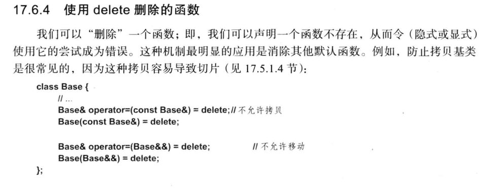
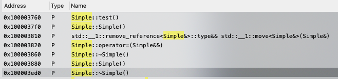
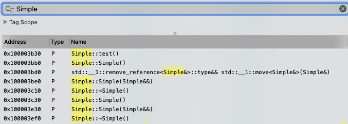
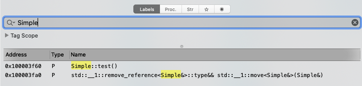

*声明：本篇分析基于macOS的clang 12.0.0版本(`Apple clang version 12.0.0 (clang-1200.0.32.2)`)。Windows的MSVC编译器生成的代码中实在是有太多安全检测代码，严重影响代码分析。汇编代码使用了 `Hopper Disassembler.app` 免费版本*

# = delete 到底意味着什么？

基于以下代码进行测试：

```cpp
class Simple {
public:
    Simple();
    ~Simple();
    void test();

//private:
    int mem1;
};

Simple::Simple()
    : mem1(0x6666)
{
}

Simple::~Simple()
{
}

void Simple::test() {
}


int main()
{
    Simple s;
    s.test();
    Simple s2(s);
    s2.mem1 = 2;
    s2.test();
}

```

根据生成的汇编代码看，声明一个函数为delete，并不会有什么影响。下面是汇编代码：

```asm

        ; Section __text
        ; Range: [0x100003de0; 0x100003f6b[ (395 bytes)
        ; File offset : [15840; 16235[ (395 bytes)
        ; Flags: 0x80000400
        ;   S_REGULAR
        ;   S_ATTR_PURE_INSTRUCTIONS
        ;   S_ATTR_SOME_INSTRUCTIONS


        ; ================ B E G I N N I N G   O F   P R O C E D U R E ================

        ; Variables:
        ;    var_8: int64_t, -8


                     __ZN6SimpleC2Ev:        // Simple::Simple()
0000000100003de0         push       rbp                                         ; CODE XREF=__ZN6SimpleC1Ev+16
0000000100003de1         mov        rbp, rsp
0000000100003de4         mov        qword [rbp+var_8], rdi
0000000100003de8         mov        rax, qword [rbp+var_8]
0000000100003dec         mov        dword [rax], 0x6666
0000000100003df2         pop        rbp
0000000100003df3         ret
                        ; endp
0000000100003df4         align      512


        ; ================ B E G I N N I N G   O F   P R O C E D U R E ================

        ; Variables:
        ;    var_8: int64_t, -8


                     __ZN6SimpleC1Ev:        // Simple::Simple()
0000000100003e00         push       rbp                                         ; CODE XREF=_main+19
0000000100003e01         mov        rbp, rsp
0000000100003e04         sub        rsp, 0x10
0000000100003e08         mov        qword [rbp+var_8], rdi
0000000100003e0c         mov        rdi, qword [rbp+var_8]
0000000100003e10         call       __ZN6SimpleC2Ev                             ; Simple::Simple()
0000000100003e15         add        rsp, 0x10
0000000100003e19         pop        rbp
0000000100003e1a         ret
                        ; endp
0000000100003e1b         align      32
```

以及 main 函数：

```asm


        ; ================ B E G I N N I N G   O F   P R O C E D U R E ================

        ; Variables:
        ;    var_8: int32_t, -8
        ;    var_18: int32_t, -24
        ;    var_20: int64_t, -32


                     _main:
0000000100003ee0         push       rbp
0000000100003ee1         mov        rbp, rsp
0000000100003ee4         sub        rsp, 0x20
0000000100003ee8         lea        rax, qword [rbp+var_8]
0000000100003eec         mov        rdi, rax
0000000100003eef         mov        qword [rbp+var_20], rax
0000000100003ef3         call       __ZN6SimpleC1Ev                             ; Simple::Simple()
0000000100003ef8         mov        rdi, qword [rbp+var_20]                     ; Begin of try block (catch block at 0x100003f3b)
0000000100003efc         call       __ZN6Simple4testEv                          ; Simple::test()
0000000100003f01         jmp        loc_100003f06                               ; End of try block started at 0x100003ef8

                     loc_100003f06:
0000000100003f06         mov        eax, dword [rbp+var_8]                      ; CODE XREF=_main+33
0000000100003f09         mov        dword [rbp+var_18], eax
0000000100003f0c         mov        dword [rbp+var_18], 0x2
0000000100003f13         lea        rdi, qword [rbp+var_18]                     ; Begin of try block (catch block at 0x100003f47)
0000000100003f17         call       __ZN6Simple4testEv                          ; Simple::test()
0000000100003f1c         jmp        loc_100003f21                               ; End of try block started at 0x100003f13, Begin of try block

                     loc_100003f21:
0000000100003f21         lea        rdi, qword [rbp+var_18]                     ; CODE XREF=_main+60
0000000100003f25         call       __ZN6SimpleD1Ev                             ; Simple::~Simple()
0000000100003f2a         lea        rdi, qword [rbp+var_8]
0000000100003f2e         call       __ZN6SimpleD1Ev                             ; Simple::~Simple()
0000000100003f33         xor        eax, eax
0000000100003f35         add        rsp, 0x20
0000000100003f39         pop        rbp
0000000100003f3a         ret
                        ; endp
0000000100003f3b         mov        qword [rbp-0x10], rax                       ; Begin of catch block for try block at 0x100003ef8
0000000100003f3f         mov        dword [rbp-0x14], edx
0000000100003f42         jmp        _main+119
0000000100003f47         mov        qword [rbp-0x10], rax                       ; Begin of catch block for try block at 0x100003f13
0000000100003f4b         mov        dword [rbp-0x14], edx
0000000100003f4e         lea        rdi, qword [rbp-0x18]
0000000100003f52         call       __ZN6SimpleD1Ev                             ; Simple::~Simple()
0000000100003f57         lea        rdi, qword [rbp-8]                          ; CODE XREF=_main+98
0000000100003f5b         call       __ZN6SimpleD1Ev                             ; Simple::~Simple()
```


参考C++之父的书 《C++程序设计语言》（第四版）的17.6.4，描述的:



除此之外，还有模版编程中，声明某一类参数实例化不被允许，以及某一种类型的隐式转换不被允许。

但是，使用delete删除的函数，与未声明的函数还是有差异的：前者编译器会发现试图使用delete的函数而报错，而后者编译器会寻找替代方法，比如不掉用析构函数，或者使用全局的operator new。

```c++
class Simple {
public:
    void test();

private:
    int mem1;
};
```

如果是以上代码，最终生成的汇编中，`Simple` 类只有 `test()` 函数的实现。

以上是 `= delete`的说明。下面看`= default`的。

# = default 意味着什么？

按照C++的语法，默认情况下，编译器会为一个类生成：

- 默认构造函数：X()
- 拷贝构造函数：X(const X&)
- 拷贝赋值操作运算符：X& operator=(const X&)
- 移动构造函数：X(X&&)
- 移动赋值操作运算符：X& operator=(X&&)
- 析构函数: ~X()

$$
*from 《《C++程序设计语言》（第四版）的 17.6*
$$

但是只要用户声明了其中部分函数，那么对应的操作就不会生成了：

- 如果程序员声明了任意构造函数，那么就不会生成默认构造函数了。
- 如果程序员声明了拷贝，移动或者析构函数，则编译器就不会为该类生成拷贝，移动操作或者析构函数了。

按照C++之父的说法，声明 `= default` 是为了恢复被禁止生成的函数的。一般情况下，使用 `= default` 生成的函数，比自己写的实现的更好。

测试中还发现
- 如果 `Simple` 类中没有类对象，那么 `Simple` 也不会生成构造函数和析构函数。只要 `Simple` 包含了类对象，才会生成构造函数和析构函数。
- 如果 `Simple` 包含了类对象，但是没有地方对 `Simple` 对象进行移动操作，默认不会生成移动赋值运算符。同理，移动构造函数也是一样。

比如：

## Case 1

```c++
#include <string>
class Simple {
public:
    void test();
    std::string c;
};

int main()
{
    Simple s;
    s.test();
    Simple s3;
    s3 = std::move(s);
}
```

最终生成的代码中，编译器为 `Simple` 类生成了 



如果改成：

## Case 2

```C++
#include <string>
class Simple {
public:
    void test();
    std::string c;
};
int main()
{
    Simple s;
    s.test();
    Simple s2(std::move(s));
}
```

对应的汇编代码是：



对比二者，前面的那个代码中没有用到移动构造函数，所以没有生成Move Constructor，只有Move Assignment Constructor。后面这个代码中没有用到移动赋值运算符，所以没有生成 Move Assignment Operator，只有 Move Constructor.

如果 `Simple` 类中没有类对象：

## Case 3

```C++
class Simple {
public:
    void test();
    int c;
};
int main()
{
    Simple s;
    s.test();
    Simple s2(std::move(s));
}
```

对应的汇编中：



只有一个 `Simple::test()` 实现。不论是否把 `Simple` 的哪个方法声明为 `= default` 都不会有什么改变。


