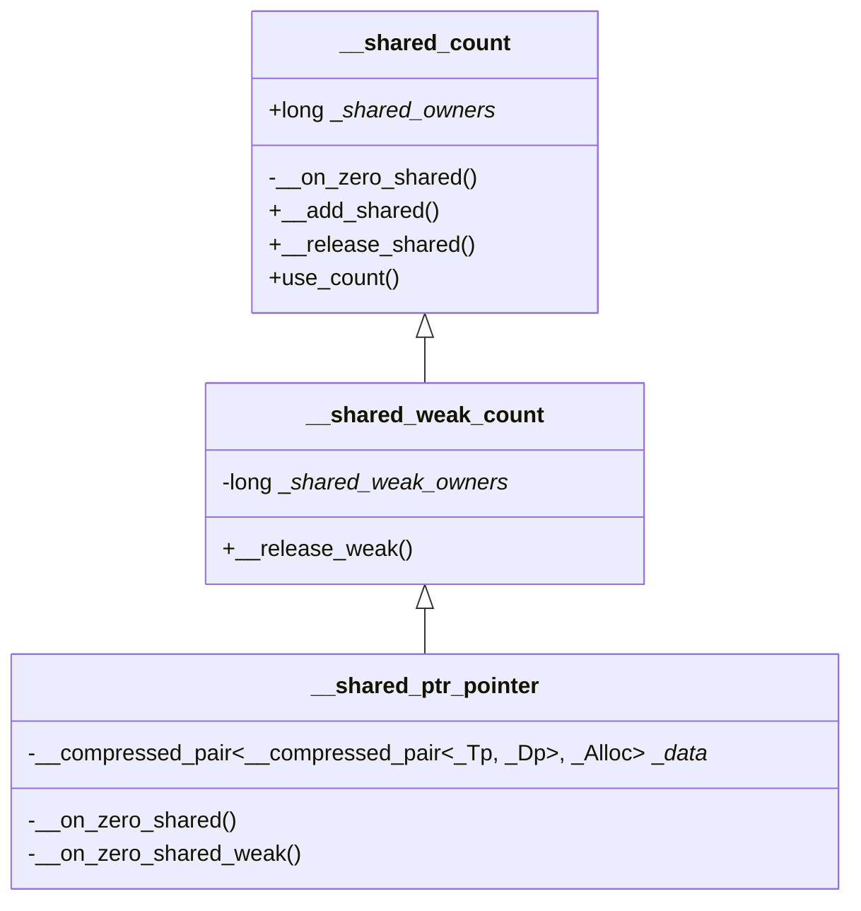

*分析的源码对应的是 `Xcode 12.0.1` 中 `llvm` 关于 `libc++` 的实现，对应 `clang` 版本 `Apple clang version 12.0.0 (clang-1200.0.32.2)`。`llvm` 源码[地址](https://github.com/llvm/llvm-project)，及 `llvm` [下载地址汇总](https://releases.llvm.org/download.html)。`libc++` 的[文档](https://releases.llvm.org/16.0.0/projects/libcxx/docs/index.html)*

[toc]

*代码分析的思路是，按照 [cppreference.com](https://en.cppreference.com/) 网站上列出的智能指针接口顺序，依据 llvm 中的源代码，借助 copilot 的帮助，分类别、按序分析。*
*clang 版本信息与 `Xcode` 对应关系参考[这里](https://gist.github.com/yamaya/2924292)*
*C++的标准文档，可以在这里下载对应的草案：[C++ Standards Committee Papers](https://www.open-std.org/JTC1/SC22/WG21/docs/papers/)，搜索 `Working Draft, Standard for Programming Language C++` 找到*

# 支持的操作

参考 [std::shared_ptr](https://en.cppreference.com/w/cpp/memory/shared_ptr/shared_ptr) 中的介绍：

成员函数：

- constructor
- destructor
- operator=
- reset
- swap
- get
- operator*,->
- operator[] (C++ 17)
- use_count
- unique (C++20)
- operator bool
- owner_before
- ...

非成员函数：

- make_shared & make_shared_for_overwrite
- allocate_shared & allocate_shared_for_overwrite
- static_pointer_cast, dynamic_pointer_cast, const_pointer_cast, reinterpret_pointer_cast (C++ 17)
- get_deleter
- operator==, !=, <, <=, >, >=, <=> (部分操作从C++20中删除了，<=> 从 C++20开始支持)
- operator <<
- std::swap
- `std::atomic<std::shared_ptr>`
- `std::hash<std::shared_ptr>`

`std::shared_ptr` 在 `llvm` 的 `release/16.x` 分支中单独放在了一个文件中，比 `release/12.x` 的好阅读多了。

`std::shared_ptr` 用来保存一个（一般情况下）通过new得到的指针，实现了一个共享所有权的语义，最后一个拥有该指针的对象销毁时才会释放指针所指向的资源。

在 `memory` 文件中有一个简化版本的接口：

```C++
template<class T>
class shared_ptr
{
public:
    typedef T element_type;
    typedef weak_ptr<T> weak_type; // C++17

    // constructors:
    constexpr shared_ptr() noexcept;
    template<class Y> explicit shared_ptr(Y* p);
    template<class Y, class D> shared_ptr(Y* p, D d);
    template<class Y, class D, class A> shared_ptr(Y* p, D d, A a);
    template <class D> shared_ptr(nullptr_t p, D d);
    template <class D, class A> shared_ptr(nullptr_t p, D d, A a);
    template<class Y> shared_ptr(const shared_ptr<Y>& r, T *p) noexcept;
    shared_ptr(const shared_ptr& r) noexcept;
    template<class Y> shared_ptr(const shared_ptr<Y>& r) noexcept;
    shared_ptr(shared_ptr&& r) noexcept;
    template<class Y> shared_ptr(shared_ptr<Y>&& r) noexcept;
    template<class Y> explicit shared_ptr(const weak_ptr<Y>& r);
    template<class Y> shared_ptr(auto_ptr<Y>&& r);          // removed in C++17
    template <class Y, class D> shared_ptr(unique_ptr<Y, D>&& r);
    shared_ptr(nullptr_t) : shared_ptr() { }

    // destructor:
    ~shared_ptr();

    // assignment:
    shared_ptr& operator=(const shared_ptr& r) noexcept;
    template<class Y> shared_ptr& operator=(const shared_ptr<Y>& r) noexcept;
    shared_ptr& operator=(shared_ptr&& r) noexcept;
    template<class Y> shared_ptr& operator=(shared_ptr<Y>&& r);
    template<class Y> shared_ptr& operator=(auto_ptr<Y>&& r); // removed in C++17
    template <class Y, class D> shared_ptr& operator=(unique_ptr<Y, D>&& r);

    // modifiers:
    void swap(shared_ptr& r) noexcept;
    void reset() noexcept;
    template<class Y> void reset(Y* p);
    template<class Y, class D> void reset(Y* p, D d);
    template<class Y, class D, class A> void reset(Y* p, D d, A a);

    // observers:
    T* get() const noexcept;
    T& operator*() const noexcept;
    T* operator->() const noexcept;
    long use_count() const noexcept;
    bool unique() const noexcept;
    explicit operator bool() const noexcept;
    template<class U> bool owner_before(shared_ptr<U> const& b) const noexcept;
    template<class U> bool owner_before(weak_ptr<U> const& b) const noexcept;
};

// shared_ptr comparisons:
template<class T, class U>
    bool operator==(shared_ptr<T> const& a, shared_ptr<U> const& b) noexcept;
template<class T, class U>
    bool operator!=(shared_ptr<T> const& a, shared_ptr<U> const& b) noexcept;
template<class T, class U>
    bool operator<(shared_ptr<T> const& a, shared_ptr<U> const& b) noexcept;
template<class T, class U>
    bool operator>(shared_ptr<T> const& a, shared_ptr<U> const& b) noexcept;
template<class T, class U>
    bool operator<=(shared_ptr<T> const& a, shared_ptr<U> const& b) noexcept;
template<class T, class U>
    bool operator>=(shared_ptr<T> const& a, shared_ptr<U> const& b) noexcept;

template <class T>
    bool operator==(const shared_ptr<T>& x, nullptr_t) noexcept;
template <class T>
    bool operator==(nullptr_t, const shared_ptr<T>& y) noexcept;
template <class T>
    bool operator!=(const shared_ptr<T>& x, nullptr_t) noexcept;
template <class T>
    bool operator!=(nullptr_t, const shared_ptr<T>& y) noexcept;
template <class T>
    bool operator<(const shared_ptr<T>& x, nullptr_t) noexcept;
template <class T>
bool operator<(nullptr_t, const shared_ptr<T>& y) noexcept;
template <class T>
    bool operator<=(const shared_ptr<T>& x, nullptr_t) noexcept;
template <class T>
    bool operator<=(nullptr_t, const shared_ptr<T>& y) noexcept;
template <class T>
    bool operator>(const shared_ptr<T>& x, nullptr_t) noexcept;
template <class T>
    bool operator>(nullptr_t, const shared_ptr<T>& y) noexcept;
template <class T>
    bool operator>=(const shared_ptr<T>& x, nullptr_t) noexcept;
template <class T>
    bool operator>=(nullptr_t, const shared_ptr<T>& y) noexcept;

// shared_ptr specialized algorithms:
template<class T> void swap(shared_ptr<T>& a, shared_ptr<T>& b) noexcept;

// shared_ptr casts:
template<class T, class U>
    shared_ptr<T> static_pointer_cast(shared_ptr<U> const& r) noexcept;
template<class T, class U>
    shared_ptr<T> dynamic_pointer_cast(shared_ptr<U> const& r) noexcept;
template<class T, class U>
    shared_ptr<T> const_pointer_cast(shared_ptr<U> const& r) noexcept;

// shared_ptr I/O:
template<class E, class T, class Y>
    basic_ostream<E, T>& operator<< (basic_ostream<E, T>& os, shared_ptr<Y> const& p);

// shared_ptr get_deleter:
template<class D, class T> D* get_deleter(shared_ptr<T> const& p) noexcept;

template<class T, class... Args>
    shared_ptr<T> make_shared(Args&&... args);
template<class T, class A, class... Args>
    shared_ptr<T> allocate_shared(const A& a, Args&&... args);
```

# 具体分析

在具体分析前，需要了解一个异常类：`bad_weak_ptr`，其实现如下：

```C++
class _LIBCPP_EXCEPTION_ABI bad_weak_ptr
    : public std::exception
{
public:
    virtual ~bad_weak_ptr() _NOEXCEPT;
    virtual const char* what() const  _NOEXCEPT;
};
```

与之关联的是一个函数：

```C++
_LIBCPP_NORETURN inline _LIBCPP_INLINE_VISIBILITY
void __throw_bad_weak_ptr()
{
#ifndef _LIBCPP_NO_EXCEPTIONS
    throw bad_weak_ptr();
#else
    _VSTD::abort();
#endif
}
```

会在后面介绍 `shared_ptr` 构造函数的时候用到。

## 新建对象

### make_shared & make_shared_for_overwrite

### make_shared

在 `release/12.x` 分支上，`make_shared` 实现如下：

```C++
template<class _Tp, class ..._Args>
inline _LIBCPP_INLINE_VISIBILITY
typename enable_if
<
    !is_array<_Tp>::value,
    shared_ptr<_Tp>
>::type
make_shared(_Args&& ...__args)
{
    static_assert(is_constructible<_Tp, _Args...>::value, "Can't construct object in make_shared");
    typedef __shared_ptr_emplace<_Tp, allocator<_Tp> > _CntrlBlk;
    typedef allocator<_CntrlBlk> _A2;
    typedef __allocator_destructor<_A2> _D2;

    _A2 __a2;
    unique_ptr<_CntrlBlk, _D2> __hold2(__a2.allocate(1), _D2(__a2, 1));
    ::new(__hold2.get()) _CntrlBlk(__a2, _VSTD::forward<_Args>(__args)...);

    _Tp *__ptr = __hold2.get()->get();
    return shared_ptr<_Tp>::__create_with_control_block(__ptr, __hold2.release());
}

template<class _Yp, class _CntrlBlk>
static shared_ptr<_Tp>
__create_with_control_block(_Yp* __p, _CntrlBlk* __cntrl)
{
    shared_ptr<_Tp> __r;
    __r.__ptr_ = __p;
    __r.__cntrl_ = __cntrl;
    __r.__enable_weak_this(__r.__ptr_, __r.__ptr_);
    return __r;
}
```

这个函数模版支持可变参数，申请一个 `_Tp` 类型的指针对象。同时还要保证 `_Tp` 不是数组类型。

其中的实现，用了 `unique_ptr` 保存控制模块 `_CntrlBlk`，控制模块用来保存引用计数，以及管理对象。

在 `llvm` 的 `release/16.x` 分支中，`make_shared` 就是直接调用下面的 `allocate_shared` 方法。

#### `allocator<T>`

看到这里，不得不先看一下 `allocator<Tp>` 这个标准库提供的默认内存管理器模版类了。以下是简化版本的代码：

```C++
template <>
class allocator<void>
{
public:
    typedef void*                                 pointer;
    typedef const void*                           const_pointer;
    typedef void                                  value_type;

    template <class _Up> struct rebind {typedef allocator<_Up> other;};
};

template <class T>
class allocator
{
public:
    typedef size_t                                size_type;
    typedef ptrdiff_t                             difference_type;
    typedef T*                                    pointer;
    typedef const T*                              const_pointer;
    typedef typename add_lvalue_reference<T>::type       reference;
    typedef typename add_lvalue_reference<const T>::type const_reference;
    typedef T                                     value_type;

    template <class U> struct rebind {typedef allocator<U> other;};

    constexpr allocator() noexcept;                      // constexpr in C++20
    constexpr allocator(const allocator&) noexcept;      // constexpr in C++20
    template <class U>
      constexpr allocator(const allocator<U>&) noexcept; // constexpr in C++20
    ~allocator();
    pointer address(reference x) const noexcept;
    const_pointer address(const_reference x) const noexcept;
    pointer allocate(size_type, allocator<void>::const_pointer hint = 0);
    void deallocate(pointer p, size_type n) noexcept;
    size_type max_size() const noexcept;
    template<class U, class... Args>
        void construct(U* p, Args&&... args);
    template <class U>
        void destroy(U* p);
};

template <class T, class U>
bool operator==(const allocator<T>&, const allocator<U>&) noexcept;

template <class T, class U>
bool operator!=(const allocator<T>&, const allocator<U>&) noexcept;
```

具体实现中还有一个 `完全特化` 版本（void 类型）。

实际实现的时候，不仅有 `void` 类型的特化版本，还有 `const void` 类型的特化版本。而专门针对 `void` 类型做特化，是因为 `void` 类型不允许计算长度，也没有定义长度。比如 `sizeof(viod)` 就会被编译器报错。

**Q：C++模版编程中的 `完全特化` 是什么概念?
A: copilot 的回答：**

```C++
在C++模板编程中，"完全特化"是指为模板提供一个特殊版本，该版本适用于一组特定的模板参数。完全特化版本的模板参数是固定的，不再是变量。

例如，我们有一个模板函数：

template <typename T>
void foo(T t) {
    // 通用实现
}

我们可以为特定类型（如int）提供一个完全特化的版本：

template <>
void foo<int>(int t) {
    // 针对 int 的特化实现
}

在这个例子中，foo<int>就是foo模板的一个完全特化版本。当我们调用foo(42)（42是int类型）时，编译器会选择使用完全特化的版本，而不是通用版本。
同样的概念也适用于模板类。我们可以为模板类提供完全特化的版本，以改变模板类在特定类型下的行为。

模版类的例子：

template <typename T>
class MyClass {
    // 原始模板的实现
};

template <> // 特征
class MyClass<特定类型> {
    // 特化版本的实现
};
```


**Q：C++模版编程中的偏特化，或者说部分特化是什么概念
A：copilot的回答：**

```C++
在C++模板编程中，偏特化（partial specialization）是一种针对模板类或模板函数的特殊实例化方式。与完全特化不同，偏特化允许我们对部分模板参数进行定制化的实现。

偏特化是指在模板定义时，为部分模板参数提供特化版本的实现。它允许我们根据模板参数的某些特性或范围，提供不同的实现方式。通过偏特化，我们可以将模板的行为按照不同的模式进行定制。

在C++中，有两种类型的偏特化：类模板偏特化和函数模板偏特化。

类模板偏特化：

template <typename T, typename U>
class MyClass {
    // 原始模板的实现
};

template <typename U>
class MyClass<int, U> {
    // 针对第一个模板参数为int的特化版本的实现
};

template <typename T>
class MyClass<T, double> {
    // 针对第二个模板参数为double的特化版本的实现
};

在上面的例子中，我们为类模板 MyClass 提供了两个偏特化版本。第一个偏特化版本是针对第一个模板参数为 int 的情况，第二个偏特化版本是针对第二个模板参数为 double 的情况。这样，在使用 MyClass 时，如果模板参数匹配了偏特化版本，编译器会优先选择偏特化版本进行实例化。

函数模板偏特化：

template <typename T>
void myFunction(T t) {
    // 原始模板的实现
}

template <typename T>
void myFunction<T*>(T* t) {
    // 针对指针类型的特化版本的实现
}

template <typename T>
void myFunction<T&>(T& t) {
    // 针对引用类型的特化版本的实现
}

在上面的例子中，我们为函数模板 myFunction 提供了两个偏特化版本。第一个偏特化版本是针对指针类型的情况，第二个偏特化版本是针对引用类型的情况。这样，在调用 myFunction 时，如果参数的类型匹配了偏特化版本，编译器会优先选择偏特化版本进行实例化。

通过偏特化，我们可以根据不同的模板参数提供不同的实现，以满足特定的需求。它在C++模板编程中非常有用，可以增强模板的灵活性和适用性。
```

接着分析 `allocator` 的代码，重点关注 `shared_ptr` 中用到的 `allocate` 和 `deallocate` 方法：

```C++
_LIBCPP_INLINE_VISIBILITY pointer allocate(size_type __n, allocator<void>::const_pointer = 0)
{
    if (__n > max_size())
        __throw_length_error("allocator<const T>::allocate(size_t n)"
                                " 'n' exceeds maximum supported size");
    return static_cast<pointer>(_VSTD::__libcpp_allocate(__n * sizeof(_Tp), _LIBCPP_ALIGNOF(_Tp)));
}

_LIBCPP_INLINE_VISIBILITY void deallocate(pointer __p, size_type __n) _NOEXCEPT
    {_VSTD::__libcpp_deallocate((void*) const_cast<_Tp *>(__p), __n * sizeof(_Tp), _LIBCPP_ALIGNOF(_Tp));}
```

注意这里的 `__libcpp_allocate` 最终调用的就是全局的 `::operator new`；`__libcpp_deallocate` 最终调用的是 `::operator delete(__ptr);`。

`_LIBCPP_ALIGNOF` 就是 `alignof` 操作符的别名。

**Q：c++ alignof vs sizeof
A：copilot 回答：**
```C++
在C++中，alignof 和 sizeof 是两个不同的操作符，用于获取类型的对齐要求和大小。

sizeof 操作符用于获取给定类型或表达式所占用的内存大小（以字节为单位）。它返回一个 size_t 类型的值，表示类型的实际大小。sizeof 是一个编译时操作符，它在编译期间计算出类型的大小，因此它可以用于静态类型的大小计算。
例如，对于以下的类型：

struct MyStruct {
    int a;
    double b;
    char c;
};

size_t size = sizeof(MyStruct);
size 的值将取决于编译器和平台的规定，可能是 16（以字节为单位），表示 MyStruct 的实际大小。

alignof 操作符用于获取给定类型的对齐要求。它返回一个 size_t 类型的值，表示类型的对齐要求。对齐要求是编译器为了性能和可移植性的考虑而规定的，要求该类型的变量在内存中的起始地址必须是某个特定的倍数。alignof 也是一个编译时操作符，它在编译期间获取类型的对齐要求。
例如，对于以上的 MyStruct 类型，可以使用 alignof 操作符获取它的对齐要求：

size_t alignment = alignof(MyStruct);
alignment 的值将取决于编译器和平台的规定，可能是 8（以字节为单位），表示 MyStruct 在内存中的起始地址必须是 8 的倍数。

总结来说，sizeof 用于获取类型的实际大小，而 alignof 用于获取类型的对齐要求。它们是不同的操作符，用于不同的目的。
```

从上面的分析可以看出，`std::allocator<T>` 就是对 `new/delete` 的一个封装。

关于 `std::allocator` 的用法：

```C++
// default allocator for ints
std::allocator<int> alloc1;

// demonstrating the few directly usable members
static_assert(std::is_same_v<int, decltype(alloc1)::value_type>);
int* p1 = alloc1.allocate(1); // space for one int
alloc1.deallocate(p1, 1);     // and it is gone

// Even those can be used through traits though, so no need
using traits_t1 = std::allocator_traits<decltype(alloc1)>; // The matching trait
p1 = traits_t1::allocate(alloc1, 1);
traits_t1::construct(alloc1, p1, 7);  // construct the int
std::cout << *p1 << '\n';
traits_t1::deallocate(alloc1, p1, 1); // deallocate space for one int
```
*<div align="right">from https://en.cppreference.com/w/cpp/memory/allocator：</div>*

返回来，我们接着看 `make_shared` 中使用到的 `shared_ptr` 的一个类方法 `__create_with_control_block`。

```C++
template<class _Yp, class _CntrlBlk>
static shared_ptr<_Tp>
__create_with_control_block(_Yp* __p, _CntrlBlk* __cntrl)
{
    shared_ptr<_Tp> __r;
    __r.__ptr_ = __p;
    __r.__cntrl_ = __cntrl;
    __r.__enable_weak_this(__r.__ptr_, __r.__ptr_);
    return __r;
}

template <class _Yp, class _OrigPtr>
    _LIBCPP_INLINE_VISIBILITY
    typename enable_if<is_convertible<_OrigPtr*,
                                        const enable_shared_from_this<_Yp>*
    >::value,
        void>::type
    __enable_weak_this(const enable_shared_from_this<_Yp>* __e,
                        _OrigPtr* __ptr) _NOEXCEPT
    {
        typedef typename remove_cv<_Yp>::type _RawYp;
        if (__e && __e->__weak_this_.expired())
        {
            __e->__weak_this_ = shared_ptr<_RawYp>(*this,
                const_cast<_RawYp*>(static_cast<const _Yp*>(__ptr)));
        }
    }
```

> `remove_cv` 是 `C++` 标准中一个工具函数，意在移除参数的 `const` 和 `volatile` 属性。

上面这个 `__ceate_with_control_block` 最终调用了 `__enable_weak_this`，这个函数保证了 ``。其中有一个参数：`enable_shared_from_this<_Yp>`，这个参数的作用是用来实现弱引用计数。

```C++
template<class _Tp>
class _LIBCPP_TEMPLATE_VIS enable_shared_from_this
{
    mutable weak_ptr<_Tp> __weak_this_;
protected:
    _LIBCPP_INLINE_VISIBILITY _LIBCPP_CONSTEXPR
    enable_shared_from_this() _NOEXCEPT {}
    _LIBCPP_INLINE_VISIBILITY
    enable_shared_from_this(enable_shared_from_this const&) _NOEXCEPT {}
    _LIBCPP_INLINE_VISIBILITY
    enable_shared_from_this& operator=(enable_shared_from_this const&) _NOEXCEPT
        {return *this;}
    _LIBCPP_INLINE_VISIBILITY
    ~enable_shared_from_this() {}
public:
    _LIBCPP_INLINE_VISIBILITY
    shared_ptr<_Tp> shared_from_this()
        {return shared_ptr<_Tp>(__weak_this_);}
    _LIBCPP_INLINE_VISIBILITY
    shared_ptr<_Tp const> shared_from_this() const
        {return shared_ptr<const _Tp>(__weak_this_);}

#if _LIBCPP_STD_VER > 14
    _LIBCPP_INLINE_VISIBILITY
    weak_ptr<_Tp> weak_from_this() _NOEXCEPT
       { return __weak_this_; }

    _LIBCPP_INLINE_VISIBILITY
    weak_ptr<const _Tp> weak_from_this() const _NOEXCEPT
        { return __weak_this_; }
#endif // _LIBCPP_STD_VER > 14

    template <class _Up> friend class shared_ptr;
};
```

这个类将 `shared_ptr` 声明为友元类，允许 `shared_ptr` 访问其私有成员。

`is_convertible` 定义如下：

```C++
#if __has_feature(is_convertible_to) && !defined(_LIBCPP_USE_IS_CONVERTIBLE_FALLBACK)

template <class _T1, class _T2> struct _LIBCPP_TEMPLATE_VIS is_convertible
    : public integral_constant<bool, __is_convertible_to(_T1, _T2)> {};

#else  // __has_feature(is_convertible_to)
```

**Q：__is_convertible_to 定义在哪个文件中？**
**A: Bito的回答：**
> __is_convertible_to 并不是标准 C++ 中定义的函数或类型，而是一种编译器内部的实现细节。不同的编译器可能会有不同的命名规则和具体实现方式。
> 
> 在某些编译器中，__is_convertible_to 可能是作为一种编译器内部的辅助工具，用于实现类型特性检查，例如 std::is_convertible。具体的实现可能位于编译器的标准库或其他系统库中，如 <type_traits> 或 <typeinfo> 等。
> 
> 然而，由于 __is_convertible_to 是编译器内部的实现细节，对于用户来说是不可见的，也不应该直接使用。在编写 C++ 代码时，应该使用标准库提供的类型特性工具，如 std::is_convertible，而不是依赖于编译器的内部实现。这样可以保证代码的可移植性和标准性。
> 

### make_shared_for_overwrite

`make_shared_for_overwrite` 在 `clang 12.0.0` 里没有定义，在 `llvm` 的 `release 16.x` 中是有的：

```C++
template<class _Tp, __enable_if_t<!is_array<_Tp>::value, int> = 0>
_LIBCPP_HIDE_FROM_ABI
shared_ptr<_Tp> make_shared_for_overwrite()
{
    return std::allocate_shared_for_overwrite<_Tp>(allocator<_Tp>());
}

template<class _Tp, __enable_if_t<is_bounded_array<_Tp>::value, int> = 0>
_LIBCPP_HIDE_FROM_ABI
shared_ptr<_Tp> make_shared_for_overwrite()
{
    return std::__allocate_shared_bounded_array<_Tp>(allocator<__for_overwrite_tag>());
}

template<class _Tp, __enable_if_t<is_unbounded_array<_Tp>::value, int> = 0>
_LIBCPP_HIDE_FROM_ABI
shared_ptr<_Tp> make_shared_for_overwrite(size_t __n)
{
    return std::__allocate_shared_unbounded_array<_Tp>(allocator<__for_overwrite_tag>(), __n);
}
```

TODO：分析 C++ 20的这个方法。

### allocate_shared & allocate_shared_for_overwrite

`allocate_shared` 是一个全局方法，不过具体实现还是调用了 `shared_ptr` 的类方法 ``：

```C++
声明：
template<class _Alloc, class ..._Args>
    static
    shared_ptr<_Tp>
    allocate_shared(const _Alloc& __a, _Args&& ...__args);

定义：
template<class _Tp, class _Alloc, class ..._Args>
inline _LIBCPP_INLINE_VISIBILITY
typename enable_if
<
    !is_array<_Tp>::value,
    shared_ptr<_Tp>
>::type
allocate_shared(const _Alloc& __a, _Args&& ...__args)
{
    return shared_ptr<_Tp>::allocate_shared(__a, _VSTD::forward<_Args>(__args)...);
}

实现细节：
template<class _Tp>
template<class _Alloc, class ..._Args>
shared_ptr<_Tp>
shared_ptr<_Tp>::allocate_shared(const _Alloc& __a, _Args&& ...__args)
{
    static_assert( is_constructible<_Tp, _Args...>::value, "Can't construct object in allocate_shared" );
    typedef __shared_ptr_emplace<_Tp, _Alloc> _CntrlBlk;
    typedef typename __allocator_traits_rebind<_Alloc, _CntrlBlk>::type _A2;
    typedef __allocator_destructor<_A2> _D2;
    _A2 __a2(__a);
    unique_ptr<_CntrlBlk, _D2> __hold2(__a2.allocate(1), _D2(__a2, 1));
    ::new(static_cast<void*>(_VSTD::addressof(*__hold2.get())))
        _CntrlBlk(__a, _VSTD::forward<_Args>(__args)...);
    shared_ptr<_Tp> __r;
    __r.__ptr_ = __hold2.get()->get();
    __r.__cntrl_ = _VSTD::addressof(*__hold2.release());
    __r.__enable_weak_this(__r.__ptr_, __r.__ptr_);
    return __r;
}
```

可以看出， `allocate_shared` 的实现与 `make_shared` 的用法十分接近，也难怪 `llvm` 的 `release/16.x` 中代码优化成了一个实现。

`std::allocate_shared` 用法如下：
 
```C++
std::shared_ptr<Base> ssp2 = std::allocate_shared<Base>(std::allocator<Base>(), 2);
```

`allocate_shared_for_overwrite` 是 C++ 20中新增的。

TODO: 

### constructor & destructor

```C++
    // 默认构造函数
    _LIBCPP_INLINE_VISIBILITY
    _LIBCPP_CONSTEXPR shared_ptr() _NOEXCEPT;

    // 接受一个 nullptr 作为初始化参数的构造函数
    _LIBCPP_INLINE_VISIBILITY
    _LIBCPP_CONSTEXPR shared_ptr(nullptr_t) _NOEXCEPT;

    // 接受一个派生类指针
    template<class _Yp>
        explicit shared_ptr(_Yp* __p,
                            typename enable_if<is_convertible<_Yp*, element_type*>::value, __nat>::type = __nat());
    
    // 接受一个派生类指针，同时允许制定删除器
    template<class _Yp, class _Dp>
        shared_ptr(_Yp* __p, _Dp __d,
                   typename enable_if<is_convertible<_Yp*, element_type*>::value, __nat>::type = __nat());

    // 接受一个派生类指针，同时允许制定删除器和内存申请类
    template<class _Yp, class _Dp, class _Alloc>
        shared_ptr(_Yp* __p, _Dp __d, _Alloc __a,
                   typename enable_if<is_convertible<_Yp*, element_type*>::value, __nat>::type = __nat());

    // 上面二者的特例，对应指针为 nullptr_t 类型。
    template <class _Dp> shared_ptr(nullptr_t __p, _Dp __d);
    template <class _Dp, class _Alloc> shared_ptr(nullptr_t __p, _Dp __d, _Alloc __a);

    // 保存一个指针，同时与 r 共享所有权
    template<class _Yp> _LIBCPP_INLINE_VISIBILITY shared_ptr(const shared_ptr<_Yp>& __r, element_type* __p) _NOEXCEPT;

    // 拷贝构造函数
    _LIBCPP_INLINE_VISIBILITY
    shared_ptr(const shared_ptr& __r) _NOEXCEPT;

    template<class _Yp>
        _LIBCPP_INLINE_VISIBILITY
        shared_ptr(const shared_ptr<_Yp>& __r,
                   typename enable_if<is_convertible<_Yp*, element_type*>::value, __nat>::type = __nat())
                       _NOEXCEPT;
#ifndef _LIBCPP_HAS_NO_RVALUE_REFERENCES
    // 移动构造函数：同类型版本
    _LIBCPP_INLINE_VISIBILITY
    shared_ptr(shared_ptr&& __r) _NOEXCEPT;

    // 移动构造函数：派生类版本
    template<class _Yp> _LIBCPP_INLINE_VISIBILITY  shared_ptr(shared_ptr<_Yp>&& __r,
                   typename enable_if<is_convertible<_Yp*, element_type*>::value, __nat>::type = __nat())
                       _NOEXCEPT;
#endif  // _LIBCPP_HAS_NO_RVALUE_REFERENCES

    // 通过 weak_ptr 来构造
    template<class _Yp> explicit shared_ptr(const weak_ptr<_Yp>& __r,
                   typename enable_if<is_convertible<_Yp*, element_type*>::value, __nat>::type= __nat());
#if _LIBCPP_STD_VER <= 14 || defined(_LIBCPP_ENABLE_CXX17_REMOVED_AUTO_PTR)
#ifndef _LIBCPP_HAS_NO_RVALUE_REFERENCES
    // 通过 auto_ptr 移动构造 shared_ptr
    template<class _Yp>
        shared_ptr(auto_ptr<_Yp>&& __r,
                   typename enable_if<is_convertible<_Yp*, element_type*>::value, __nat>::type = __nat());
#else
    // 通过 auto_ptr 拷贝构造 shared_ptr
    template<class _Yp>
        shared_ptr(auto_ptr<_Yp> __r,
                   typename enable_if<is_convertible<_Yp*, element_type*>::value, __nat>::type = __nat());
#endif
#endif
#ifndef _LIBCPP_HAS_NO_RVALUE_REFERENCES
    // 通过 unique_ptr 移动构造 shared_ptr：非右值引用 && 非数组 版本
    template <class _Yp, class _Dp>
        shared_ptr(unique_ptr<_Yp, _Dp>&&,
                   typename enable_if
                   <
                       !is_lvalue_reference<_Dp>::value &&
                       !is_array<_Yp>::value &&
                       is_convertible<typename unique_ptr<_Yp, _Dp>::pointer, element_type*>::value,
                       __nat
                   >::type = __nat());
    // 通过unique_ptr 移动构造 shared_ptr：右值引用 && 非数组 版本
    template <class _Yp, class _Dp>
        shared_ptr(unique_ptr<_Yp, _Dp>&&,
                   typename enable_if
                   <
                       is_lvalue_reference<_Dp>::value &&
                       !is_array<_Yp>::value &&
                       is_convertible<typename unique_ptr<_Yp, _Dp>::pointer, element_type*>::value,
                       __nat
                   >::type = __nat());
#else  // _LIBCPP_HAS_NO_RVALUE_REFERENCES
    // 通过 unique_ptr 拷贝构造 shared_ptr：非右值引用 && 非数组 版本
    template <class _Yp, class _Dp>
        shared_ptr(unique_ptr<_Yp, _Dp>,
                   typename enable_if
                   <
                       !is_lvalue_reference<_Dp>::value &&
                       !is_array<_Yp>::value &&
                       is_convertible<typename unique_ptr<_Yp, _Dp>::pointer, element_type*>::value,
                       __nat
                   >::type = __nat());
    // 通过 unique_ptr 拷贝构造 shared_ptr：右值引用 && 非数组 版本
    template <class _Yp, class _Dp>
        shared_ptr(unique_ptr<_Yp, _Dp>,
                   typename enable_if
                   <
                       is_lvalue_reference<_Dp>::value &&
                       !is_array<_Yp>::value &&
                       is_convertible<typename unique_ptr<_Yp, _Dp>::pointer, element_type*>::value,
                       __nat
                   >::type = __nat());
#endif  // _LIBCPP_HAS_NO_RVALUE_REFERENCES

    // 析构函数
    ~shared_ptr();

    // 拷贝赋值操作符
    _LIBCPP_INLINE_VISIBILITY
    shared_ptr& operator=(const shared_ptr& __r) _NOEXCEPT;
    template<class _Yp>
        typename enable_if
        <
            is_convertible<_Yp*, element_type*>::value,
            shared_ptr&
        >::type
        _LIBCPP_INLINE_VISIBILITY
        operator=(const shared_ptr<_Yp>& __r) _NOEXCEPT;
#ifndef _LIBCPP_HAS_NO_RVALUE_REFERENCES
    // 移动赋值操作符：同类型
    _LIBCPP_INLINE_VISIBILITY
    shared_ptr& operator=(shared_ptr&& __r) _NOEXCEPT;
    template<class _Yp>
        typename enable_if
        <
            is_convertible<_Yp*, element_type*>::value,
            shared_ptr<_Tp>&
        >::type
        _LIBCPP_INLINE_VISIBILITY
        operator=(shared_ptr<_Yp>&& __r);
#if _LIBCPP_STD_VER <= 14 || defined(_LIBCPP_ENABLE_CXX17_REMOVED_AUTO_PTR)
    // 基于 `auto_ptr` 的移动赋值操作符
    template<class _Yp>
        _LIBCPP_INLINE_VISIBILITY
        typename enable_if
        <
            !is_array<_Yp>::value &&
            is_convertible<_Yp*, element_type*>::value,
            shared_ptr
        >::type&
        operator=(auto_ptr<_Yp>&& __r);
#endif
#else  // _LIBCPP_HAS_NO_RVALUE_REFERENCES
#if _LIBCPP_STD_VER <= 14 || defined(_LIBCPP_ENABLE_CXX17_REMOVED_AUTO_PTR)
    // 基于 `auto_ptr` 的拷贝赋值操作符
    template<class _Yp>
        _LIBCPP_INLINE_VISIBILITY
        typename enable_if
        <
            !is_array<_Yp>::value &&
            is_convertible<_Yp*, element_type*>::value,
            shared_ptr&
        >::type
        operator=(auto_ptr<_Yp> __r);
#endif
#endif
    // 基于 `unique_ptr` 的移动赋值操作符和拷贝赋值操作符
    template <class _Yp, class _Dp>
        typename enable_if
        <
            !is_array<_Yp>::value &&
            is_convertible<typename unique_ptr<_Yp, _Dp>::pointer, element_type*>::value,
            shared_ptr&
        >::type
#ifndef _LIBCPP_HAS_NO_RVALUE_REFERENCES
        _LIBCPP_INLINE_VISIBILITY
        operator=(unique_ptr<_Yp, _Dp>&& __r);
#else  // _LIBCPP_HAS_NO_RVALUE_REFERENCES
        _LIBCPP_INLINE_VISIBILITY
        operator=(unique_ptr<_Yp, _Dp> __r);
#endif
```

可以看出，`shared_ptr` 的构造函数支持：

- 默认构造函数
- nullptr构造函数
- 支持派生类指针构造
- 支持指定删除器，内存申请器
- 移动构造函数，支持同类型和派生类类型
- 拷贝构造函数，支持同类型和派生类类型
- 基于 `weak_ptr` 的构造函数
- 基于 `auto_ptr` 的构造函数，移动构造函数，拷贝赋值操作符，和移动赋值操作符，C++ 17开始弃用
- 基于 `unique_ptr` 的移动构造函数，拷贝构造函数，拷贝赋值操作符，和移动赋值操作符
- 同类型的移动构造函数，赋值操作符

以及析构函数。

总结一下就是，`shared_ptr` 
- 即支持一般类应该有的默认构造函数，也支持特殊类型，如nullptr的构造。
- 同时还对同类型的派生类，`auto_ptr`，`unique_ptr` 类型支持拷贝构造，移动构造，拷贝赋值操作符和移动构造操作符；以及支持 `weak_ptr` 的构造函数。
- 另外，还支持给定一个派生类裸指针，对应一个 `shared_ptr` 作为计数维护对象来构造。

构造函数一般使用新建 `_CntrlBlk` 方法；赋值操作符一般使用 `swap` 方法。观察2例：

```C++
template<class _Tp>
template <class _Yp, class _Dp>
#ifndef _LIBCPP_HAS_NO_RVALUE_REFERENCES
shared_ptr<_Tp>::shared_ptr(unique_ptr<_Yp, _Dp>&& __r,
#else
shared_ptr<_Tp>::shared_ptr(unique_ptr<_Yp, _Dp> __r,
#endif
                            typename enable_if
                            <
                                !is_lvalue_reference<_Dp>::value &&
                                !is_array<_Yp>::value &&
                                is_convertible<typename unique_ptr<_Yp, _Dp>::pointer, element_type*>::value,
                                __nat
                            >::type)
    : __ptr_(__r.get())
{
#if _LIBCPP_STD_VER > 11
    if (__ptr_ == nullptr)
        __cntrl_ = nullptr;
    else
#endif
    {
        typedef typename __shared_ptr_default_allocator<_Yp>::type _AllocT;
        typedef __shared_ptr_pointer<_Yp*, _Dp, _AllocT > _CntrlBlk;
        __cntrl_ = new _CntrlBlk(__r.get(), __r.get_deleter(), _AllocT());
        __enable_weak_this(__r.get(), __r.get());
    }
    __r.release();
}

template<class _Tp>
template <class _Yp, class _Dp>
inline
typename enable_if
<
    !is_array<_Yp>::value &&
    is_convertible<typename unique_ptr<_Yp, _Dp>::pointer,
                   typename shared_ptr<_Tp>::element_type*>::value,
    shared_ptr<_Tp>&
>::type
shared_ptr<_Tp>::operator=(unique_ptr<_Yp, _Dp>&& __r)
{
    shared_ptr(_VSTD::move(__r)).swap(*this);
    return *this;
}
```

这里要注意，维护计数的是一个 `__cntrl_` 指针类型的成员变量。

### 涉及到的几个类

#### __shared_ptr_default_allocator

这个只是对 `allocator` 的重定义。

```C++
template <class _Yp, bool = is_function<_Yp>::value>
    struct __shared_ptr_default_allocator
    {
        typedef allocator<_Yp> type;
    };

template <class _Yp>
    struct __shared_ptr_default_allocator<_Yp, true>
    {
        typedef allocator<__shared_ptr_dummy_rebind_allocator_type> type;
    };

struct __shared_ptr_dummy_rebind_allocator_type;
template <>
class _LIBCPP_TEMPLATE_VIS allocator<__shared_ptr_dummy_rebind_allocator_type>
{
public:
    template <class _Other>
    struct rebind
    {
        typedef allocator<_Other> other;
    };
};
```

#### default_delete

```C++
// 普通版本
template <class _Tp>
struct _LIBCPP_TEMPLATE_VIS default_delete {
    static_assert(!is_function<_Tp>::value,
                  "default_delete cannot be instantiated for function types");
#ifndef _LIBCPP_CXX03_LANG
  _LIBCPP_INLINE_VISIBILITY constexpr default_delete() _NOEXCEPT = default;
#else
  _LIBCPP_INLINE_VISIBILITY default_delete() {}
#endif
  template <class _Up>
  _LIBCPP_INLINE_VISIBILITY
  default_delete(const default_delete<_Up>&,
                 typename enable_if<is_convertible<_Up*, _Tp*>::value>::type* =
                     0) _NOEXCEPT {}

  _LIBCPP_INLINE_VISIBILITY void operator()(_Tp* __ptr) const _NOEXCEPT {
    static_assert(sizeof(_Tp) > 0,
                  "default_delete can not delete incomplete type");
    static_assert(!is_void<_Tp>::value,
                  "default_delete can not delete incomplete type");
    delete __ptr;
  }
};

// 不定长数组版本
template <class _Tp>
struct _LIBCPP_TEMPLATE_VIS default_delete<_Tp[]> {
private:
  template <class _Up>
  struct _EnableIfConvertible
      : enable_if<is_convertible<_Up(*)[], _Tp(*)[]>::value> {};

public:
#ifndef _LIBCPP_CXX03_LANG
  _LIBCPP_INLINE_VISIBILITY constexpr default_delete() _NOEXCEPT = default;
#else
  _LIBCPP_INLINE_VISIBILITY default_delete() {}
#endif

  template <class _Up>
  _LIBCPP_INLINE_VISIBILITY
  default_delete(const default_delete<_Up[]>&,
                 typename _EnableIfConvertible<_Up>::type* = 0) _NOEXCEPT {}

  template <class _Up>
  _LIBCPP_INLINE_VISIBILITY
  typename _EnableIfConvertible<_Up>::type
  operator()(_Up* __ptr) const _NOEXCEPT {
    static_assert(sizeof(_Tp) > 0,
                  "default_delete can not delete incomplete type");
    static_assert(!is_void<_Tp>::value,
                  "default_delete can not delete void type");
    delete[] __ptr;
  }
};
```

主要作用是重载了 `operator()`，使得具有释放保存指针的功能。

#### __shared_ptr_pointer

在上面 `shared_ptr` 构造函数中，使用了控制模块类：

`typedef __shared_ptr_pointer<_Yp*, default_delete<_Yp>, _AllocT > _CntrlBlk;`

`__shared_ptr_pointer` 定义：

```C++
template <class _Tp, class _Dp, class _Alloc>
class __shared_ptr_pointer
    : public __shared_weak_count
{
    __compressed_pair<__compressed_pair<_Tp, _Dp>, _Alloc> __data_;
public:
    _LIBCPP_INLINE_VISIBILITY
    __shared_ptr_pointer(_Tp __p, _Dp __d, _Alloc __a)
        :  __data_(__compressed_pair<_Tp, _Dp>(__p, _VSTD::move(__d)), _VSTD::move(__a)) {}

#ifndef _LIBCPP_NO_RTTI
    virtual const void* __get_deleter(const type_info&) const _NOEXCEPT;
#endif

private:
    virtual void __on_zero_shared() _NOEXCEPT;
    virtual void __on_zero_shared_weak() _NOEXCEPT;
};


#ifndef _LIBCPP_NO_RTTI

template <class _Tp, class _Dp, class _Alloc>
const void*
__shared_ptr_pointer<_Tp, _Dp, _Alloc>::__get_deleter(const type_info& __t) const _NOEXCEPT
{
    return __t == typeid(_Dp) ? _VSTD::addressof(__data_.first().second()) : nullptr;
}

#endif  // _LIBCPP_NO_RTTI

template <class _Tp, class _Dp, class _Alloc>
void
__shared_ptr_pointer<_Tp, _Dp, _Alloc>::__on_zero_shared() _NOEXCEPT
{
    __data_.first().second()(__data_.first().first());
    __data_.first().second().~_Dp();
}

template <class _Tp, class _Dp, class _Alloc>
void
__shared_ptr_pointer<_Tp, _Dp, _Alloc>::__on_zero_shared_weak() _NOEXCEPT
{
    typedef typename __allocator_traits_rebind<_Alloc, __shared_ptr_pointer>::type _Al;
    typedef allocator_traits<_Al> _ATraits;
    typedef pointer_traits<typename _ATraits::pointer> _PTraits;

    _Al __a(__data_.second());
    __data_.second().~_Alloc();
    __a.deallocate(_PTraits::pointer_to(*this), 1);
}

class _LIBCPP_TYPE_VIS __shared_count
{
    __shared_count(const __shared_count&);
    __shared_count& operator=(const __shared_count&);

protected:
    long __shared_owners_;
    virtual ~__shared_count();
private:
    virtual void __on_zero_shared() _NOEXCEPT = 0;

public:
    _LIBCPP_INLINE_VISIBILITY
    explicit __shared_count(long __refs = 0) _NOEXCEPT
        : __shared_owners_(__refs) {}

#if defined(_LIBCPP_BUILDING_LIBRARY) && \
    defined(_LIBCPP_DEPRECATED_ABI_LEGACY_LIBRARY_DEFINITIONS_FOR_INLINE_FUNCTIONS)
    void __add_shared() _NOEXCEPT;
    bool __release_shared() _NOEXCEPT;
#else
    _LIBCPP_INLINE_VISIBILITY
    void __add_shared() _NOEXCEPT {
      __libcpp_atomic_refcount_increment(__shared_owners_);
    }
    _LIBCPP_INLINE_VISIBILITY
    bool __release_shared() _NOEXCEPT {
      if (__libcpp_atomic_refcount_decrement(__shared_owners_) == -1) {
        __on_zero_shared();
        return true;
      }
      return false;
    }
#endif
    _LIBCPP_INLINE_VISIBILITY
    long use_count() const _NOEXCEPT {
        return __libcpp_relaxed_load(&__shared_owners_) + 1;
    }
};

class _LIBCPP_TYPE_VIS __shared_weak_count
    : private __shared_count
{
    long __shared_weak_owners_;

public:
    _LIBCPP_INLINE_VISIBILITY
    explicit __shared_weak_count(long __refs = 0) _NOEXCEPT
        : __shared_count(__refs),
          __shared_weak_owners_(__refs) {}
protected:
    virtual ~__shared_weak_count();

public:
#if defined(_LIBCPP_BUILDING_LIBRARY) && \
    defined(_LIBCPP_DEPRECATED_ABI_LEGACY_LIBRARY_DEFINITIONS_FOR_INLINE_FUNCTIONS)
    void __add_shared() _NOEXCEPT;
    void __add_weak() _NOEXCEPT;
    void __release_shared() _NOEXCEPT;
#else
    _LIBCPP_INLINE_VISIBILITY
    void __add_shared() _NOEXCEPT {
      __shared_count::__add_shared();
    }
    _LIBCPP_INLINE_VISIBILITY
    void __add_weak() _NOEXCEPT {
      __libcpp_atomic_refcount_increment(__shared_weak_owners_);
    }
    _LIBCPP_INLINE_VISIBILITY
    void __release_shared() _NOEXCEPT {
      if (__shared_count::__release_shared())
        __release_weak();
    }
#endif
    void __release_weak() _NOEXCEPT;
    _LIBCPP_INLINE_VISIBILITY
    long use_count() const _NOEXCEPT {return __shared_count::use_count();}
    __shared_weak_count* lock() _NOEXCEPT;

    // Define the function out only if we build static libc++ without RTTI.
    // Otherwise we may break clients who need to compile their projects with
    // -fno-rtti and yet link against a libc++.dylib compiled
    // without -fno-rtti.
#if !defined(_LIBCPP_NO_RTTI) || !defined(_LIBCPP_BUILD_STATIC)
    virtual const void* __get_deleter(const type_info&) const _NOEXCEPT;
#endif
private:
    virtual void __on_zero_shared_weak() _NOEXCEPT = 0;
};
```

以上可以看到继承关系：



*MarkDown 语法参考自： [【Tool】UML类图详解及Markdown语法](https://juejin.cn/post/6992958324920549390)，或者直接参考官方文档：[Class diagrams](https://github.com/mermaidjs/mermaidjs.github.io/blob/master/classDiagram.md)*

在 `shared_ptr` 中使用到比较多的方法是：

- __shared_count::__add_shared：构造函数中使用
- __shared_count::__release_shared：析构函数中使用
- __shared_count::use_count：shared_ptr::use_count() 中使用

## 成员函数

- reset

```C++
template<class _Tp>
inline
void
shared_ptr<_Tp>::reset() _NOEXCEPT
{
    shared_ptr().swap(*this);
}

template<class _Tp>
template<class _Yp>
inline
typename enable_if
<
    is_convertible<_Yp*, typename shared_ptr<_Tp>::element_type*>::value,
    void
>::type
shared_ptr<_Tp>::reset(_Yp* __p)
{
    shared_ptr(__p).swap(*this);
}

template<class _Tp>
template<class _Yp, class _Dp>
inline
typename enable_if
<
    is_convertible<_Yp*, typename shared_ptr<_Tp>::element_type*>::value,
    void
>::type
shared_ptr<_Tp>::reset(_Yp* __p, _Dp __d)
{
    shared_ptr(__p, __d).swap(*this);
}

template<class _Tp>
template<class _Yp, class _Dp, class _Alloc>
inline
typename enable_if
<
    is_convertible<_Yp*, typename shared_ptr<_Tp>::element_type*>::value,
    void
>::type
shared_ptr<_Tp>::reset(_Yp* __p, _Dp __d, _Alloc __a)
{
    shared_ptr(__p, __d, __a).swap(*this);
}
```

- swap

```C++
template<class _Tp>
inline
void
shared_ptr<_Tp>::swap(shared_ptr& __r) _NOEXCEPT
{
    _VSTD::swap(__ptr_, __r.__ptr_);
    _VSTD::swap(__cntrl_, __r.__cntrl_);
}
```

- get

```C++
_LIBCPP_INLINE_VISIBILITY
element_type* get() const _NOEXCEPT {return __ptr_;}
```

- use_count

```C++
_LIBCPP_INLINE_VISIBILITY
long use_count() const _NOEXCEPT {return __cntrl_ ? __cntrl_->use_count() : 0;}
```

- operator bool

```C++
_LIBCPP_INLINE_VISIBILITY
_LIBCPP_EXPLICIT operator bool() const _NOEXCEPT {return get() != 0;}
```

这里需要留意一下自定义类型转换的原型，这个操作是没有 `返回值` 的。上面这种写法属于**转换函数**，可以参考 [用户定义的类型转换 (C++)](https://learn.microsoft.com/zh-cn/cpp/cpp/user-defined-type-conversions-cpp?view=msvc-170)。还有一种使用 `explicit` 修饰的写法。

- operator*, ->

```C++
_LIBCPP_INLINE_VISIBILITY
typename add_lvalue_reference<element_type>::type operator*() const _NOEXCEPT
    {return *__ptr_;}

_LIBCPP_INLINE_VISIBILITY
element_type* operator->() const _NOEXCEPT {return __ptr_;}
```
- owner_befor

```C++
template <class _Up>
    _LIBCPP_INLINE_VISIBILITY
    bool owner_before(shared_ptr<_Up> const& __p) const _NOEXCEPT
    {return __cntrl_ < __p.__cntrl_;}
template <class _Up>
    _LIBCPP_INLINE_VISIBILITY
    bool owner_before(weak_ptr<_Up> const& __p) const _NOEXCEPT
    {return __cntrl_ < __p.__cntrl_;}
```

`owner_before` 是用来在标准库的算法(比如 `std::owner_less`)中排序用的，一旦有了排序的算法，`shared_ptr`, `weak_ptr` 就可以作为 `key` 保存在排序的容器中了。

## 非成员函数

- static_pointer_cast, dynamic_pointer_cast, const_pointer_cast

```C++
template<class _Tp, class _Up>
inline _LIBCPP_INLINE_VISIBILITY
typename enable_if
<
    !is_array<_Tp>::value && !is_array<_Up>::value,
    shared_ptr<_Tp>
>::type
static_pointer_cast(const shared_ptr<_Up>& __r) _NOEXCEPT
{
    return shared_ptr<_Tp>(__r, static_cast<_Tp*>(__r.get()));
}

template<class _Tp, class _Up>
inline _LIBCPP_INLINE_VISIBILITY
typename enable_if
<
    !is_array<_Tp>::value && !is_array<_Up>::value,
    shared_ptr<_Tp>
>::type
dynamic_pointer_cast(const shared_ptr<_Up>& __r) _NOEXCEPT
{
    _Tp* __p = dynamic_cast<_Tp*>(__r.get());
    return __p ? shared_ptr<_Tp>(__r, __p) : shared_ptr<_Tp>();
}

template<class _Tp, class _Up>
typename enable_if
<
    is_array<_Tp>::value == is_array<_Up>::value,
    shared_ptr<_Tp>
>::type
const_pointer_cast(const shared_ptr<_Up>& __r) _NOEXCEPT
{
    typedef typename remove_extent<_Tp>::type _RTp;
    return shared_ptr<_Tp>(__r, const_cast<_RTp*>(__r.get()));
}
```

- reinterpret_pointer_cast (C++ 20中新增)

```C++
template<class _Tp, class _Up>
_LIBCPP_HIDE_FROM_ABI shared_ptr<_Tp>
reinterpret_pointer_cast(const shared_ptr<_Up>& __r) _NOEXCEPT
{
    return shared_ptr<_Tp>(__r,
                           reinterpret_cast<
                               typename shared_ptr<_Tp>::element_type*>(__r.get()));
}
```

- get_deleter

```C++
template<class _Dp, class _Tp>
inline _LIBCPP_INLINE_VISIBILITY
_Dp*
get_deleter(const shared_ptr<_Tp>& __p) _NOEXCEPT
{
    return __p.template __get_deleter<_Dp>();
}
```

- swap

```C++
template<class _Tp>
inline _LIBCPP_INLINE_VISIBILITY
void
swap(shared_ptr<_Tp>& __x, shared_ptr<_Tp>& __y) _NOEXCEPT
{
    __x.swap(__y);
}
```

- operator<<

定义在 `/Applications/Xcode.app/Contents/Developer/Toolchains/XcodeDefault.xctoolchain/usr/include/c++/v1/ostream` 中：

```C++
template<class _CharT, class _Traits, class _Yp>
inline _LIBCPP_INLINE_VISIBILITY
basic_ostream<_CharT, _Traits>&
operator<<(basic_ostream<_CharT, _Traits>& __os, shared_ptr<_Yp> const& __p)
{
    return __os << __p.get();
}
```

# 需要注意的点

- 构造函数，拷贝构造函数，移动构造函数，拷贝赋值操作符，移动赋值操作符分别支持对裸指针, `auto_ptr`, `unique_ptr`, `shared_ptr` 的操作
- 构造函数中，需要专门对 `nullptr_t` 类型进行重载
- 计数需要使用原子操作，以实现多线程环境下计数正确，保证对象生命周期管理；注意 `shared_ptr` 并不是线程安全的，多线程环境中，使用 `shared_ptr` 还需要有系统级别的同步操作。


# 构造函数&赋值操作符 实现代码

构造函数 （14个）：
- 默认构造：`shared_ptr()`
- `nullptr_t` 作为入参的构造：`shared_ptr(nullptr_t)`
- 裸指针构造：`shared_ptr(_Yp* __p, typename enable_if<is_convertible<_Yp*, element_type*>::value, __nat>::type)`
- 裸指针+删除器构造：`shared_ptr(_Yp* __p, _Dp __d, typename enable_if<is_convertible<_Yp*, element_type*>::value, __nat>::type)`
- 裸指针+删除器+内存申请构造：`shared_ptr(_Yp* __p, _Dp __d, _Alloc __a, typename enable_if<is_convertible<_Yp*, element_type*>::value, __nat>::type)`
- `nullptr_t` 作为特殊裸指针的构造，包括删除器版本，以及内存申请器版本：
  - `shared_ptr(nullptr_t __p, _Dp __d)` 
  - `shared_ptr(nullptr_t __p, _Dp __d, _Alloc __a)`
- 基于另一个派生类的 `shared_ptr` 对象 + 裸指针构造：`shared_ptr(const shared_ptr<_Yp>& __r, element_type *__p)`
- 拷贝构造：`shared_ptr(const shared_ptr& __r)`
- 基于派生类对象的拷贝构造：`shared_ptr(const shared_ptr<_Yp>& __r, typename enable_if<is_convertible<_Yp*, element_type*>::value, __nat>::type)`
- 移动构造：`shared_ptr(shared_ptr&& __r)`
- 基于派生类对象的移动构造：`shared_ptr(shared_ptr<_Yp>&& __r, typename enable_if<is_convertible<_Yp*, element_type*>::value, __nat>::type)`
- C++11 ~ 14，支持的基于 `auto_ptr` 的移动/拷贝构造：
  - `shared_ptr(auto_ptr<_Yp>&& __r, typename enable_if<is_convertible<_Yp*, element_type*>::value, __nat>::type)`
  - `shared_ptr(auto_ptr<_Yp> __r, typename enable_if<is_convertible<_Yp*, element_type*>::value, __nat>::type)`
- 基于派生类 `unique_ptr` 对象的移动/拷贝构造：
    ```C++
    // 删除器 _Dp 为非右值引用类型
    shared_ptr<_Tp>::shared_ptr(unique_ptr<_Yp, _Dp>&& __r,
    or
    shared_ptr<_Tp>::shared_ptr(unique_ptr<_Yp, _Dp> __r,
                                typename enable_if
                                <
                                    !is_lvalue_reference<_Dp>::value &&
                                    !is_array<_Yp>::value &&
                                    is_convertible<typename unique_ptr<_Yp, _Dp>::pointer, element_type*>::value,
                                    __nat
                                >::type)
    // 删除器 _Dp 为右值引用类型，具体实现的地方，把右值引用类型移除掉，就变成了上面那种类型了。
    shared_ptr<_Tp>::shared_ptr(unique_ptr<_Yp, _Dp>&& __r,
    or
    shared_ptr<_Tp>::shared_ptr(unique_ptr<_Yp, _Dp> __r,
                                typename enable_if
                                <
                                    is_lvalue_reference<_Dp>::value &&
                                    !is_array<_Yp>::value &&
                                    is_convertible<typename unique_ptr<_Yp, _Dp>::pointer, element_type*>::value,
                                    __nat
                                >::type)    
    ```

赋值操作符 （8个）：
- 拷贝赋值操作符：`operator=(const shared_ptr& __r)`
- 派生类的拷贝赋值操作符：`operator=(const shared_ptr<_Yp>& __r)`
- 移动赋值操作符：`operator=(shared_ptr&& __r)`
- 派生类的移动赋值操作符：`operator=(shared_ptr<_Yp>&& __r)`
- 基于 `auto_ptr` 类型的，移动赋值操作符：`operator=(auto_ptr<_Yp>&& __r)`
- 基于 `unique_ptr`类型，派生类对象的，移动赋值操作符，带删除器版本：`operator=(unique_ptr<_Yp, _Dp>&& __r)`
- 基于 `auto_ptr` 类型，派生类对象的，拷贝赋值构造符：`operator=(auto_ptr<_Yp> __r)`
- 基于 `unique_ptr`类型，派生类对象的，拷贝赋值操作符，带删除器版本：`operator=(unique_ptr<_Yp, _Dp> __r)`

下面是源代码：

```C++
template<class _Tp>
inline
_LIBCPP_CONSTEXPR
shared_ptr<_Tp>::shared_ptr() _NOEXCEPT
    : __ptr_(0),
      __cntrl_(0)
{
}

template<class _Tp>
inline
_LIBCPP_CONSTEXPR
shared_ptr<_Tp>::shared_ptr(nullptr_t) _NOEXCEPT
    : __ptr_(0),
      __cntrl_(0)
{
}

template<class _Tp>
template<class _Yp>
shared_ptr<_Tp>::shared_ptr(_Yp* __p,
                            typename enable_if<is_convertible<_Yp*, element_type*>::value, __nat>::type)
    : __ptr_(__p)
{
    unique_ptr<_Yp> __hold(__p);
    typedef typename __shared_ptr_default_allocator<_Yp>::type _AllocT;
    typedef __shared_ptr_pointer<_Yp*, default_delete<_Yp>, _AllocT > _CntrlBlk;
    __cntrl_ = new _CntrlBlk(__p, default_delete<_Yp>(), _AllocT());
    __hold.release();
    __enable_weak_this(__p, __p);
}

template<class _Tp>
template<class _Yp, class _Dp>
shared_ptr<_Tp>::shared_ptr(_Yp* __p, _Dp __d,
                            typename enable_if<is_convertible<_Yp*, element_type*>::value, __nat>::type)
    : __ptr_(__p)
{
#ifndef _LIBCPP_NO_EXCEPTIONS
    try
    {
#endif  // _LIBCPP_NO_EXCEPTIONS
        typedef typename __shared_ptr_default_allocator<_Yp>::type _AllocT;
        typedef __shared_ptr_pointer<_Yp*, _Dp, _AllocT > _CntrlBlk;
        __cntrl_ = new _CntrlBlk(__p, __d, _AllocT());
        __enable_weak_this(__p, __p);
#ifndef _LIBCPP_NO_EXCEPTIONS
    }
    catch (...)
    {
        __d(__p);
        throw;
    }
#endif  // _LIBCPP_NO_EXCEPTIONS
}

template<class _Tp>
template<class _Dp>
shared_ptr<_Tp>::shared_ptr(nullptr_t __p, _Dp __d)
    : __ptr_(0)
{
#ifndef _LIBCPP_NO_EXCEPTIONS
    try
    {
#endif  // _LIBCPP_NO_EXCEPTIONS
        typedef typename __shared_ptr_default_allocator<_Tp>::type _AllocT;
        typedef __shared_ptr_pointer<nullptr_t, _Dp, _AllocT > _CntrlBlk;
        __cntrl_ = new _CntrlBlk(__p, __d, _AllocT());
#ifndef _LIBCPP_NO_EXCEPTIONS
    }
    catch (...)
    {
        __d(__p);
        throw;
    }
#endif  // _LIBCPP_NO_EXCEPTIONS
}

template<class _Tp>
template<class _Yp, class _Dp, class _Alloc>
shared_ptr<_Tp>::shared_ptr(_Yp* __p, _Dp __d, _Alloc __a,
                            typename enable_if<is_convertible<_Yp*, element_type*>::value, __nat>::type)
    : __ptr_(__p)
{
#ifndef _LIBCPP_NO_EXCEPTIONS
    try
    {
#endif  // _LIBCPP_NO_EXCEPTIONS
        typedef __shared_ptr_pointer<_Yp*, _Dp, _Alloc> _CntrlBlk;
        typedef typename __allocator_traits_rebind<_Alloc, _CntrlBlk>::type _A2;
        typedef __allocator_destructor<_A2> _D2;
        _A2 __a2(__a);
        unique_ptr<_CntrlBlk, _D2> __hold2(__a2.allocate(1), _D2(__a2, 1));
        ::new(static_cast<void*>(_VSTD::addressof(*__hold2.get())))
            _CntrlBlk(__p, __d, __a);
        __cntrl_ = _VSTD::addressof(*__hold2.release());
        __enable_weak_this(__p, __p);
#ifndef _LIBCPP_NO_EXCEPTIONS
    }
    catch (...)
    {
        __d(__p);
        throw;
    }
#endif  // _LIBCPP_NO_EXCEPTIONS
}

template<class _Tp>
template<class _Dp, class _Alloc>
shared_ptr<_Tp>::shared_ptr(nullptr_t __p, _Dp __d, _Alloc __a)
    : __ptr_(0)
{
#ifndef _LIBCPP_NO_EXCEPTIONS
    try
    {
#endif  // _LIBCPP_NO_EXCEPTIONS
        typedef __shared_ptr_pointer<nullptr_t, _Dp, _Alloc> _CntrlBlk;
        typedef typename __allocator_traits_rebind<_Alloc, _CntrlBlk>::type _A2;
        typedef __allocator_destructor<_A2> _D2;
        _A2 __a2(__a);
        unique_ptr<_CntrlBlk, _D2> __hold2(__a2.allocate(1), _D2(__a2, 1));
        ::new(static_cast<void*>(_VSTD::addressof(*__hold2.get())))
            _CntrlBlk(__p, __d, __a);
        __cntrl_ = _VSTD::addressof(*__hold2.release());
#ifndef _LIBCPP_NO_EXCEPTIONS
    }
    catch (...)
    {
        __d(__p);
        throw;
    }
#endif  // _LIBCPP_NO_EXCEPTIONS
}

template<class _Tp>
template<class _Yp>
inline
shared_ptr<_Tp>::shared_ptr(const shared_ptr<_Yp>& __r, element_type *__p) _NOEXCEPT
    : __ptr_(__p),
      __cntrl_(__r.__cntrl_)
{
    if (__cntrl_)
        __cntrl_->__add_shared();
}

template<class _Tp>
inline
shared_ptr<_Tp>::shared_ptr(const shared_ptr& __r) _NOEXCEPT
    : __ptr_(__r.__ptr_),
      __cntrl_(__r.__cntrl_)
{
    if (__cntrl_)
        __cntrl_->__add_shared();
}

template<class _Tp>
template<class _Yp>
inline
shared_ptr<_Tp>::shared_ptr(const shared_ptr<_Yp>& __r,
                            typename enable_if<is_convertible<_Yp*, element_type*>::value, __nat>::type)
         _NOEXCEPT
    : __ptr_(__r.__ptr_),
      __cntrl_(__r.__cntrl_)
{
    if (__cntrl_)
        __cntrl_->__add_shared();
}

#ifndef _LIBCPP_HAS_NO_RVALUE_REFERENCES

template<class _Tp>
inline
shared_ptr<_Tp>::shared_ptr(shared_ptr&& __r) _NOEXCEPT
    : __ptr_(__r.__ptr_),
      __cntrl_(__r.__cntrl_)
{
    __r.__ptr_ = 0;
    __r.__cntrl_ = 0;
}

template<class _Tp>
template<class _Yp>
inline
shared_ptr<_Tp>::shared_ptr(shared_ptr<_Yp>&& __r,
                            typename enable_if<is_convertible<_Yp*, element_type*>::value, __nat>::type)
         _NOEXCEPT
    : __ptr_(__r.__ptr_),
      __cntrl_(__r.__cntrl_)
{
    __r.__ptr_ = 0;
    __r.__cntrl_ = 0;
}

#endif  // _LIBCPP_HAS_NO_RVALUE_REFERENCES

#if _LIBCPP_STD_VER <= 14 || defined(_LIBCPP_ENABLE_CXX17_REMOVED_AUTO_PTR)
template<class _Tp>
template<class _Yp>
#ifndef _LIBCPP_HAS_NO_RVALUE_REFERENCES
shared_ptr<_Tp>::shared_ptr(auto_ptr<_Yp>&& __r,
#else
shared_ptr<_Tp>::shared_ptr(auto_ptr<_Yp> __r,
#endif
                            typename enable_if<is_convertible<_Yp*, element_type*>::value, __nat>::type)
    : __ptr_(__r.get())
{
    typedef __shared_ptr_pointer<_Yp*, default_delete<_Yp>, allocator<_Yp> > _CntrlBlk;
    __cntrl_ = new _CntrlBlk(__r.get(), default_delete<_Yp>(), allocator<_Yp>());
    __enable_weak_this(__r.get(), __r.get());
    __r.release();
}
#endif

template<class _Tp>
template <class _Yp, class _Dp>
#ifndef _LIBCPP_HAS_NO_RVALUE_REFERENCES
shared_ptr<_Tp>::shared_ptr(unique_ptr<_Yp, _Dp>&& __r,
#else
shared_ptr<_Tp>::shared_ptr(unique_ptr<_Yp, _Dp> __r,
#endif
                            typename enable_if
                            <
                                !is_lvalue_reference<_Dp>::value &&
                                !is_array<_Yp>::value &&
                                is_convertible<typename unique_ptr<_Yp, _Dp>::pointer, element_type*>::value,
                                __nat
                            >::type)
    : __ptr_(__r.get())
{
#if _LIBCPP_STD_VER > 11
    if (__ptr_ == nullptr)
        __cntrl_ = nullptr;
    else
#endif
    {
        typedef typename __shared_ptr_default_allocator<_Yp>::type _AllocT;
        typedef __shared_ptr_pointer<_Yp*, _Dp, _AllocT > _CntrlBlk;
        __cntrl_ = new _CntrlBlk(__r.get(), __r.get_deleter(), _AllocT());
        __enable_weak_this(__r.get(), __r.get());
    }
    __r.release();
}

template<class _Tp>
template <class _Yp, class _Dp>
#ifndef _LIBCPP_HAS_NO_RVALUE_REFERENCES
shared_ptr<_Tp>::shared_ptr(unique_ptr<_Yp, _Dp>&& __r,
#else
shared_ptr<_Tp>::shared_ptr(unique_ptr<_Yp, _Dp> __r,
#endif
                            typename enable_if
                            <
                                is_lvalue_reference<_Dp>::value &&
                                !is_array<_Yp>::value &&
                                is_convertible<typename unique_ptr<_Yp, _Dp>::pointer, element_type*>::value,
                                __nat
                            >::type)
    : __ptr_(__r.get())
{
#if _LIBCPP_STD_VER > 11
    if (__ptr_ == nullptr)
        __cntrl_ = nullptr;
    else
#endif
    {
        typedef typename __shared_ptr_default_allocator<_Yp>::type _AllocT;
        typedef __shared_ptr_pointer<_Yp*,
                                     reference_wrapper<typename remove_reference<_Dp>::type>,
                                     _AllocT > _CntrlBlk;
        __cntrl_ = new _CntrlBlk(__r.get(), ref(__r.get_deleter()), _AllocT());
        __enable_weak_this(__r.get(), __r.get());
    }
    __r.release();
}

template<class _Tp>
inline
shared_ptr<_Tp>&
shared_ptr<_Tp>::operator=(const shared_ptr& __r) _NOEXCEPT
{
    shared_ptr(__r).swap(*this);
    return *this;
}

template<class _Tp>
template<class _Yp>
inline
typename enable_if
<
    is_convertible<_Yp*, typename shared_ptr<_Tp>::element_type*>::value,
    shared_ptr<_Tp>&
>::type
shared_ptr<_Tp>::operator=(const shared_ptr<_Yp>& __r) _NOEXCEPT
{
    shared_ptr(__r).swap(*this);
    return *this;
}

#ifndef _LIBCPP_HAS_NO_RVALUE_REFERENCES

template<class _Tp>
inline
shared_ptr<_Tp>&
shared_ptr<_Tp>::operator=(shared_ptr&& __r) _NOEXCEPT
{
    shared_ptr(_VSTD::move(__r)).swap(*this);
    return *this;
}

template<class _Tp>
template<class _Yp>
inline
typename enable_if
<
    is_convertible<_Yp*, typename shared_ptr<_Tp>::element_type*>::value,
    shared_ptr<_Tp>&
>::type
shared_ptr<_Tp>::operator=(shared_ptr<_Yp>&& __r)
{
    shared_ptr(_VSTD::move(__r)).swap(*this);
    return *this;
}

#if _LIBCPP_STD_VER <= 14 || defined(_LIBCPP_ENABLE_CXX17_REMOVED_AUTO_PTR)
template<class _Tp>
template<class _Yp>
inline
typename enable_if
<
    !is_array<_Yp>::value &&
    is_convertible<_Yp*, typename shared_ptr<_Tp>::element_type*>::value,
    shared_ptr<_Tp>
>::type&
shared_ptr<_Tp>::operator=(auto_ptr<_Yp>&& __r)
{
    shared_ptr(_VSTD::move(__r)).swap(*this);
    return *this;
}
#endif

template<class _Tp>
template <class _Yp, class _Dp>
inline
typename enable_if
<
    !is_array<_Yp>::value &&
    is_convertible<typename unique_ptr<_Yp, _Dp>::pointer,
                   typename shared_ptr<_Tp>::element_type*>::value,
    shared_ptr<_Tp>&
>::type
shared_ptr<_Tp>::operator=(unique_ptr<_Yp, _Dp>&& __r)
{
    shared_ptr(_VSTD::move(__r)).swap(*this);
    return *this;
}

#else  // _LIBCPP_HAS_NO_RVALUE_REFERENCES

#if _LIBCPP_STD_VER <= 14 || defined(_LIBCPP_ENABLE_CXX17_REMOVED_AUTO_PTR)
template<class _Tp>
template<class _Yp>
inline _LIBCPP_INLINE_VISIBILITY
typename enable_if
<
    !is_array<_Yp>::value &&
    is_convertible<_Yp*, typename shared_ptr<_Tp>::element_type*>::value,
    shared_ptr<_Tp>&
>::type
shared_ptr<_Tp>::operator=(auto_ptr<_Yp> __r)
{
    shared_ptr(__r).swap(*this);
    return *this;
}
#endif

template<class _Tp>
template <class _Yp, class _Dp>
inline _LIBCPP_INLINE_VISIBILITY
typename enable_if
<
    !is_array<_Yp>::value &&
    is_convertible<typename unique_ptr<_Yp, _Dp>::pointer,
                   typename shared_ptr<_Tp>::element_type*>::value,
    shared_ptr<_Tp>&
>::type
shared_ptr<_Tp>::operator=(unique_ptr<_Yp, _Dp> __r)
{
    shared_ptr(_VSTD::move(__r)).swap(*this);
    return *this;
}

#endif  // _LIBCPP_HAS_NO_RVALUE_REFERENCES
```